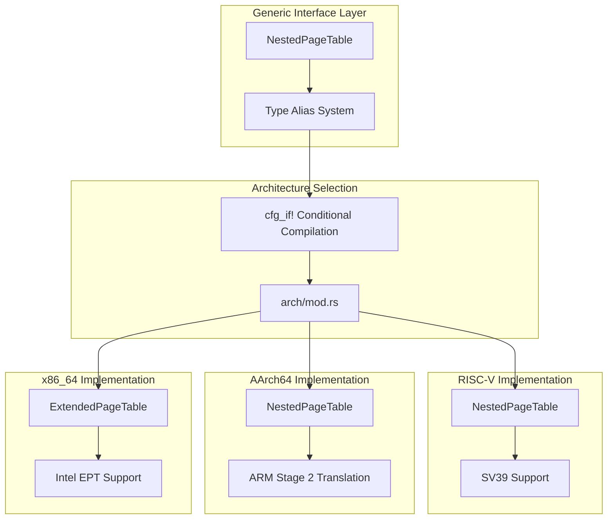
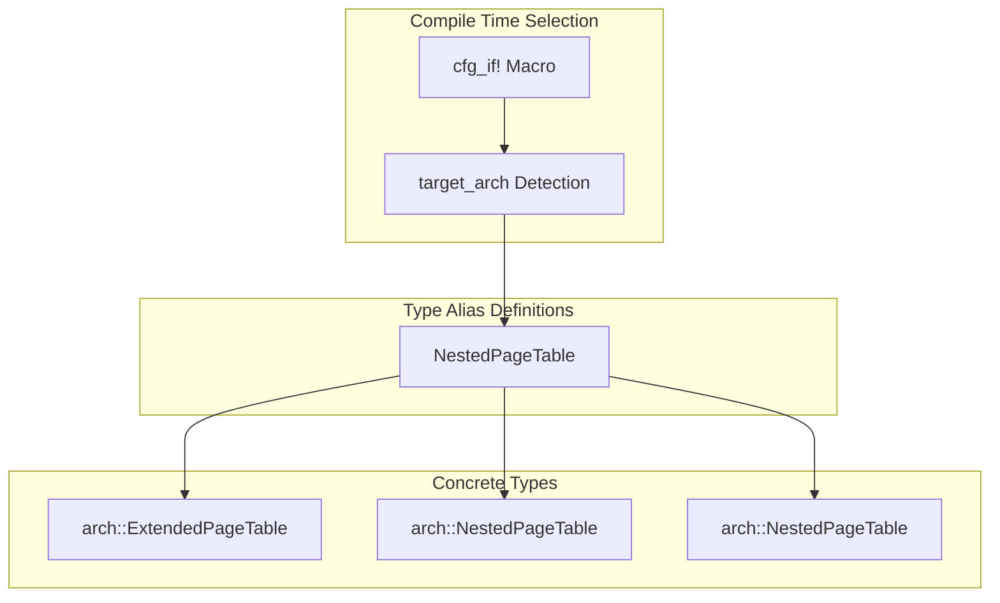
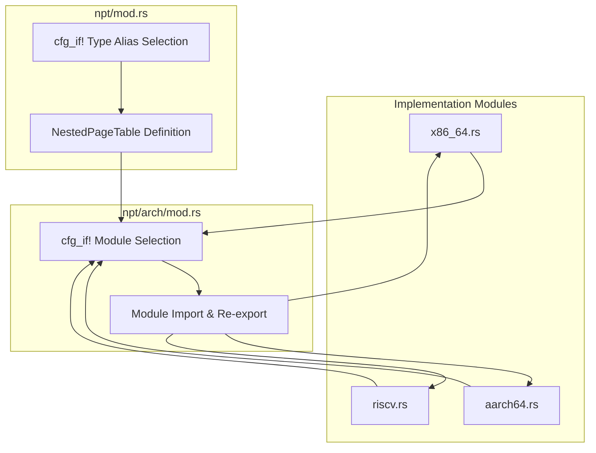

# Nested Page Tables

> **Relevant source files**
> * [src/npt/arch/mod.rs](https://github.com/arceos-hypervisor/axaddrspace/blob/2ed4d076/src/npt/arch/mod.rs)
> * [src/npt/mod.rs](https://github.com/arceos-hypervisor/axaddrspace/blob/2ed4d076/src/npt/mod.rs)

## Purpose and Scope

The Nested Page Tables system provides architecture-specific two-stage address translation capabilities for hypervisor virtualization. This system enables guest operating systems to manage their own virtual memory while the hypervisor transparently translates guest physical addresses to host physical addresses through hardware-assisted virtualization features.

This document covers the generic nested page table interface and architecture selection mechanism. For detailed implementation specifics, see [Architecture Selection](/arceos-hypervisor/axaddrspace/3.1-architecture-selection), [AArch64 Implementation](/arceos-hypervisor/axaddrspace/3.2-aarch64-implementation), [x86_64 Implementation](/arceos-hypervisor/axaddrspace/3.3-x86_64-implementation), and [RISC-V Implementation](/arceos-hypervisor/axaddrspace/3.4-risc-v-implementation). For broader address space management context, see [Address Space Management](/arceos-hypervisor/axaddrspace/2.2-address-space-management).

## Architecture Overview

The nested page table system uses a layered architecture that provides a unified interface while supporting multiple hardware virtualization technologies. The system leverages conditional compilation to select the appropriate implementation based on the target architecture.

**Nested Page Table Architecture**

Sources: [src/npt/mod.rs(L1 - L15)&emsp;](https://github.com/arceos-hypervisor/axaddrspace/blob/2ed4d076/src/npt/mod.rs#L1-L15) [src/npt/arch/mod.rs(L1 - L15)&emsp;](https://github.com/arceos-hypervisor/axaddrspace/blob/2ed4d076/src/npt/arch/mod.rs#L1-L15)

## Type System and Abstraction

The nested page table system uses Rust's conditional compilation features to provide a single `NestedPageTable<H>` type that resolves to different concrete implementations depending on the target architecture. This approach ensures type safety while maintaining architecture-specific optimizations.

**Type Alias Resolution System**

The type resolution follows this pattern in [src/npt/mod.rs(L1 - L12)&emsp;](https://github.com/arceos-hypervisor/axaddrspace/blob/2ed4d076/src/npt/mod.rs#L1-L12):

|Target Architecture|Type Alias Resolution|Hardware Feature|
| --- | --- | --- |
|x86_64|arch::ExtendedPageTable<H>|Intel EPT|
|aarch64|arch::NestedPageTable<H>|ARM Stage 2 Translation|
|riscv32/riscv64|arch::NestedPageTable<H>|RISC-V SV39|

Sources: [src/npt/mod.rs(L1 - L12)&emsp;](https://github.com/arceos-hypervisor/axaddrspace/blob/2ed4d076/src/npt/mod.rs#L1-L12)

## Architecture Module System

The architecture selection mechanism uses a two-tier conditional compilation system. The top-level module defines type aliases, while the architecture module handles implementation selection and re-exports.

**Module Selection Flow**

The architecture module in [src/npt/arch/mod.rs(L3 - L14)&emsp;](https://github.com/arceos-hypervisor/axaddrspace/blob/2ed4d076/src/npt/arch/mod.rs#L3-L14) uses pattern matching on `target_arch` to:

1. Import the appropriate architecture-specific module
2. Re-export all public items using wildcard imports
3. Provide a unified interface for the parent module

Sources: [src/npt/arch/mod.rs(L3 - L14)&emsp;](https://github.com/arceos-hypervisor/axaddrspace/blob/2ed4d076/src/npt/arch/mod.rs#L3-L14)

## Integration Points

The nested page table system integrates with several other components in the axaddrspace crate:

* **Address Space Management**: Used by `AddrSpace<H>` for guest-to-host address translation
* **Hardware Abstraction**: Depends on `AxMmHal` trait for memory frame allocation
* **Address Types**: Operates on `GuestPhysAddr` and `HostPhysAddr` types
* **Memory Backends**: Provides translation services for both linear and allocation backends

The generic parameter `H` represents the hardware abstraction layer implementation, ensuring type safety across the entire address space management stack.

Sources: [src/npt/mod.rs(L1 - L15)&emsp;](https://github.com/arceos-hypervisor/axaddrspace/blob/2ed4d076/src/npt/mod.rs#L1-L15) [src/npt/arch/mod.rs(L1 - L15)&emsp;](https://github.com/arceos-hypervisor/axaddrspace/blob/2ed4d076/src/npt/arch/mod.rs#L1-L15)