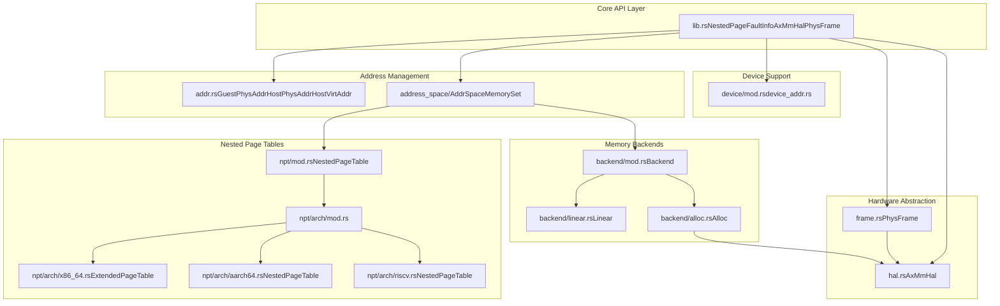
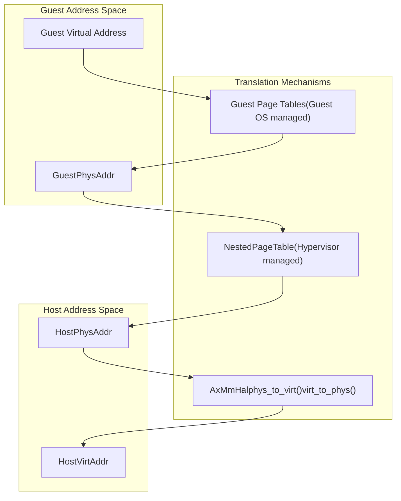

# Overview

> **Relevant source files**
> * [Cargo.toml](https://github.com/arceos-hypervisor/axaddrspace/blob/2ed4d076/Cargo.toml)
> * [src/lib.rs](https://github.com/arceos-hypervisor/axaddrspace/blob/2ed4d076/src/lib.rs)

The `axaddrspace` crate provides guest virtual machine address space management capabilities for the ArceOS-Hypervisor system. This module handles the translation between guest physical addresses and host physical addresses through nested page tables, supports multiple memory mapping strategies, and provides a hardware abstraction layer for cross-platform virtualization support.

The crate enables hypervisors to manage guest VM memory efficiently while maintaining isolation between guest and host address spaces. For specific details about nested page table implementations, see [Nested Page Tables](/arceos-hypervisor/axaddrspace/3-nested-page-tables). For information about memory mapping strategies, see [Memory Mapping Backends](/arceos-hypervisor/axaddrspace/4-memory-mapping-backends).

## Purpose and Scope

The `axaddrspace` crate serves as the core memory management component for guest VMs in the ArceOS-Hypervisor ecosystem. It abstracts the complexities of address translation, page table management, and platform-specific virtualization extensions into a unified API.

**Core Responsibilities:**

* Guest-to-host address translation through nested page tables
* Memory region management with configurable mapping backends
* Hardware abstraction for memory operations across architectures
* Page fault handling for dynamic memory allocation
* Device address space management

**Sources:** [Cargo.toml(L1 - L25)&emsp;](https://github.com/arceos-hypervisor/axaddrspace/blob/2ed4d076/Cargo.toml#L1-L25) [src/lib.rs(L1 - L5)&emsp;](https://github.com/arceos-hypervisor/axaddrspace/blob/2ed4d076/src/lib.rs#L1-L5)

## System Architecture

The following diagram illustrates the high-level architecture and key code entities within the `axaddrspace` crate:

**System Component Overview**

**Sources:** [src/lib.rs(L10 - L22)&emsp;](https://github.com/arceos-hypervisor/axaddrspace/blob/2ed4d076/src/lib.rs#L10-L22) [Cargo.toml(L1 - L25)&emsp;](https://github.com/arceos-hypervisor/axaddrspace/blob/2ed4d076/Cargo.toml#L1-L25)

## Key Components

### Address Translation System

The crate implements a two-stage address translation system where guest virtual addresses are first translated to guest physical addresses by the guest OS, then guest physical addresses are translated to host physical addresses by the hypervisor's nested page tables.

**Address Type Hierarchy**

**Sources:** [src/lib.rs(L17)&emsp;](https://github.com/arceos-hypervisor/axaddrspace/blob/2ed4d076/src/lib.rs#L17-L17) [src/lib.rs(L26 - L33)&emsp;](https://github.com/arceos-hypervisor/axaddrspace/blob/2ed4d076/src/lib.rs#L26-L33)

### Memory Management Framework

The `AddrSpace<H>` struct serves as the central coordinator for memory management operations, utilizing different backend strategies and maintaining nested page table state.

|Component|Type|Purpose|
| --- | --- | --- |
|AddrSpace<H>|Main struct|Coordinates memory operations and page table management|
|MemorySet<Backend<H>>|Memory regions|Manages collections of mapped memory areas|
|Backend<H>|Strategy enum|Selects between Linear and Alloc mapping strategies|
|NestedPageTable<H>|Page table|Architecture-specific guest-to-host translation|
|NestedPageFaultInfo|Fault handler|Provides context for page fault resolution|

**Sources:** [src/lib.rs(L18)&emsp;](https://github.com/arceos-hypervisor/axaddrspace/blob/2ed4d076/src/lib.rs#L18-L18) [src/lib.rs(L26 - L33)&emsp;](https://github.com/arceos-hypervisor/axaddrspace/blob/2ed4d076/src/lib.rs#L26-L33)

### Hardware Abstraction Layer

The `AxMmHal` trait provides platform-independent memory operations that must be implemented by the underlying hypervisor platform. The `PhysFrame<H>` type implements RAII semantics for physical memory frame management.

**Sources:** [src/lib.rs(L20 - L21)&emsp;](https://github.com/arceos-hypervisor/axaddrspace/blob/2ed4d076/src/lib.rs#L20-L21)

### Error Handling

The crate integrates with the ArceOS error handling system through the `mapping_err_to_ax_err` function, which converts `MappingError` types from the `memory_set` crate into `AxError` types.

**Sources:** [src/lib.rs(L23 - L24)&emsp;](https://github.com/arceos-hypervisor/axaddrspace/blob/2ed4d076/src/lib.rs#L23-L24) [src/lib.rs(L35 - L42)&emsp;](https://github.com/arceos-hypervisor/axaddrspace/blob/2ed4d076/src/lib.rs#L35-L42)

## Dependencies and Integration

The crate builds upon several foundational ArceOS modules:

* `memory_addr`: Provides base address type definitions
* `memory_set`: Supplies memory region management primitives
* `page_table_entry`: Offers page table entry abstractions
* `page_table_multiarch`: Enables multi-architecture page table support
* `axerrno`: Provides standardized error types

**Sources:** [Cargo.toml(L19 - L24)&emsp;](https://github.com/arceos-hypervisor/axaddrspace/blob/2ed4d076/Cargo.toml#L19-L24)

## Feature Configuration

The crate supports architecture-specific features through Cargo feature flags:

* `arm-el2`: Enables ARM EL2 (hypervisor) mode support (default)

**Sources:** [Cargo.toml(L7 - L9)&emsp;](https://github.com/arceos-hypervisor/axaddrspace/blob/2ed4d076/Cargo.toml#L7-L9)