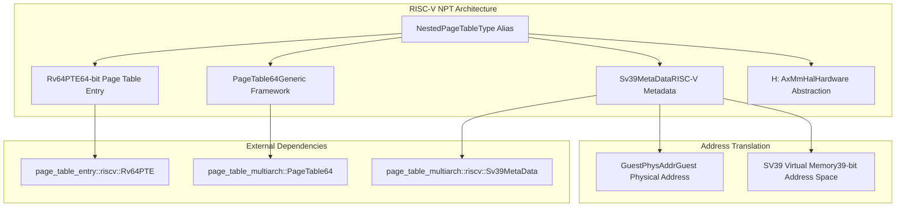
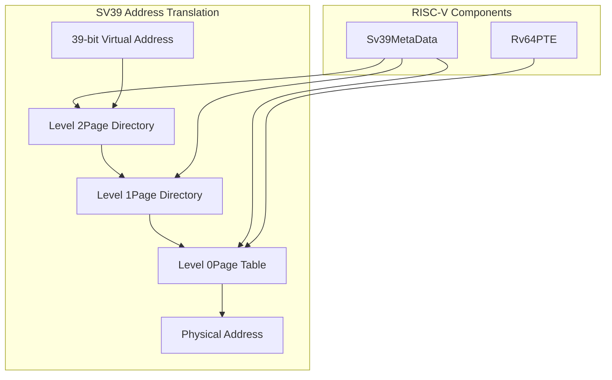
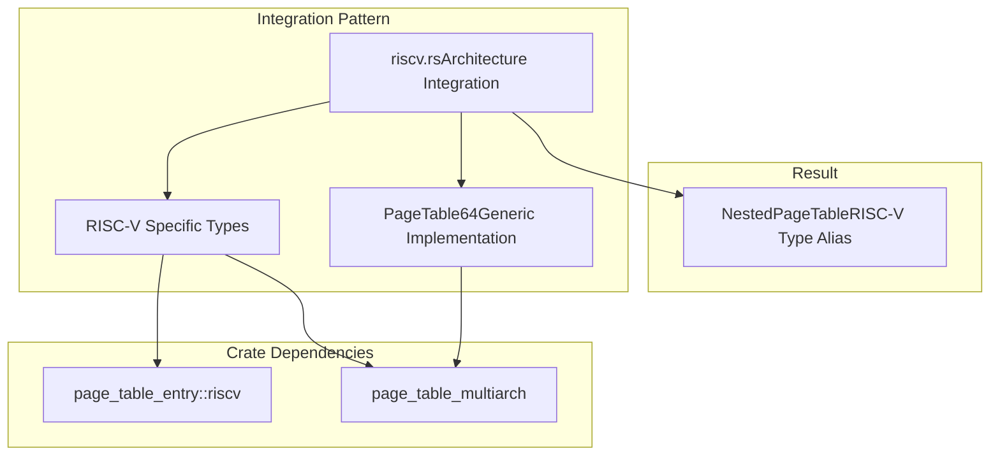

# RISC-V Implementation

> **Relevant source files**
> * [src/npt/arch/riscv.rs](https://github.com/arceos-hypervisor/axaddrspace/blob/2ed4d076/src/npt/arch/riscv.rs)

This document covers the RISC-V-specific implementation of nested page tables within the axaddrspace crate. The RISC-V implementation provides support for the SV39 virtual memory scheme, enabling guest-to-host address translation in RISC-V virtualization environments.

For information about the overall nested page table architecture selection, see [Architecture Selection](/arceos-hypervisor/axaddrspace/3.1-architecture-selection). For details about other architecture implementations, see [AArch64 Implementation](/arceos-hypervisor/axaddrspace/3.2-aarch64-implementation) and [x86_64 Implementation](/arceos-hypervisor/axaddrspace/3.3-x86_64-implementation).

## Architecture Overview

The RISC-V implementation follows the same architectural pattern as other platform-specific nested page table implementations. It combines generic page table functionality with RISC-V-specific components to provide hardware-appropriate virtualization support.



Sources: [src/npt/arch/riscv.rs(L1 - L6)&emsp;](https://github.com/arceos-hypervisor/axaddrspace/blob/2ed4d076/src/npt/arch/riscv.rs#L1-L6)

## Type Definition and Components

The RISC-V nested page table implementation is defined as a single type alias that combines specialized RISC-V components with the generic `PageTable64` framework:

```
pub type NestedPageTable<H> = PageTable64<Sv39MetaData<GuestPhysAddr>, Rv64PTE, H>;
```

This type alias instantiates the generic page table with three key parameters:

|Parameter|Type|Purpose|
| --- | --- | --- |
|Metadata|Sv39MetaData<GuestPhysAddr>|RISC-V SV39 paging scheme configuration|
|Entry Type|Rv64PTE|64-bit RISC-V page table entry format|
|HAL Type|H: AxMmHal|Hardware abstraction layer implementation|

Sources: [src/npt/arch/riscv.rs(L6)&emsp;](https://github.com/arceos-hypervisor/axaddrspace/blob/2ed4d076/src/npt/arch/riscv.rs#L6-L6)

## SV39 Virtual Memory Support

The implementation leverages the `Sv39MetaData` type to provide support for RISC-V's SV39 virtual memory scheme. SV39 is a 39-bit virtual address translation scheme commonly used in RISC-V systems, providing:

* 39-bit virtual address space
* Three-level page table hierarchy
* 4 KiB page size support
* Integration with `GuestPhysAddr` for guest physical addressing



Sources: [src/npt/arch/riscv.rs(L2 - L6)&emsp;](https://github.com/arceos-hypervisor/axaddrspace/blob/2ed4d076/src/npt/arch/riscv.rs#L2-L6)

## Integration with Generic Framework

The RISC-V implementation demonstrates the modular design of the nested page table system. It relies entirely on external crates for the actual implementation details:

* **page_table_entry**: Provides the `Rv64PTE` type for RISC-V page table entries
* **page_table_multiarch**: Supplies both the generic `PageTable64` framework and RISC-V-specific `Sv39MetaData`

This approach ensures that:

* Architecture-specific logic is maintained in specialized crates
* The axaddrspace crate focuses on integration and abstraction
* Updates to RISC-V specifications can be handled in dedicated libraries
* The implementation remains consistent with other architectures



Sources: [src/npt/arch/riscv.rs(L1 - L6)&emsp;](https://github.com/arceos-hypervisor/axaddrspace/blob/2ed4d076/src/npt/arch/riscv.rs#L1-L6)