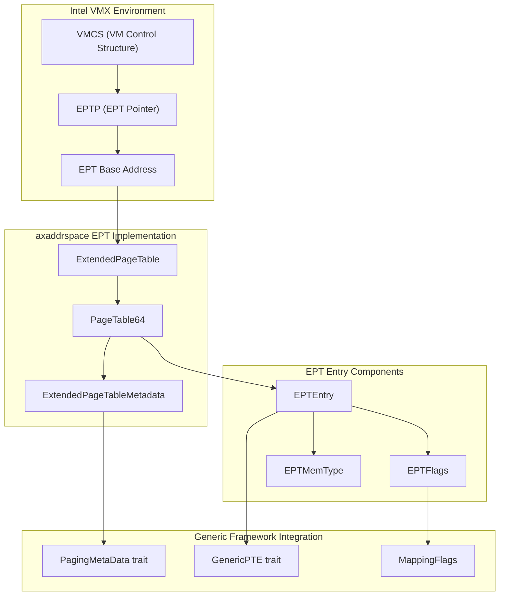
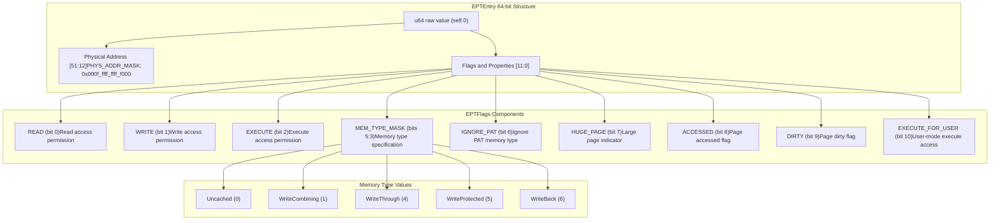
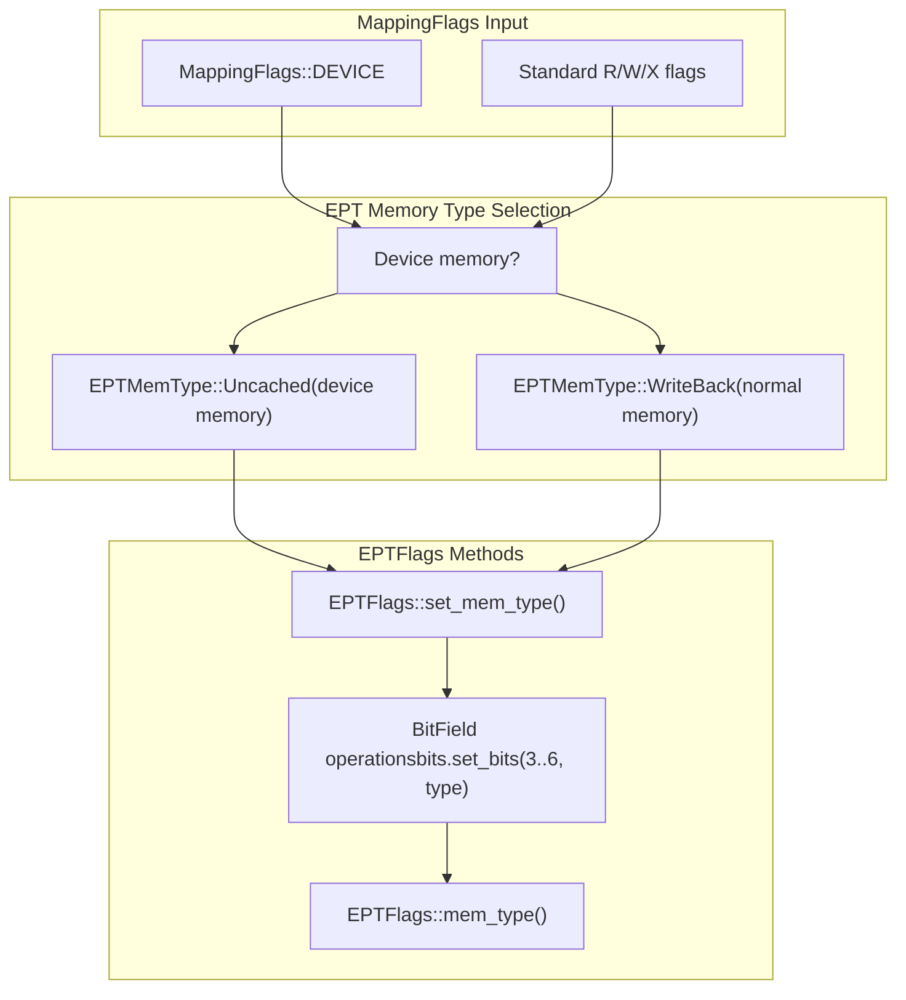
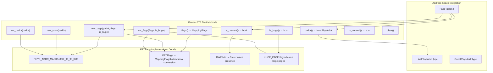
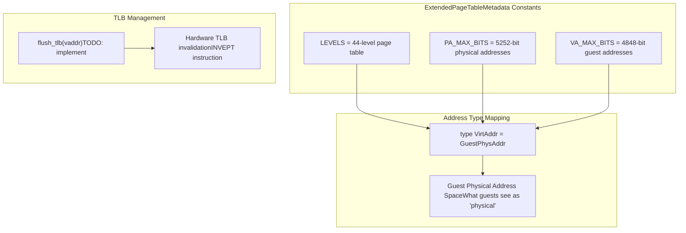

# x86_64 Implementation

> **Relevant source files**
> * [src/npt/arch/x86_64.rs](https://github.com/arceos-hypervisor/axaddrspace/blob/2ed4d076/src/npt/arch/x86_64.rs)

This document covers the Intel x86_64 Extended Page Table (EPT) implementation for nested page tables in the axaddrspace crate. The EPT system provides hardware-assisted virtualization support for Intel VMX environments, enabling efficient guest-to-host physical address translation. For general nested page table concepts and architecture selection, see [Architecture Selection](/arceos-hypervisor/axaddrspace/3.1-architecture-selection). For implementations on other architectures, see [AArch64 Implementation](/arceos-hypervisor/axaddrspace/3.2-aarch64-implementation) and [RISC-V Implementation](/arceos-hypervisor/axaddrspace/3.4-risc-v-implementation).

## EPT Overview and Intel Virtualization Context

The x86_64 implementation leverages Intel's Extended Page Table technology, which is part of the VMX (Virtual Machine Extensions) feature set. EPT provides hardware-accelerated second-level address translation, mapping guest physical addresses to host physical addresses without requiring software intervention for most memory accesses.

**EPT System Architecture**



Sources: [src/npt/arch/x86_64.rs(L182 - L184)&emsp;](https://github.com/arceos-hypervisor/axaddrspace/blob/2ed4d076/src/npt/arch/x86_64.rs#L182-L184)

## EPT Entry Structure and Flags

The `EPTEntry` structure represents a 64-bit EPT page table entry that follows Intel's EPT specification. Each entry contains physical address bits, access permissions, and memory type information.

**EPT Entry Bit Layout and Components**



Sources: [src/npt/arch/x86_64.rs(L9 - L32)&emsp;](https://github.com/arceos-hypervisor/axaddrspace/blob/2ed4d076/src/npt/arch/x86_64.rs#L9-L32) [src/npt/arch/x86_64.rs(L34 - L45)&emsp;](https://github.com/arceos-hypervisor/axaddrspace/blob/2ed4d076/src/npt/arch/x86_64.rs#L34-L45) [src/npt/arch/x86_64.rs(L99 - L107)&emsp;](https://github.com/arceos-hypervisor/axaddrspace/blob/2ed4d076/src/npt/arch/x86_64.rs#L99-L107)

### EPT Flags Implementation

The `EPTFlags` structure uses the `bitflags!` macro to provide type-safe manipulation of EPT entry flags. Key access permissions follow Intel's VMX specification:

|Flag|Bit Position|Purpose|
| --- | --- | --- |
|READ|0|Enables read access to the page|
|WRITE|1|Enables write access to the page|
|EXECUTE|2|Enables instruction execution from the page|
|MEM_TYPE_MASK|5:3|Specifies memory type for terminate pages|
|HUGE_PAGE|7|Indicates 2MB or 1GB page size|
|ACCESSED|8|Hardware-set when page is accessed|
|DIRTY|9|Hardware-set when page is written|

Sources: [src/npt/arch/x86_64.rs(L9 - L32)&emsp;](https://github.com/arceos-hypervisor/axaddrspace/blob/2ed4d076/src/npt/arch/x86_64.rs#L9-L32)

## Memory Type Management

EPT supports Intel's memory type system for controlling caching behavior and memory ordering. The `EPTMemType` enum defines the available memory types that can be encoded in EPT entries.

**Memory Type Configuration Flow**



Sources: [src/npt/arch/x86_64.rs(L47 - L56)&emsp;](https://github.com/arceos-hypervisor/axaddrspace/blob/2ed4d076/src/npt/arch/x86_64.rs#L47-L56) [src/npt/arch/x86_64.rs(L58 - L78)&emsp;](https://github.com/arceos-hypervisor/axaddrspace/blob/2ed4d076/src/npt/arch/x86_64.rs#L58-L78) [src/npt/arch/x86_64.rs(L80 - L97)&emsp;](https://github.com/arceos-hypervisor/axaddrspace/blob/2ed4d076/src/npt/arch/x86_64.rs#L80-L97)

The memory type conversion logic ensures that:

* Normal memory regions use `WriteBack` caching for optimal performance
* Device memory regions use `Uncached` type to prevent caching side effects
* The conversion is bidirectional between `MappingFlags` and `EPTFlags`

## Generic Page Table Framework Integration

The `EPTEntry` implements the `GenericPTE` trait, enabling integration with the architecture-independent page table framework. This abstraction allows the same high-level page table operations to work across different architectures.

**GenericPTE Implementation for EPTEntry**



Sources: [src/npt/arch/x86_64.rs(L109 - L154)&emsp;](https://github.com/arceos-hypervisor/axaddrspace/blob/2ed4d076/src/npt/arch/x86_64.rs#L109-L154)

### Key Implementation Details

The `EPTEntry` provides several critical implementation details:

|Method|Implementation|Purpose|
| --- | --- | --- |
|is_present()|self.0 & 0x7 != 0|Checks if any of R/W/X bits are set|
|paddr()|(self.0 & PHYS_ADDR_MASK)|Extracts 40-bit physical address|
|new_table()|Sets R+W+X for intermediate tables|Creates non-leaf EPT entries|
|set_flags()|ConvertsMappingFlagstoEPTFlags|Handles huge page flag setting|

Sources: [src/npt/arch/x86_64.rs(L117 - L149)&emsp;](https://github.com/arceos-hypervisor/axaddrspace/blob/2ed4d076/src/npt/arch/x86_64.rs#L117-L149)

## Extended Page Table Metadata

The `ExtendedPageTableMetadata` structure defines the architectural parameters for Intel EPT, implementing the `PagingMetaData` trait to provide page table configuration to the generic framework.

**EPT Configuration Parameters**



Sources: [src/npt/arch/x86_64.rs(L167 - L180)&emsp;](https://github.com/arceos-hypervisor/axaddrspace/blob/2ed4d076/src/npt/arch/x86_64.rs#L167-L180)

The metadata configuration aligns with Intel's EPT specification:

* **4-level hierarchy**: EPT4, EPT3, EPT2, EPT1 tables providing 48-bit guest address translation
* **52-bit physical addresses**: Supporting Intel's maximum physical address width
* **Guest physical address context**: EPT translates what guests consider "physical" addresses

## Type Alias and Framework Integration

The final component ties together all EPT-specific implementations with the generic page table framework through a type alias:

```
pub type ExtendedPageTable<H> = PageTable64<ExtendedPageTableMetadata, EPTEntry, H>;
```

This type alias creates the main EPT page table type that:

* Uses `ExtendedPageTableMetadata` for architectural parameters
* Uses `EPTEntry` for page table entries with Intel-specific features
* Accepts a generic hardware abstraction layer `H`
* Inherits all functionality from the `PageTable64` generic implementation

Sources: [src/npt/arch/x86_64.rs(L182 - L184)&emsp;](https://github.com/arceos-hypervisor/axaddrspace/blob/2ed4d076/src/npt/arch/x86_64.rs#L182-L184)

The resulting `ExtendedPageTable<H>` type provides a complete EPT implementation that integrates seamlessly with the broader address space management system while leveraging Intel's hardware virtualization features for optimal performance.