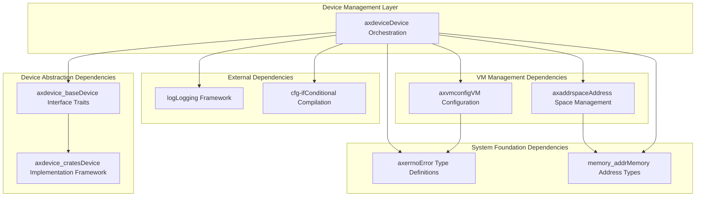
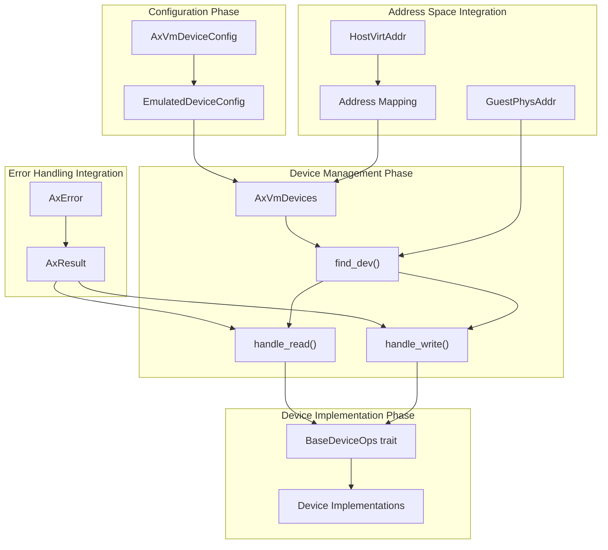

# ArceOS Ecosystem Integration

> **Relevant source files**
> * [Cargo.toml](https://github.com/arceos-hypervisor/axdevice/blob/8652ce80/Cargo.toml)

## Purpose and Scope

This document explains how the `axdevice` crate integrates with the broader ArceOS hypervisor ecosystem. It covers the modular architecture approach, dependency relationships with other ArceOS crates, and the layered design that enables extensible device emulation within virtual machines.

For information about the internal architecture of axdevice components, see [System Architecture](/arceos-hypervisor/axdevice/2-system-architecture). For details about device configuration and emulation implementation, see [Core Components](/arceos-hypervisor/axdevice/3-core-components).

## ArceOS Hypervisor Ecosystem Structure

The `axdevice` crate operates within a carefully structured ecosystem of ArceOS hypervisor components, each serving specific responsibilities in the virtualization stack.

### Ecosystem Dependency Graph

Sources: [Cargo.toml(L1 - L19)&emsp;](https://github.com/arceos-hypervisor/axdevice/blob/8652ce80/Cargo.toml#L1-L19)

## Dependency Architecture

### ArceOS Hypervisor-Specific Dependencies

The `axdevice` crate depends on three key ArceOS hypervisor components, each maintained in separate Git repositories to support modular development:

|Dependency|Repository|Role in axdevice|
| --- | --- | --- |
|axvmconfig|github.com/arceos-hypervisor/axvmconfig.git|Provides VM configuration structures that define device parameters|
|axaddrspace|github.com/arceos-hypervisor/axaddrspace.git|Manages guest physical address space mappings for device MMIO regions|
|axdevice_base|github.com/arceos-hypervisor/axdevice_crates.git|DefinesBaseDeviceOpstrait and device abstraction interfaces|

### ArceOS System Foundation Dependencies

The crate relies on foundational ArceOS system components for basic functionality:

* **`axerrno`**: Provides standardized error types (`AxError`, `AxResult`) used throughout the hypervisor ecosystem
* **`memory_addr`**: Supplies memory address types (`GuestPhysAddr`, `HostVirtAddr`) for address space operations

### External Ecosystem Dependencies

Standard Rust ecosystem crates provide utility functionality:

* **`log`**: Enables structured logging for debugging and monitoring device operations
* **`cfg-if`**: Supports conditional compilation for platform-specific device implementations

Sources: [Cargo.toml(L8 - L18)&emsp;](https://github.com/arceos-hypervisor/axdevice/blob/8652ce80/Cargo.toml#L8-L18)

## Integration Patterns and Code Entities

### Component Integration Flow

### Trait and Type Integration Points

The ecosystem integration occurs through specific code entities that provide standardized interfaces:

**Configuration Integration:**

* `AxVmDeviceConfig` structure coordinates with `axvmconfig` crate for VM-level device configuration
* `EmulatedDeviceConfig` instances define individual device parameters within the VM configuration

**Device Operation Integration:**

* `BaseDeviceOps` trait from `axdevice_base` defines the interface contract for all emulated devices
* `find_dev()` method uses `GuestPhysAddr` from `memory_addr` crate for address-based device lookup
* `handle_read()` and `handle_write()` methods return `AxResult<T>` using error types from `axerrno`

**Address Space Integration:**

* `GuestPhysAddr` and `HostVirtAddr` types from `memory_addr` enable precise memory mapping
* Integration with `axaddrspace` manages guest physical memory regions assigned to devices

Sources: [Cargo.toml(L13 - L18)&emsp;](https://github.com/arceos-hypervisor/axdevice/blob/8652ce80/Cargo.toml#L13-L18)

## Modular Design Benefits

### Repository Separation Strategy

The ArceOS hypervisor ecosystem uses a multi-repository approach that provides several architectural advantages:

**Development Independence:**

* Each component (`axvmconfig`, `axaddrspace`, `axdevice_base`) can evolve independently
* Version pinning through Git dependencies allows controlled integration of component updates
* Teams can work on different aspects of the hypervisor without merge conflicts

**Dependency Management:**

* `axdevice` specifies `default-features = false` for `axvmconfig`, enabling minimal dependency inclusion
* Git-based dependencies allow using cutting-edge features before crates.io publication
* Clear separation of concerns prevents circular dependencies between components

**Extensibility Framework:**

* New device types can be added by implementing `BaseDeviceOps` without modifying core `axdevice` code
* Additional VM configuration options can be added to `axvmconfig` without breaking existing device implementations
* Address space management improvements in `axaddrspace` benefit all device emulation automatically

### Integration Testing and Compatibility

The modular approach enables comprehensive integration testing:

* Each component maintains its own test suite for isolated functionality verification
* Integration tests can verify compatibility between specific versions of ecosystem components
* CI/CD pipelines can test multiple version combinations to ensure ecosystem stability

Sources: [Cargo.toml(L16 - L18)&emsp;](https://github.com/arceos-hypervisor/axdevice/blob/8652ce80/Cargo.toml#L16-L18)