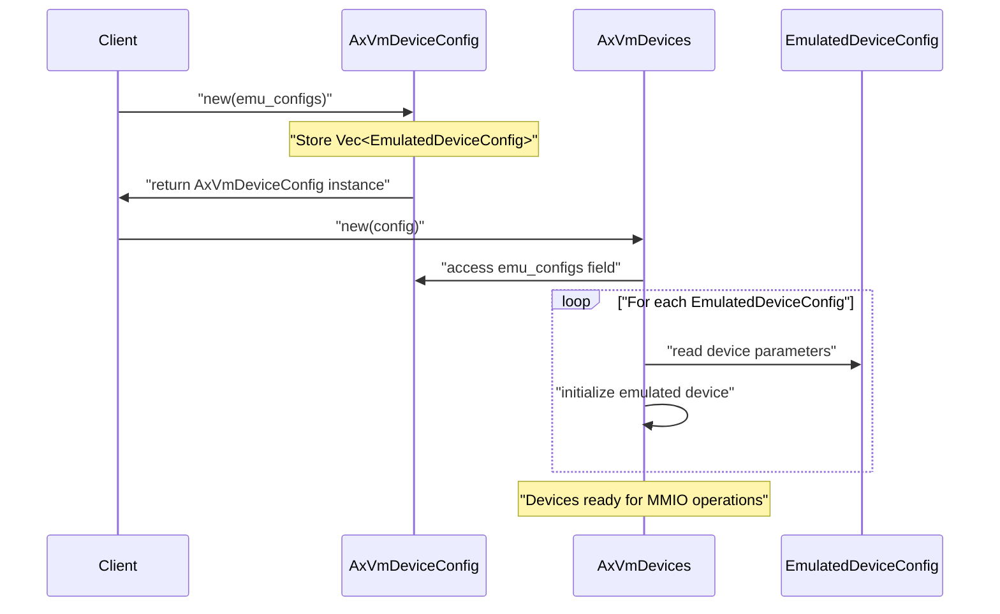
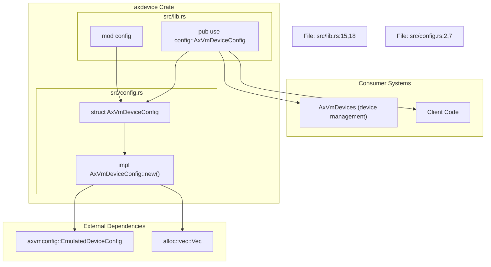
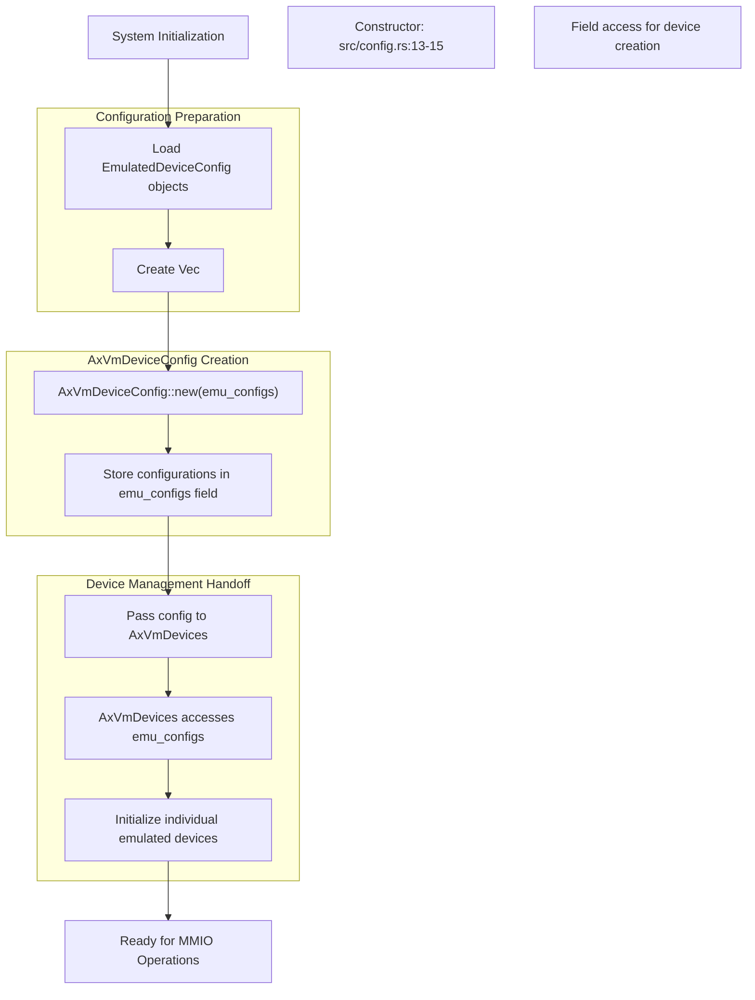

# Configuration Management

> **Relevant source files**
> * [src/config.rs](https://github.com/arceos-hypervisor/axdevice/blob/8652ce80/src/config.rs)
> * [src/lib.rs](https://github.com/arceos-hypervisor/axdevice/blob/8652ce80/src/lib.rs)

## Purpose and Scope

This document covers the configuration management system in the axdevice crate, specifically focusing on how device configurations are defined, structured, and used to initialize emulated devices in the ArceOS hypervisor. The `AxVmDeviceConfig` structure serves as the primary interface for managing collections of emulated device configurations that will be instantiated by the device emulation system.

For information about the actual device emulation and MMIO operation handling, see [Device Emulation](/arceos-hypervisor/axdevice/3.2-device-emulation). For broader system architecture context, see [System Architecture](/arceos-hypervisor/axdevice/2-system-architecture).

## Core Configuration Structure

The configuration management system is built around a simple but effective structure that aggregates individual device configurations into a manageable collection.

### AxVmDeviceConfig Structure

The primary configuration container is `AxVmDeviceConfig`, which maintains a vector of `EmulatedDeviceConfig` objects imported from the `axvmconfig` crate.

```

```

**Configuration Structure Analysis**

|Component|Type|Purpose|Location|
| --- | --- | --- | --- |
|AxVmDeviceConfig|Struct|Container for multiple device configurations|src/config.rs5-8|
|emu_configs|Vec<EmulatedDeviceConfig>|Collection of individual device configurations|src/config.rs7|
|new()|Constructor|Creates new configuration instance|src/config.rs13-15|

Sources: [src/config.rs(L1 - L17)&emsp;](https://github.com/arceos-hypervisor/axdevice/blob/8652ce80/src/config.rs#L1-L17)

## Configuration Data Flow

The configuration system follows a straightforward data flow pattern where external configuration data is aggregated and then passed to the device management layer.

### Configuration Lifecycle



**Configuration Flow Steps**

1. **Construction**: `AxVmDeviceConfig::new()` accepts a vector of `EmulatedDeviceConfig` objects
2. **Storage**: The configuration vector is stored in the `emu_configs` field
3. **Consumption**: Device management system accesses configurations during initialization
4. **Device Creation**: Each configuration drives the creation of corresponding emulated devices

Sources: [src/config.rs(L13 - L15)&emsp;](https://github.com/arceos-hypervisor/axdevice/blob/8652ce80/src/config.rs#L13-L15) [src/lib.rs(L18)&emsp;](https://github.com/arceos-hypervisor/axdevice/blob/8652ce80/src/lib.rs#L18-L18)

## Module Integration

The configuration management integrates seamlessly with the broader axdevice crate structure and external dependencies.

### Crate Integration Pattern



**Integration Responsibilities**

|Component|Responsibility|Implementation|
| --- | --- | --- |
|Module Declaration|Expose config module|src/lib.rs15|
|Public Export|MakeAxVmDeviceConfigavailable|src/lib.rs18|
|Dependency Import|AccessEmulatedDeviceConfigtype|src/config.rs2|
|Memory Management|UseVecfor dynamic collections|src/config.rs1|

Sources: [src/lib.rs(L15 - L19)&emsp;](https://github.com/arceos-hypervisor/axdevice/blob/8652ce80/src/lib.rs#L15-L19) [src/config.rs(L1 - L2)&emsp;](https://github.com/arceos-hypervisor/axdevice/blob/8652ce80/src/config.rs#L1-L2)

## Configuration Usage Patterns

The design supports common configuration management patterns expected in a hypervisor device emulation system.

### Typical Usage Workflow



**Configuration Management Characteristics**

* **Simplicity**: Minimal wrapper around configuration vector with single constructor
* **Flexibility**: Accepts any number of device configurations through `Vec` collection
* **Integration**: Seamless handoff to device management layer through public field access
* **Memory Safety**: Uses `alloc::vec::Vec` for safe dynamic memory management in `no_std` environment

Sources: [src/config.rs(L5 - L16)&emsp;](https://github.com/arceos-hypervisor/axdevice/blob/8652ce80/src/config.rs#L5-L16) [src/lib.rs(L11 - L18)&emsp;](https://github.com/arceos-hypervisor/axdevice/blob/8652ce80/src/lib.rs#L11-L18)

## Error Handling and Validation

The current configuration management implementation follows a minimal approach with validation delegated to consuming systems and external configuration sources.

**Validation Strategy**

|Validation Level|Responsibility|Implementation|
| --- | --- | --- |
|Type Safety|Rust compiler|Vec<EmulatedDeviceConfig>type constraints|
|Content Validation|axvmconfigcrate|EmulatedDeviceConfiginternal validation|
|Device Creation|AxVmDevices|Validation during device instantiation|
|Runtime Checks|Device implementations|MMIO operation validation|

The simple structure allows higher-level systems to implement appropriate validation and error handling strategies while maintaining a clean separation of concerns.

Sources: [src/config.rs(L1 - L17)&emsp;](https://github.com/arceos-hypervisor/axdevice/blob/8652ce80/src/config.rs#L1-L17)