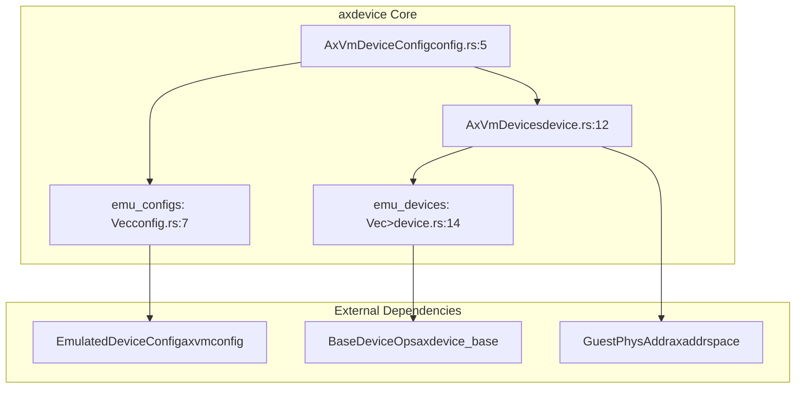

# Core Components

> **Relevant source files**
> * [src/config.rs](https://github.com/arceos-hypervisor/axdevice/blob/8652ce80/src/config.rs)
> * [src/device.rs](https://github.com/arceos-hypervisor/axdevice/blob/8652ce80/src/device.rs)
> * [src/lib.rs](https://github.com/arceos-hypervisor/axdevice/blob/8652ce80/src/lib.rs)

This page provides an overview of the main functional components that make up the axdevice system. It introduces the two primary subsystems: configuration management through `AxVmDeviceConfig` and device emulation through `AxVmDevices`. For detailed information about configuration management, see [Configuration Management](/arceos-hypervisor/axdevice/3.1-configuration-management). For detailed information about device emulation functionality, see [Device Emulation](/arceos-hypervisor/axdevice/3.2-device-emulation).

## Component Overview

The axdevice crate is structured around two core components that work together to provide virtual machine device emulation capabilities:

|Component|Primary Type|Responsibility|File Location|
| --- | --- | --- | --- |
|Configuration Management|AxVmDeviceConfig|Stores and manages device configuration parameters|src/config.rs|
|Device Emulation|AxVmDevices|Handles MMIO operations and device lifecycle management|src/device.rs|

### Configuration Management

The `AxVmDeviceConfig` struct serves as the central configuration container for all emulated devices in a virtual machine. It maintains a vector of `EmulatedDeviceConfig` objects that define the parameters for individual devices.

**Key characteristics:**

* Simple container structure with a single `emu_configs` field [src/config.rs(L5 - L8)&emsp;](https://github.com/arceos-hypervisor/axdevice/blob/8652ce80/src/config.rs#L5-L8)
* Constructor function `new()` for initialization [src/config.rs(L13 - L15)&emsp;](https://github.com/arceos-hypervisor/axdevice/blob/8652ce80/src/config.rs#L13-L15)
* Depends on `axvmconfig::EmulatedDeviceConfig` for individual device configurations [src/config.rs(L2)&emsp;](https://github.com/arceos-hypervisor/axdevice/blob/8652ce80/src/config.rs#L2-L2)

### Device Emulation

The `AxVmDevices` struct represents the runtime device management system for a virtual machine. It maintains collections of emulated devices and provides the interface for handling guest VM memory-mapped I/O operations.

**Key characteristics:**

* Maintains a vector of `Arc<dyn BaseDeviceOps>` for thread-safe device access [src/device.rs(L14)&emsp;](https://github.com/arceos-hypervisor/axdevice/blob/8652ce80/src/device.rs#L14-L14)
* Provides MMIO read/write handlers for guest VM interactions [src/device.rs(L65 - L92)&emsp;](https://github.com/arceos-hypervisor/axdevice/blob/8652ce80/src/device.rs#L65-L92)
* Implements device lookup by guest physical address [src/device.rs(L57 - L62)&emsp;](https://github.com/arceos-hypervisor/axdevice/blob/8652ce80/src/device.rs#L57-L62)

## Component Architecture

**Core Component Structure**



Sources: [src/lib.rs(L18 - L19)&emsp;](https://github.com/arceos-hypervisor/axdevice/blob/8652ce80/src/lib.rs#L18-L19) [src/config.rs(L5 - L8)&emsp;](https://github.com/arceos-hypervisor/axdevice/blob/8652ce80/src/config.rs#L5-L8) [src/device.rs(L12 - L16)&emsp;](https://github.com/arceos-hypervisor/axdevice/blob/8652ce80/src/device.rs#L12-L16)

## Component Interaction Flow

**Initialization and Runtime Flow**

```

```

Sources: [src/config.rs(L13 - L15)&emsp;](https://github.com/arceos-hypervisor/axdevice/blob/8652ce80/src/config.rs#L13-L15) [src/device.rs(L21 - L28)&emsp;](https://github.com/arceos-hypervisor/axdevice/blob/8652ce80/src/device.rs#L21-L28) [src/device.rs(L65 - L92)&emsp;](https://github.com/arceos-hypervisor/axdevice/blob/8652ce80/src/device.rs#L65-L92)

## Public Interface

The axdevice crate exports both core components through its main library interface:

```
pub use config::AxVmDeviceConfig;
pub use device::AxVmDevices;
```

**Key Public Methods:**

|Component|Method|Purpose|Return Type|
| --- | --- | --- | --- |
|AxVmDeviceConfig|new(emu_configs)|Create configuration instance|Self|
|AxVmDevices|new(config)|Initialize device manager|Self|
|AxVmDevices|find_dev(ipa)|Locate device by address|Option<Arc<dyn BaseDeviceOps>>|
|AxVmDevices|handle_mmio_read(addr, width)|Process guest read operations|AxResult<usize>|
|AxVmDevices|handle_mmio_write(addr, width, val)|Process guest write operations|()|

Sources: [src/lib.rs(L18 - L19)&emsp;](https://github.com/arceos-hypervisor/axdevice/blob/8652ce80/src/lib.rs#L18-L19) [src/device.rs(L57 - L92)&emsp;](https://github.com/arceos-hypervisor/axdevice/blob/8652ce80/src/device.rs#L57-L92)

## Implementation Status

The current implementation provides the foundational structure but has key areas marked for future development:

* **Device Initialization**: The `init()` method contains commented-out code for device type dispatch [src/device.rs(L31 - L54)&emsp;](https://github.com/arceos-hypervisor/axdevice/blob/8652ce80/src/device.rs#L31-L54)
* **Device Type Support**: Placeholder comments indicate planned support for multiple device types including console, VirtIO, and interrupt controllers [src/device.rs(L34 - L47)&emsp;](https://github.com/arceos-hypervisor/axdevice/blob/8652ce80/src/device.rs#L34-L47)
* **Passthrough Devices**: Architecture anticipates future support for passthrough devices [src/device.rs(L15)&emsp;](https://github.com/arceos-hypervisor/axdevice/blob/8652ce80/src/device.rs#L15-L15)

The MMIO handling functionality is fully implemented and operational, providing the runtime interface needed for guest VM device interactions.

Sources: [src/device.rs(L31 - L54)&emsp;](https://github.com/arceos-hypervisor/axdevice/blob/8652ce80/src/device.rs#L31-L54) [src/device.rs(L15)&emsp;](https://github.com/arceos-hypervisor/axdevice/blob/8652ce80/src/device.rs#L15-L15)