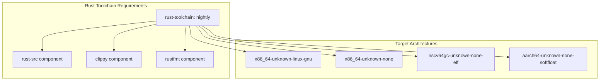
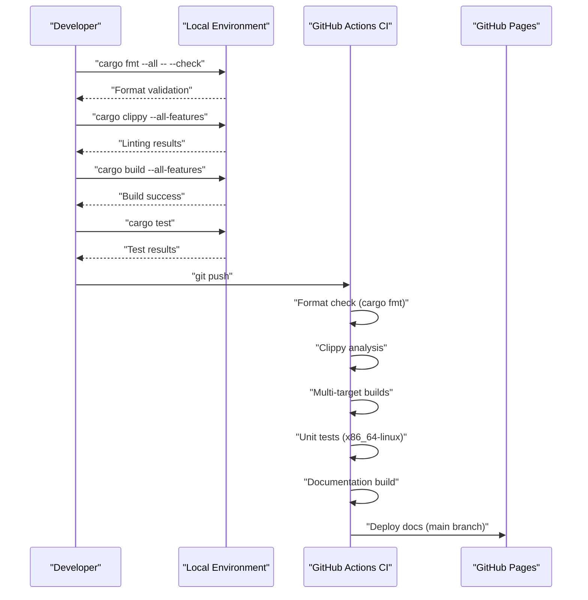
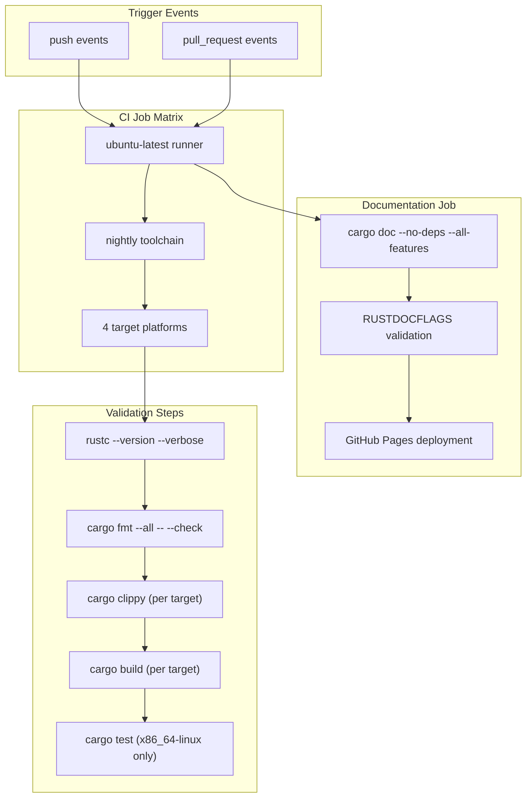
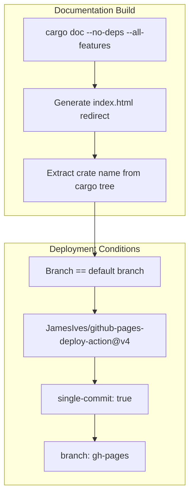

# Development Guide

> **Relevant source files**
> * [.github/workflows/ci.yml](https://github.com/arceos-hypervisor/axdevice/blob/8652ce80/.github/workflows/ci.yml)
> * [.gitignore](https://github.com/arceos-hypervisor/axdevice/blob/8652ce80/.gitignore)

This document provides comprehensive information for developers working with the `axdevice` crate, covering build processes, testing procedures, CI/CD workflows, and contribution guidelines. This guide focuses on the practical aspects of developing, building, and maintaining the device emulation components within the ArceOS hypervisor ecosystem.

For information about the system architecture and how components interact, see [System Architecture](/arceos-hypervisor/axdevice/2-system-architecture). For details about specific device implementations and configuration management, see [Core Components](/arceos-hypervisor/axdevice/3-core-components).

## Development Environment Setup

The `axdevice` crate requires a Rust nightly toolchain with specific target support for cross-platform compatibility across multiple architectures supported by the ArceOS hypervisor.

### Required Toolchain Components



*Development Environment Architecture*

The development environment supports both hosted Linux development and bare-metal hypervisor targets across multiple CPU architectures.

**Sources:** [.github/workflows/ci.yml(L11 - L19)&emsp;](https://github.com/arceos-hypervisor/axdevice/blob/8652ce80/.github/workflows/ci.yml#L11-L19)

### Target Platform Support

|Target|Purpose|Usage Context|
| --- | --- | --- |
|x86_64-unknown-linux-gnu|Host development and testing|Unit tests and development builds|
|x86_64-unknown-none|Bare-metal x86_64 hypervisor|Production hypervisor deployment|
|riscv64gc-unknown-none-elf|RISC-V bare-metal|RISC-V based hypervisor systems|
|aarch64-unknown-none-softfloat|ARM64 bare-metal|ARM-based hypervisor platforms|

**Sources:** [.github/workflows/ci.yml(L12)&emsp;](https://github.com/arceos-hypervisor/axdevice/blob/8652ce80/.github/workflows/ci.yml#L12-L12)

## Build and Test Workflow

The development workflow follows a standardized process that ensures code quality and cross-platform compatibility through automated checks and builds.

### Development Workflow Diagram



*Complete Development and CI Workflow*

**Sources:** [.github/workflows/ci.yml(L23 - L30)&emsp;](https://github.com/arceos-hypervisor/axdevice/blob/8652ce80/.github/workflows/ci.yml#L23-L30) [.github/workflows/ci.yml(L44 - L55)&emsp;](https://github.com/arceos-hypervisor/axdevice/blob/8652ce80/.github/workflows/ci.yml#L44-L55)

### Local Development Commands

The standard development cycle involves these key commands:

```markdown
# Code formatting verification
cargo fmt --all -- --check

# Static analysis with custom flags
cargo clippy --target <TARGET> --all-features -- -A clippy::new_without_default

# Cross-platform builds
cargo build --target <TARGET> --all-features

# Unit testing (Linux host only)
cargo test --target x86_64-unknown-linux-gnu -- --nocapture
```

**Sources:** [.github/workflows/ci.yml(L23 - L30)&emsp;](https://github.com/arceos-hypervisor/axdevice/blob/8652ce80/.github/workflows/ci.yml#L23-L30)

## CI/CD Pipeline Architecture

The continuous integration system uses GitHub Actions with a matrix strategy to ensure compatibility across all supported target platforms.

### CI Pipeline Flow



*CI/CD Pipeline Architecture*

**Sources:** [.github/workflows/ci.yml(L1 - L31)&emsp;](https://github.com/arceos-hypervisor/axdevice/blob/8652ce80/.github/workflows/ci.yml#L1-L31) [.github/workflows/ci.yml(L32 - L56)&emsp;](https://github.com/arceos-hypervisor/axdevice/blob/8652ce80/.github/workflows/ci.yml#L32-L56)

### Matrix Strategy Configuration

The CI system uses a fail-fast: false strategy to ensure all target platforms are tested even if one fails:

```yaml
strategy:
  fail-fast: false
  matrix:
    rust-toolchain: [nightly]
    targets: [x86_64-unknown-linux-gnu, x86_64-unknown-none, riscv64gc-unknown-none-elf, aarch64-unknown-none-softfloat]
```

**Sources:** [.github/workflows/ci.yml(L8 - L12)&emsp;](https://github.com/arceos-hypervisor/axdevice/blob/8652ce80/.github/workflows/ci.yml#L8-L12)

## Code Quality Standards

The project enforces strict code quality standards through automated tooling integrated into the CI pipeline.

### Linting Configuration

The clippy configuration suppresses specific warnings that are acceptable for the hypervisor context:

```css
cargo clippy --target ${{ matrix.targets }} --all-features -- -A clippy::new_without_default
```

The `-A clippy::new_without_default` flag allows `new()` methods without corresponding `Default` implementations, which is common in device emulation where default configurations may not be meaningful.

**Sources:** [.github/workflows/ci.yml(L25)&emsp;](https://github.com/arceos-hypervisor/axdevice/blob/8652ce80/.github/workflows/ci.yml#L25-L25)

### Documentation Standards

Documentation builds use strict flags to ensure comprehensive documentation quality:

```yaml
RUSTDOCFLAGS: -D rustdoc::broken_intra_doc_links -D missing-docs
```

These flags treat broken documentation links and missing documentation as compilation errors, ensuring complete and accurate documentation.

**Sources:** [.github/workflows/ci.yml(L40)&emsp;](https://github.com/arceos-hypervisor/axdevice/blob/8652ce80/.github/workflows/ci.yml#L40-L40)

## Documentation Generation and Deployment

The documentation system automatically generates and deploys API documentation to GitHub Pages for the main branch.

### Documentation Build Process



*Documentation Generation and Deployment Process*

The documentation build creates a redirect page that automatically navigates to the main crate documentation:

```
printf '<meta http-equiv="refresh" content="0;url=%s/index.html">' $(cargo tree | head -1 | cut -d' ' -f1) > target/doc/index.html
```

**Sources:** [.github/workflows/ci.yml(L44 - L55)&emsp;](https://github.com/arceos-hypervisor/axdevice/blob/8652ce80/.github/workflows/ci.yml#L44-L55)

## Project Structure and Ignored Files

The development environment excludes specific files and directories that are generated during the build process or are environment-specific.

### Ignored File Categories

|Category|Files|Purpose|
| --- | --- | --- |
|Build Artifacts|/target,*.asm,*.img,*.bin,*.elf|Compiled binaries and assembly output|
|Runtime Files|actual.out,qemu.log|Test execution and emulation logs|
|Development Tools|rusty-tags.vi,/.vscode,.DS_Store|Editor and IDE configurations|
|Dependencies|Cargo.lock|Lock file excluded because axdevice is a library|

**Sources:** [.gitignore(L1 - L18)&emsp;](https://github.com/arceos-hypervisor/axdevice/blob/8652ce80/.gitignore#L1-L18)

## Contributing Guidelines

### Pre-submission Checklist

Before submitting code changes, ensure all of the following pass locally:

1. **Code Formatting**: `cargo fmt --all -- --check`
2. **Static Analysis**: `cargo clippy --all-features -- -A clippy::new_without_default`
3. **Cross-platform Builds**: Test builds on all target platforms
4. **Unit Tests**: `cargo test --target x86_64-unknown-linux-gnu -- --nocapture`
5. **Documentation**: `cargo doc --no-deps --all-features`

### Target Platform Testing

All changes must build successfully on the four supported target platforms. The CI system will verify this automatically, but local testing on critical platforms is recommended:

```markdown
# Test core functionality on Linux host
cargo test --target x86_64-unknown-linux-gnu

# Verify bare-metal builds
cargo build --target x86_64-unknown-none --all-features
cargo build --target riscv64gc-unknown-none-elf --all-features
cargo build --target aarch64-unknown-none-softfloat --all-features
```

**Sources:** [.github/workflows/ci.yml(L27 - L30)&emsp;](https://github.com/arceos-hypervisor/axdevice/blob/8652ce80/.github/workflows/ci.yml#L27-L30)