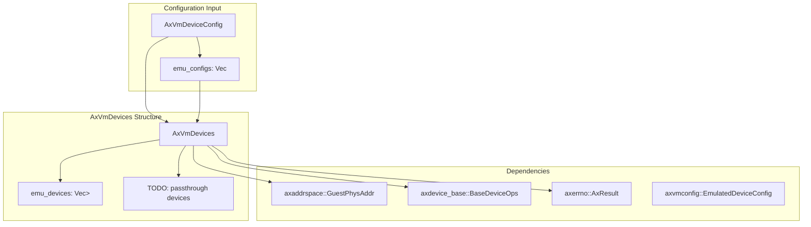
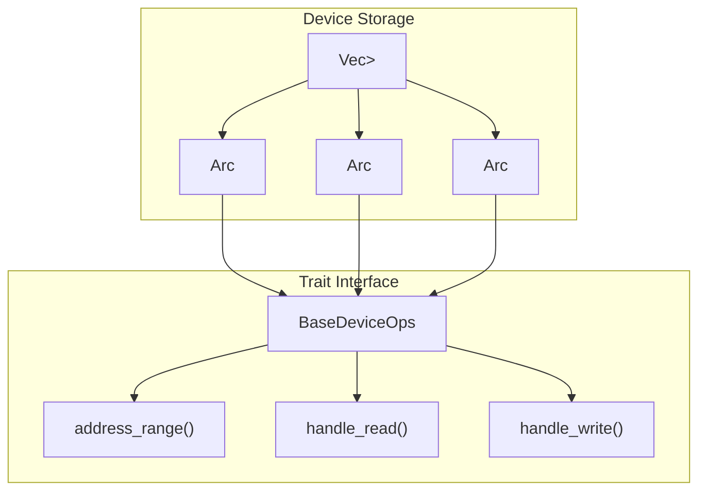
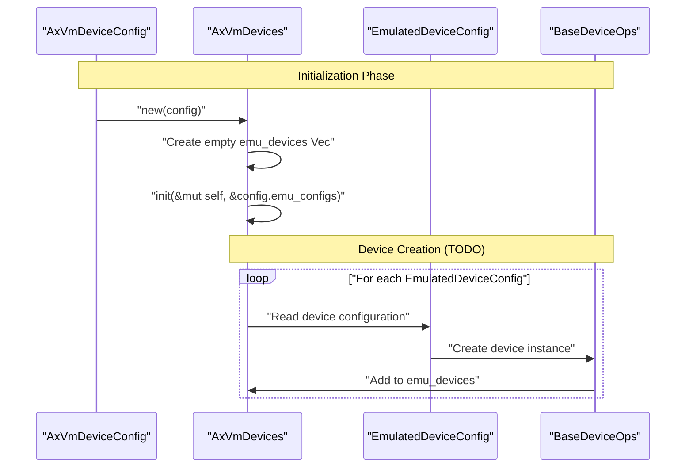
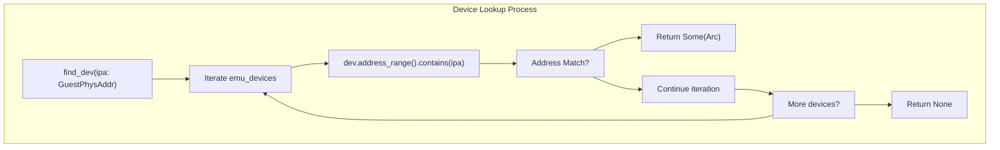
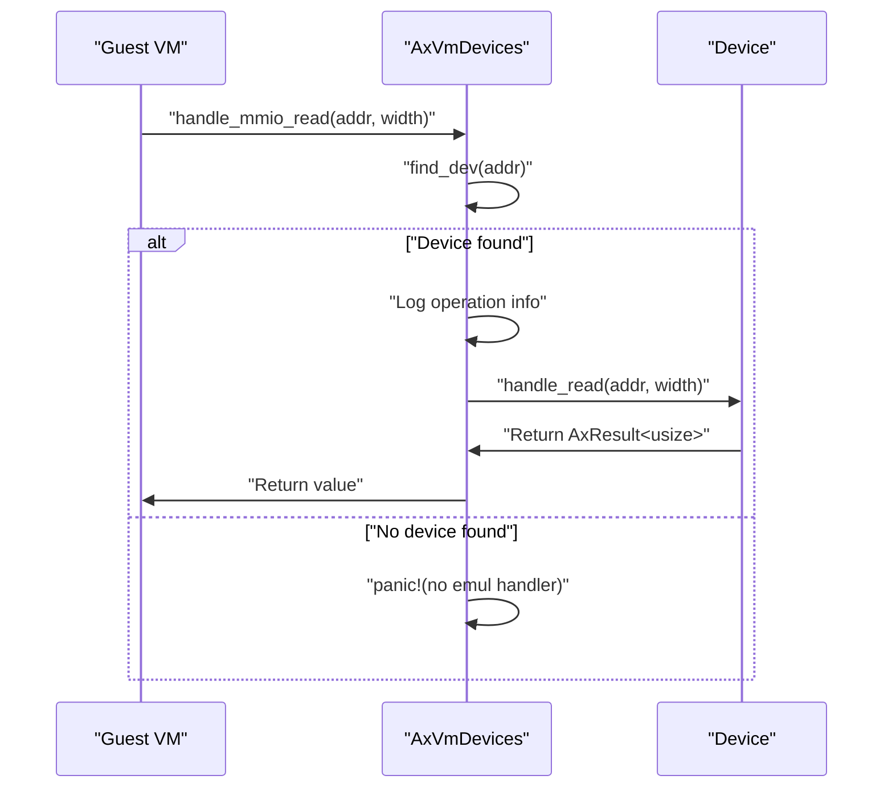
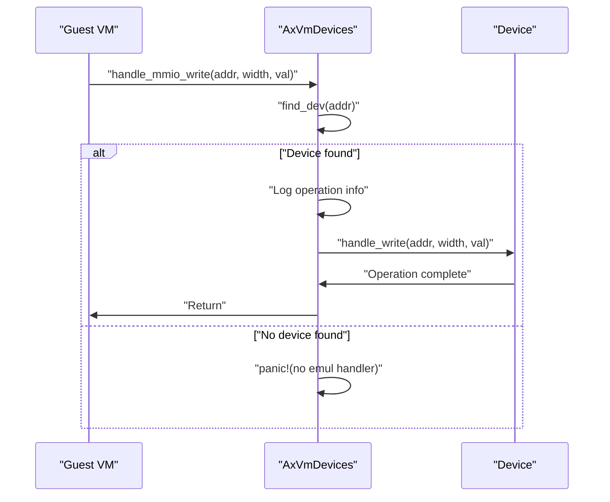
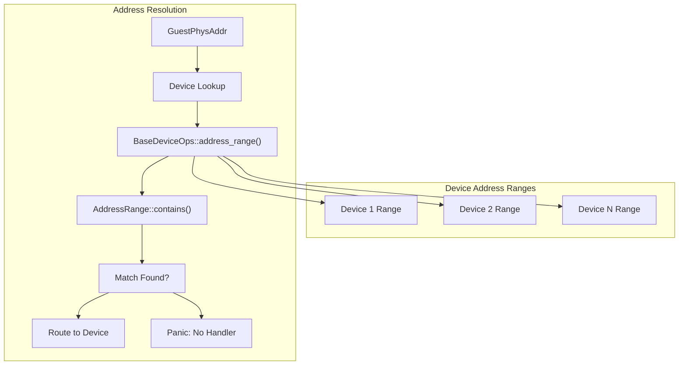
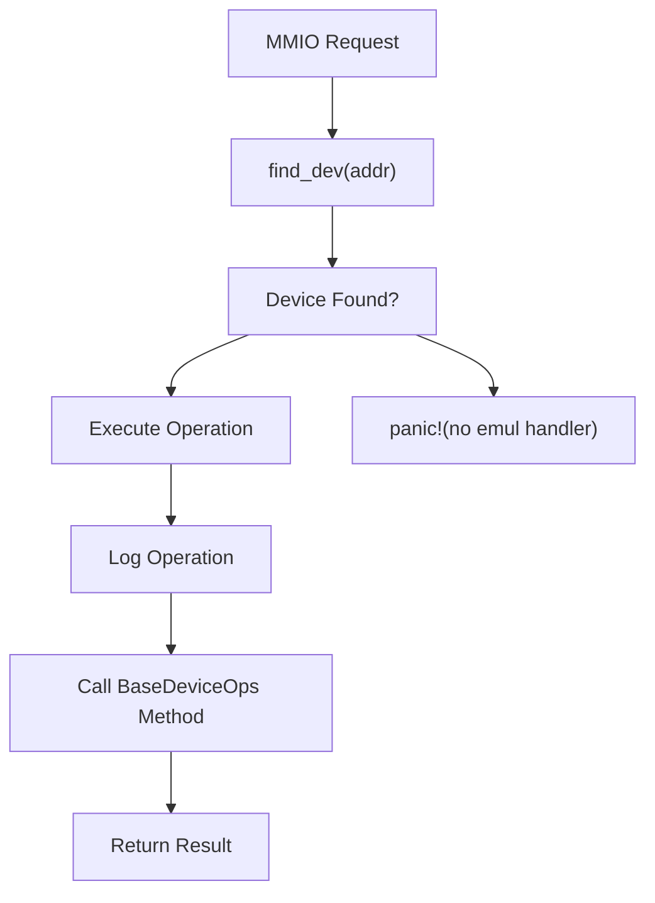
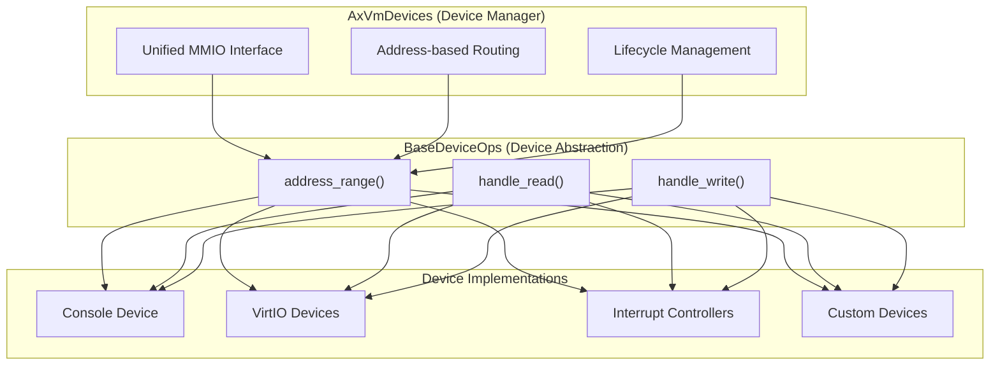

# Device Emulation

> **Relevant source files**
> * [src/device.rs](https://github.com/arceos-hypervisor/axdevice/blob/8652ce80/src/device.rs)
> * [src/lib.rs](https://github.com/arceos-hypervisor/axdevice/blob/8652ce80/src/lib.rs)

## Purpose and Scope

This document covers the device emulation system implemented by the `AxVmDevices` struct, which serves as the central orchestrator for all emulated devices within a virtual machine. The system handles Memory-Mapped I/O (MMIO) operations from guest VMs, manages device lifecycles, and routes operations to appropriate device implementations through the `BaseDeviceOps` trait interface.

For information about device configuration management, see [Configuration Management](/arceos-hypervisor/axdevice/3.1-configuration-management). For broader system integration details, see [ArceOS Ecosystem Integration](/arceos-hypervisor/axdevice/4-arceos-ecosystem-integration).

## AxVmDevices Architecture

The `AxVmDevices` struct acts as the primary interface between guest virtual machines and emulated devices. It maintains a collection of device implementations and provides unified access to MMIO operations.

### Core Structure

Sources: [src/device.rs(L1 - L16)&emsp;](https://github.com/arceos-hypervisor/axdevice/blob/8652ce80/src/device.rs#L1-L16)

The `AxVmDevices` struct currently focuses on emulated devices through the `emu_devices` field, with placeholders for future passthrough device support.

### Device Collection Management

Sources: [src/device.rs(L12 - L16)&emsp;](https://github.com/arceos-hypervisor/axdevice/blob/8652ce80/src/device.rs#L12-L16)

## Device Lifecycle Management

### Initialization Process

The `AxVmDevices` initialization follows a two-phase approach: structure creation and device initialization.

Sources: [src/device.rs(L19 - L28)&emsp;](https://github.com/arceos-hypervisor/axdevice/blob/8652ce80/src/device.rs#L19-L28) [src/device.rs(L30 - L54)&emsp;](https://github.com/arceos-hypervisor/axdevice/blob/8652ce80/src/device.rs#L30-L54)

The `new()` method creates an empty device collection and delegates to the `init()` method for device-specific initialization. Currently, the `init()` method contains placeholder code with TODO comments indicating future device type handling.

### Device Type Enumeration

The commented code in `init()` reveals the planned device type architecture:

|Device Type|Description|
| --- | --- |
|EmuDeviceTConsole|Console device emulation|
|EmuDeviceTGicdV2|GIC distributor v2|
|EmuDeviceTGPPT|General Purpose Physical Timer|
|EmuDeviceTVirtioBlk|VirtIO block device|
|EmuDeviceTVirtioNet|VirtIO network device|
|EmuDeviceTVirtioConsole|VirtIO console device|
|EmuDeviceTIOMMU|I/O Memory Management Unit|
|EmuDeviceTICCSRE|Interrupt Controller System Register Enable|
|EmuDeviceTSGIR|Software Generated Interrupt Register|
|EmuDeviceTGICR|GIC redistributor|
|EmuDeviceTMeta|Metadata device|

Sources: [src/device.rs(L34 - L46)&emsp;](https://github.com/arceos-hypervisor/axdevice/blob/8652ce80/src/device.rs#L34-L46)

## MMIO Operation Handling

### Device Lookup Mechanism

The `find_dev()` method provides address-based device resolution using the `BaseDeviceOps` trait's `address_range()` method.

Sources: [src/device.rs(L56 - L62)&emsp;](https://github.com/arceos-hypervisor/axdevice/blob/8652ce80/src/device.rs#L56-L62)

### MMIO Read Operations

The `handle_mmio_read()` method processes guest VM read requests and returns data from the appropriate device.

Sources: [src/device.rs(L64 - L75)&emsp;](https://github.com/arceos-hypervisor/axdevice/blob/8652ce80/src/device.rs#L64-L75)

The method includes comprehensive logging that outputs the device's address range and the specific IPA (Intermediate Physical Address) being accessed.

### MMIO Write Operations

The `handle_mmio_write()` method processes guest VM write requests to device registers.

Sources: [src/device.rs(L77 - L93)&emsp;](https://github.com/arceos-hypervisor/axdevice/blob/8652ce80/src/device.rs#L77-L93)

Both MMIO operations follow a similar pattern: device lookup, logging, delegation to the device implementation, and error handling via panic for unmapped addresses.

## Address Space Integration

### Guest Physical Address Handling

The system uses `GuestPhysAddr` from the `axaddrspace` crate to represent guest physical memory addresses, ensuring type safety in address operations.

Sources: [src/device.rs(L6)&emsp;](https://github.com/arceos-hypervisor/axdevice/blob/8652ce80/src/device.rs#L6-L6) [src/device.rs(L57 - L62)&emsp;](https://github.com/arceos-hypervisor/axdevice/blob/8652ce80/src/device.rs#L57-L62)

### Error Handling Strategy

The current implementation uses panic-based error handling for unmapped addresses, which provides immediate feedback during development but may require more graceful handling in production environments.

Sources: [src/device.rs(L74)&emsp;](https://github.com/arceos-hypervisor/axdevice/blob/8652ce80/src/device.rs#L74-L74) [src/device.rs(L88 - L91)&emsp;](https://github.com/arceos-hypervisor/axdevice/blob/8652ce80/src/device.rs#L88-L91)

## Integration with BaseDeviceOps

The `AxVmDevices` system relies entirely on the `BaseDeviceOps` trait for device-specific functionality, creating a clean separation between device management and device implementation.

### Trait Method Usage

|Method|Purpose|Usage in AxVmDevices|
| --- | --- | --- |
|address_range()|Define device memory mapping|Used infind_dev()for address resolution|
|handle_read()|Process read operations|Called fromhandle_mmio_read()|
|handle_write()|Process write operations|Called fromhandle_mmio_write()|

Sources: [src/device.rs(L60)&emsp;](https://github.com/arceos-hypervisor/axdevice/blob/8652ce80/src/device.rs#L60-L60) [src/device.rs(L72)&emsp;](https://github.com/arceos-hypervisor/axdevice/blob/8652ce80/src/device.rs#L72-L72) [src/device.rs(L85)&emsp;](https://github.com/arceos-hypervisor/axdevice/blob/8652ce80/src/device.rs#L85-L85)

### Device Abstraction Benefits

Sources: [src/device.rs(L7)&emsp;](https://github.com/arceos-hypervisor/axdevice/blob/8652ce80/src/device.rs#L7-L7) [src/device.rs(L14)&emsp;](https://github.com/arceos-hypervisor/axdevice/blob/8652ce80/src/device.rs#L14-L14)

This architecture enables the `AxVmDevices` system to remain device-agnostic while providing consistent MMIO handling across all emulated device types.