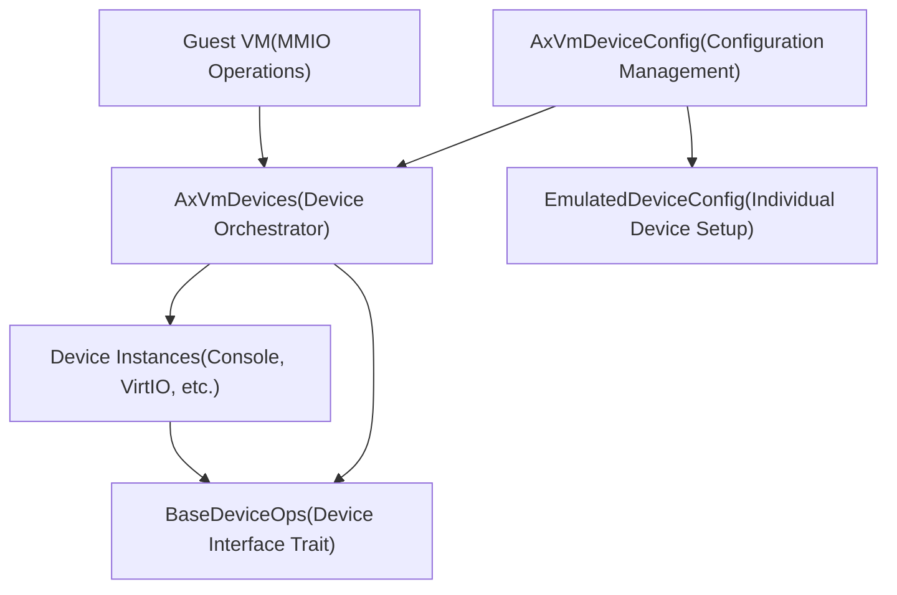
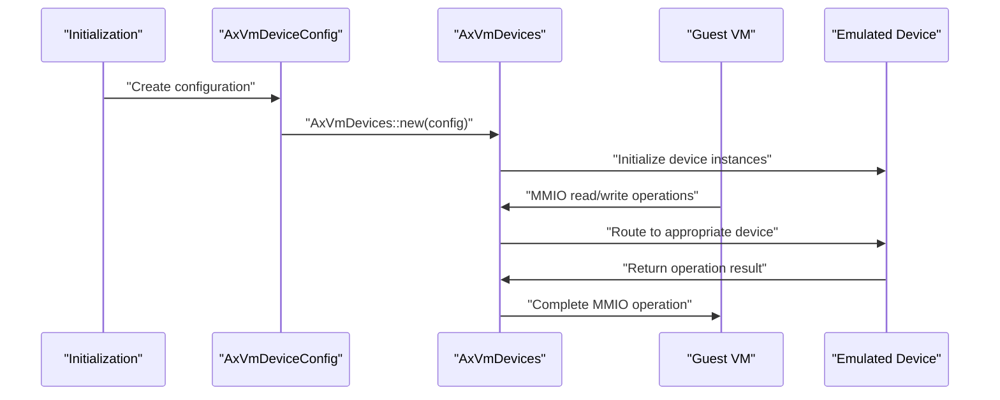
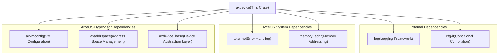

# Overview

> **Relevant source files**
> * [Cargo.toml](https://github.com/arceos-hypervisor/axdevice/blob/8652ce80/Cargo.toml)
> * [src/lib.rs](https://github.com/arceos-hypervisor/axdevice/blob/8652ce80/src/lib.rs)

## Purpose and Scope

The `axdevice` crate provides virtual machine device emulation capabilities within the ArceOS hypervisor ecosystem. This document covers the core functionality of device configuration management and MMIO (Memory-Mapped I/O) operation handling for guest virtual machines.

For detailed information about system architecture patterns, see [System Architecture](/arceos-hypervisor/axdevice/2-system-architecture). For implementation details of individual components, see [Core Components](/arceos-hypervisor/axdevice/3-core-components). For integration with other ArceOS crates, see [ArceOS Ecosystem Integration](/arceos-hypervisor/axdevice/4-arceos-ecosystem-integration).

## Device Emulation Framework

The `axdevice` crate serves as the central device management layer for the ArceOS hypervisor, enabling guest virtual machines to interact with emulated hardware devices through standardized MMIO operations. The crate abstracts device configuration and runtime behavior into two primary components: `AxVmDeviceConfig` for device setup and `AxVmDevices` for operational device management.

**Core Entity Relationships**

Sources: [src/lib.rs(L15 - L19)&emsp;](https://github.com/arceos-hypervisor/axdevice/blob/8652ce80/src/lib.rs#L15-L19) [Cargo.toml(L1 - L19)&emsp;](https://github.com/arceos-hypervisor/axdevice/blob/8652ce80/Cargo.toml#L1-L19)

## Main Components

The crate is organized into two fundamental modules that handle distinct aspects of device emulation:

|Component|Module|Primary Responsibility|
| --- | --- | --- |
|AxVmDeviceConfig|config|Device configuration management and initialization parameters|
|AxVmDevices|device|Runtime device operation handling and MMIO request routing|

**Component Interaction Flow**

Sources: [src/lib.rs(L15 - L16)&emsp;](https://github.com/arceos-hypervisor/axdevice/blob/8652ce80/src/lib.rs#L15-L16) [src/lib.rs(L18 - L19)&emsp;](https://github.com/arceos-hypervisor/axdevice/blob/8652ce80/src/lib.rs#L18-L19)

## ArceOS Hypervisor Integration

The `axdevice` crate operates as a foundational component within the ArceOS hypervisor stack, integrating with several specialized crates to provide comprehensive device emulation capabilities:

**Dependency Architecture**

Sources: [Cargo.toml(L8 - L18)&emsp;](https://github.com/arceos-hypervisor/axdevice/blob/8652ce80/Cargo.toml#L8-L18)

## Runtime Environment

The crate is designed for `no_std` environments, utilizing the `alloc` crate for dynamic memory allocation without requiring the full standard library. This design enables deployment in hypervisor contexts where minimal runtime overhead is critical.

The logging infrastructure is integrated throughout the system using the `log` crate, providing debugging and operational visibility into device emulation activities.

Sources: [src/lib.rs(L1)&emsp;](https://github.com/arceos-hypervisor/axdevice/blob/8652ce80/src/lib.rs#L1-L1) [src/lib.rs(L11 - L13)&emsp;](https://github.com/arceos-hypervisor/axdevice/blob/8652ce80/src/lib.rs#L11-L13)

## Development Context

The `axdevice` crate follows the ArceOS project's modular architecture approach, where specialized functionality is separated into focused crates. The device emulation layer specifically handles the intersection between guest virtual machine memory operations and host-side device implementations.

For build and development procedures, see [Development Guide](/arceos-hypervisor/axdevice/5-development-guide). For detailed component implementation, see [Configuration Management](/arceos-hypervisor/axdevice/3.1-configuration-management) and [Device Emulation](/arceos-hypervisor/axdevice/3.2-device-emulation).

Sources: [Cargo.toml(L1 - L4)&emsp;](https://github.com/arceos-hypervisor/axdevice/blob/8652ce80/Cargo.toml#L1-L4) [src/lib.rs(L3 - L9)&emsp;](https://github.com/arceos-hypervisor/axdevice/blob/8652ce80/src/lib.rs#L3-L9)