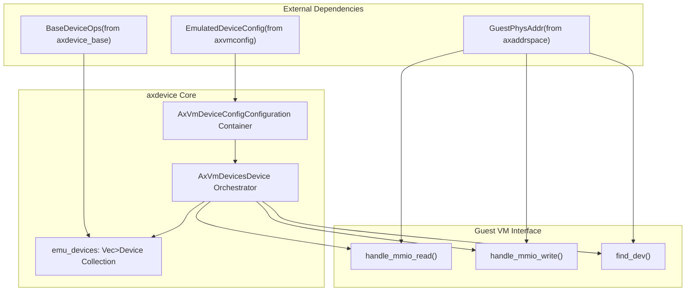
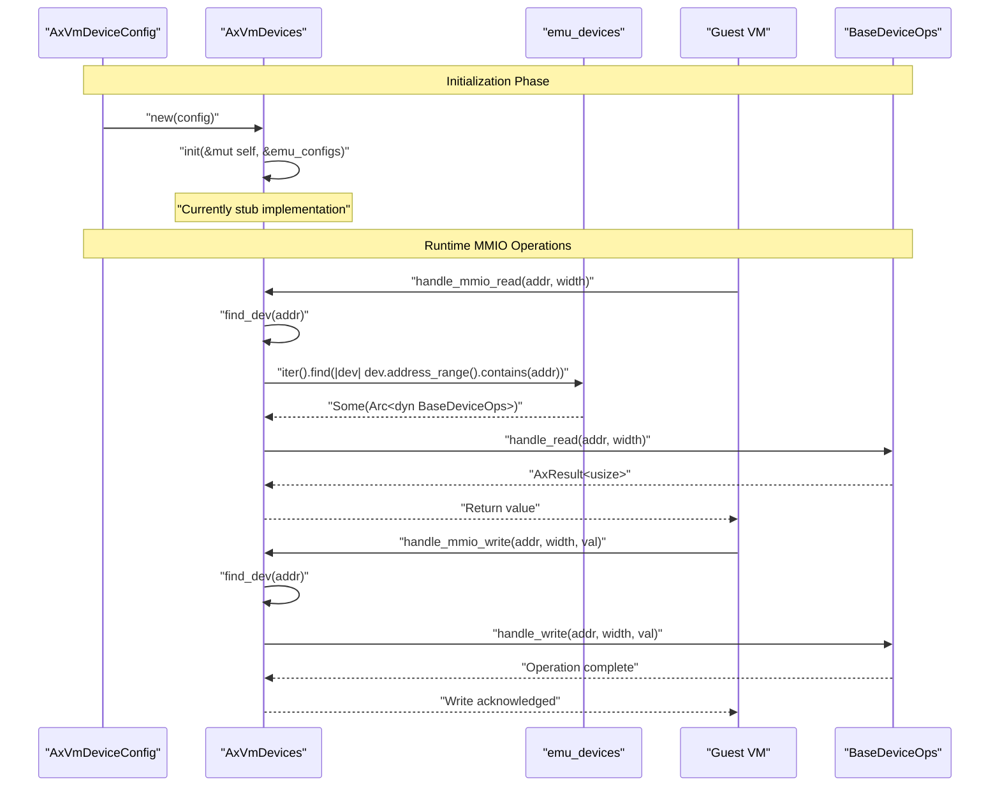
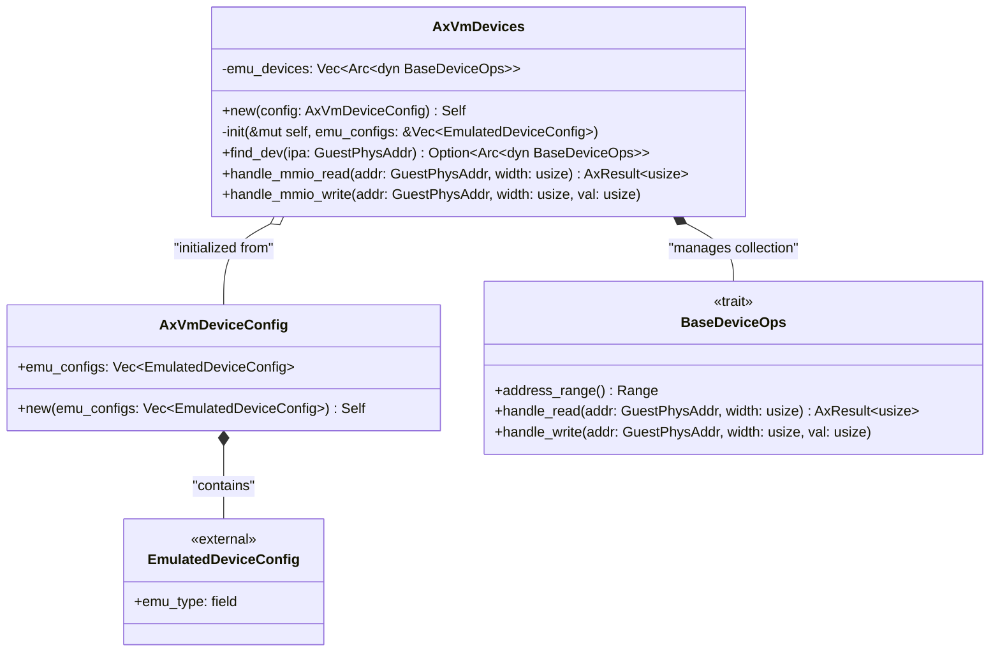
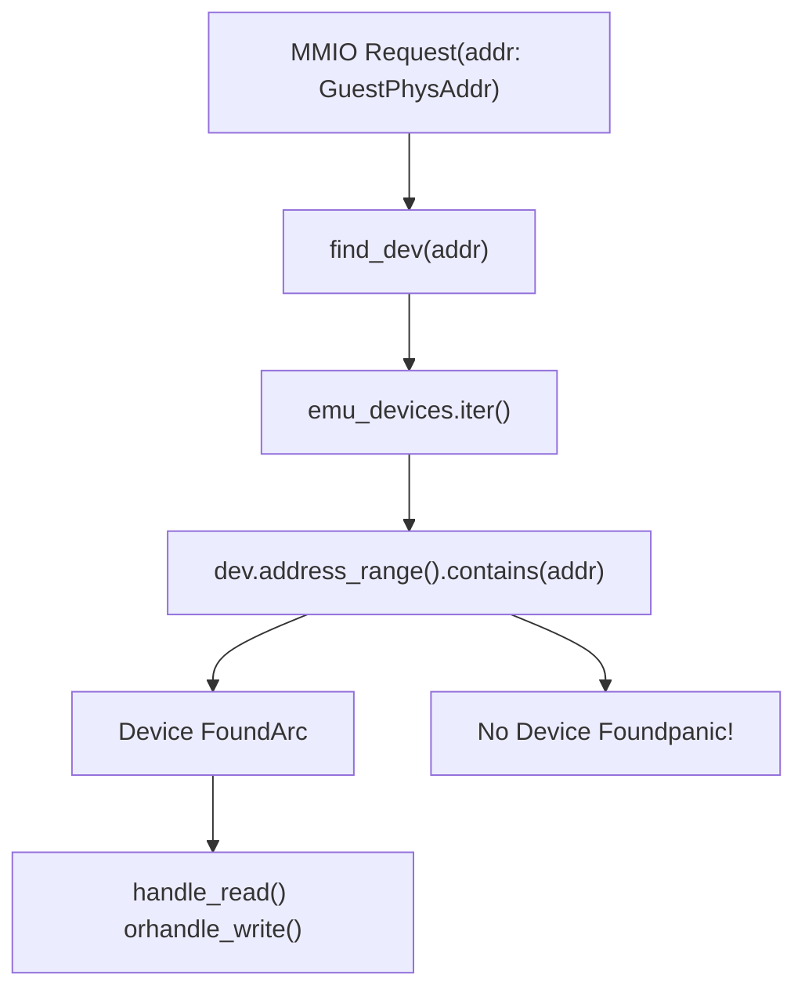
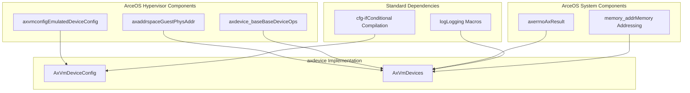

# System Architecture

> **Relevant source files**
> * [Cargo.toml](https://github.com/arceos-hypervisor/axdevice/blob/8652ce80/Cargo.toml)
> * [src/config.rs](https://github.com/arceos-hypervisor/axdevice/blob/8652ce80/src/config.rs)
> * [src/device.rs](https://github.com/arceos-hypervisor/axdevice/blob/8652ce80/src/device.rs)
> * [src/lib.rs](https://github.com/arceos-hypervisor/axdevice/blob/8652ce80/src/lib.rs)

## Purpose and Scope

This document provides a comprehensive view of the `axdevice` system architecture, detailing how the configuration and device management components work together to provide virtual machine device emulation within the ArceOS hypervisor ecosystem. The architecture encompasses MMIO operation handling, device lifecycle management, and integration with external ArceOS components.

For detailed information about individual core components, see [Core Components](/arceos-hypervisor/axdevice/3-core-components). For ArceOS ecosystem integration details, see [ArceOS Ecosystem Integration](/arceos-hypervisor/axdevice/4-arceos-ecosystem-integration).

## High-Level System Architecture

The `axdevice` crate implements a two-layer architecture consisting of configuration management and device emulation orchestration:

### Core Architecture Overview

Sources: [src/config.rs(L5 - L8)&emsp;](https://github.com/arceos-hypervisor/axdevice/blob/8652ce80/src/config.rs#L5-L8) [src/device.rs(L12 - L16)&emsp;](https://github.com/arceos-hypervisor/axdevice/blob/8652ce80/src/device.rs#L12-L16) [src/device.rs(L57 - L62)&emsp;](https://github.com/arceos-hypervisor/axdevice/blob/8652ce80/src/device.rs#L57-L62) [src/device.rs(L65 - L75)&emsp;](https://github.com/arceos-hypervisor/axdevice/blob/8652ce80/src/device.rs#L65-L75) [src/device.rs(L78 - L92)&emsp;](https://github.com/arceos-hypervisor/axdevice/blob/8652ce80/src/device.rs#L78-L92)

## Component Interaction Flow

The system follows a clear initialization and runtime operation pattern:

### Device Initialization and MMIO Handling Flow

Sources: [src/device.rs(L20 - L28)&emsp;](https://github.com/arceos-hypervisor/axdevice/blob/8652ce80/src/device.rs#L20-L28) [src/device.rs(L30 - L54)&emsp;](https://github.com/arceos-hypervisor/axdevice/blob/8652ce80/src/device.rs#L30-L54) [src/device.rs(L57 - L62)&emsp;](https://github.com/arceos-hypervisor/axdevice/blob/8652ce80/src/device.rs#L57-L62) [src/device.rs(L65 - L75)&emsp;](https://github.com/arceos-hypervisor/axdevice/blob/8652ce80/src/device.rs#L65-L75) [src/device.rs(L78 - L92)&emsp;](https://github.com/arceos-hypervisor/axdevice/blob/8652ce80/src/device.rs#L78-L92)

## Core Data Structures and Relationships

### Configuration and Device Management Structure

Sources: [src/config.rs(L5 - L16)&emsp;](https://github.com/arceos-hypervisor/axdevice/blob/8652ce80/src/config.rs#L5-L16) [src/device.rs(L12 - L16)&emsp;](https://github.com/arceos-hypervisor/axdevice/blob/8652ce80/src/device.rs#L12-L16) [src/device.rs(L20 - L28)&emsp;](https://github.com/arceos-hypervisor/axdevice/blob/8652ce80/src/device.rs#L20-L28) [src/device.rs(L57 - L62)&emsp;](https://github.com/arceos-hypervisor/axdevice/blob/8652ce80/src/device.rs#L57-L62)

## MMIO Operation Handling Architecture

The system's core functionality centers around Memory-Mapped I/O (MMIO) operation routing:

### MMIO Address Resolution and Device Routing

|Operation|Method|Address Resolution|Device Interaction|
| --- | --- | --- | --- |
|Read|handle_mmio_read|find_dev(addr)→address_range().contains(addr)|device.handle_read(addr, width)|
|Write|handle_mmio_write|find_dev(addr)→address_range().contains(addr)|device.handle_write(addr, width, val)|

The address resolution process follows this pattern:

Sources: [src/device.rs(L57 - L62)&emsp;](https://github.com/arceos-hypervisor/axdevice/blob/8652ce80/src/device.rs#L57-L62) [src/device.rs(L65 - L75)&emsp;](https://github.com/arceos-hypervisor/axdevice/blob/8652ce80/src/device.rs#L65-L75) [src/device.rs(L78 - L92)&emsp;](https://github.com/arceos-hypervisor/axdevice/blob/8652ce80/src/device.rs#L78-L92)

## Dependency Architecture and External Integration

The system integrates with multiple ArceOS ecosystem components:

### External Dependencies and Integration Points

### Dependency Details

|Component|Source|Purpose|Usage|
| --- | --- | --- | --- |
|EmulatedDeviceConfig|axvmconfig|Device configuration data|Stored inAxVmDeviceConfig.emu_configs|
|GuestPhysAddr|axaddrspace|Guest physical addressing|MMIO operation parameters|
|BaseDeviceOps|axdevice_base|Device operation interface|Stored asArc<dyn BaseDeviceOps>|
|AxResult|axerrno|Error handling|Return type forhandle_mmio_read|

Sources: [Cargo.toml(L8 - L18)&emsp;](https://github.com/arceos-hypervisor/axdevice/blob/8652ce80/Cargo.toml#L8-L18) [src/config.rs(L2)&emsp;](https://github.com/arceos-hypervisor/axdevice/blob/8652ce80/src/config.rs#L2-L2) [src/device.rs(L6 - L9)&emsp;](https://github.com/arceos-hypervisor/axdevice/blob/8652ce80/src/device.rs#L6-L9) [src/lib.rs(L11 - L13)&emsp;](https://github.com/arceos-hypervisor/axdevice/blob/8652ce80/src/lib.rs#L11-L13)

## Current Implementation Status

The system architecture includes placeholder implementations for future device types:

### Device Type Support (Planned Implementation)

The `init` method in `AxVmDevices` contains commented code indicating planned support for multiple device types:

* Console devices (`EmuDeviceTConsole`)
* VirtIO devices (`EmuDeviceTVirtioBlk`, `EmuDeviceTVirtioNet`, `EmuDeviceTVirtioConsole`)
* Interrupt controllers (`EmuDeviceTGicdV2`, `EmuDeviceTGICR`)
* IOMMU (`EmuDeviceTIOMMU`)
* Other specialized devices (`EmuDeviceTGPPT`, `EmuDeviceTICCSRE`, `EmuDeviceTSGIR`, `EmuDeviceTMeta`)

Sources: [src/device.rs(L30 - L54)&emsp;](https://github.com/arceos-hypervisor/axdevice/blob/8652ce80/src/device.rs#L30-L54)