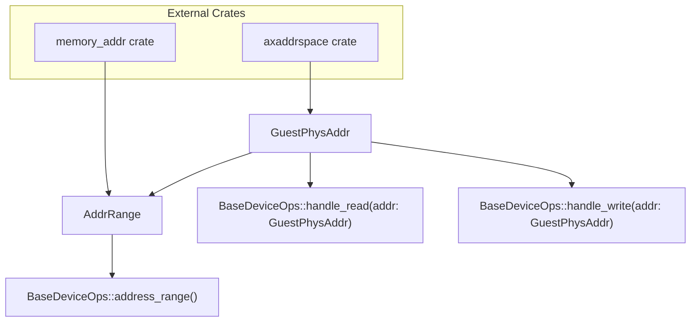
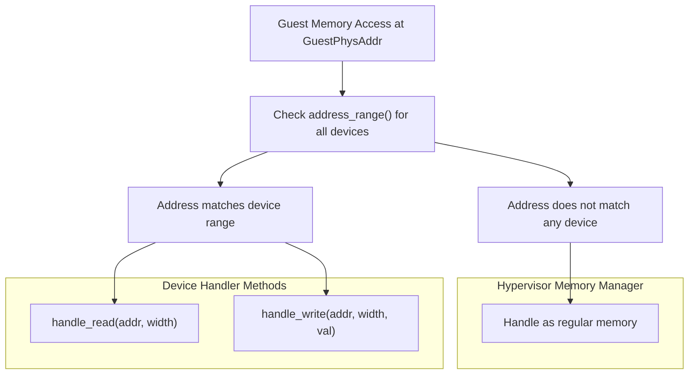
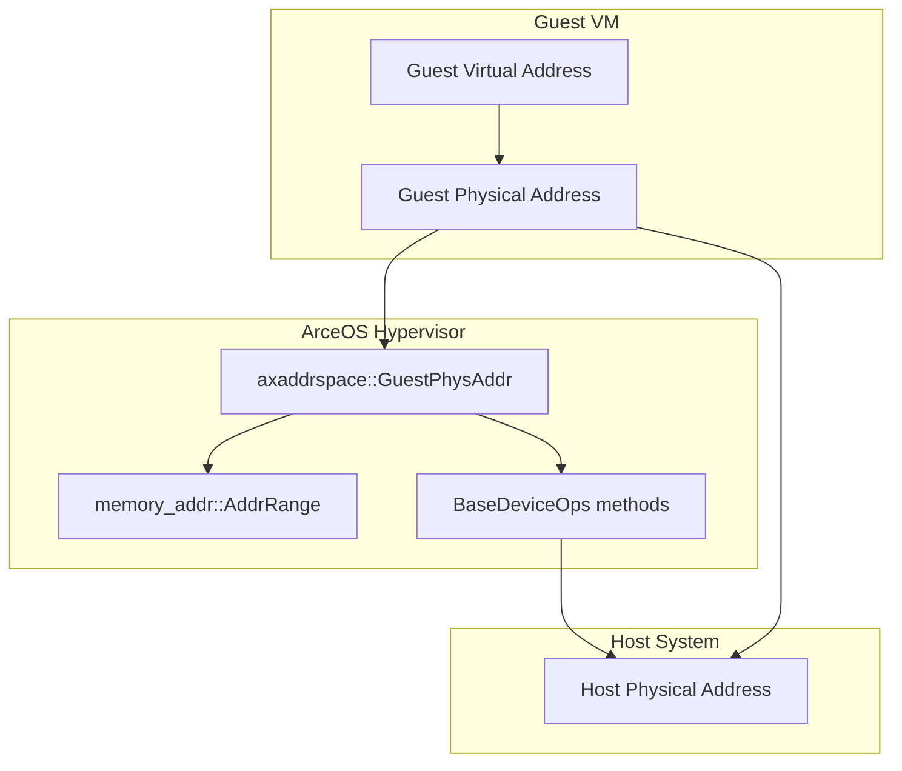

# Address Space Management

> **Relevant source files**
> * [axdevice_base/src/lib.rs](https://github.com/arceos-hypervisor/axdevice_crates/blob/28d49f14/axdevice_base/src/lib.rs)

This document covers the address space management system used by emulated devices in the ArceOS hypervisor. It explains how guest physical addresses (`GuestPhysAddr`) are mapped to device handlers, how address ranges (`AddrRange<GuestPhysAddr>`) define device memory regions, and the integration with the `axaddrspace` crate for hypervisor address space management.

For information about device type classification and the `BaseDeviceOps` trait interface, see [Device Type System](/arceos-hypervisor/axdevice_crates/2.2-device-type-system) and [BaseDeviceOps Trait](/arceos-hypervisor/axdevice_crates/2.1-basedeviceops-trait).

## Core Address Space Concepts

The address space management system is built around two fundamental types from external crates:

* `GuestPhysAddr` from the `axaddrspace` crate represents individual guest physical addresses
* `AddrRange<GuestPhysAddr>` from the `memory_addr` crate represents contiguous address ranges

Every emulated device must define its memory-mapped region through the `address_range()` method in the `BaseDeviceOps` trait, which returns an `AddrRange<GuestPhysAddr>` defining the device's location in guest physical memory space.

**Address Space Type Hierarchy**



Sources: [axdevice_base/src/lib.rs(L11 - L14)&emsp;](https://github.com/arceos-hypervisor/axdevice_crates/blob/28d49f14/axdevice_base/src/lib.rs#L11-L14) [axdevice_base/src/lib.rs(L25)&emsp;](https://github.com/arceos-hypervisor/axdevice_crates/blob/28d49f14/axdevice_base/src/lib.rs#L25-L25) [axdevice_base/src/lib.rs(L27 - L29)&emsp;](https://github.com/arceos-hypervisor/axdevice_crates/blob/28d49f14/axdevice_base/src/lib.rs#L27-L29)

## Guest Physical Address Mapping

Guest physical addresses represent the memory layout as seen by the virtual machine. Each emulated device occupies a specific range within this address space, allowing the hypervisor to route memory accesses to the appropriate device handler.

The `BaseDeviceOps` trait defines the contract for address space integration:

|Method|Parameter Type|Return Type|Purpose|
| --- | --- | --- | --- |
|address_range()|None|AddrRange<GuestPhysAddr>|Define device memory region|
|handle_read()|addr: GuestPhysAddr, width: usize|AxResult<usize>|Handle guest read access|
|handle_write()|addr: GuestPhysAddr, width: usize, val: usize|None|Handle guest write access|

The `width` parameter specifies the access size (1, 2, 4, or 8 bytes), allowing devices to handle different data types appropriately.

Sources: [axdevice_base/src/lib.rs(L25 - L29)&emsp;](https://github.com/arceos-hypervisor/axdevice_crates/blob/28d49f14/axdevice_base/src/lib.rs#L25-L29)

## Device Address Range Management

Each device implementation must return a valid `AddrRange<GuestPhysAddr>` that defines its memory-mapped region. This range is used by the hypervisor's address space manager to route memory accesses to the correct device handler.

**Device Address Range Resolution Flow**

```

```

The address space manager maintains a mapping between guest physical address ranges and device handlers, enabling efficient routing of memory operations without requiring linear searches through all devices.

Sources: [axdevice_base/src/lib.rs(L25)&emsp;](https://github.com/arceos-hypervisor/axdevice_crates/blob/28d49f14/axdevice_base/src/lib.rs#L25-L25)

## Memory Access Routing Flow

When a guest virtual machine accesses memory, the hypervisor must determine whether the access targets an emulated device or regular memory. This determination is made using the address ranges returned by each device's `address_range()` method.

**Memory Access Decision Tree**



The routing decision is based on whether the guest physical address falls within any device's declared address range. If multiple devices claim overlapping ranges, the behavior is implementation-defined by the hypervisor's address space manager.

Sources: [axdevice_base/src/lib.rs(L27 - L29)&emsp;](https://github.com/arceos-hypervisor/axdevice_crates/blob/28d49f14/axdevice_base/src/lib.rs#L27-L29)

## Integration with axaddrspace

The `axaddrspace` crate provides the `GuestPhysAddr` type that represents addresses in the guest's physical memory space. This integration ensures type safety and prevents confusion between different address spaces (host physical, guest physical, guest virtual).

The choice of `GuestPhysAddr` as the address type in `BaseDeviceOps` methods indicates that device emulation operates at the guest physical memory level, after any guest virtual-to-physical translation has occurred within the guest VM.

**Address Space Integration Architecture**



This architecture ensures that emulated devices receive addresses in a consistent format regardless of the guest's internal memory management configuration.

Sources: [axdevice_base/src/lib.rs(L13)&emsp;](https://github.com/arceos-hypervisor/axdevice_crates/blob/28d49f14/axdevice_base/src/lib.rs#L13-L13) [axdevice_base/src/lib.rs(L25)&emsp;](https://github.com/arceos-hypervisor/axdevice_crates/blob/28d49f14/axdevice_base/src/lib.rs#L25-L25) [axdevice_base/src/lib.rs(L27 - L29)&emsp;](https://github.com/arceos-hypervisor/axdevice_crates/blob/28d49f14/axdevice_base/src/lib.rs#L27-L29)