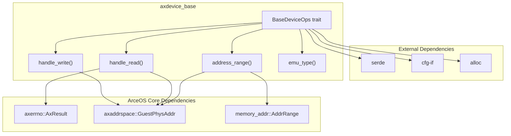
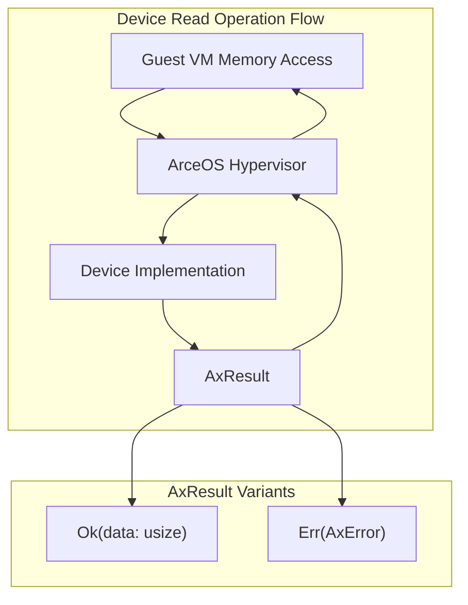
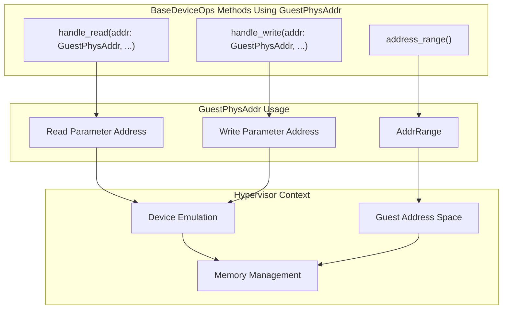
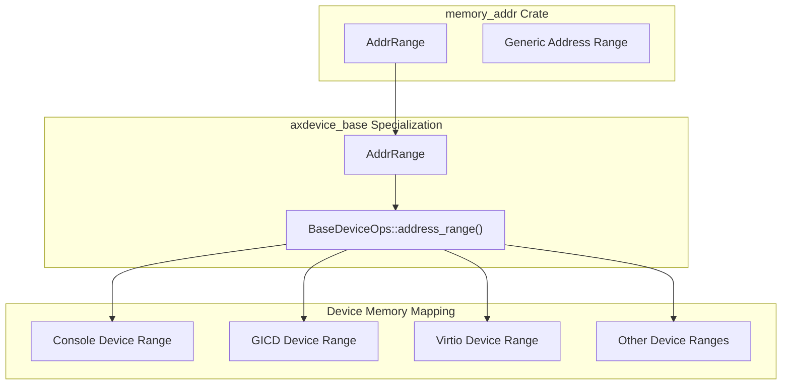

# ArceOS Integration

> **Relevant source files**
> * [axdevice_base/Cargo.toml](https://github.com/arceos-hypervisor/axdevice_crates/blob/28d49f14/axdevice_base/Cargo.toml)
> * [axdevice_base/src/lib.rs](https://github.com/arceos-hypervisor/axdevice_crates/blob/28d49f14/axdevice_base/src/lib.rs)

This page documents how `axdevice_base` integrates with the ArceOS hypervisor ecosystem through its core dependencies: `axerrno`, `axaddrspace`, and `memory_addr`. These dependencies enable standardized error handling, guest physical address management, and memory range abstractions essential for device emulation in the hypervisor context.

For information about the core device abstraction patterns, see [Core Architecture](/arceos-hypervisor/axdevice_crates/2-core-architecture). For implementation details of the traits and types, see [BaseDeviceOps Trait](/arceos-hypervisor/axdevice_crates/2.1-basedeviceops-trait).

## ArceOS Dependency Overview

The `axdevice_base` crate relies on three key ArceOS ecosystem dependencies that provide fundamental hypervisor capabilities. These dependencies are tightly integrated into the `BaseDeviceOps` trait interface to ensure consistent device emulation across the ArceOS hypervisor.

### Dependency Architecture



Sources: [axdevice_base/src/lib.rs(L11 - L14)&emsp;](https://github.com/arceos-hypervisor/axdevice_crates/blob/28d49f14/axdevice_base/src/lib.rs#L11-L14) [axdevice_base/Cargo.toml(L10 - L16)&emsp;](https://github.com/arceos-hypervisor/axdevice_crates/blob/28d49f14/axdevice_base/Cargo.toml#L10-L16)

### Dependency Declaration

The dependencies are declared in the crate's `Cargo.toml` with specific version requirements:

|Dependency|Version|Source|Purpose|
| --- | --- | --- | --- |
|axerrno|0.1.0|crates.io|Standardized error handling|
|axaddrspace|git main|GitHub repository|Guest physical address types|
|memory_addr|0.3|crates.io|Memory address range abstractions|

Sources: [axdevice_base/Cargo.toml(L14 - L16)&emsp;](https://github.com/arceos-hypervisor/axdevice_crates/blob/28d49f14/axdevice_base/Cargo.toml#L14-L16)

## Error Handling Integration:axerrno

The `axerrno` crate provides standardized error handling across the ArceOS ecosystem. In `axdevice_base`, it's used exclusively in the `handle_read` method of the `BaseDeviceOps` trait to indicate success or failure of read operations.

### AxResult Usage Pattern



The `handle_read` method signature demonstrates this integration:

```rust
fn handle_read(&self, addr: GuestPhysAddr, width: usize) -> AxResult<usize>
```

This design allows device implementations to return either:

* `Ok(data)` - successful read with the actual data value
* `Err(error)` - standardized error indicating why the read failed

Sources: [axdevice_base/src/lib.rs(L27)&emsp;](https://github.com/arceos-hypervisor/axdevice_crates/blob/28d49f14/axdevice_base/src/lib.rs#L27-L27)

## Address Space Integration:axaddrspace

The `axaddrspace` crate provides hypervisor-specific address space management types, particularly `GuestPhysAddr` which represents guest physical addresses in the virtualized environment.

### GuestPhysAddr in BaseDeviceOps

The `GuestPhysAddr` type appears in three critical methods of the `BaseDeviceOps` trait:



The integration enables:

* **Address Range Definition**: `address_range()` returns `AddrRange<GuestPhysAddr>` to define the guest physical memory region this device occupies
* **Read Access**: `handle_read()` receives a `GuestPhysAddr` parameter indicating which guest physical address is being read
* **Write Access**: `handle_write()` receives a `GuestPhysAddr` parameter indicating which guest physical address is being written

Sources: [axdevice_base/src/lib.rs(L25 - L29)&emsp;](https://github.com/arceos-hypervisor/axdevice_crates/blob/28d49f14/axdevice_base/src/lib.rs#L25-L29)

## Memory Range Integration:memory_addr

The `memory_addr` crate provides the `AddrRange<T>` generic type used to represent contiguous memory address ranges. In `axdevice_base`, it's specialized with `GuestPhysAddr` to define device memory regions.

### AddrRange Specialization



This specialization allows each device implementation to precisely define:

* **Start Address**: Beginning of the device's guest physical address range
* **Size/End Address**: Extent of the device's memory-mapped region
* **Bounds Checking**: Automatic validation that access addresses fall within the device's range

The `address_range()` method is fundamental to the hypervisor's memory management, enabling it to route guest memory accesses to the appropriate emulated device based on the target address.

Sources: [axdevice_base/src/lib.rs(L11 - L25)&emsp;](https://github.com/arceos-hypervisor/axdevice_crates/blob/28d49f14/axdevice_base/src/lib.rs#L11-L25)

## Integration Patterns in BaseDeviceOps

The `BaseDeviceOps` trait demonstrates a cohesive integration pattern where each ArceOS dependency serves a specific role in the device emulation interface:

### Method Integration Matrix

|Method|axerrno|axaddrspace|memory_addr|Purpose|
| --- | --- | --- | --- | --- |
|emu_type()|❌|❌|❌|Device type identification|
|address_range()|❌|✅|✅|Memory region definition|
|handle_read()|✅|✅|❌|Read operation with error handling|
|handle_write()|❌|✅|❌|Write operation (no error return)|

### Trait Method Signatures

The complete trait definition shows the integration points:

```rust
pub trait BaseDeviceOps {
    fn emu_type(&self) -> EmuDeviceType;
    fn address_range(&self) -> AddrRange<GuestPhysAddr>;      // memory_addr + axaddrspace
    fn handle_read(&self, addr: GuestPhysAddr, width: usize) -> AxResult<usize>;  // axaddrspace + axerrno
    fn handle_write(&self, addr: GuestPhysAddr, width: usize, val: usize);        // axaddrspace
}
```

This design ensures that device implementations can seamlessly integrate with the ArceOS hypervisor's memory management and error handling systems.

Sources: [axdevice_base/src/lib.rs(L21 - L30)&emsp;](https://github.com/arceos-hypervisor/axdevice_crates/blob/28d49f14/axdevice_base/src/lib.rs#L21-L30)

## Hypervisor Ecosystem Context

The ArceOS integration dependencies position `axdevice_base` as a bridge between the hypervisor core and device-specific implementations. This integration enables:

* **Unified Address Space**: All devices operate within the same `GuestPhysAddr` address space managed by the hypervisor
* **Consistent Error Handling**: Device operations return standardized `AxResult` types that the hypervisor can process uniformly
* **Memory Region Management**: Device address ranges integrate with the hypervisor's memory management unit for efficient routing

The dependency choices reflect ArceOS's design philosophy of providing specialized, composable components for hypervisor functionality while maintaining `no_std` compatibility for embedded and constrained environments.

Sources: [axdevice_base/src/lib.rs(L1 - L14)&emsp;](https://github.com/arceos-hypervisor/axdevice_crates/blob/28d49f14/axdevice_base/src/lib.rs#L1-L14) [axdevice_base/Cargo.toml(L14 - L16)&emsp;](https://github.com/arceos-hypervisor/axdevice_crates/blob/28d49f14/axdevice_base/Cargo.toml#L14-L16)