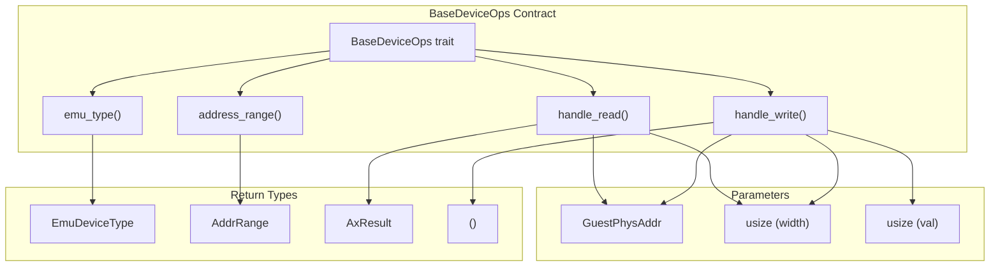
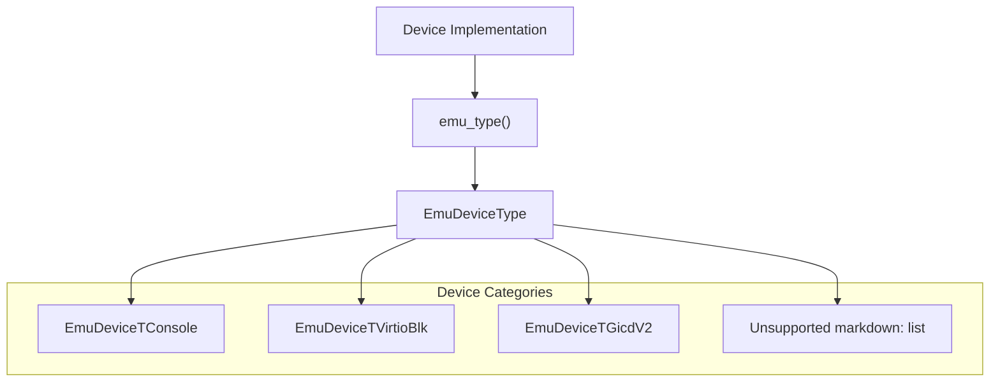
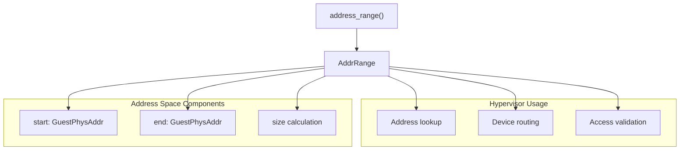
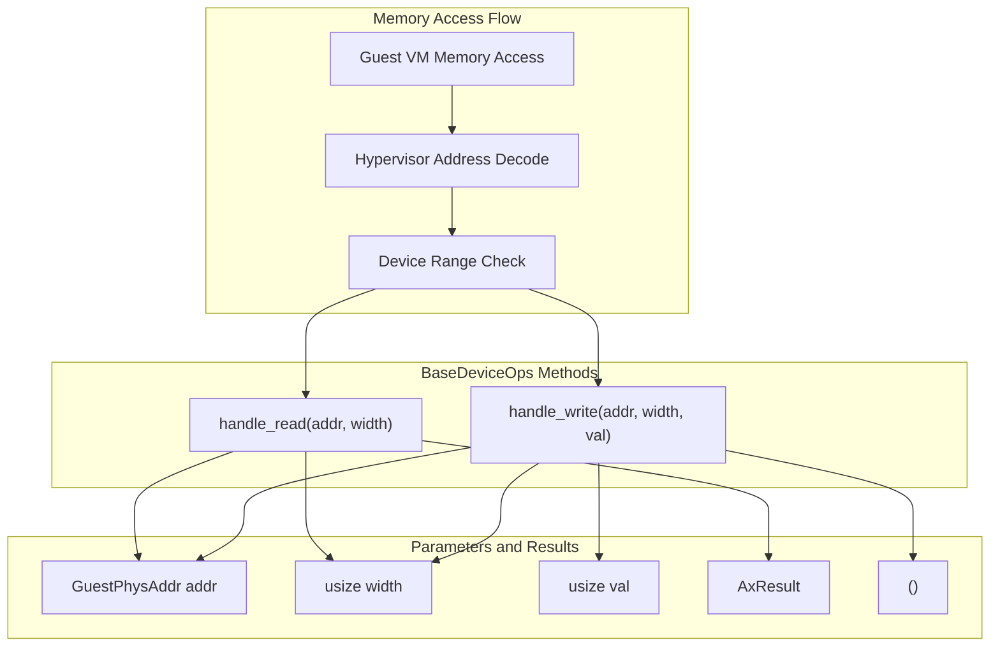
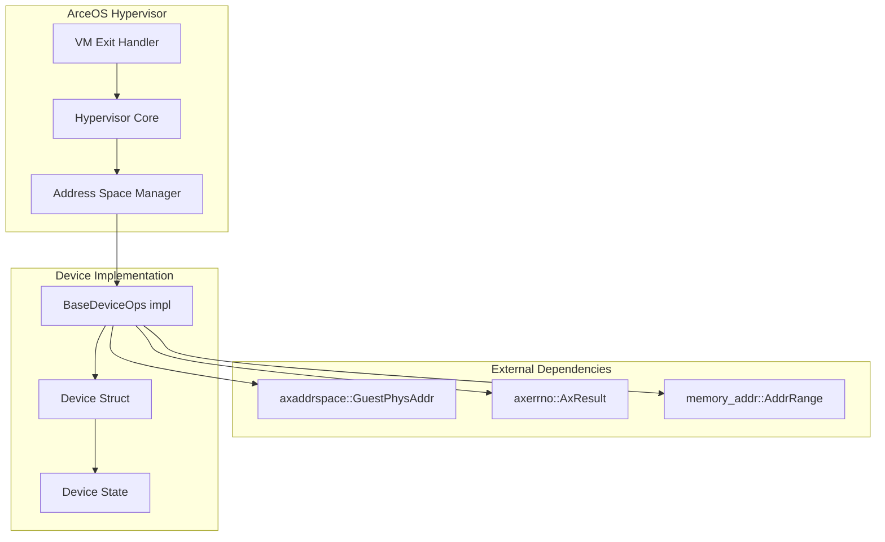

# BaseDeviceOps Trait

> **Relevant source files**
> * [axdevice_base/src/lib.rs](https://github.com/arceos-hypervisor/axdevice_crates/blob/28d49f14/axdevice_base/src/lib.rs)

This document covers the `BaseDeviceOps` trait, which defines the core interface that all emulated devices must implement in the ArceOS hypervisor device emulation system. The trait provides a uniform contract for device identification, address mapping, and memory access handling across different types of virtualized hardware.

For information about specific device types that implement this trait, see [Device Type System](/arceos-hypervisor/axdevice_crates/2.2-device-type-system). For details about address space management and memory mapping, see [Address Space Management](/arceos-hypervisor/axdevice_crates/2.3-address-space-management).

## Trait Overview

The `BaseDeviceOps` trait serves as the fundamental abstraction layer for device emulation in the ArceOS hypervisor. It defines four essential operations that enable the hypervisor to uniformly interact with different types of emulated devices, from simple console devices to complex interrupt controllers.

The trait is designed for `no_std` environments and integrates with the ArceOS ecosystem through typed address spaces and standardized error handling.

**Sources:** [axdevice_base/src/lib.rs(L20 - L30)&emsp;](https://github.com/arceos-hypervisor/axdevice_crates/blob/28d49f14/axdevice_base/src/lib.rs#L20-L30)

## Method Specifications

### Device Type Identification

The `emu_type()` method returns an `EmuDeviceType` enum value that identifies the specific type of device being emulated. This enables the hypervisor to apply device-specific logic and optimizations.

|Method|Signature|Purpose|
| --- | --- | --- |
|emu_type|fn emu_type(&self) -> EmuDeviceType|Device type identification for hypervisor routing|

**Sources:** [axdevice_base/src/lib.rs(L22 - L23)&emsp;](https://github.com/arceos-hypervisor/axdevice_crates/blob/28d49f14/axdevice_base/src/lib.rs#L22-L23)

### Address Range Management

The `address_range()` method defines the guest physical address space region that the device occupies. The hypervisor uses this information to route memory accesses to the appropriate device implementation.

|Method|Signature|Purpose|
| --- | --- | --- |
|address_range|fn address_range(&self) -> AddrRange<GuestPhysAddr>|Memory-mapped I/O address space definition|

**Sources:** [axdevice_base/src/lib.rs(L24 - L25)&emsp;](https://github.com/arceos-hypervisor/axdevice_crates/blob/28d49f14/axdevice_base/src/lib.rs#L24-L25)

### Memory Access Handlers

The memory access handlers implement the core device emulation logic. The `handle_read()` method processes guest read operations and returns emulated device state, while `handle_write()` processes guest write operations that may modify device behavior.

|Method|Signature|Return|Purpose|
| --- | --- | --- | --- |
|handle_read|fn handle_read(&self, addr: GuestPhysAddr, width: usize) -> AxResult<usize>|AxResult<usize>|Process guest memory read operations|
|handle_write|fn handle_write(&self, addr: GuestPhysAddr, width: usize, val: usize)|()|Process guest memory write operations|

**Sources:** [axdevice_base/src/lib.rs(L26 - L29)&emsp;](https://github.com/arceos-hypervisor/axdevice_crates/blob/28d49f14/axdevice_base/src/lib.rs#L26-L29)

## Implementation Requirements

### Error Handling

Read operations return `AxResult<usize>` to handle potential emulation errors such as invalid register addresses or unsupported access widths. Write operations use a void return type, with error conditions typically handled through device-specific state changes or logging.

### Access Width Support

The `width` parameter specifies the memory access size in bytes (typically 1, 2, 4, or 8). Device implementations must handle the access widths supported by their emulated hardware, potentially returning errors for unsupported widths.

### Address Validation

Device implementations should validate that the provided `addr` parameter falls within their declared address range and corresponds to a valid device register or memory location.

## Integration Patterns

The trait integrates with the ArceOS hypervisor through standardized address space management and error handling. Device implementations typically maintain internal state and use the trait methods as the primary interface for hypervisor interaction.

**Sources:** [axdevice_base/src/lib.rs(L11 - L18)&emsp;](https://github.com/arceos-hypervisor/axdevice_crates/blob/28d49f14/axdevice_base/src/lib.rs#L11-L18)