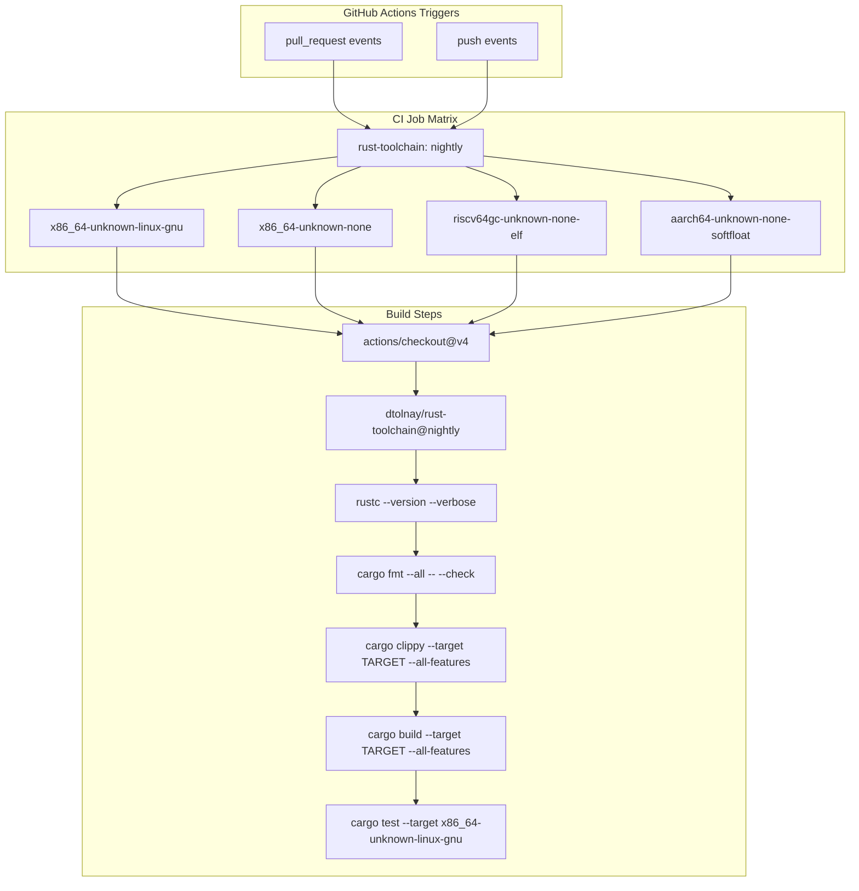
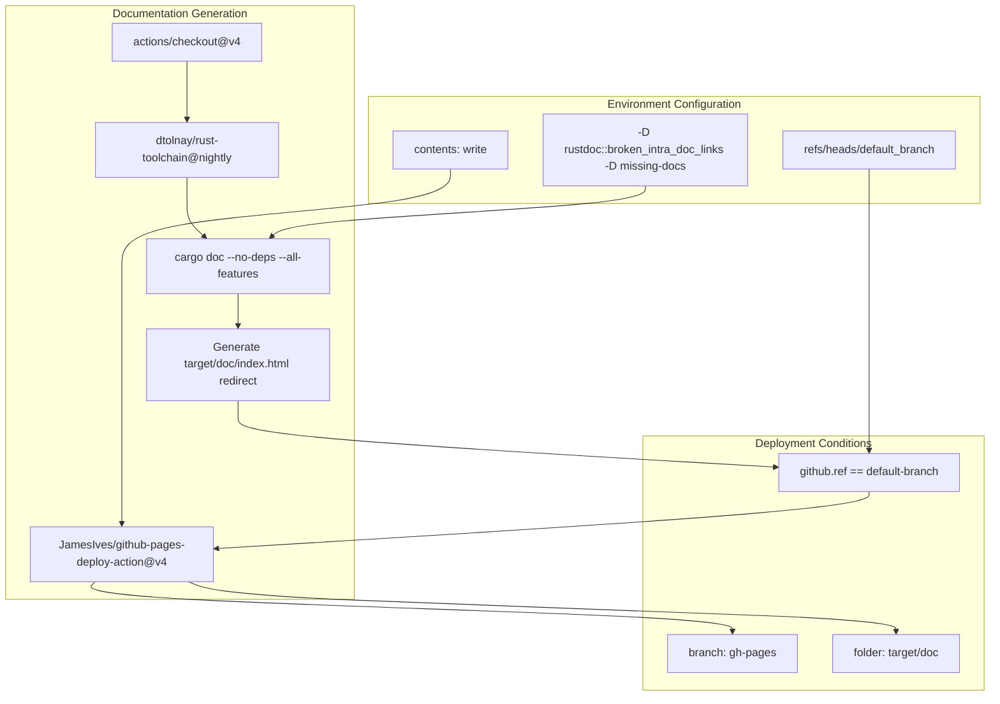
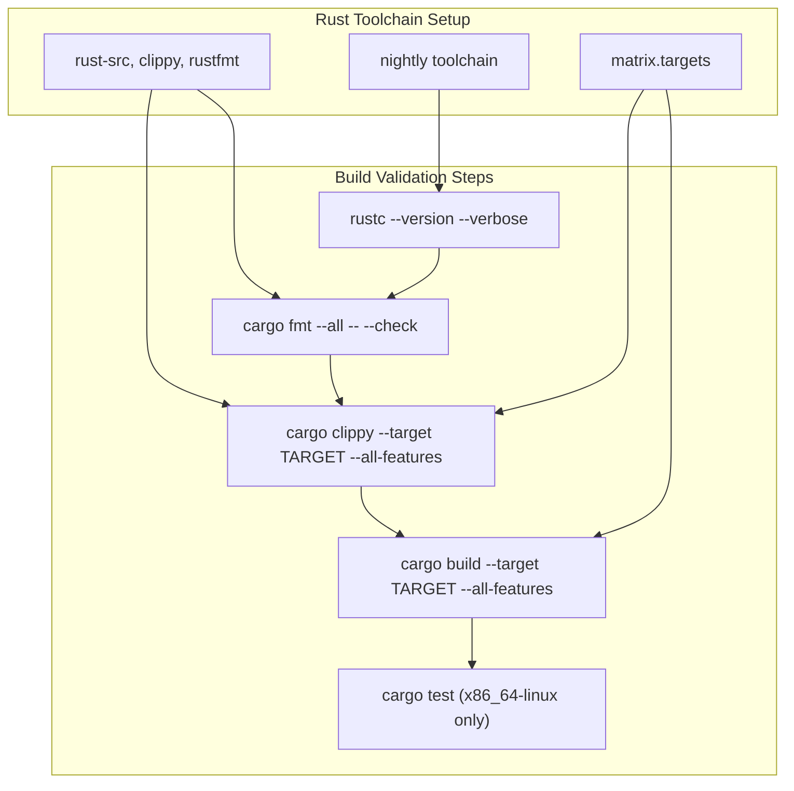
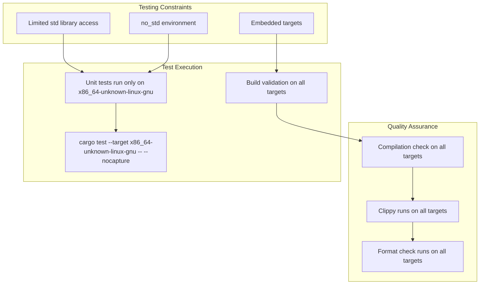
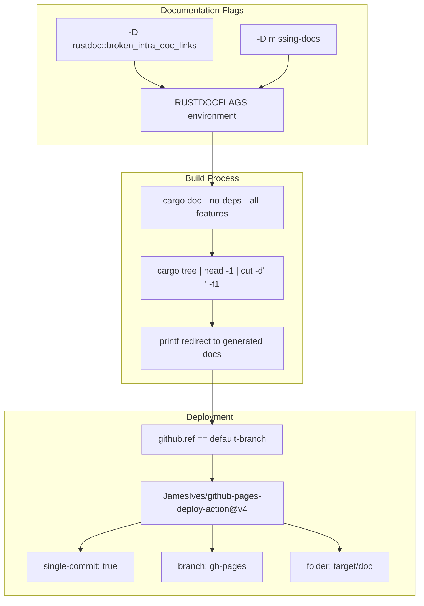
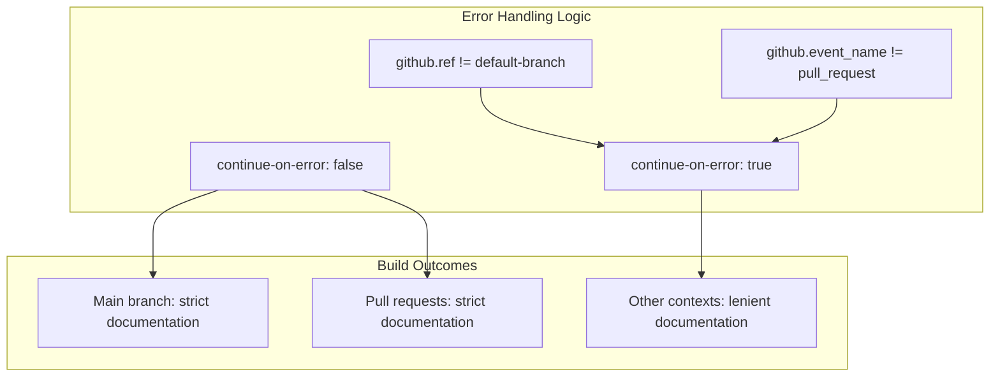

# Build System and CI

> **Relevant source files**
> * [.github/workflows/ci.yml](https://github.com/arceos-hypervisor/axdevice_crates/blob/28d49f14/.github/workflows/ci.yml)

This page documents the automated build system and continuous integration (CI) pipeline for the `axdevice_crates` repository. It covers the multi-architecture build strategy, code quality enforcement, testing procedures, and documentation generation workflow that ensures the codebase maintains compatibility across different target platforms in the no_std embedded environment.

For information about implementing new devices within this build system, see [Implementing New Devices](/arceos-hypervisor/axdevice_crates/4.2-implementing-new-devices). For details about the core architecture that this build system validates, see [Core Architecture](/arceos-hypervisor/axdevice_crates/2-core-architecture).

## CI Pipeline Overview

The repository uses GitHub Actions to implement a comprehensive CI pipeline that validates code across multiple architectures and maintains documentation quality. The pipeline consists of two primary jobs: `ci` for code validation and `doc` for documentation generation.

### CI Job Architecture

Sources: [.github/workflows/ci.yml(L1 - L31)&emsp;](https://github.com/arceos-hypervisor/axdevice_crates/blob/28d49f14/.github/workflows/ci.yml#L1-L31)

### Documentation Job Pipeline

Sources: [.github/workflows/ci.yml(L32 - L56)&emsp;](https://github.com/arceos-hypervisor/axdevice_crates/blob/28d49f14/.github/workflows/ci.yml#L32-L56)

## Multi-Architecture Build Strategy

The CI pipeline validates compatibility across four distinct target architectures, each serving different use cases in the hypervisor ecosystem:

|Target|Purpose|Test Coverage|
| --- | --- | --- |
|x86_64-unknown-linux-gnu|Standard Linux development and unit testing|Full (includingcargo test)|
|x86_64-unknown-none|Bare metal x86_64 hypervisor environments|Build and lint only|
|riscv64gc-unknown-none-elf|RISC-V hypervisor platforms|Build and lint only|
|aarch64-unknown-none-softfloat|ARM64 embedded hypervisor systems|Build and lint only|

### Build Matrix Configuration

The build matrix uses a `fail-fast: false` strategy to ensure all target architectures are tested independently, preventing early termination when one target fails.

Sources: [.github/workflows/ci.yml(L8 - L19)&emsp;](https://github.com/arceos-hypervisor/axdevice_crates/blob/28d49f14/.github/workflows/ci.yml#L8-L19) [.github/workflows/ci.yml(L25 - L30)&emsp;](https://github.com/arceos-hypervisor/axdevice_crates/blob/28d49f14/.github/workflows/ci.yml#L25-L30)

## Code Quality Enforcement

The CI pipeline enforces multiple layers of code quality validation before any changes can be merged.

### Formatting and Linting

|Check Type|Command|Purpose|
| --- | --- | --- |
|Code Formatting|cargo fmt --all -- --check|Ensures consistent code style across the codebase|
|Clippy Linting|cargo clippy --target $TARGET --all-features -- -A clippy::new_without_default|Catches common mistakes and enforces Rust best practices|
|Documentation|RUSTDOCFLAGS="-D rustdoc::broken_intra_doc_links -D missing-docs"|Enforces complete documentation with valid links|

The Clippy configuration specifically allows the `clippy::new_without_default` lint, indicating that the codebase may contain `new()` methods without corresponding `Default` implementations, which is common in no_std environments.

Sources: [.github/workflows/ci.yml(L22 - L25)&emsp;](https://github.com/arceos-hypervisor/axdevice_crates/blob/28d49f14/.github/workflows/ci.yml#L22-L25) [.github/workflows/ci.yml(L40)&emsp;](https://github.com/arceos-hypervisor/axdevice_crates/blob/28d49f14/.github/workflows/ci.yml#L40-L40)

## Testing Strategy

The testing approach is pragmatic, recognizing the constraints of no_std embedded development:

### Unit Testing Limitations

Unit tests execute only on `x86_64-unknown-linux-gnu` because the other targets are bare metal environments that lack the standard library infrastructure required for Rust's test framework. However, the build validation ensures that the code compiles correctly for all target architectures.

Sources: [.github/workflows/ci.yml(L28 - L30)&emsp;](https://github.com/arceos-hypervisor/axdevice_crates/blob/28d49f14/.github/workflows/ci.yml#L28-L30)

## Documentation Generation and Deployment

The documentation system automatically generates and deploys API documentation using a dedicated job that runs in parallel with the main CI validation.

### Documentation Build Process

The documentation generation uses strict flags to ensure high-quality documentation:

The `--no-deps` flag ensures that only the crate's own documentation is generated, not its dependencies. The automatic index.html generation creates a redirect to the main crate documentation.

Sources: [.github/workflows/ci.yml(L40)&emsp;](https://github.com/arceos-hypervisor/axdevice_crates/blob/28d49f14/.github/workflows/ci.yml#L40-L40) [.github/workflows/ci.yml(L44 - L48)&emsp;](https://github.com/arceos-hypervisor/axdevice_crates/blob/28d49f14/.github/workflows/ci.yml#L44-L48) [.github/workflows/ci.yml(L49 - L55)&emsp;](https://github.com/arceos-hypervisor/axdevice_crates/blob/28d49f14/.github/workflows/ci.yml#L49-L55)

## Development Workflow Integration

The CI system is designed to support the typical development workflow for embedded hypervisor development:

### Branch Protection and Quality Gates

|Stage|Validation|Blocking|
| --- | --- | --- |
|Pull Request|All CI checks must pass|Yes|
|Format Check|cargo fmtvalidation|Yes|
|Lint Check|Clippy on all targets|Yes|
|Build Check|Compilation on all targets|Yes|
|Unit Tests|Tests on Linux target only|Yes|
|Documentation|Doc generation and link validation|Yes for main branch|

### Error Handling Strategy

The documentation job uses conditional error handling with `continue-on-error` set based on branch and event type, allowing documentation builds to fail on non-main branches and non-pull-request events without blocking the overall workflow.

This approach ensures that documentation quality is enforced where it matters most (main branch and pull requests) while allowing experimental branches to have temporary documentation issues.

Sources: [.github/workflows/ci.yml(L45)&emsp;](https://github.com/arceos-hypervisor/axdevice_crates/blob/28d49f14/.github/workflows/ci.yml#L45-L45) [.github/workflows/ci.yml(L39)&emsp;](https://github.com/arceos-hypervisor/axdevice_crates/blob/28d49f14/.github/workflows/ci.yml#L39-L39)