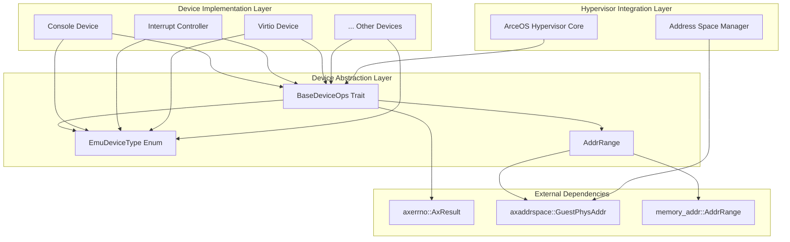
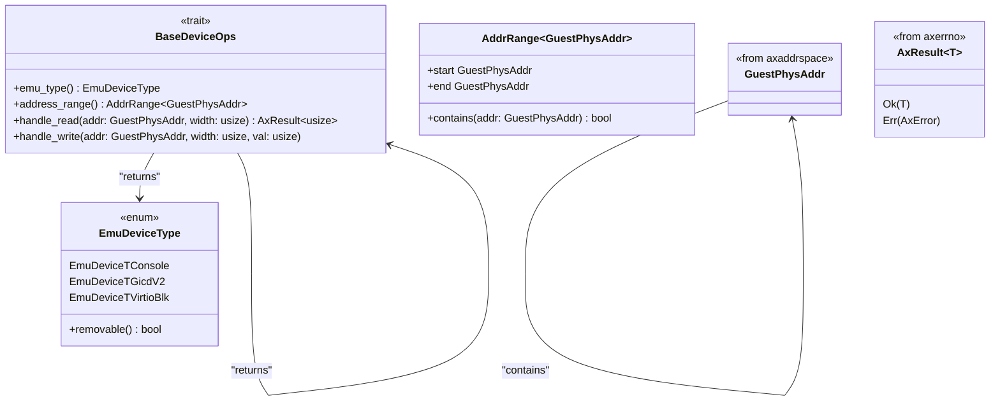
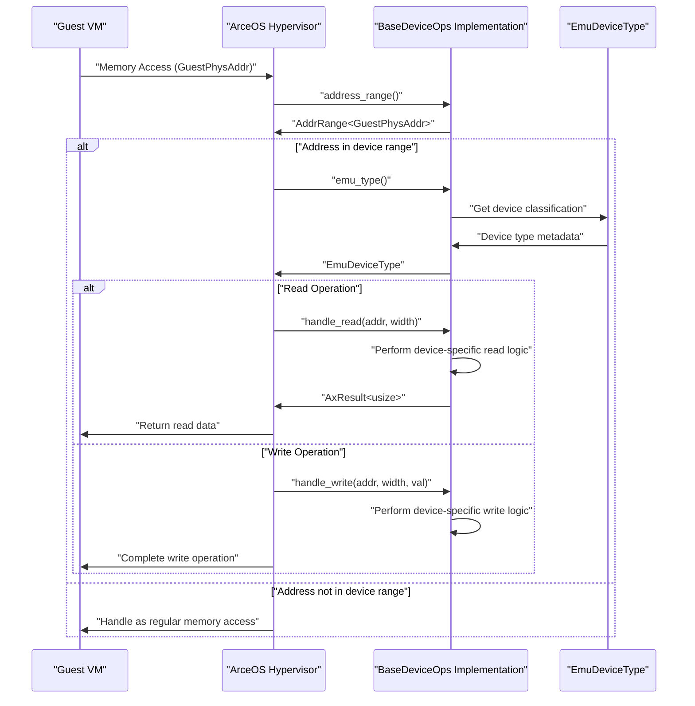

# Core Architecture

> **Relevant source files**
> * [axdevice_base/src/lib.rs](https://github.com/arceos-hypervisor/axdevice_crates/blob/28d49f14/axdevice_base/src/lib.rs)

This document outlines the fundamental design patterns, traits, and abstractions that form the foundation of the axdevice_crates device emulation system. It covers the high-level architectural decisions, the trait-based abstraction model, and how the core components interact within the ArceOS hypervisor ecosystem.

For detailed documentation of the `BaseDeviceOps` trait implementation, see [BaseDeviceOps Trait](/arceos-hypervisor/axdevice_crates/2.1-basedeviceops-trait). For comprehensive coverage of device type classifications, see [Device Type System](/arceos-hypervisor/axdevice_crates/2.2-device-type-system). For specifics on memory management and guest physical addressing, see [Address Space Management](/arceos-hypervisor/axdevice_crates/2.3-address-space-management).

## Architectural Overview

The axdevice_crates system implements a trait-based device emulation architecture designed specifically for the ArceOS hypervisor. The architecture centers around a unified abstraction layer that enables consistent device emulation across different hardware types while maintaining the performance characteristics required for hypervisor environments.

#### Core Architectural Components

*Sources: [axdevice_base/src/lib.rs(L1 - L31)&emsp;](https://github.com/arceos-hypervisor/axdevice_crates/blob/28d49f14/axdevice_base/src/lib.rs#L1-L31)*

## Trait-Based Device Abstraction

The system employs a trait-based abstraction model where all emulated devices implement the `BaseDeviceOps` trait. This design provides a uniform interface for device operations while allowing each device type to implement specific emulation logic.

#### BaseDeviceOps Contract

*Sources: [axdevice_base/src/lib.rs(L20 - L30)&emsp;](https://github.com/arceos-hypervisor/axdevice_crates/blob/28d49f14/axdevice_base/src/lib.rs#L20-L30)*

The trait defines four essential operations that every emulated device must support:

|Method|Purpose|Return Type|
| --- | --- | --- |
|emu_type()|Device type identification|EmuDeviceType|
|address_range()|Memory mapping boundaries|AddrRange<GuestPhysAddr>|
|handle_read()|Read operation emulation|AxResult<usize>|
|handle_write()|Write operation emulation|()|

## Memory-Mapped Device Emulation Model

The architecture implements a memory-mapped I/O (MMIO) model where devices are accessed through specific guest physical address ranges. This design mirrors how real hardware devices are typically accessed and provides natural integration with existing hypervisor memory management systems.

#### Device Access Flow

*Sources: [axdevice_base/src/lib.rs(L24 - L29)&emsp;](https://github.com/arceos-hypervisor/axdevice_crates/blob/28d49f14/axdevice_base/src/lib.rs#L24-L29)*

## Integration with Hypervisor Core

The device emulation system integrates tightly with the ArceOS hypervisor through several key interfaces and design decisions:

### Dependency Architecture

|Component|Purpose|Integration Point|
| --- | --- | --- |
|axerrno::AxResult|Error handling consistency|All fallible operations returnAxResult<T>|
|axaddrspace::GuestPhysAddr|Guest memory addressing|Device address ranges and access parameters|
|memory_addr::AddrRange|Address range management|Device memory mapping boundaries|

### No Standard Library Constraint

The entire system operates under `#![no_std]` constraints, reflecting its target deployment in embedded hypervisor environments. This architectural decision influences several design choices:

* Use of `alloc` crate for heap-allocated collections when needed
* Reliance on external crates for core functionality (error handling, address management)
* Emphasis on zero-cost abstractions and compile-time optimizations

*Sources: [axdevice_base/src/lib.rs(L1)&emsp;](https://github.com/arceos-hypervisor/axdevice_crates/blob/28d49f14/axdevice_base/src/lib.rs#L1-L1)*

## Design Principles

The architecture embodies several key design principles that guide the system's development and usage:

**Uniform Interface**: All devices implement identical trait methods, enabling generic device management code in the hypervisor.

**Type Safety**: Strong typing through `EmuDeviceType` enum and `GuestPhysAddr` wrapper prevents common addressing errors.

**Performance**: Direct trait dispatch and `no_std` environment minimize runtime overhead.

**Extensibility**: New device types can be added by implementing `BaseDeviceOps` and extending `EmuDeviceType`.

**ArceOS Integration**: Deep integration with ArceOS ecosystem through shared address space management and error handling patterns.

*Sources: [axdevice_base/src/lib.rs(L3 - L18)&emsp;](https://github.com/arceos-hypervisor/axdevice_crates/blob/28d49f14/axdevice_base/src/lib.rs#L3-L18)*