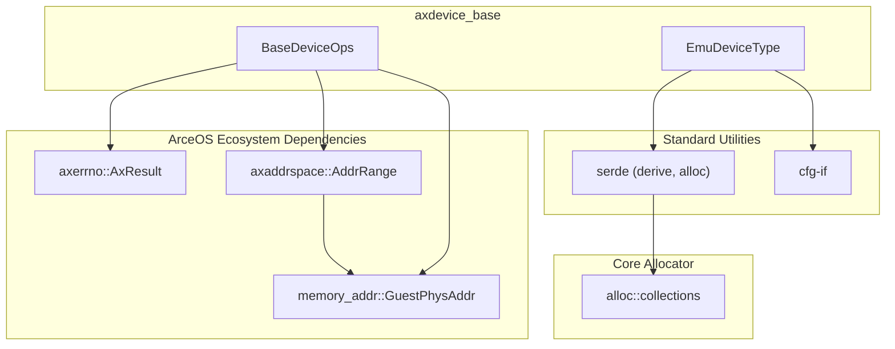
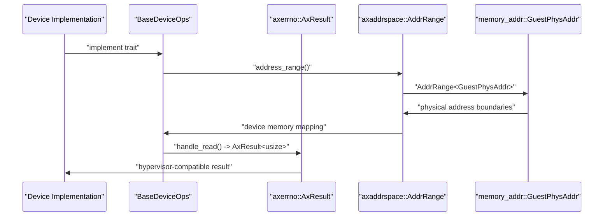
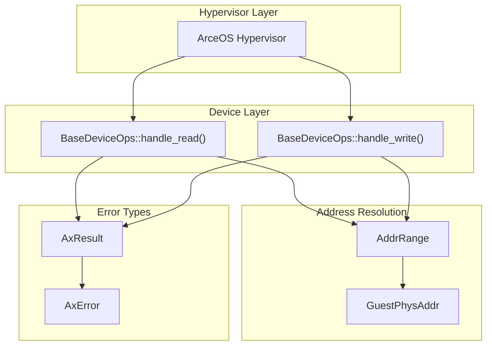

# Dependencies and Integration

> **Relevant source files**
> * [axdevice_base/Cargo.toml](https://github.com/arceos-hypervisor/axdevice_crates/blob/28d49f14/axdevice_base/Cargo.toml)

This document covers the external crate dependencies used by `axdevice_base` and explains how they integrate to support device emulation within the ArceOS hypervisor ecosystem. The focus is on dependency selection rationale, integration patterns, and the `no_std` compatibility requirements.

For detailed coverage of how ArceOS-specific dependencies (`axerrno`, `axaddrspace`, `memory_addr`) enable hypervisor functionality, see [ArceOS Integration](/arceos-hypervisor/axdevice_crates/3.1-arceos-integration). For information about how dependencies support the core device abstraction, see [BaseDeviceOps Trait](/arceos-hypervisor/axdevice_crates/2.1-basedeviceops-trait).

## Dependency Architecture Overview

The `axdevice_base` crate maintains a minimal dependency footprint while supporting essential hypervisor device emulation capabilities. All dependencies are carefully selected for `no_std` compatibility and embedded system constraints.

**Dependency Categories and Integration**



Sources: [axdevice_base/Cargo.toml(L10 - L16)&emsp;](https://github.com/arceos-hypervisor/axdevice_crates/blob/28d49f14/axdevice_base/Cargo.toml#L10-L16)

## Dependency Analysis

### ArceOS Hypervisor Dependencies

The three ArceOS-specific dependencies form the core integration layer that enables device emulation within the hypervisor:

|Dependency|Version|Purpose|Integration Point|
| --- | --- | --- | --- |
|axerrno|0.1.0|Error handling for hypervisor operations|BaseDeviceOpsreturn types|
|axaddrspace|git latest|Guest physical address management|Device address range mapping|
|memory_addr|0.3|Memory address utilities|Address range boundaries|

**ArceOS Integration Pattern**



Sources: [axdevice_base/Cargo.toml(L14 - L16)&emsp;](https://github.com/arceos-hypervisor/axdevice_crates/blob/28d49f14/axdevice_base/Cargo.toml#L14-L16)

### Standard Library Dependencies

#### serde Configuration

The `serde` dependency uses a specific feature configuration optimized for `no_std` environments:

```
serde = { version = "1.0.204", default-features = false, features = ["derive", "alloc"] }
```

* `default-features = false`: Removes `std` dependency
* `derive` feature: Enables `#[derive(Serialize, Deserialize)]` macros for `EmuDeviceType`
* `alloc` feature: Provides collections support without requiring full standard library

#### Conditional Compilation Support

The `cfg-if` crate enables clean conditional compilation patterns:

```
cfg-if = "1.0"
```

This dependency supports platform-specific device behavior while maintaining code clarity across different target architectures (x86_64, RISC-V, ARM64).

Sources: [axdevice_base/Cargo.toml(L11 - L12)&emsp;](https://github.com/arceos-hypervisor/axdevice_crates/blob/28d49f14/axdevice_base/Cargo.toml#L11-L12)

## Integration Patterns

### Error Propagation Chain

The error handling integration follows a consistent pattern from hypervisor operations through device emulation:

**Error Flow Through Dependencies**



Sources: [axdevice_base/Cargo.toml(L14 - L16)&emsp;](https://github.com/arceos-hypervisor/axdevice_crates/blob/28d49f14/axdevice_base/Cargo.toml#L14-L16)

### Memory Address Integration

The address management dependencies create a unified addressing model:

1. **memory_addr::GuestPhysAddr**: Provides type-safe guest physical addresses
2. **axaddrspace::AddrRange**: Wraps `GuestPhysAddr` into address ranges
3. **BaseDeviceOps::address_range()**: Returns `AddrRange<GuestPhysAddr>` for device mapping

This integration ensures that device emulation operates within the hypervisor's guest address space management without requiring device implementations to handle low-level address translation.

### Serialization Integration

The `serde` integration with `EmuDeviceType` enables device type persistence and configuration management:

* Device type serialization for hypervisor state saving
* Configuration file parsing for device topology
* Inter-component communication with serialized device descriptors

The `alloc` feature dependency provides the necessary collection types for handling serialized device configurations without requiring full standard library support.

Sources: [axdevice_base/Cargo.toml(L12)&emsp;](https://github.com/arceos-hypervisor/axdevice_crates/blob/28d49f14/axdevice_base/Cargo.toml#L12-L12)

## Dependency Version Strategy

### ArceOS Ecosystem Tracking

* `axerrno`: Uses semantic versioning (0.1.0) for stable error handling interface
* `axaddrspace`: Tracks git repository HEAD for active development coordination
* `memory_addr`: Uses stable crate version (0.3) for mature address utilities

### External Dependencies

* `serde`: Pinned to specific version (1.0.204) for build reproducibility
* `cfg-if`: Uses caret range (1.0) allowing compatible updates

This strategy balances stability for core functionality with active development tracking for hypervisor-specific components.

Sources: [axdevice_base/Cargo.toml(L11 - L16)&emsp;](https://github.com/arceos-hypervisor/axdevice_crates/blob/28d49f14/axdevice_base/Cargo.toml#L11-L16)