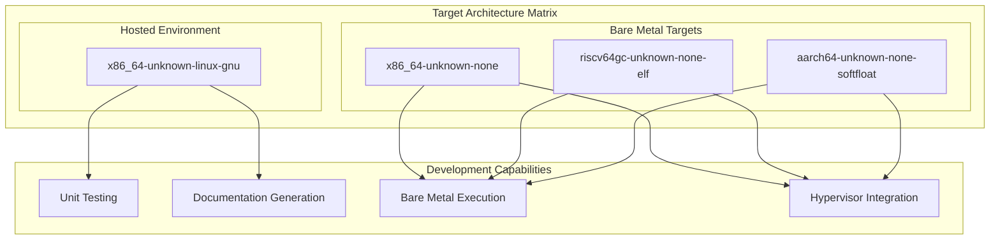
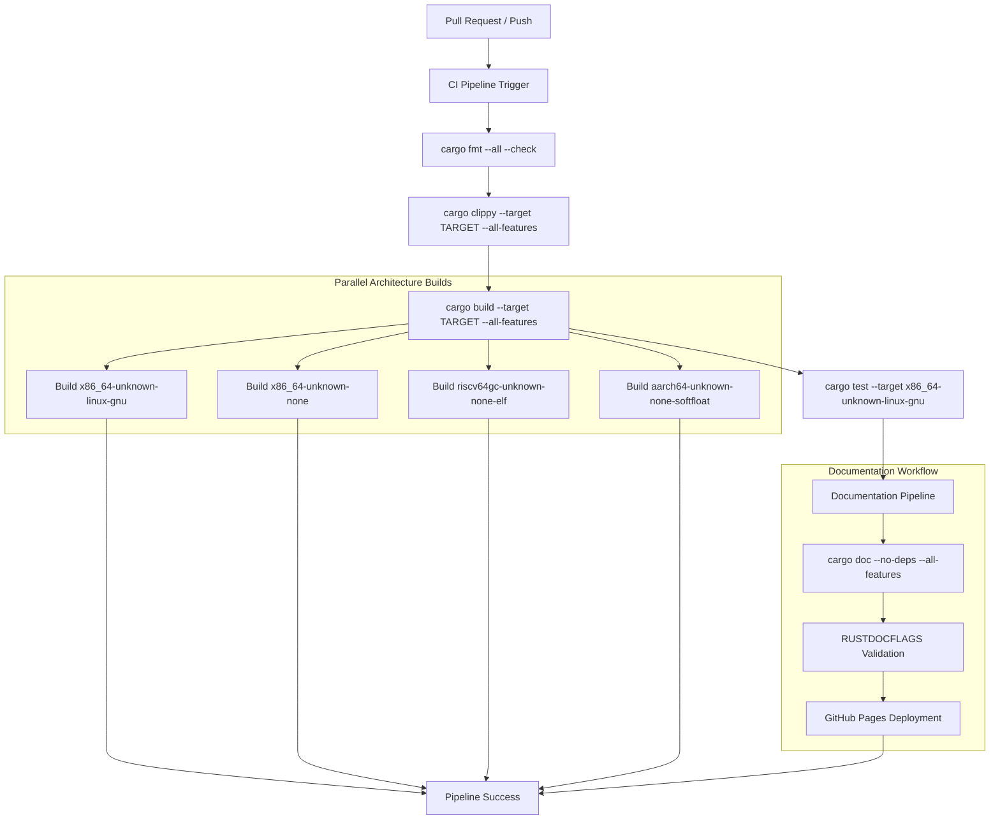
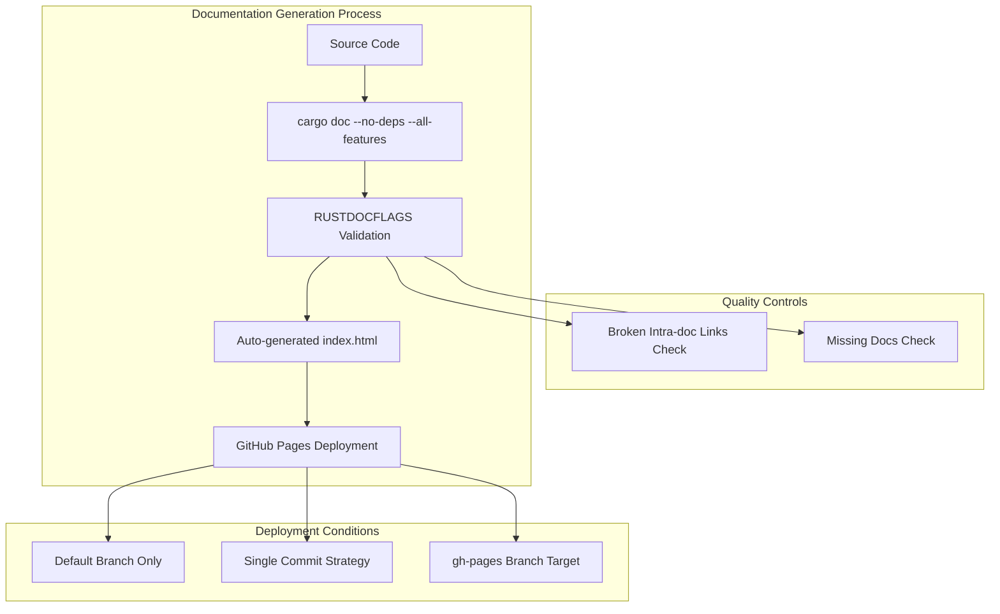

# Development Guide

> **Relevant source files**
> * [.github/workflows/ci.yml](https://github.com/arceos-hypervisor/axdevice_crates/blob/28d49f14/.github/workflows/ci.yml)
> * [.gitignore](https://github.com/arceos-hypervisor/axdevice_crates/blob/28d49f14/.gitignore)

This document provides practical information for developers working with or extending the axdevice_crates system. It covers the development environment setup, build processes, code quality standards, and contribution workflows specific to this hypervisor device emulation framework.

For detailed information about implementing specific device types, see [Implementing New Devices](/arceos-hypervisor/axdevice_crates/4.2-implementing-new-devices). For comprehensive build system documentation, see [Build System and CI](/arceos-hypervisor/axdevice_crates/4.1-build-system-and-ci).

## Development Environment Requirements

The axdevice_crates project requires a specific development environment configuration to support its no_std embedded target and multi-architecture requirements.

### Rust Toolchain Configuration

The project exclusively uses the **nightly** Rust toolchain to access cutting-edge features required for hypervisor development and no_std environments. The required toolchain components are:

|Component|Purpose|
| --- | --- |
|rust-src|Source code for cross-compilation to embedded targets|
|clippy|Advanced linting for code quality enforcement|
|rustfmt|Code formatting standardization|

### Supported Target Architectures

The codebase maintains compatibility across four distinct target architectures, reflecting the diverse embedded and hypervisor deployment scenarios:



Sources: [.github/workflows/ci.yml(L12)&emsp;](https://github.com/arceos-hypervisor/axdevice_crates/blob/28d49f14/.github/workflows/ci.yml#L12-L12) [.github/workflows/ci.yml(L19)&emsp;](https://github.com/arceos-hypervisor/axdevice_crates/blob/28d49f14/.github/workflows/ci.yml#L19-L19)

## Development Workflow Pipeline

The development process follows a strict automated pipeline that enforces code quality and multi-architecture compatibility:



Sources: [.github/workflows/ci.yml(L22 - L30)&emsp;](https://github.com/arceos-hypervisor/axdevice_crates/blob/28d49f14/.github/workflows/ci.yml#L22-L30) [.github/workflows/ci.yml(L44 - L48)&emsp;](https://github.com/arceos-hypervisor/axdevice_crates/blob/28d49f14/.github/workflows/ci.yml#L44-L48)

## Code Quality Standards

### Formatting Requirements

All code must pass `cargo fmt --all --check` without modifications. The project uses the standard Rust formatting conventions with no custom overrides.

### Linting Configuration

The Clippy linting process runs with `--all-features` enabled and includes one specific allowance:

* `clippy::new_without_default` is explicitly allowed via `-A clippy::new_without_default`

This exception acknowledges that hypervisor device emulation patterns may require `new()` methods without corresponding `Default` implementations due to the specialized initialization requirements of emulated hardware.

### Documentation Standards

Documentation generation enforces strict quality standards through `RUSTDOCFLAGS`:

```yaml
RUSTDOCFLAGS: -D rustdoc::broken_intra_doc_links -D missing-docs
```

These flags ensure:

* **Broken intra-doc links**: All internal documentation links must resolve correctly
* **Missing docs**: All public APIs must include documentation

Sources: [.github/workflows/ci.yml(L25)&emsp;](https://github.com/arceos-hypervisor/axdevice_crates/blob/28d49f14/.github/workflows/ci.yml#L25-L25) [.github/workflows/ci.yml(L40)&emsp;](https://github.com/arceos-hypervisor/axdevice_crates/blob/28d49f14/.github/workflows/ci.yml#L40-L40)

## Testing Strategy

### Unit Testing Scope

Unit tests execute exclusively on the `x86_64-unknown-linux-gnu` target, which provides the hosted environment necessary for test infrastructure. The testing command includes `--nocapture` to ensure full test output visibility.

### Multi-Architecture Validation

While unit tests run only on the hosted target, **build verification** occurs across all four supported architectures. This approach ensures:

* Code compiles correctly for all deployment targets
* no_std constraints are properly maintained
* Architecture-specific conditional compilation works correctly

### Test Execution Conditions

Tests run conditionally based on the target architecture:

```css
if: ${{ matrix.targets == 'x86_64-unknown-linux-gnu' }}
```

This constraint reflects the practical limitation that bare-metal targets cannot execute standard Rust test infrastructure.

Sources: [.github/workflows/ci.yml(L28 - L30)&emsp;](https://github.com/arceos-hypervisor/axdevice_crates/blob/28d49f14/.github/workflows/ci.yml#L28-L30)

## Documentation Workflow

### Automated Documentation Generation

The documentation pipeline operates independently from the main CI pipeline and includes sophisticated deployment automation:



### Index Generation Logic

The documentation system automatically generates a redirect index using shell commands:

```
printf '<meta http-equiv="refresh" content="0;url=%s/index.html">' $(cargo tree | head -1 | cut -d' ' -f1) > target/doc/index.html
```

This creates an automatic redirect from the documentation root to the primary crate's documentation.

### Deployment Permissions

The documentation job requires `contents: write` permissions to deploy to GitHub Pages, reflecting the automated nature of the documentation publication process.

Sources: [.github/workflows/ci.yml(L44 - L48)&emsp;](https://github.com/arceos-hypervisor/axdevice_crates/blob/28d49f14/.github/workflows/ci.yml#L44-L48) [.github/workflows/ci.yml(L50 - L55)&emsp;](https://github.com/arceos-hypervisor/axdevice_crates/blob/28d49f14/.github/workflows/ci.yml#L50-L55)

## Development Environment Setup

### Repository Setup

```markdown
# Clone the repository
git clone https://github.com/arceos-hypervisor/axdevice_crates
cd axdevice_crates

# Install nightly toolchain with required components
rustup toolchain install nightly
rustup default nightly
rustup component add rust-src clippy rustfmt

# Add required targets
rustup target add x86_64-unknown-none
rustup target add riscv64gc-unknown-none-elf  
rustup target add aarch64-unknown-none-softfloat
```

### Verification Commands

Verify your development environment matches CI requirements:

```markdown
# Check formatting
cargo fmt --all -- --check

# Run linting
cargo clippy --all-features -- -A clippy::new_without_default

# Test build for all targets
cargo build --target x86_64-unknown-linux-gnu --all-features
cargo build --target x86_64-unknown-none --all-features
cargo build --target riscv64gc-unknown-none-elf --all-features
cargo build --target aarch64-unknown-none-softfloat --all-features

# Run tests
cargo test --target x86_64-unknown-linux-gnu -- --nocapture

# Generate documentation
cargo doc --no-deps --all-features
```

Sources: [.github/workflows/ci.yml(L15 - L19)&emsp;](https://github.com/arceos-hypervisor/axdevice_crates/blob/28d49f14/.github/workflows/ci.yml#L15-L19) [.github/workflows/ci.yml(L22 - L30)&emsp;](https://github.com/arceos-hypervisor/axdevice_crates/blob/28d49f14/.github/workflows/ci.yml#L22-L30)