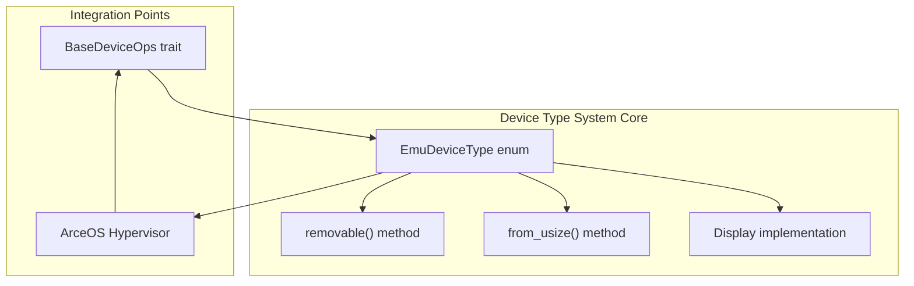
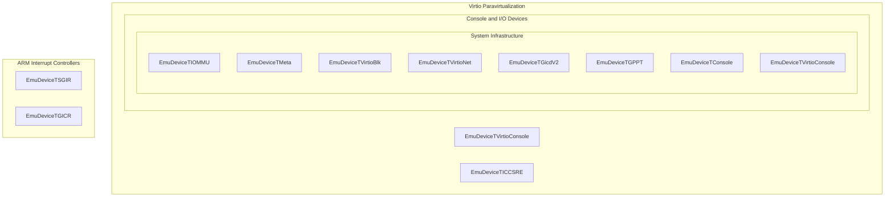
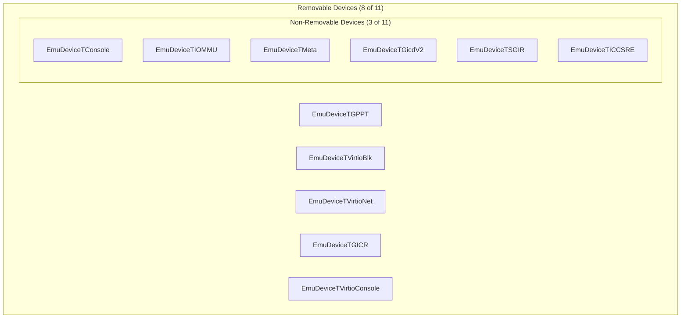
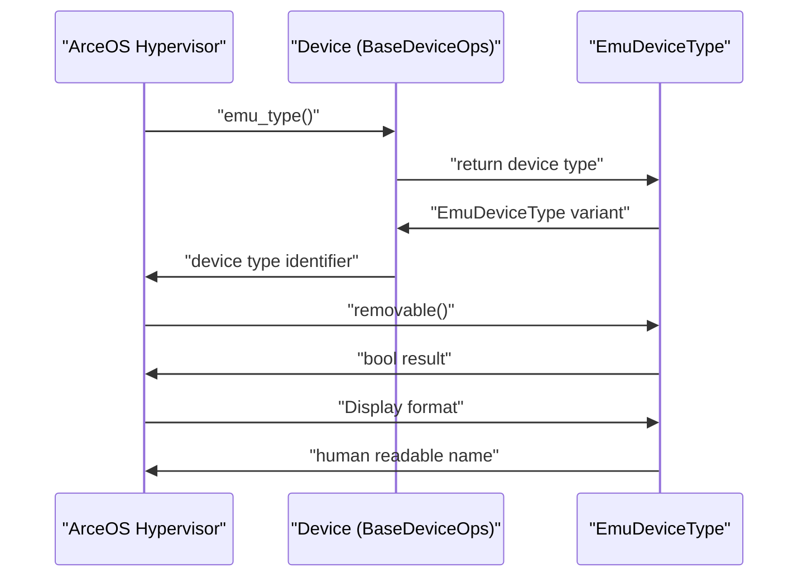

# Device Type System

> **Relevant source files**
> * [axdevice_base/src/emu_type.rs](https://github.com/arceos-hypervisor/axdevice_crates/blob/28d49f14/axdevice_base/src/emu_type.rs)
> * [axdevice_base/src/lib.rs](https://github.com/arceos-hypervisor/axdevice_crates/blob/28d49f14/axdevice_base/src/lib.rs)

This document covers the `EmuDeviceType` enumeration and associated type system that categorizes and manages different classes of emulated devices in the ArceOS hypervisor. The device type system provides unified identification, classification, and removability management for all supported emulated hardware devices.

For information about how devices implement behavior through the trait system, see [BaseDeviceOps Trait](/arceos-hypervisor/axdevice_crates/2.1-basedeviceops-trait). For details about memory mapping and address ranges, see [Address Space Management](/arceos-hypervisor/axdevice_crates/2.3-address-space-management).

## Overview

The device type system is built around the `EmuDeviceType` enum defined in [axdevice_base/src/emu_type.rs(L3 - L28)&emsp;](https://github.com/arceos-hypervisor/axdevice_crates/blob/28d49f14/axdevice_base/src/emu_type.rs#L3-L28) This enumeration serves as the central registry of all supported emulated device types in the ArceOS hypervisor ecosystem, providing type identification, categorization, and operational characteristics for each device class.



Sources: [axdevice_base/src/emu_type.rs(L3 - L28)&emsp;](https://github.com/arceos-hypervisor/axdevice_crates/blob/28d49f14/axdevice_base/src/emu_type.rs#L3-L28) [axdevice_base/src/lib.rs(L20 - L30)&emsp;](https://github.com/arceos-hypervisor/axdevice_crates/blob/28d49f14/axdevice_base/src/lib.rs#L20-L30)

## Device Type Enumeration

The `EmuDeviceType` enum defines 11 distinct device types, each assigned a unique numeric identifier from 0 to 10. The enumeration uses explicit discriminant values to ensure stable serialization and conversion.

|Device Type|Value|Description|
| --- | --- | --- |
|EmuDeviceTConsole|0|Console device|
|EmuDeviceTGicdV2|1|ARM interrupt controller V2 device|
|EmuDeviceTGPPT|2|Partial passthrough interrupt controller device|
|EmuDeviceTVirtioBlk|3|Virtio block device|
|EmuDeviceTVirtioNet|4|Virtio net device|
|EmuDeviceTVirtioConsole|5|Virtio console device|
|EmuDeviceTIOMMU|6|IOMMU device|
|EmuDeviceTICCSRE|7|Interrupt ICC SRE device|
|EmuDeviceTSGIR|8|Interrupt ICC SGIR device|
|EmuDeviceTGICR|9|Interrupt controller GICR device|
|EmuDeviceTMeta|10|Meta device|

Sources: [axdevice_base/src/emu_type.rs(L5 - L28)&emsp;](https://github.com/arceos-hypervisor/axdevice_crates/blob/28d49f14/axdevice_base/src/emu_type.rs#L5-L28)

## Device Categories

Device Type Taxonomy by Functional Category



Sources: [axdevice_base/src/emu_type.rs(L5 - L28)&emsp;](https://github.com/arceos-hypervisor/axdevice_crates/blob/28d49f14/axdevice_base/src/emu_type.rs#L5-L28) [axdevice_base/src/emu_type.rs(L34 - L45)&emsp;](https://github.com/arceos-hypervisor/axdevice_crates/blob/28d49f14/axdevice_base/src/emu_type.rs#L34-L45)

### ARM Interrupt Controller Focus

The device type system shows a strong focus on ARM architecture virtualization, with 5 out of 11 device types (45%) dedicated to ARM Generic Interrupt Controller (GIC) components:

* **`EmuDeviceTGicdV2`**: ARM GICv2 distributor interface
* **`EmuDeviceTGPPT`**: Partial passthrough interrupt controller
* **`EmuDeviceTICCSRE`**: ICC System Register Enable interface
* **`EmuDeviceTSGIR`**: ICC Software Generated Interrupt Register
* **`EmuDeviceTGICR`**: GIC redistributor interface

### Virtio Paravirtualization Support

Three device types implement Virtio paravirtualization standards:

* **`EmuDeviceTVirtioBlk`**: Block storage device
* **`EmuDeviceTVirtioNet`**: Network interface device
* **`EmuDeviceTVirtioConsole`**: Console device

Sources: [axdevice_base/src/emu_type.rs(L5 - L28)&emsp;](https://github.com/arceos-hypervisor/axdevice_crates/blob/28d49f14/axdevice_base/src/emu_type.rs#L5-L28)

## Removability Classification

The device type system categorizes devices by removability using the `removable()` method defined in [axdevice_base/src/emu_type.rs(L52 - L64)&emsp;](https://github.com/arceos-hypervisor/axdevice_crates/blob/28d49f14/axdevice_base/src/emu_type.rs#L52-L64) This classification determines whether devices can be dynamically added or removed from a running virtual machine.

Device Removability Classification



Sources: [axdevice_base/src/emu_type.rs(L52 - L64)&emsp;](https://github.com/arceos-hypervisor/axdevice_crates/blob/28d49f14/axdevice_base/src/emu_type.rs#L52-L64)

### Removable Devices

The following 8 device types are classified as removable:

* All ARM interrupt controller devices
* All Virtio paravirtualization devices

### Non-Removable Devices

The following 3 device types are classified as non-removable:

* **Console device**: Essential for basic VM operation
* **IOMMU device**: Critical system infrastructure
* **Meta device**: Core hypervisor functionality

Sources: [axdevice_base/src/emu_type.rs(L53 - L63)&emsp;](https://github.com/arceos-hypervisor/axdevice_crates/blob/28d49f14/axdevice_base/src/emu_type.rs#L53-L63)

## Type Conversion and Identification

### Numeric Conversion

The `from_usize()` method provides conversion from numeric identifiers to device types, supporting serialization and external configuration systems.

```python
// Example conversion pattern from axdevice_base/src/emu_type.rs:67-82
pub fn from_usize(value: usize) -> EmuDeviceType {
    match value {
        0 => EmuDeviceType::EmuDeviceTConsole,
        1 => EmuDeviceType::EmuDeviceTGicdV2,
        // ... additional mappings
        _ => panic!("Unknown EmuDeviceType value: {}", value),
    }
}
```

### String Representation

The `Display` trait implementation in [axdevice_base/src/emu_type.rs(L30 - L47)&emsp;](https://github.com/arceos-hypervisor/axdevice_crates/blob/28d49f14/axdevice_base/src/emu_type.rs#L30-L47) provides human-readable names for debugging and logging:

* `EmuDeviceTConsole` → "console"
* `EmuDeviceTGicdV2` → "Arm interrupt controller V2"
* `EmuDeviceTVirtioBlk` → "virtio block"

Sources: [axdevice_base/src/emu_type.rs(L30 - L47)&emsp;](https://github.com/arceos-hypervisor/axdevice_crates/blob/28d49f14/axdevice_base/src/emu_type.rs#L30-L47) [axdevice_base/src/emu_type.rs(L67 - L82)&emsp;](https://github.com/arceos-hypervisor/axdevice_crates/blob/28d49f14/axdevice_base/src/emu_type.rs#L67-L82)

## Integration with BaseDeviceOps

The device type system integrates with the `BaseDeviceOps` trait through the `emu_type()` method, enabling runtime device identification:

Device Type Integration Flow



Sources: [axdevice_base/src/lib.rs(L22 - L23)&emsp;](https://github.com/arceos-hypervisor/axdevice_crates/blob/28d49f14/axdevice_base/src/lib.rs#L22-L23) [axdevice_base/src/emu_type.rs(L50 - L83)&emsp;](https://github.com/arceos-hypervisor/axdevice_crates/blob/28d49f14/axdevice_base/src/emu_type.rs#L50-L83)

This integration enables the hypervisor to:

1. Identify device types at runtime
2. Determine removability characteristics
3. Apply type-specific handling logic
4. Generate debugging output with descriptive names

Sources: [axdevice_base/src/lib.rs(L20 - L30)&emsp;](https://github.com/arceos-hypervisor/axdevice_crates/blob/28d49f14/axdevice_base/src/lib.rs#L20-L30) [axdevice_base/src/emu_type.rs(L1 - L84)&emsp;](https://github.com/arceos-hypervisor/axdevice_crates/blob/28d49f14/axdevice_base/src/emu_type.rs#L1-L84)