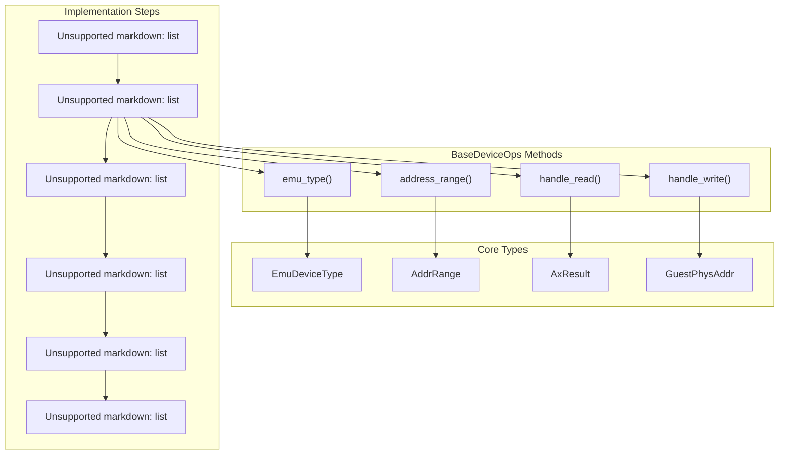
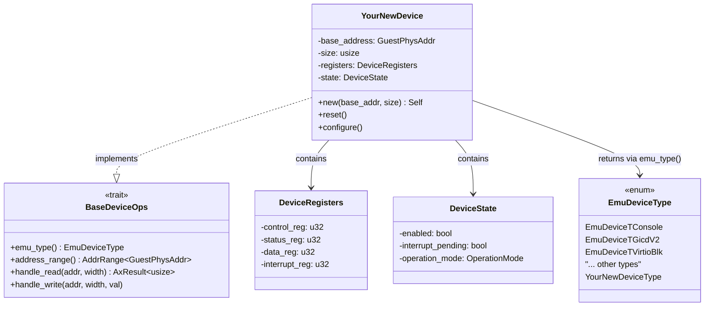
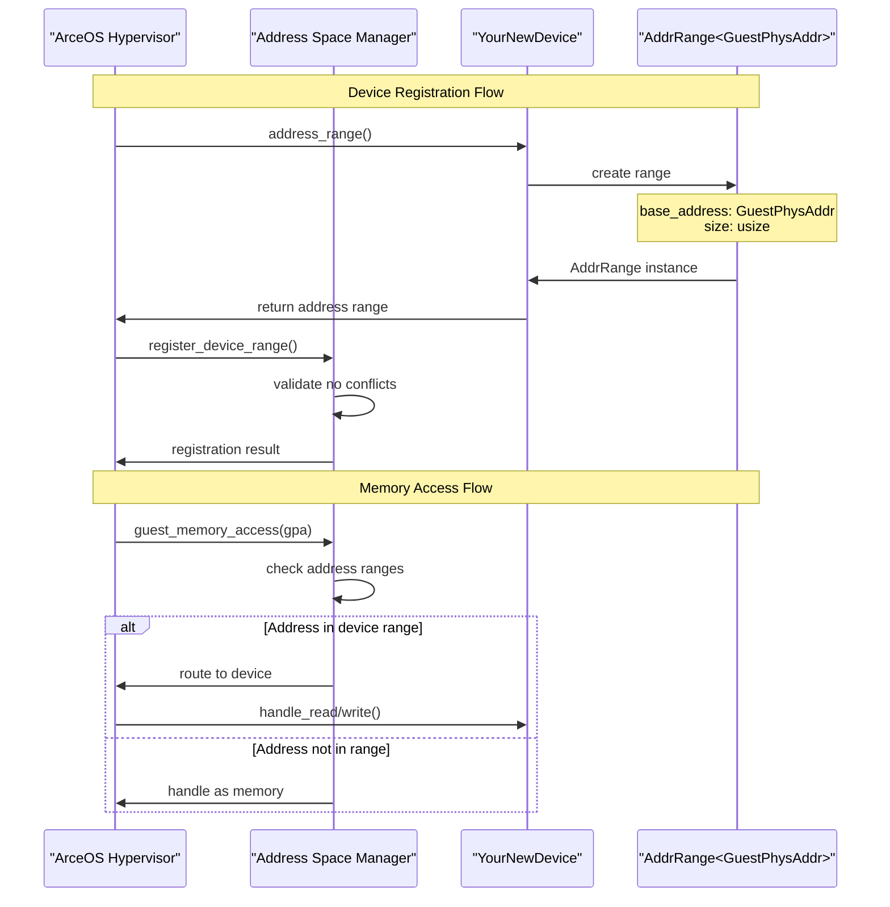
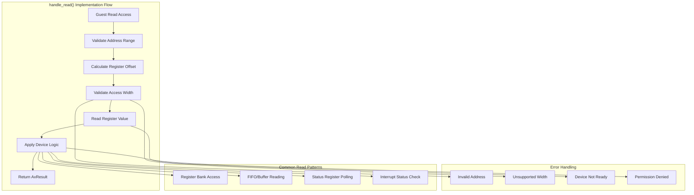
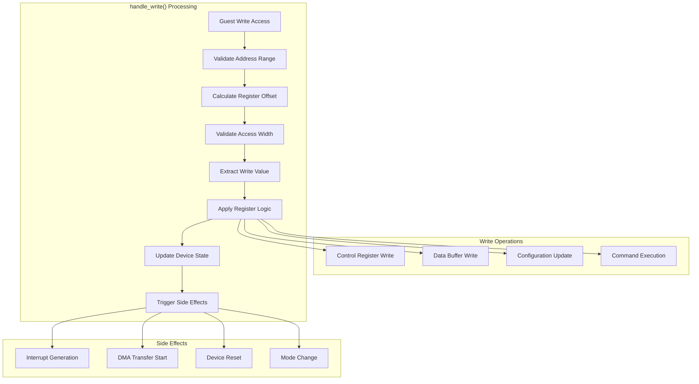

# Implementing New Devices

> **Relevant source files**
> * [axdevice_base/src/emu_type.rs](https://github.com/arceos-hypervisor/axdevice_crates/blob/28d49f14/axdevice_base/src/emu_type.rs)
> * [axdevice_base/src/lib.rs](https://github.com/arceos-hypervisor/axdevice_crates/blob/28d49f14/axdevice_base/src/lib.rs)

This page provides a comprehensive guide for implementing new emulated devices within the ArceOS hypervisor ecosystem using the `BaseDeviceOps` trait foundation. It covers the step-by-step process of creating device implementations, configuring address ranges, implementing read/write handlers, and integrating with the device type system.

For information about the core architecture and trait definitions, see [Core Architecture](/arceos-hypervisor/axdevice_crates/2-core-architecture). For details about the device type enumeration system, see [Device Type System](/arceos-hypervisor/axdevice_crates/2.2-device-type-system).

## Implementation Overview

Creating a new emulated device requires implementing the `BaseDeviceOps` trait and integrating with the `EmuDeviceType` system. The implementation process follows a standardized pattern that ensures compatibility with the ArceOS hypervisor's device emulation framework.

### Device Implementation Architecture

Sources: [axdevice_base/src/lib.rs(L20 - L30)&emsp;](https://github.com/arceos-hypervisor/axdevice_crates/blob/28d49f14/axdevice_base/src/lib.rs#L20-L30) [axdevice_base/src/emu_type.rs(L3 - L28)&emsp;](https://github.com/arceos-hypervisor/axdevice_crates/blob/28d49f14/axdevice_base/src/emu_type.rs#L3-L28)

## Device Structure Definition

The first step in implementing a new device is defining the device structure that will hold the device's state and configuration. The structure should contain all necessary data for device emulation, including memory mappings, configuration registers, and operational state.

### Device Implementation Pattern

Sources: [axdevice_base/src/lib.rs(L21 - L30)&emsp;](https://github.com/arceos-hypervisor/axdevice_crates/blob/28d49f14/axdevice_base/src/lib.rs#L21-L30) [axdevice_base/src/emu_type.rs(L5 - L28)&emsp;](https://github.com/arceos-hypervisor/axdevice_crates/blob/28d49f14/axdevice_base/src/emu_type.rs#L5-L28)

## BaseDeviceOps Implementation

The core of device implementation involves implementing the four required methods of the `BaseDeviceOps` trait. Each method serves a specific purpose in the device emulation lifecycle.

### Required Method Implementation

|Method|Purpose|Return Type|Parameters|
| --- | --- | --- | --- |
|emu_type()|Device type identification|EmuDeviceType|&self|
|address_range()|Memory mapping definition|AddrRange<GuestPhysAddr>|&self|
|handle_read()|Read operation processing|AxResult<usize>|&self, addr, width|
|handle_write()|Write operation processing|()|&self, addr, width, val|

The `emu_type()` method returns the device's type identifier from the `EmuDeviceType` enumeration. This method enables the hypervisor to identify and categorize the device for management purposes.

The `address_range()` method defines the guest physical address range that the device occupies in the virtual machine's memory space. This range determines which memory accesses will be routed to the device's read and write handlers.

Sources: [axdevice_base/src/lib.rs(L22 - L29)&emsp;](https://github.com/arceos-hypervisor/axdevice_crates/blob/28d49f14/axdevice_base/src/lib.rs#L22-L29)

## Address Range Configuration

Device address range configuration requires careful consideration of the guest physical address space layout and potential conflicts with other devices or memory regions. The address range must be properly aligned and sized according to the device's requirements.

### Address Range Management Flow

Sources: [axdevice_base/src/lib.rs(L24 - L25)&emsp;](https://github.com/arceos-hypervisor/axdevice_crates/blob/28d49f14/axdevice_base/src/lib.rs#L24-L25)

The address range should be configured during device initialization and remain constant throughout the device's lifetime. Dynamic address range changes are not supported by the current architecture.

## Read Handler Implementation

The `handle_read()` method processes guest read operations targeting the device's address range. The implementation must decode the address offset, validate the access width, and return appropriate data based on the device's current state.

### Read Handler Patterns

Sources: [axdevice_base/src/lib.rs(L27)&emsp;](https://github.com/arceos-hypervisor/axdevice_crates/blob/28d49f14/axdevice_base/src/lib.rs#L27-L27)

The read handler should support standard access widths (1, 2, 4, and 8 bytes) and return data in the appropriate format. Register values should be calculated based on the device's current state and any side effects of the read operation should be applied.

## Write Handler Implementation

The `handle_write()` method processes guest write operations to the device's address range. Unlike read operations, write handlers do not return data but may trigger device state changes, interrupt generation, or other side effects.

### Write Handler Architecture

Sources: [axdevice_base/src/lib.rs(L29)&emsp;](https://github.com/arceos-hypervisor/axdevice_crates/blob/28d49f14/axdevice_base/src/lib.rs#L29-L29)

Write handlers should validate input data, apply appropriate bit masks for register fields, and handle write-only or read-only register access restrictions. The handler should also manage any required atomicity or ordering constraints.

## Device Type Selection

Choosing the appropriate `EmuDeviceType` is crucial for proper device categorization and management. The device type affects removability, hypervisor behavior, and integration with other system components.

### Device Type Categories

|Category|Device Types|Removable|Use Cases|
| --- | --- | --- | --- |
|Console/IO|EmuDeviceTConsole,EmuDeviceTVirtioConsole|Mixed|Terminal, logging|
|Interrupt Controllers|EmuDeviceTGicdV2,EmuDeviceTGPPT,EmuDeviceTICCSRE,EmuDeviceTSGIR,EmuDeviceTGICR|Yes|ARM interrupt management|
|Virtio Devices|EmuDeviceTVirtioBlk,EmuDeviceTVirtioNet|Yes|Paravirtualized I/O|
|System Infrastructure|EmuDeviceTIOMMU,EmuDeviceTMeta|No|Core system functions|

For new device types not covered by existing categories, the `EmuDeviceType` enumeration must be extended with appropriate variants. The `removable()` method implementation should be updated to reflect the new device's characteristics.

Sources: [axdevice_base/src/emu_type.rs(L5 - L28)&emsp;](https://github.com/arceos-hypervisor/axdevice_crates/blob/28d49f14/axdevice_base/src/emu_type.rs#L5-L28) [axdevice_base/src/emu_type.rs(L52 - L64)&emsp;](https://github.com/arceos-hypervisor/axdevice_crates/blob/28d49f14/axdevice_base/src/emu_type.rs#L52-L64)

## Implementation Best Practices

### State Management

Device state should be properly encapsulated and protected against concurrent access. Use appropriate synchronization primitives when device state may be accessed from multiple contexts.

### Error Handling

All operations that can fail should return appropriate `AxResult` types. Use specific error codes from the `axerrno` crate to indicate different failure conditions.

### Memory Access Validation

Always validate guest physical addresses against the device's configured address range and ensure access widths are supported by the target registers.

### Performance Considerations

Minimize computational overhead in read and write handlers, as these methods are called frequently during device emulation. Cache frequently accessed values and avoid unnecessary calculations.

### Testing Strategy

Implement comprehensive test coverage for all register access patterns, error conditions, and state transitions. Verify compatibility with the target guest operating systems and device drivers.

Sources: [axdevice_base/src/lib.rs(L1 - L31)&emsp;](https://github.com/arceos-hypervisor/axdevice_crates/blob/28d49f14/axdevice_base/src/lib.rs#L1-L31) [axdevice_base/src/emu_type.rs(L1 - L84)&emsp;](https://github.com/arceos-hypervisor/axdevice_crates/blob/28d49f14/axdevice_base/src/emu_type.rs#L1-L84)