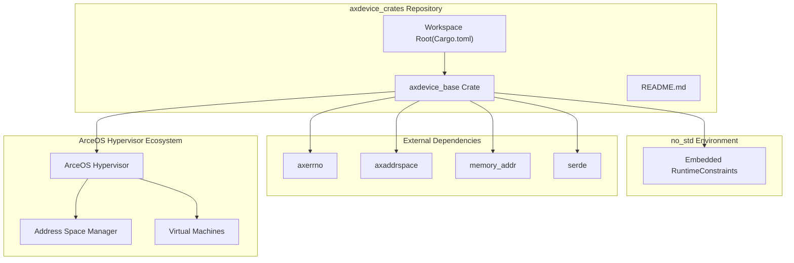
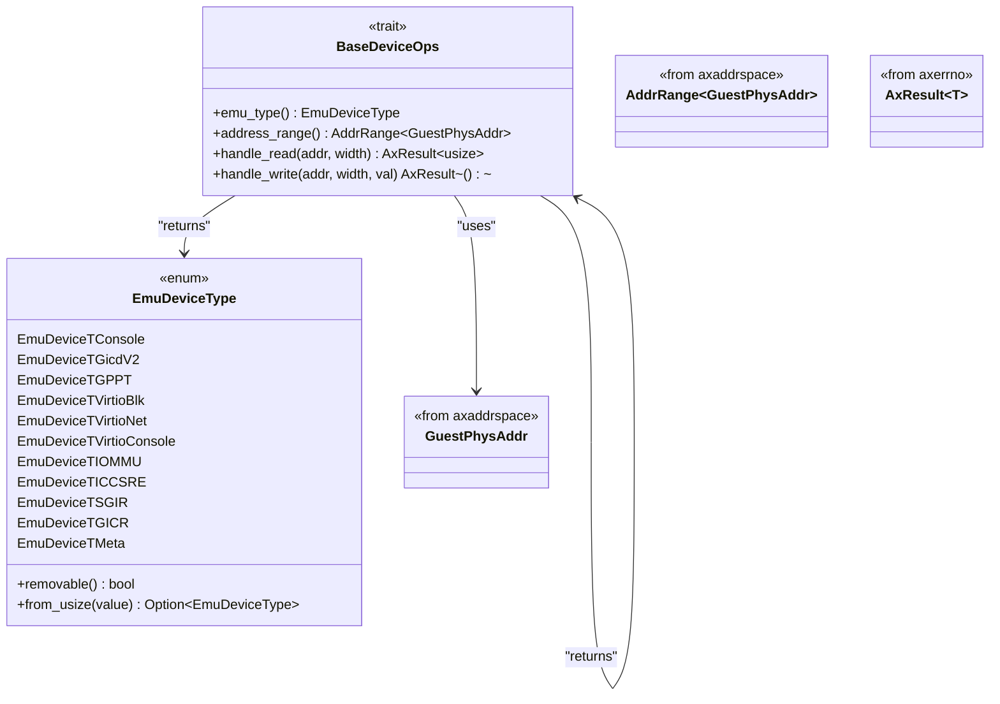
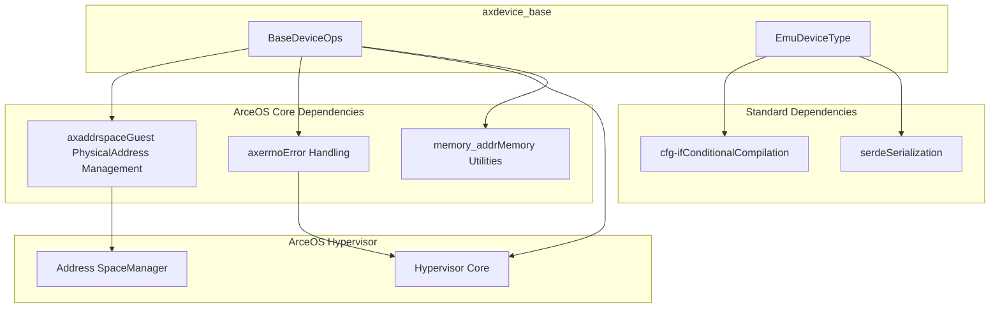

# Overview

> **Relevant source files**
> * [Cargo.toml](https://github.com/arceos-hypervisor/axdevice_crates/blob/28d49f14/Cargo.toml)
> * [README.md](https://github.com/arceos-hypervisor/axdevice_crates/blob/28d49f14/README.md)

This document provides an overview of the `axdevice_crates` repository, which contains foundational crates for building emulated device subsystems within the ArceOS hypervisor ecosystem. The repository specifically targets `no_std` embedded environments and provides the core abstractions needed for device emulation in virtualized guest systems.

For detailed information about the core device abstraction layer, see [Core Architecture](/arceos-hypervisor/axdevice_crates/2-core-architecture). For implementation guidance, see [Development Guide](/arceos-hypervisor/axdevice_crates/4-development-guide). For specifics about external dependencies and ArceOS integration, see [Dependencies and Integration](/arceos-hypervisor/axdevice_crates/3-dependencies-and-integration).

## Purpose and Scope

The `axdevice_crates` repository serves as the foundation for device emulation in the ArceOS hypervisor. It provides:

* Core traits and abstractions for emulated devices (`BaseDeviceOps`)
* A comprehensive device type taxonomy (`EmuDeviceType`)
* Integration points with ArceOS hypervisor address space management
* Support for multiple architectures and virtualization approaches

The repository is designed for `no_std` environments, making it suitable for embedded systems and hypervisor contexts where the standard library is not available.

**Sources:** [README.md(L1 - L5)&emsp;](https://github.com/arceos-hypervisor/axdevice_crates/blob/28d49f14/README.md#L1-L5) [Cargo.toml(L1 - L16)&emsp;](https://github.com/arceos-hypervisor/axdevice_crates/blob/28d49f14/Cargo.toml#L1-L16)

## Repository Architecture

### System Architecture Overview

The repository follows a workspace-based structure with `axdevice_base` as the foundational crate:

**Sources:** [Cargo.toml(L1 - L16)&emsp;](https://github.com/arceos-hypervisor/axdevice_crates/blob/28d49f14/Cargo.toml#L1-L16) [README.md(L3)&emsp;](https://github.com/arceos-hypervisor/axdevice_crates/blob/28d49f14/README.md#L3-L3)

### Core Component Relationships

The following diagram shows how the main code entities relate to each other:

**Sources:** Based on architectural analysis from provided diagrams

## Device Type Categories

The `EmuDeviceType` enum categorizes emulated devices into several functional groups:

|Category|Device Types|Removable|Purpose|
| --- | --- | --- | --- |
|Console & I/O|EmuDeviceTConsole,EmuDeviceTVirtioConsole|Mixed|Guest system I/O|
|ARM Interrupt Controllers|EmuDeviceTGicdV2,EmuDeviceTGPPT,EmuDeviceTICCSRE,EmuDeviceTSGIR,EmuDeviceTGICR|Yes|ARM-specific interrupt handling|
|Virtio Paravirtualization|EmuDeviceTVirtioBlk,EmuDeviceTVirtioNet|Yes|High-performance paravirtualized devices|
|System Infrastructure|EmuDeviceTIOMMU,EmuDeviceTMeta|No|Core system components|

The majority of device types (8 out of 11) are removable, indicating support for dynamic device configuration in virtualized environments.

**Sources:** Based on `EmuDeviceType` analysis from architectural diagrams

## Integration with ArceOS Ecosystem

The `axdevice_crates` repository integrates tightly with the ArceOS hypervisor ecosystem through several key dependencies:

**Sources:** [Cargo.toml(L15 - L16)&emsp;](https://github.com/arceos-hypervisor/axdevice_crates/blob/28d49f14/Cargo.toml#L15-L16) architectural analysis

## Development Environment

The repository targets multiple architectures and maintains compatibility with `no_std` environments:

* **Architecture Support**: x86_64, RISC-V (riscv64gc), ARM64 (aarch64)
* **Environment**: `no_std` compatible for embedded systems
* **License**: Triple-licensed under GPL-3.0-or-later OR Apache-2.0 OR MulanPSL-2.0
* **Workspace Structure**: Single workspace with `axdevice_base` as the foundational member

The `no_std` constraint ensures the crates can be used in hypervisor and embedded contexts where the standard library is not available, making them suitable for system-level virtualization components.

**Sources:** [Cargo.toml(L8 - L13)&emsp;](https://github.com/arceos-hypervisor/axdevice_crates/blob/28d49f14/Cargo.toml#L8-L13) [README.md(L3)&emsp;](https://github.com/arceos-hypervisor/axdevice_crates/blob/28d49f14/README.md#L3-L3)

## Next Steps

This overview establishes the foundational understanding of the `axdevice_crates` repository. For implementation details:

* See [Project Structure](/arceos-hypervisor/axdevice_crates/1.1-project-structure) for detailed workspace organization
* See [BaseDeviceOps Trait](/arceos-hypervisor/axdevice_crates/2.1-basedeviceops-trait) for the core device abstraction API
* See [Device Type System](/arceos-hypervisor/axdevice_crates/2.2-device-type-system) for comprehensive device categorization
* See [Implementing New Devices](/arceos-hypervisor/axdevice_crates/4.2-implementing-new-devices) for development guidance