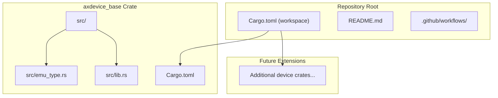
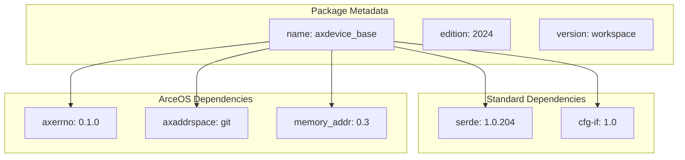
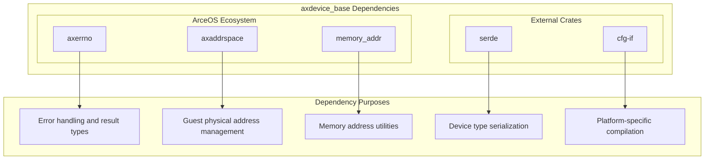
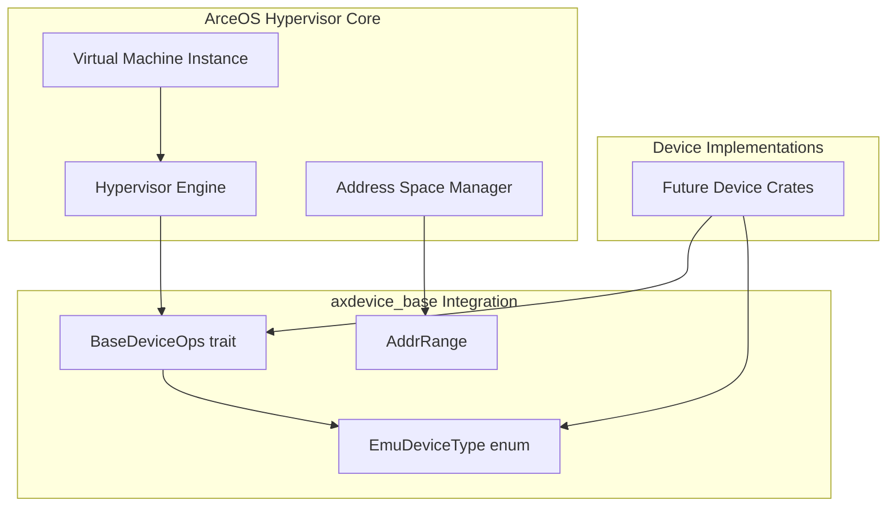
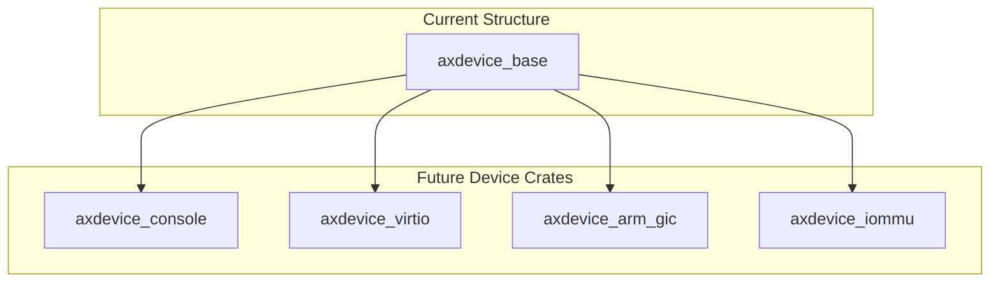

# Project Structure

> **Relevant source files**
> * [Cargo.toml](https://github.com/arceos-hypervisor/axdevice_crates/blob/28d49f14/Cargo.toml)
> * [axdevice_base/Cargo.toml](https://github.com/arceos-hypervisor/axdevice_crates/blob/28d49f14/axdevice_base/Cargo.toml)

This document covers the workspace organization and architectural layout of the `axdevice_crates` repository. It explains how the `axdevice_base` foundation crate is structured and integrates with the ArceOS hypervisor ecosystem. For detailed information about the core traits and device abstractions, see [Core Architecture](/arceos-hypervisor/axdevice_crates/2-core-architecture). For build system specifics and development workflows, see [Build System and CI](/arceos-hypervisor/axdevice_crates/4.1-build-system-and-ci).

## Workspace Organization

The `axdevice_crates` repository follows a Cargo workspace pattern with a single foundational crate that serves as the basis for device emulation abstractions.

### Repository Structure

**Sources:** [Cargo.toml(L1 - L16)&emsp;](https://github.com/arceos-hypervisor/axdevice_crates/blob/28d49f14/Cargo.toml#L1-L16) [axdevice_base/Cargo.toml(L1 - L17)&emsp;](https://github.com/arceos-hypervisor/axdevice_crates/blob/28d49f14/axdevice_base/Cargo.toml#L1-L17)

The workspace is configured with resolver version 2 and includes the `axdevice_base` crate as its primary member. The workspace-level configuration defines common package metadata including version `0.1.0`, authorship, and licensing under GPL-3.0-or-later, Apache-2.0, or MulanPSL-2.0.

### Workspace Dependencies

|Dependency|Version|Purpose|
| --- | --- | --- |
|axdevice_base|0.1|Foundation crate for device abstractions|

**Sources:** [Cargo.toml(L15 - L16)&emsp;](https://github.com/arceos-hypervisor/axdevice_crates/blob/28d49f14/Cargo.toml#L15-L16)

## axdevice_base Crate Architecture

The `axdevice_base` crate serves as the foundational layer providing core traits and types for device emulation in the ArceOS hypervisor environment.

### Crate Configuration

**Sources:** [axdevice_base/Cargo.toml(L1 - L9)&emsp;](https://github.com/arceos-hypervisor/axdevice_crates/blob/28d49f14/axdevice_base/Cargo.toml#L1-L9) [axdevice_base/Cargo.toml(L10 - L16)&emsp;](https://github.com/arceos-hypervisor/axdevice_crates/blob/28d49f14/axdevice_base/Cargo.toml#L10-L16)

The crate uses Rust edition 2024 and inherits workspace-level version and metadata. Key configuration aspects include:

* **No-std compatibility**: Uses `alloc` feature for collections without requiring standard library
* **Serialization support**: Serde with `derive` and `alloc` features enabled
* **Conditional compilation**: `cfg-if` for platform-specific code paths

### Dependency Architecture

The crate's dependencies are strategically chosen to support hypervisor device emulation while maintaining compatibility with embedded environments.

**Sources:** [axdevice_base/Cargo.toml(L11 - L16)&emsp;](https://github.com/arceos-hypervisor/axdevice_crates/blob/28d49f14/axdevice_base/Cargo.toml#L11-L16)

#### ArceOS-Specific Dependencies

* **`axerrno`**: Provides `AxResult<T>` type for consistent error handling across the ArceOS ecosystem
* **`axaddrspace`**: Supplies `GuestPhysAddr` and address range management for hypervisor memory operations
* **`memory_addr`**: Low-level memory address manipulation utilities

#### External Dependencies

* **`serde`**: Enables serialization of device types with `derive` macros and `alloc` feature for no-std environments
* **`cfg-if`**: Facilitates conditional compilation for different target architectures

## Integration Points

### ArceOS Hypervisor Integration

The `axdevice_base` crate integrates with the broader ArceOS hypervisor ecosystem through well-defined interfaces:

**Sources:** [axdevice_base/Cargo.toml(L14 - L15)&emsp;](https://github.com/arceos-hypervisor/axdevice_crates/blob/28d49f14/axdevice_base/Cargo.toml#L14-L15)

### Target Architecture Support

The crate is designed to support multiple target architectures commonly used in embedded hypervisor environments:

|Architecture|Target Triple|Purpose|
| --- | --- | --- |
|x86_64|x86_64-unknown-linux-gnu|Development and testing|
|x86_64 bare-metal|x86_64-unknown-none|Hypervisor deployment|
|RISC-V 64-bit|riscv64gc-unknown-none-elf|Embedded RISC-V systems|
|ARM64|aarch64-unknown-none-softfloat|ARM-based hypervisors|

The architecture support reflects the project's focus on ARM virtualization (evidenced by the prevalence of ARM interrupt controller device types) while maintaining cross-platform compatibility.

## Extensibility Design

The workspace structure anticipates future expansion with additional device implementation crates:

**Sources:** [Cargo.toml(L4 - L6)&emsp;](https://github.com/arceos-hypervisor/axdevice_crates/blob/28d49f14/Cargo.toml#L4-L6)

The workspace member list currently contains only `axdevice_base`, but the structure supports adding device-specific implementation crates that would depend on the foundation crate and implement the `BaseDeviceOps` trait for specific hardware categories.