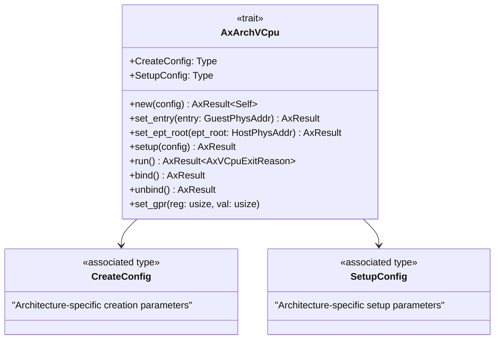
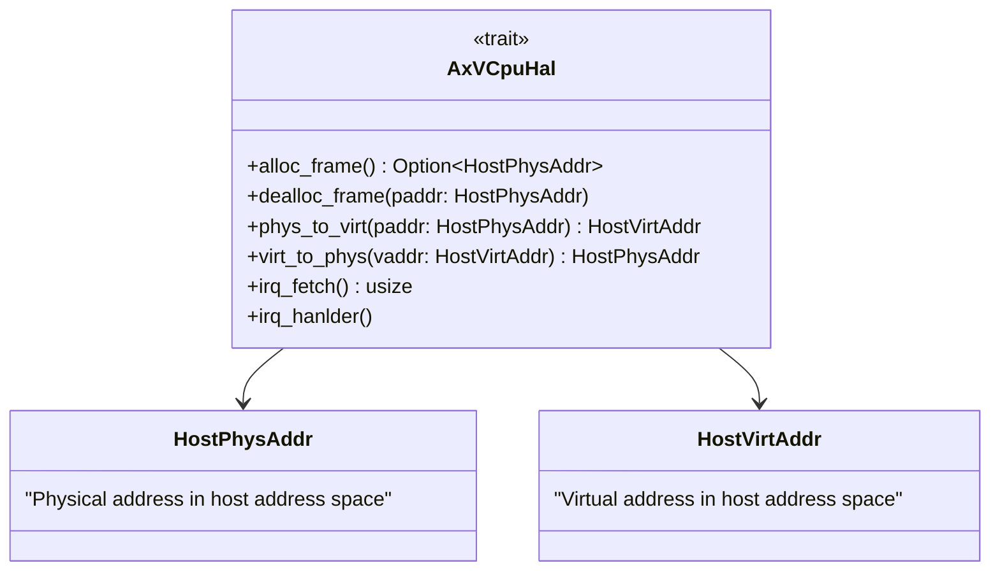
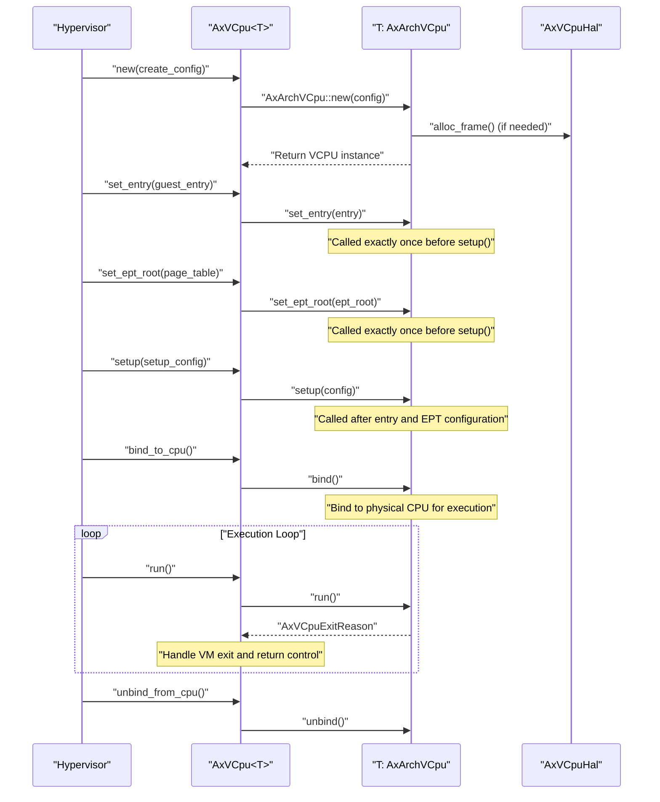

# Architecture Abstraction Layer

> **Relevant source files**
> * [src/arch_vcpu.rs](https://github.com/arceos-hypervisor/axvcpu/blob/34fc1067/src/arch_vcpu.rs)
> * [src/hal.rs](https://github.com/arceos-hypervisor/axvcpu/blob/34fc1067/src/hal.rs)

This document covers the architecture abstraction mechanisms in the axvcpu crate that enable support for multiple CPU architectures through trait-based interfaces. The abstraction layer consists of two primary traits: `AxArchVCpu` for architecture-specific virtual CPU operations and `AxVCpuHal` for hardware abstraction layer functionality.

For information about the core VCPU management and state machine, see [VCPU State Machine and Lifecycle](/arceos-hypervisor/axvcpu/2.1-vcpu-state-machine-and-lifecycle). For details about how these abstractions integrate with the broader hypervisor ecosystem, see [Dependencies and Integration](/arceos-hypervisor/axvcpu/5.1-dependencies-and-integration).

## AxArchVCpu Trait Interface

The `AxArchVCpu` trait serves as the primary abstraction for architecture-specific virtual CPU implementations. This trait defines a common interface that enables the same hypervisor code to manage virtual CPUs across different hardware architectures such as x86_64, ARM64, and RISC-V.

### Trait Definition and Core Methods

The trait interface defines essential lifecycle methods and configuration types:

|Method|Purpose|Timing Constraints|
| --- | --- | --- |
|new()|Create new VCPU instance|First call|
|set_entry()|Configure guest entry point|Beforesetup()|
|set_ept_root()|Configure extended page tables|Beforesetup()|
|setup()|Complete VCPU initialization|After entry/EPT configuration|
|run()|Execute guest until VM exit|During VCPU execution|
|bind()/unbind()|Manage physical CPU binding|During lifecycle transitions|
|set_gpr()|Set general-purpose registers|Runtime configuration|

**AxArchVCpu Trait Interface**



Sources: [src/arch_vcpu.rs(L9 - L44)&emsp;](https://github.com/arceos-hypervisor/axvcpu/blob/34fc1067/src/arch_vcpu.rs#L9-L44)

### Configuration Types and Lifecycle Management

The trait uses associated types `CreateConfig` and `SetupConfig` to allow each architecture implementation to define its own configuration parameters. This design enables architecture-specific customization while maintaining a consistent interface.

The lifecycle methods follow a strict calling sequence with timing guarantees enforced by the trait documentation:

1. `new()` creates the VCPU instance with architecture-specific configuration
2. `set_entry()` and `set_ept_root()` configure memory layout (called exactly once each)
3. `setup()` completes initialization after memory configuration
4. `bind()`/`unbind()` manage physical CPU association during runtime
5. `run()` executes the guest and returns exit reasons for hypervisor handling

Sources: [src/arch_vcpu.rs(L10 - L13)&emsp;](https://github.com/arceos-hypervisor/axvcpu/blob/34fc1067/src/arch_vcpu.rs#L10-L13) [src/arch_vcpu.rs(L15 - L31)&emsp;](https://github.com/arceos-hypervisor/axvcpu/blob/34fc1067/src/arch_vcpu.rs#L15-L31)

## Hardware Abstraction Layer (AxVCpuHal)

The `AxVCpuHal` trait provides a hardware abstraction layer for memory management and interrupt handling operations that the VCPU system requires from the underlying kernel or hypervisor.

### Memory Management Interface

The HAL defines essential memory operations for frame allocation and address translation:

|Method|Operation|Return Type|
| --- | --- | --- |
|alloc_frame()|Allocate physical frame|Option<HostPhysAddr>|
|dealloc_frame()|Deallocate physical frame|()|
|phys_to_virt()|Physical to virtual address translation|HostVirtAddr|
|virt_to_phys()|Virtual to physical address translation|HostPhysAddr|

### Interrupt Handling Interface

The HAL provides interrupt management capabilities with default implementations:

* `irq_fetch()` returns the current interrupt number (defaults to 0)
* `irq_hanlder()` dispatches interrupts to the host OS (unimplemented by default)

**AxVCpuHal Interface Structure**



Sources: [src/hal.rs(L4 - L54)&emsp;](https://github.com/arceos-hypervisor/axvcpu/blob/34fc1067/src/hal.rs#L4-L54)

## Multi-Architecture Support Design

The abstraction layer enables support for multiple CPU architectures through a trait-based design that separates generic VCPU management from architecture-specific implementation details.

### Architecture Implementation Pattern

Each supported architecture provides its own implementation of the `AxArchVCpu` trait with architecture-specific:

* Hardware virtualization support (VMX for x86, VHE for ARM, H-extension for RISC-V)
* System register access patterns
* Exception and interrupt handling mechanisms
* Memory management unit integration
* Power management interfaces

**Multi-Architecture Abstraction Pattern**

```

```

Sources: [src/arch_vcpu.rs(L6 - L9)&emsp;](https://github.com/arceos-hypervisor/axvcpu/blob/34fc1067/src/arch_vcpu.rs#L6-L9) [src/hal.rs(L3 - L4)&emsp;](https://github.com/arceos-hypervisor/axvcpu/blob/34fc1067/src/hal.rs#L3-L4)

## Lifecycle and Method Call Sequences

The architecture abstraction enforces a specific sequence of method calls to ensure proper VCPU initialization and execution.

### VCPU Initialization Sequence

The trait design guarantees that initialization methods are called in the correct order through documentation contracts and type system constraints:

**VCPU Lifecycle Method Sequence**



Sources: [src/arch_vcpu.rs(L15 - L41)&emsp;](https://github.com/arceos-hypervisor/axvcpu/blob/34fc1067/src/arch_vcpu.rs#L15-L41)

### Exit Handling Integration

The `run()` method returns `AxVCpuExitReason` values that integrate with the exit handling system, allowing architecture-specific implementations to communicate VM exit events through a common interface.

The abstraction enables architecture implementations to:

* Map hardware-specific exit conditions to common exit reason types
* Provide exit-specific data through standardized structures
* Maintain consistent error handling across different architectures

Sources: [src/arch_vcpu.rs(L34)&emsp;](https://github.com/arceos-hypervisor/axvcpu/blob/34fc1067/src/arch_vcpu.rs#L34-L34) [src/arch_vcpu.rs(L4)&emsp;](https://github.com/arceos-hypervisor/axvcpu/blob/34fc1067/src/arch_vcpu.rs#L4-L4)