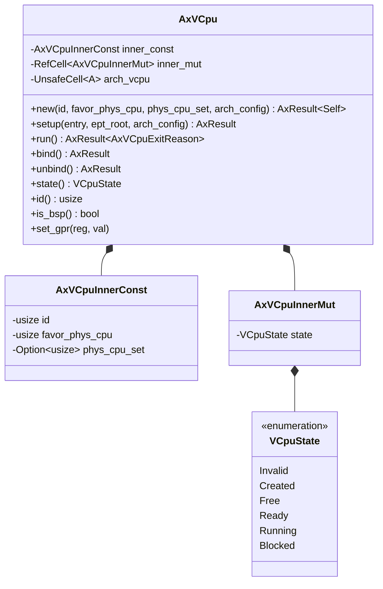
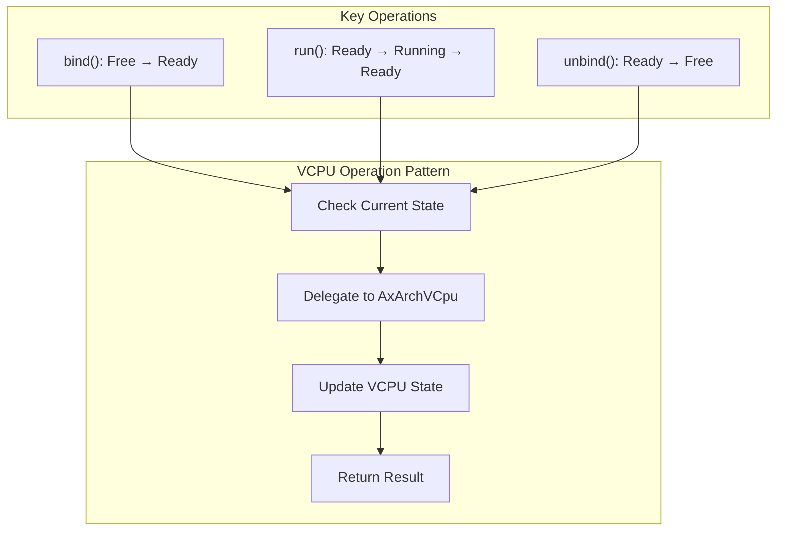
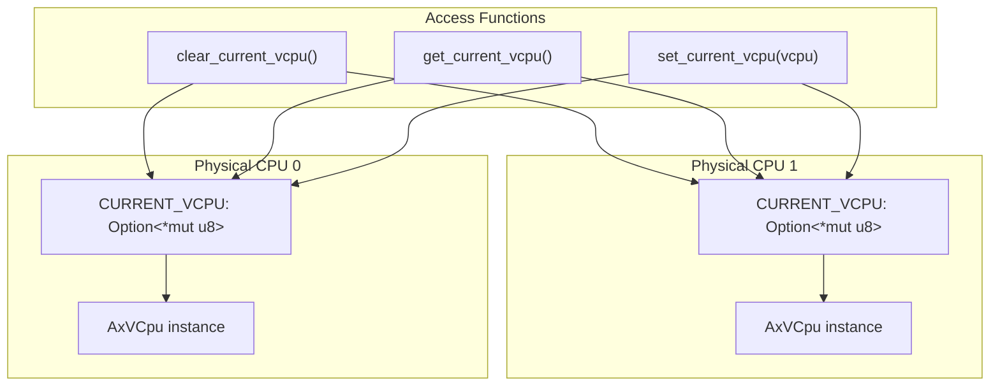
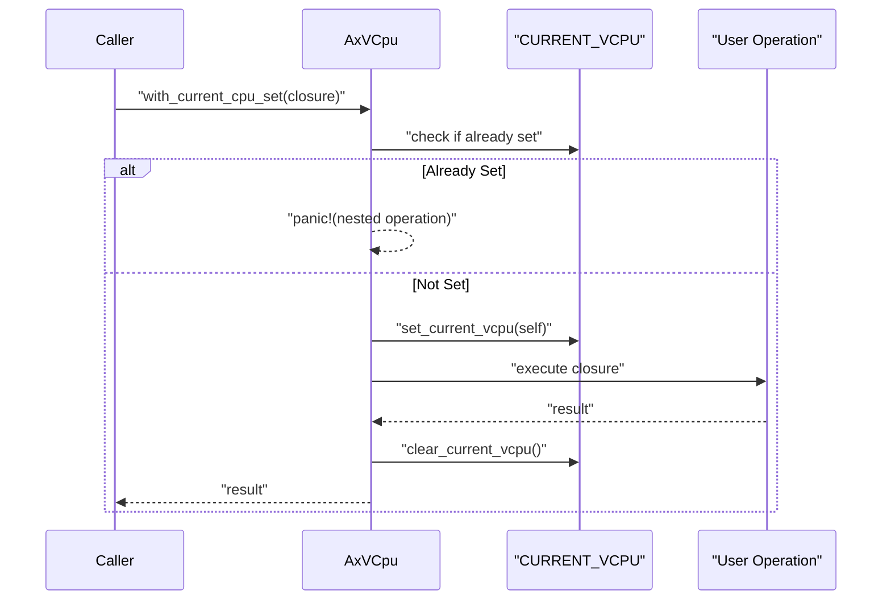
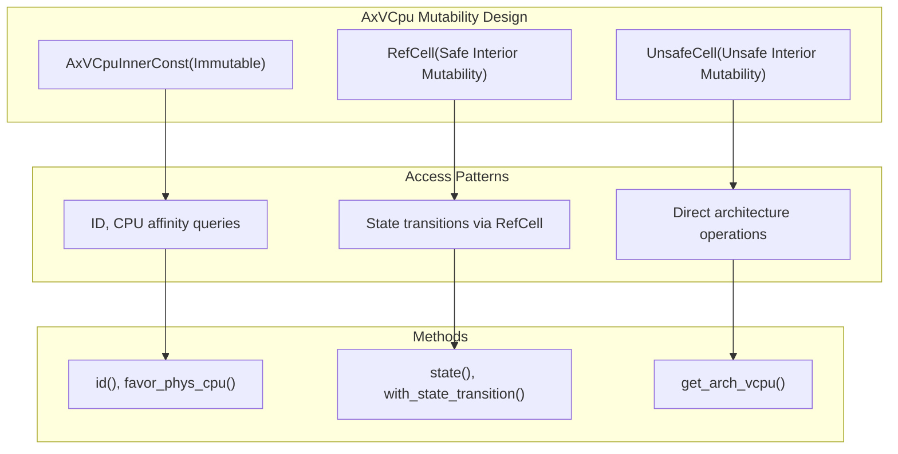
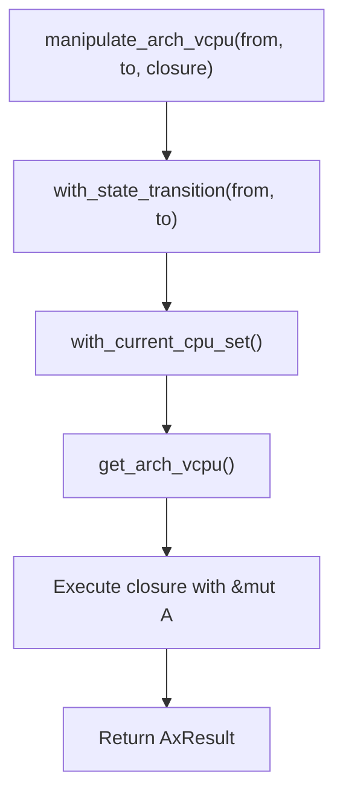

# Core VCPU Management

> **Relevant source files**
> * [src/arch_vcpu.rs](https://github.com/arceos-hypervisor/axvcpu/blob/34fc1067/src/arch_vcpu.rs)
> * [src/vcpu.rs](https://github.com/arceos-hypervisor/axvcpu/blob/34fc1067/src/vcpu.rs)

This document covers the central `AxVCpu` abstraction that provides the primary interface for virtual CPU management in the axvcpu crate. The `AxVCpu` struct serves as an architecture-independent wrapper that delegates platform-specific operations to architecture implementations while maintaining consistent state management and lifecycle control.

For detailed information about VCPU state transitions and lifecycle stages, see [VCPU State Machine and Lifecycle](/arceos-hypervisor/axvcpu/2.1-vcpu-state-machine-and-lifecycle). For architecture-specific implementation details, see [Architecture Abstraction Layer](/arceos-hypervisor/axvcpu/2.2-architecture-abstraction-layer). For information about handling VCPU exits and events, see [Exit Handling System](/arceos-hypervisor/axvcpu/3-exit-handling-system).

## AxVCpu Structure and Components

The `AxVCpu` struct is designed as a generic wrapper that provides architecture-independent VCPU management by delegating specific operations to types implementing the `AxArchVCpu` trait.

### Core Data Structure



The `AxVCpu` structure separates concerns into three main components:

|Component|Purpose|Mutability|
| --- | --- | --- |
|AxVCpuInnerConst|Immutable VCPU configuration (ID, CPU affinity)|Constant|
|AxVCpuInnerMut|Mutable state information managed throughRefCell|Interior mutable|
|arch_vcpu|Architecture-specific implementation viaUnsafeCell|Unsafe interior mutable|

Sources: [src/vcpu.rs(L8 - L63)&emsp;](https://github.com/arceos-hypervisor/axvcpu/blob/34fc1067/src/vcpu.rs#L8-L63)

## Architecture Independence Design

The `AxVCpu` achieves architecture independence by using the `AxArchVCpu` trait as a type parameter, allowing the same interface to work with different CPU architectures.

### Trait Integration Pattern

```

```

The `AxArchVCpu` trait defines the contract that architecture-specific implementations must fulfill:

|Method|Purpose|State Requirement|
| --- | --- | --- |
|new()|Create new architecture VCPU|-|
|set_entry()|Set guest entry point|Before setup|
|set_ept_root()|Set memory translation root|Before setup|
|setup()|Complete VCPU initialization|After entry/EPT set|
|run()|Execute guest code|Running state|
|bind()/unbind()|CPU binding operations|Ready/Free transition|

Sources: [src/arch_vcpu.rs(L6 - L44)&emsp;](https://github.com/arceos-hypervisor/axvcpu/blob/34fc1067/src/arch_vcpu.rs#L6-L44) [src/vcpu.rs(L53 - L63)&emsp;](https://github.com/arceos-hypervisor/axvcpu/blob/34fc1067/src/vcpu.rs#L53-L63)

## VCPU Lifecycle Operations

The `AxVCpu` provides key lifecycle operations that manage VCPU state transitions and delegate to architecture-specific implementations.

### Creation and Initialization Flow

```

```

### Runtime Operations

The main runtime operations follow a consistent pattern of state validation and architecture delegation:



Sources: [src/vcpu.rs(L205 - L225)&emsp;](https://github.com/arceos-hypervisor/axvcpu/blob/34fc1067/src/vcpu.rs#L205-L225) [src/vcpu.rs(L86 - L99)&emsp;](https://github.com/arceos-hypervisor/axvcpu/blob/34fc1067/src/vcpu.rs#L86-L99)

## Current VCPU Management

The crate maintains per-CPU tracking of the currently executing VCPU using a percpu variable, enabling architecture implementations to access their containing `AxVCpu` instance.

### Per-CPU VCPU Tracking



The current VCPU mechanism provides:

|Function|Purpose|Safety|
| --- | --- | --- |
|get_current_vcpu<A>()|Get current VCPU reference|Safe|
|get_current_vcpu_mut<A>()|Get mutable current VCPU reference|Safe|
|set_current_vcpu()|Set current VCPU pointer|Unsafe|
|clear_current_vcpu<A>()|Clear current VCPU pointer|Unsafe|

The `with_current_cpu_set` method automatically manages current VCPU setup and cleanup:



Sources: [src/vcpu.rs(L238 - L290)&emsp;](https://github.com/arceos-hypervisor/axvcpu/blob/34fc1067/src/vcpu.rs#L238-L290) [src/vcpu.rs(L164 - L180)&emsp;](https://github.com/arceos-hypervisor/axvcpu/blob/34fc1067/src/vcpu.rs#L164-L180)

## Interior Mutability Pattern

The `AxVCpu` uses a sophisticated interior mutability design to handle the different access patterns required for VCPU state and architecture-specific data.

### Mutability Strategy



The design rationale for different mutability approaches:

|Component|Mutability Type|Reason|
| --- | --- | --- |
|inner_const|None|Immutable configuration data|
|inner_mut|RefCell|Safe runtime borrowing for state|
|arch_vcpu|UnsafeCell|Direct access needed during VCPU execution|

The `manipulate_arch_vcpu` method combines state transition with architecture delegation:



Sources: [src/vcpu.rs(L53 - L63)&emsp;](https://github.com/arceos-hypervisor/axvcpu/blob/34fc1067/src/vcpu.rs#L53-L63) [src/vcpu.rs(L185 - L192)&emsp;](https://github.com/arceos-hypervisor/axvcpu/blob/34fc1067/src/vcpu.rs#L185-L192) [src/vcpu.rs(L199 - L203)&emsp;](https://github.com/arceos-hypervisor/axvcpu/blob/34fc1067/src/vcpu.rs#L199-L203)