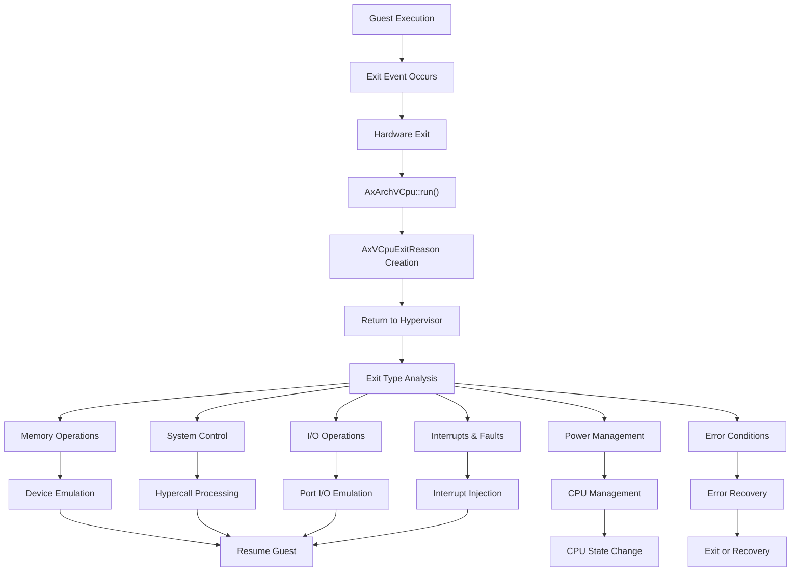
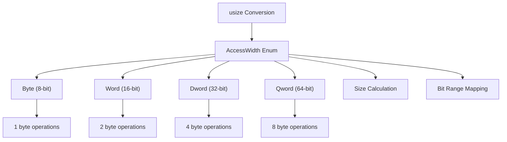
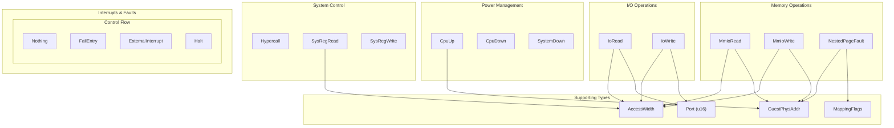

# Exit Handling System

> **Relevant source files**
> * [src/exit.rs](https://github.com/arceos-hypervisor/axvcpu/blob/34fc1067/src/exit.rs)

## Purpose and Scope

The Exit Handling System provides a comprehensive framework for managing VCPU exits in the ArceOS hypervisor. When guest code execution encounters events that require hypervisor intervention, the VCPU exits to the host and provides detailed information about the cause through the `AxVCpuExitReason` enum. This system abstracts exit handling across different CPU architectures while providing sufficient detail for the hypervisor to emulate devices, handle hypercalls, manage power states, and process memory operations.

For detailed categorization of specific exit types, see [Exit Reasons and Categories](/arceos-hypervisor/axvcpu/3.1-exit-reasons-and-categories). For information about memory and I/O operation handling specifics, see [Memory Access and I/O Operations](/arceos-hypervisor/axvcpu/3.2-memory-access-and-io-operations). For the broader VCPU management context, see [Core VCPU Management](/arceos-hypervisor/axvcpu/2-core-vcpu-management).

## Exit Handling Architecture

The exit handling system centers around two primary data structures that work together to provide precise information about why a VCPU exited and what data is associated with that exit.

### VCPU Exit Flow

Sources: [src/exit.rs(L66 - L210)&emsp;](https://github.com/arceos-hypervisor/axvcpu/blob/34fc1067/src/exit.rs#L66-L210)

### Access Width Specification System

The system uses a precise access width specification to handle different data sizes across memory and I/O operations:

Sources: [src/exit.rs(L6 - L61)&emsp;](https://github.com/arceos-hypervisor/axvcpu/blob/34fc1067/src/exit.rs#L6-L61)

## Core Data Structures

### AccessWidth Enum

The `AccessWidth` enum provides standardized representation of memory and I/O access sizes. It supports conversion from and to `usize` values and provides utility methods for size calculations and bit range mapping.

|Access Width|Size (bytes)|Bit Range|Usage|
| --- | --- | --- | --- |
|Byte|1|0..8|Byte-level operations|
|Word|2|0..16|16-bit operations (x86 terminology)|
|Dword|4|0..32|32-bit operations|
|Qword|8|0..64|64-bit operations|

Sources: [src/exit.rs(L6 - L61)&emsp;](https://github.com/arceos-hypervisor/axvcpu/blob/34fc1067/src/exit.rs#L6-L61)

### AxVCpuExitReason Enum

The `AxVCpuExitReason` enum is marked as `#[non_exhaustive]` to allow future expansion and contains comprehensive exit information for all supported virtualization scenarios.

## Exit Reason Categories

### Code Entity Mapping

Sources: [src/exit.rs(L70 - L210)&emsp;](https://github.com/arceos-hypervisor/axvcpu/blob/34fc1067/src/exit.rs#L70-L210)

## Exit Processing Workflow

### Memory and I/O Exit Handling

Memory-mapped I/O operations (`MmioRead`, `MmioWrite`) and port I/O operations (`IoRead`, `IoWrite`) include precise access width information and target addresses. The system distinguishes between different register widths for MMIO reads to support complex instruction emulation.

### System Register Access

System register operations (`SysRegRead`, `SysRegWrite`) provide architecture-specific register addressing schemes:

* **x86_64**: MSR addresses
* **ARM64**: ESR_EL2.ISS format encoding (`<op0><op2><op1><CRn>00000<CRm>0`)
* **RISC-V**: CSR addresses

### Power Management Operations

Power management exits (`CpuUp`, `CpuDown`, `SystemDown`) handle CPU lifecycle events with architecture-specific target CPU identification:

* **ARM64**: MPIDR affinity fields
* **x86_64**: APIC ID values
* **RISC-V**: Hart ID values

### Error and Control Flow

The system provides `Nothing` exits for polling opportunities and `FailEntry` exits for hardware-level virtualization failures with architecture-specific failure reason codes.

Sources: [src/exit.rs(L70 - L210)&emsp;](https://github.com/arceos-hypervisor/axvcpu/blob/34fc1067/src/exit.rs#L70-L210)

## Integration Points

The exit handling system integrates with several key components:

* **AxArchVCpu trait**: Architecture implementations return `AxVCpuExitReason` from their `run()` methods
* **GuestPhysAddr**: Physical address representation from `axaddrspace` crate
* **MappingFlags**: Memory permission flags for nested page fault handling
* **Hypervisor**: Processes exit reasons to emulate devices and manage guest state

The `#[non_exhaustive]` attribute on `AxVCpuExitReason` ensures forward compatibility as new exit types are added for expanded virtualization features.

Sources: [src/exit.rs(L1 - L4)&emsp;](https://github.com/arceos-hypervisor/axvcpu/blob/34fc1067/src/exit.rs#L1-L4) [src/exit.rs(L66 - L67)&emsp;](https://github.com/arceos-hypervisor/axvcpu/blob/34fc1067/src/exit.rs#L66-L67)