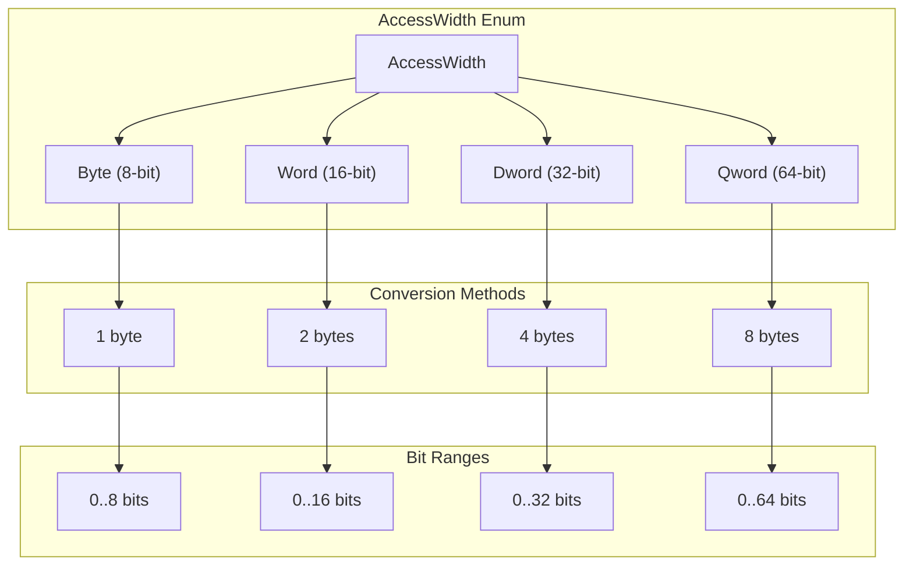
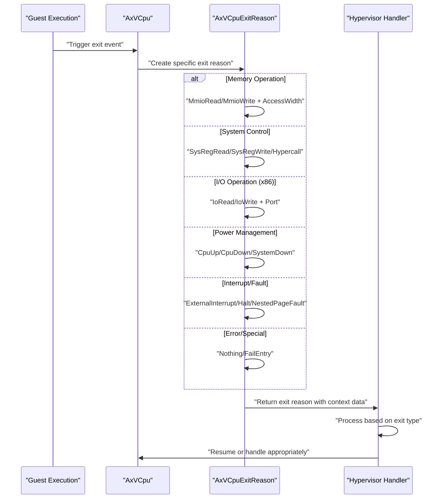

# Exit Reasons and Categories

> **Relevant source files**
> * [src/exit.rs](https://github.com/arceos-hypervisor/axvcpu/blob/34fc1067/src/exit.rs)

This page documents the comprehensive set of virtual CPU exit reasons that can occur during guest execution in the AxVCpu system. It covers the `AxVCpuExitReason` enum and related types that define when and why a virtual CPU exits guest mode to return control to the hypervisor.

For information about how these exit reasons are processed and handled by the hypervisor, see [Memory Access and I/O Operations](/arceos-hypervisor/axvcpu/3.2-memory-access-and-io-operations). For details about the VCPU state management during exits, see [VCPU State Machine and Lifecycle](/arceos-hypervisor/axvcpu/2.1-vcpu-state-machine-and-lifecycle).

## Exit Reason Overview

The `AxVCpuExitReason` enum defined in [src/exit.rs(L68 - L210)&emsp;](https://github.com/arceos-hypervisor/axvcpu/blob/34fc1067/src/exit.rs#L68-L210) provides a comprehensive taxonomy of all possible reasons why a virtual CPU might exit guest execution. Each exit reason includes specific data fields relevant to that type of exit, enabling the hypervisor to process the exit appropriately.

The exit system is designed to be architecture-independent while accommodating architecture-specific details where necessary. All exit reasons include detailed context information to allow the hypervisor to emulate the operation, handle the event, or make decisions about guest execution.

**Sources:** [src/exit.rs(L66 - L210)&emsp;](https://github.com/arceos-hypervisor/axvcpu/blob/34fc1067/src/exit.rs#L66-L210)

## Exit Categories and Types

### Memory Operations

Memory-related exits occur when the guest attempts operations that require hypervisor intervention:

|Exit Type|Purpose|Key Data|
| --- | --- | --- |
|MmioRead|Guest reads from memory-mapped I/O|Address, access width, target register|
|MmioWrite|Guest writes to memory-mapped I/O|Address, access width, data value|
|NestedPageFault|Page fault in nested paging|Fault address, access flags|

**MMIO Operations**

* `MmioRead` [src/exit.rs(L78 - L88)&emsp;](https://github.com/arceos-hypervisor/axvcpu/blob/34fc1067/src/exit.rs#L78-L88) captures reads with target register information
* `MmioWrite` [src/exit.rs(L89 - L97)&emsp;](https://github.com/arceos-hypervisor/axvcpu/blob/34fc1067/src/exit.rs#L89-L97) includes the data being written
* Both specify the `GuestPhysAddr` and `AccessWidth` for precise emulation

**Page Faults**

* `NestedPageFault` [src/exit.rs(L153 - L161)&emsp;](https://github.com/arceos-hypervisor/axvcpu/blob/34fc1067/src/exit.rs#L153-L161) occurs during EPT violations on x86 or stage-2 faults on ARM
* Includes `MappingFlags` to indicate the type of access attempted

### System Control Operations

System-level control operations that require hypervisor mediation:

|Exit Type|Purpose|Architecture Scope|
| --- | --- | --- |
|SysRegRead|Read system registers|MSRs (x86), CSRs (RISC-V), System regs (ARM)|
|SysRegWrite|Write system registers|MSRs (x86), CSRs (RISC-V), System regs (ARM)|
|Hypercall|Guest-initiated hypervisor calls|All architectures|

**System Register Access**

* [src/exit.rs(L98 - L125)&emsp;](https://github.com/arceos-hypervisor/axvcpu/blob/34fc1067/src/exit.rs#L98-L125) defines both read and write operations
* Address encoding varies by architecture (ESR_EL2.ISS format for ARM64)
* Register index specified for read operations to identify target GPR

**Hypercalls**

* [src/exit.rs(L71 - L77)&emsp;](https://github.com/arceos-hypervisor/axvcpu/blob/34fc1067/src/exit.rs#L71-L77) includes hypercall number and up to 6 arguments
* Provides standardized interface for guest-hypervisor communication

### I/O Operations (x86-specific)

Direct I/O port access operations, specific to x86 architecture:

* `IoRead` [src/exit.rs(L126 - L134)&emsp;](https://github.com/arceos-hypervisor/axvcpu/blob/34fc1067/src/exit.rs#L126-L134) for reading from I/O ports
* `IoWrite` [src/exit.rs(L135 - L145)&emsp;](https://github.com/arceos-hypervisor/axvcpu/blob/34fc1067/src/exit.rs#L135-L145) for writing to I/O ports
* Both use `Port` type (u16) [src/exit.rs(L64)&emsp;](https://github.com/arceos-hypervisor/axvcpu/blob/34fc1067/src/exit.rs#L64-L64) and specify `AccessWidth`
* Target register is implicit (always al/ax/eax) due to x86 I/O instruction semantics

### Interrupt and Exception Handling

Events that interrupt normal guest execution:

* `ExternalInterrupt` [src/exit.rs(L146 - L152)&emsp;](https://github.com/arceos-hypervisor/axvcpu/blob/34fc1067/src/exit.rs#L146-L152) captures hardware interrupts with vector number
* `Halt` [src/exit.rs(L163)&emsp;](https://github.com/arceos-hypervisor/axvcpu/blob/34fc1067/src/exit.rs#L163-L163) indicates the guest has halted execution

### Power Management

CPU and system power state changes:

|Exit Type|Purpose|Data Fields|
| --- | --- | --- |
|CpuUp|Bring up secondary CPU|Target CPU ID, entry point, argument|
|CpuDown|Power down CPU|Power state (currently unused)|
|SystemDown|Power down entire system|None|

**Multi-CPU Management**

* `CpuUp` [src/exit.rs(L164 - L186)&emsp;](https://github.com/arceos-hypervisor/axvcpu/blob/34fc1067/src/exit.rs#L164-L186) handles architecture-specific CPU startup (PSCI/SIPI/SBI)
* Target CPU identification varies by architecture (MPIDR/APIC ID/hartid)

### Error and Special Conditions

Exceptional conditions and edge cases:

* `Nothing` [src/exit.rs(L199 - L202)&emsp;](https://github.com/arceos-hypervisor/axvcpu/blob/34fc1067/src/exit.rs#L199-L202) indicates no special handling needed
* `FailEntry` [src/exit.rs(L203 - L209)&emsp;](https://github.com/arceos-hypervisor/axvcpu/blob/34fc1067/src/exit.rs#L203-L209) represents VM entry failures with hardware-specific error codes

**Sources:** [src/exit.rs(L68 - L210)&emsp;](https://github.com/arceos-hypervisor/axvcpu/blob/34fc1067/src/exit.rs#L68-L210)

## Access Width Specifications

The `AccessWidth` enum [src/exit.rs(L6 - L61)&emsp;](https://github.com/arceos-hypervisor/axvcpu/blob/34fc1067/src/exit.rs#L6-L61) provides precise specification of memory and I/O operation sizes:

**AccessWidth Conversion and Utility Methods**

* `TryFrom<usize>` [src/exit.rs(L21 - L33)&emsp;](https://github.com/arceos-hypervisor/axvcpu/blob/34fc1067/src/exit.rs#L21-L33) converts byte sizes to width enum
* `From<AccessWidth>` [src/exit.rs(L35 - L44)&emsp;](https://github.com/arceos-hypervisor/axvcpu/blob/34fc1067/src/exit.rs#L35-L44) converts width to byte size
* `size()` method [src/exit.rs(L47 - L51)&emsp;](https://github.com/arceos-hypervisor/axvcpu/blob/34fc1067/src/exit.rs#L47-L51) returns size in bytes
* `bits_range()` method [src/exit.rs(L52 - L61)&emsp;](https://github.com/arceos-hypervisor/axvcpu/blob/34fc1067/src/exit.rs#L52-L61) returns bit range covered

**Sources:** [src/exit.rs(L6 - L61)&emsp;](https://github.com/arceos-hypervisor/axvcpu/blob/34fc1067/src/exit.rs#L6-L61)

## Exit Reason Classification

```mermaid
flowchart TD
subgraph subGraph6["Error Conditions"]
    Nothing["Nothing"]
    FailEntry["FailEntry"]
end
subgraph subGraph5["Power Management"]
    CpuUp["CpuUp"]
    CpuDown["CpuDown"]
    SystemDown["SystemDown"]
end
subgraph subGraph4["Interrupts & Faults"]
    ExternalInterrupt["ExternalInterrupt"]
    Halt["Halt"]
end
subgraph subGraph3["I/O Operations"]
    IoRead["IoRead (x86 only)"]
    IoWrite["IoWrite (x86 only)"]
end
subgraph subGraph2["System Control"]
    SysRegRead["SysRegRead"]
    SysRegWrite["SysRegWrite"]
    Hypercall["Hypercall"]
end
subgraph subGraph1["Memory Operations"]
    MmioRead["MmioRead"]
    MmioWrite["MmioWrite"]
    NestedPageFault["NestedPageFault"]
end
subgraph subGraph0["AxVCpuExitReason Categories"]
    MEM["Memory Operations"]
    SYS["System Control"]
    IO["I/O Operations"]
    INT["Interrupts & Faults"]
    PWR["Power Management"]
    ERR["Error Conditions"]
end

ERR --> FailEntry
ERR --> Nothing
INT --> ExternalInterrupt
INT --> Halt
IO --> IoRead
IO --> IoWrite
MEM --> MmioRead
MEM --> MmioWrite
MEM --> NestedPageFault
PWR --> CpuDown
PWR --> CpuUp
PWR --> SystemDown
SYS --> Hypercall
SYS --> SysRegRead
SYS --> SysRegWrite
```

This diagram shows the logical grouping of exit reasons by their primary function and the specific enum variants that fall into each category.

**Sources:** [src/exit.rs(L68 - L210)&emsp;](https://github.com/arceos-hypervisor/axvcpu/blob/34fc1067/src/exit.rs#L68-L210)

## Exit Processing Flow

This sequence diagram illustrates how different types of guest operations result in specific exit reasons being created and returned to the hypervisor for processing.

**Sources:** [src/exit.rs(L66 - L210)&emsp;](https://github.com/arceos-hypervisor/axvcpu/blob/34fc1067/src/exit.rs#L66-L210)