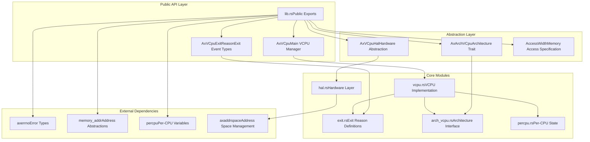
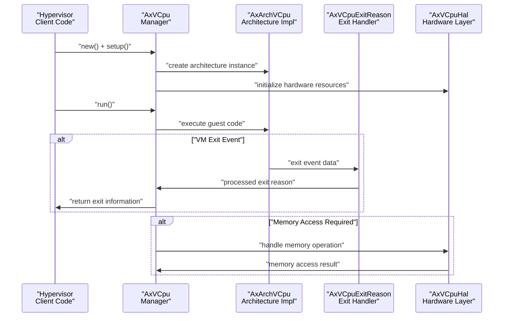

# Overview

> **Relevant source files**
> * [Cargo.toml](https://github.com/arceos-hypervisor/axvcpu/blob/34fc1067/Cargo.toml)
> * [README.md](https://github.com/arceos-hypervisor/axvcpu/blob/34fc1067/README.md)
> * [src/lib.rs](https://github.com/arceos-hypervisor/axvcpu/blob/34fc1067/src/lib.rs)

This document provides an overview of the `axvcpu` crate, which serves as a virtual CPU abstraction layer for the ArceOS hypervisor. The crate provides architecture-independent VCPU management capabilities, comprehensive exit handling, and multi-platform support through a trait-based design.

For detailed information about VCPU lifecycle management and state transitions, see [Core VCPU Management](/arceos-hypervisor/axvcpu/2-core-vcpu-management). For comprehensive coverage of VM exit handling and processing, see [Exit Handling System](/arceos-hypervisor/axvcpu/3-exit-handling-system). For implementation specifics including per-CPU state and hardware abstraction, see [Implementation Details](/arceos-hypervisor/axvcpu/4-implementation-details).

## Purpose and Scope

The `axvcpu` crate implements a virtualization abstraction that enables hypervisors to manage virtual CPUs across different hardware architectures. It provides a unified interface for VCPU creation, execution control, exit handling, and resource management while abstracting away architecture-specific implementation details.

The crate operates in a `no_std` environment and integrates with the broader ArceOS hypervisor ecosystem through well-defined interfaces and dependency relationships.

**Sources:** [src/lib.rs(L1 - L4)&emsp;](https://github.com/arceos-hypervisor/axvcpu/blob/34fc1067/src/lib.rs#L1-L4) [README.md(L1 - L3)&emsp;](https://github.com/arceos-hypervisor/axvcpu/blob/34fc1067/README.md#L1-L3)

## System Architecture

The following diagram illustrates the high-level architecture of the `axvcpu` system, showing how the main code entities relate to each other:

### AxVCpu Core Architecture

This diagram shows the modular design where the public API layer exposes the main abstractions (`AxVCpu`, `AxVCpuExitReason`, `AxArchVCpu`, `AxVCpuHal`) which are implemented by corresponding core modules, with clear dependency relationships to external crates.

**Sources:** [src/lib.rs(L9 - L22)&emsp;](https://github.com/arceos-hypervisor/axvcpu/blob/34fc1067/src/lib.rs#L9-L22) [Cargo.toml(L7 - L12)&emsp;](https://github.com/arceos-hypervisor/axvcpu/blob/34fc1067/Cargo.toml#L7-L12)

## Core Component Overview

### VCPU Management Components

|Component|Module|Purpose|
| --- | --- | --- |
|AxVCpu|vcpu.rs|Primary VCPU abstraction managing lifecycle and execution|
|AxArchVCpu|arch_vcpu.rs|Architecture-specific trait for platform implementations|
|AxVCpuExitReason|exit.rs|Enumeration of all possible VM exit conditions|
|AxVCpuHal|hal.rs|Hardware abstraction layer for memory and interrupt management|
|Per-CPU state|percpu.rs|Management of per-CPU virtualization state|

The system follows a layered approach where the generic `AxVCpu` manager coordinates with architecture-specific implementations through the `AxArchVCpu` trait, while exit events are processed through the comprehensive `AxVCpuExitReason` enumeration.

**Sources:** [src/lib.rs(L15 - L21)&emsp;](https://github.com/arceos-hypervisor/axvcpu/blob/34fc1067/src/lib.rs#L15-L21)

### VCPU Execution and Exit Flow

This sequence diagram demonstrates how the core components interact during VCPU execution, with the `AxVCpu` manager orchestrating between architecture-specific implementations and hardware abstraction layers to handle VM exits and memory operations.

**Sources:** [src/lib.rs(L9 - L21)&emsp;](https://github.com/arceos-hypervisor/axvcpu/blob/34fc1067/src/lib.rs#L9-L21)

## Integration with ArceOS Ecosystem

The `axvcpu` crate serves as a foundational component in the ArceOS hypervisor stack, providing the essential virtual CPU management capabilities that higher-level hypervisor components depend on. It integrates with several key external dependencies:

* **`axerrno`**: Provides standardized error handling across the hypervisor
* **`memory_addr`**: Offers memory address abstractions for guest physical addressing
* **`percpu`**: Enables per-CPU variable management for hypervisor state
* **`axaddrspace`**: Provides address space management for guest memory virtualization

The crate's `no_std` design ensures compatibility with kernel-level hypervisor environments while maintaining portability across different host operating systems and hardware platforms.

**Sources:** [Cargo.toml(L7 - L12)&emsp;](https://github.com/arceos-hypervisor/axvcpu/blob/34fc1067/Cargo.toml#L7-L12) [src/lib.rs(L4)&emsp;](https://github.com/arceos-hypervisor/axvcpu/blob/34fc1067/src/lib.rs#L4-L4)