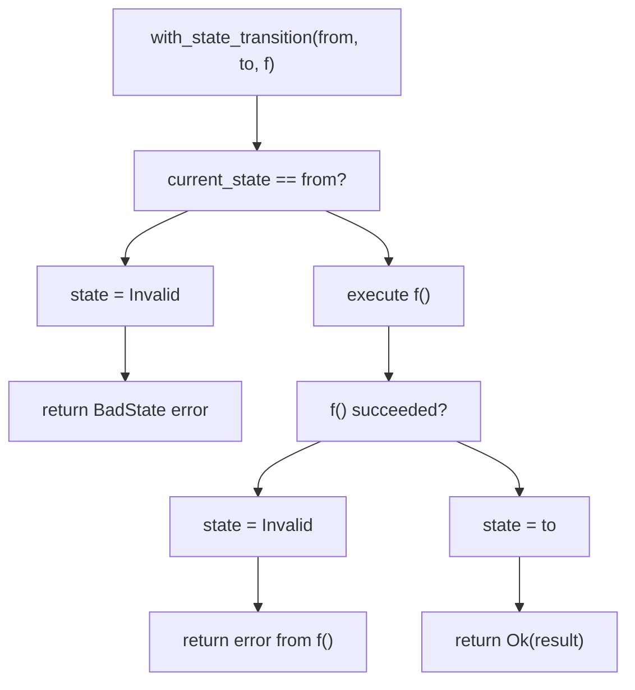
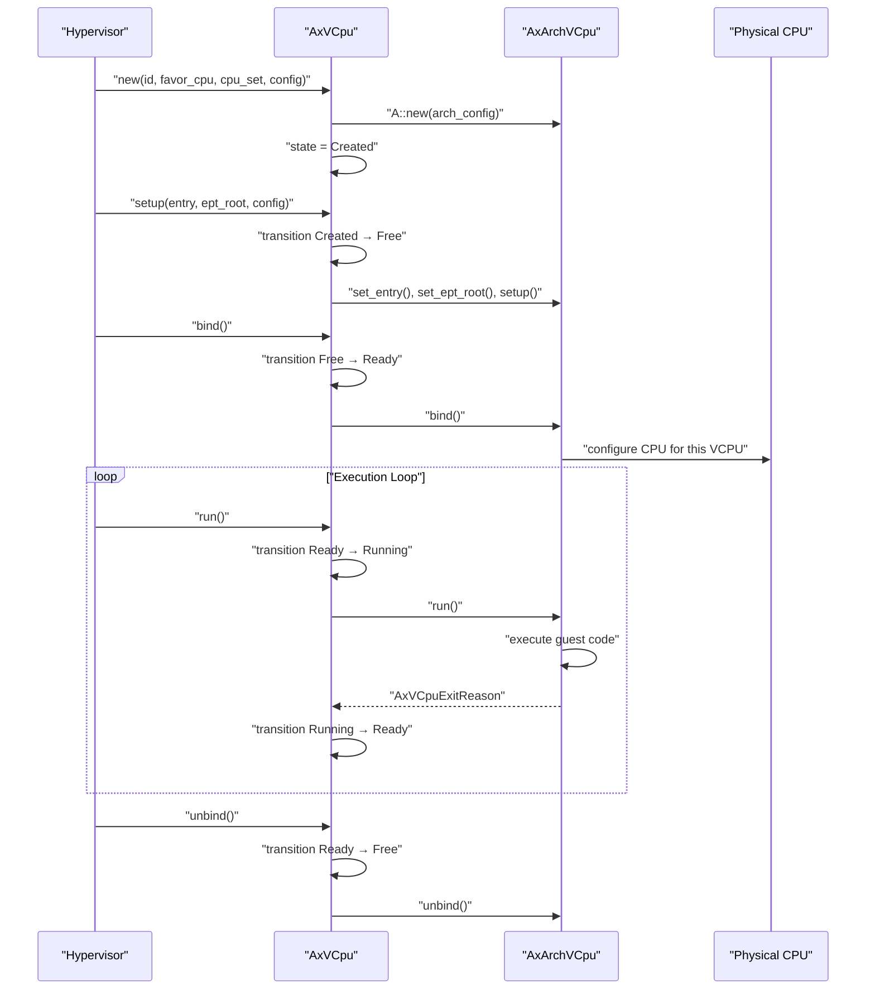
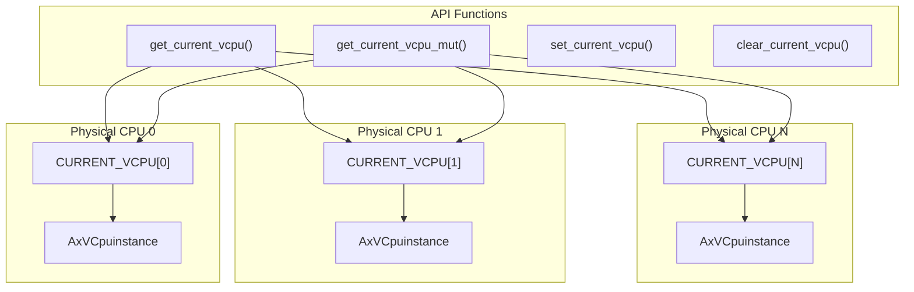
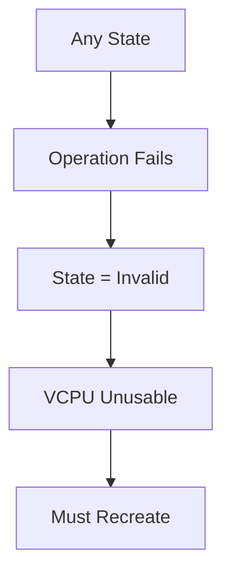

# VCPU State Machine and Lifecycle

> **Relevant source files**
> * [src/vcpu.rs](https://github.com/arceos-hypervisor/axvcpu/blob/34fc1067/src/vcpu.rs)

This document covers the state machine and lifecycle management of virtual CPUs in the axvcpu crate. It details the five-state VCPU model, state transition rules, lifecycle operations, and the per-CPU current VCPU tracking mechanism. For architecture-specific VCPU implementations, see [Architecture Abstraction Layer](/arceos-hypervisor/axvcpu/2.2-architecture-abstraction-layer). For VCPU exit handling during execution, see [Exit Handling System](/arceos-hypervisor/axvcpu/3-exit-handling-system).

## VCPU State Model

The `VCpuState` enum defines a five-state model that governs VCPU lifecycle management. Each state represents a distinct phase in the VCPU's existence and determines which operations are permitted.

```

```

### State Definitions

|State|Value|Description|
| --- | --- | --- |
|Invalid|0|Error state indicating the VCPU is unusable|
|Created|1|VCPU exists but requires setup before use|
|Free|2|VCPU is configured and can be bound to a physical CPU|
|Ready|3|VCPU is bound to a physical CPU and ready to execute|
|Running|4|VCPU is actively executing guest code|
|Blocked|5|VCPU is temporarily blocked (currently unused)|

Sources: [src/vcpu.rs(L20 - L35)&emsp;](https://github.com/arceos-hypervisor/axvcpu/blob/34fc1067/src/vcpu.rs#L20-L35)

## State Transition Management

The `AxVCpu` struct enforces strict state transition rules through the `with_state_transition` method, which atomically checks the current state and transitions to a new state only if the precondition is met.



### State Transition Methods

The VCPU provides several methods for managing state transitions:

* `with_state_transition()` - Core method that atomically checks current state and transitions if valid
* `transition_state()` - Simple state transition without executing additional operations
* `manipulate_arch_vcpu()` - Combines state transition with architecture-specific operations
* `unsafe set_state()` - Bypasses validation for emergency use

Sources: [src/vcpu.rs(L136 - L197)&emsp;](https://github.com/arceos-hypervisor/axvcpu/blob/34fc1067/src/vcpu.rs#L136-L197)

## VCPU Lifecycle Operations

The VCPU lifecycle consists of four main phases: creation, setup, binding, and execution. Each phase corresponds to specific state transitions and operations.



### Creation Phase

The `new()` method creates a VCPU instance with immutable configuration and initializes it in the `Created` state. The VCPU stores its ID, favored physical CPU, and CPU set restrictions.

### Setup Phase

The `setup()` method configures the VCPU with guest entry point, extended page table root, and architecture-specific settings, transitioning from `Created` to `Free` state.

### Binding Phase

The `bind()` method associates the VCPU with the current physical CPU, transitioning from `Free` to `Ready` state. This prepares the hardware for VCPU execution.

### Execution Phase

The `run()` method executes the VCPU, transitioning from `Ready` to `Running` and back to `Ready` upon VM exit. This phase handles guest code execution and exit processing.

Sources: [src/vcpu.rs(L66 - L225)&emsp;](https://github.com/arceos-hypervisor/axvcpu/blob/34fc1067/src/vcpu.rs#L66-L225)

## Current VCPU Management

The system maintains a per-CPU pointer to the currently active VCPU using the `CURRENT_VCPU` per-CPU variable. This enables architecture-specific code to access the containing `AxVCpu` instance.



### Current VCPU API

|Function|Purpose|
| --- | --- |
|get_current_vcpu<A>()|Returns immutable reference to current VCPU|
|get_current_vcpu_mut<A>()|Returns mutable reference to current VCPU|
|set_current_vcpu<A>()|Sets the current VCPU (unsafe)|
|clear_current_vcpu<A>()|Clears the current VCPU (unsafe)|

The `with_current_cpu_set()` method ensures proper setup and cleanup of the current VCPU context, preventing nested VCPU operations which could cause corruption.

Sources: [src/vcpu.rs(L238 - L290)&emsp;](https://github.com/arceos-hypervisor/axvcpu/blob/34fc1067/src/vcpu.rs#L238-L290)

## Error Handling and Invalid States

The state machine includes comprehensive error handling that transitions VCPUs to the `Invalid` state when errors occur. This prevents continued use of corrupted VCPU instances.

### Error Scenarios

* **State Mismatch**: Attempting operations in wrong state transitions to `Invalid`
* **Architecture Errors**: Failures in `AxArchVCpu` operations transition to `Invalid`
* **Nested Operations**: Attempting nested VCPU operations causes panic for safety
* **Setup Failures**: Errors during `setup()`, `bind()`, or `run()` transition to `Invalid`

### Recovery Strategy

Once a VCPU enters the `Invalid` state, it cannot be recovered and must be recreated. This fail-fast approach prevents cascade failures and maintains system integrity.



Sources: [src/vcpu.rs(L136 - L161)&emsp;](https://github.com/arceos-hypervisor/axvcpu/blob/34fc1067/src/vcpu.rs#L136-L161)