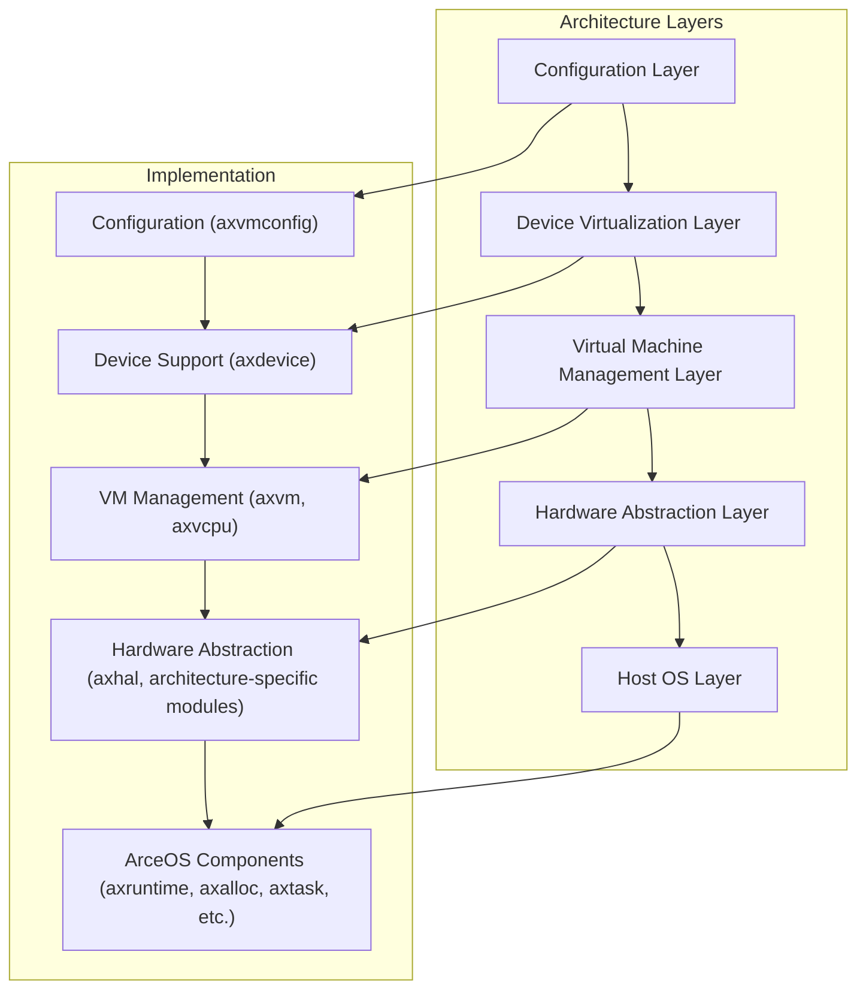
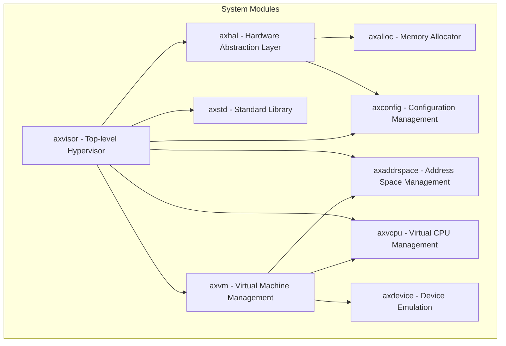
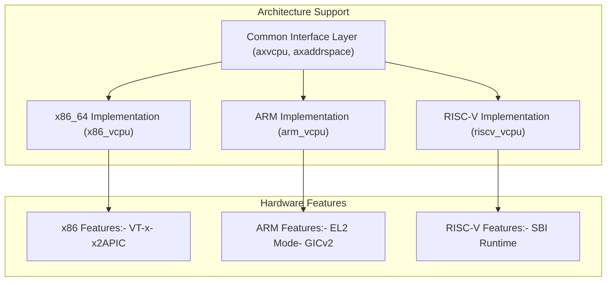
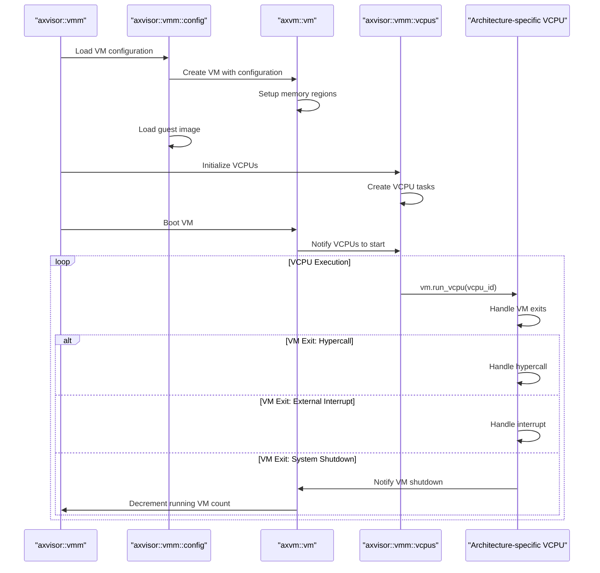
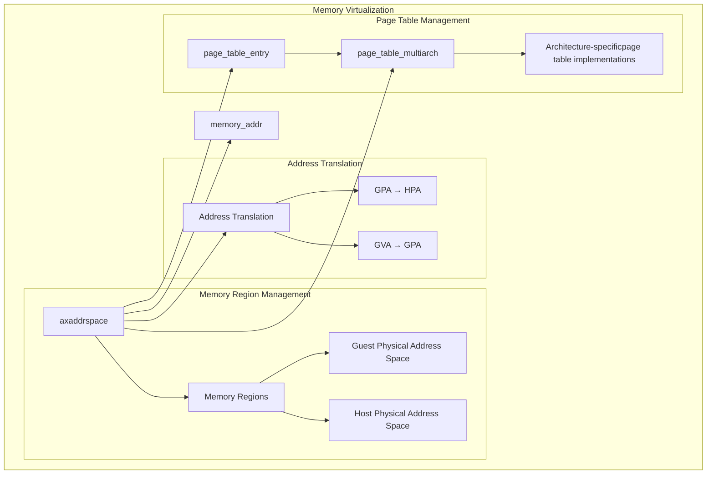
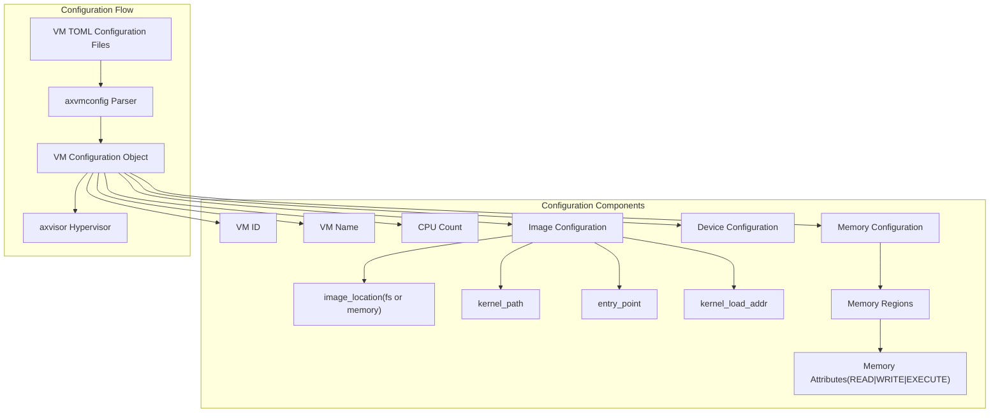

# Architecture

> **Relevant source files**
> * [Cargo.lock](https://github.com/arceos-hypervisor/axvisor/blob/0c9b89a5/Cargo.lock)
> * [Cargo.toml](https://github.com/arceos-hypervisor/axvisor/blob/0c9b89a5/Cargo.toml)
> * [README.md](https://github.com/arceos-hypervisor/axvisor/blob/0c9b89a5/README.md)

This page describes the core architectural design and principles of AxVisor, a unified modular hypervisor based on the ArceOS unikernel framework. It explains the high-level system structure, key components, and the relationships between them. For specific details on VM management, see [VM Management](/arceos-hypervisor/axvisor/2.2-vm-management), and for hardware abstraction details, see [Hardware Abstraction Layer](/arceos-hypervisor/axvisor/2.3-hardware-abstraction-layer).

## Architectural Overview

AxVisor is designed as a modular hypervisor with a layered architecture that achieves two primary goals:

1. **Unification**: Using a single codebase to support multiple architectures (x86_64, ARM/aarch64, and RISC-V)
2. **Modularity**: Decomposing hypervisor functionality into distinct modules that communicate through well-defined interfaces

The hypervisor is built on top of the ArceOS unikernel framework, which provides essential OS functionality like task scheduling, memory management, and interrupt handling.

Sources: [README.md(L29 - L36)&emsp;](https://github.com/arceos-hypervisor/axvisor/blob/0c9b89a5/README.md#L29-L36)

## Core Modules and Their Relationships

AxVisor is composed of several key modules, each with specific responsibilities:

The **key relationships** between these modules:

|Module|Primary Responsibility|Dependencies|
| --- | --- | --- |
|axvisor|Top-level hypervisor implementation|axvm,axhal,axvcpu,axaddrspace,axconfig|
|axvm|Virtual machine lifecycle management|axvcpu,axaddrspace,axdevice|
|axhal|Hardware abstraction for different architectures|axalloc,axconfig|
|axvcpu|Virtual CPU creation and execution|axaddrspace|
|axaddrspace|Memory virtualization and address space management|memory_addr,page_table_entry,page_table_multiarch|
|axdevice|Device emulation and passthrough|axaddrspace|

Sources: [Cargo.toml(L15 - L46)&emsp;](https://github.com/arceos-hypervisor/axvisor/blob/0c9b89a5/Cargo.toml#L15-L46)

## Cross-Architecture Implementation

One of AxVisor's key features is its unified architecture approach. The system uses a common interface for architecture-independent code, with architecture-specific implementations provided through separate modules.

This architecture allows AxVisor to:

* Share common virtualization logic across architectures
* Isolate architecture-specific implementation details
* Add new architecture support without changing core functionality

Sources: [Cargo.toml(L35 - L37)&emsp;](https://github.com/arceos-hypervisor/axvisor/blob/0c9b89a5/Cargo.toml#L35-L37) [Cargo.toml(L41 - L46)&emsp;](https://github.com/arceos-hypervisor/axvisor/blob/0c9b89a5/Cargo.toml#L41-L46)

## Virtualization Flow

The core virtualization process in AxVisor follows these key steps:

This execution model enables AxVisor to:

1. Load guest operating systems from either filesystem or memory
2. Manage VM execution through architecture-specific VCPU implementations
3. Handle various virtualization events through the VM exit mechanism

Sources: [README.md(L99 - L112)&emsp;](https://github.com/arceos-hypervisor/axvisor/blob/0c9b89a5/README.md#L99-L112) [README.md(L159 - L201)&emsp;](https://github.com/arceos-hypervisor/axvisor/blob/0c9b89a5/README.md#L159-L201)

## Memory Management Architecture

Memory virtualization in AxVisor is built around the `axaddrspace` module, which provides memory region management and address translation services.

Key features of the memory management architecture:

* Separation of address spaces between host and guest
* Architecture-independent memory region management
* Architecture-specific page table implementations
* Two-stage address translation (Guest Virtual → Guest Physical → Host Physical)

Sources: [Cargo.toml(L37)&emsp;](https://github.com/arceos-hypervisor/axvisor/blob/0c9b89a5/Cargo.toml#L37-L37) [Cargo.toml(L42 - L44)&emsp;](https://github.com/arceos-hypervisor/axvisor/blob/0c9b89a5/Cargo.toml#L42-L44)

## Configuration System

AxVisor uses a robust configuration system based on TOML files to define VM properties and behavior:

The configuration system enables:

* Declarative definition of VM properties
* Flexible image loading from filesystem or memory
* Consistent VM configuration across different architectures
* Separation of configuration from implementation logic

Sources: [README.md(L72 - L75)&emsp;](https://github.com/arceos-hypervisor/axvisor/blob/0c9b89a5/README.md#L72-L75) [Cargo.toml(L48 - L52)&emsp;](https://github.com/arceos-hypervisor/axvisor/blob/0c9b89a5/Cargo.toml#L48-L52)

## Multi-Guest Support

AxVisor is designed to support multiple guest operating systems simultaneously:

|Guest OS|Supported Architectures|Features|
| --- | --- | --- |
|ArceOS|x86_64, ARM, RISC-V|Full virtualization support|
|NimbOS|x86_64, ARM, RISC-V|Full virtualization support|
|Linux|ARM (aarch64)|Single-core and SMP with passthrough devices|
|Starry-OS|x86_64|Full virtualization support|

The multi-guest architecture enables:

* Testing of different operating systems on the same hypervisor
* Comparison of performance across different guest types
* Development and debugging of guest-specific virtualization features

Sources: [README.md(L45 - L56)&emsp;](https://github.com/arceos-hypervisor/axvisor/blob/0c9b89a5/README.md#L45-L56)

## Conclusion

AxVisor's architecture follows key design principles that enable it to provide a unified hypervisor solution across multiple hardware architectures:

1. **Layered Design**: Clear separation of concerns through a well-defined layering pattern
2. **Modular Structure**: Functionality divided into well-defined modules with clear interfaces
3. **Architecture Independence**: Separation of architecture-specific code from common functionality
4. **Configuration-Driven**: Extensive use of configuration files for flexible deployment
5. **Flexible Guest Support**: Support for multiple guest operating systems and image loading methods

This design enables AxVisor to maintain a single codebase while supporting diverse hardware platforms and guest operating systems, making it an adaptable and maintainable hypervisor solution.

Sources: [README.md(L21 - L28)&emsp;](https://github.com/arceos-hypervisor/axvisor/blob/0c9b89a5/README.md#L21-L28) [README.md(L29 - L36)&emsp;](https://github.com/arceos-hypervisor/axvisor/blob/0c9b89a5/README.md#L29-L36)