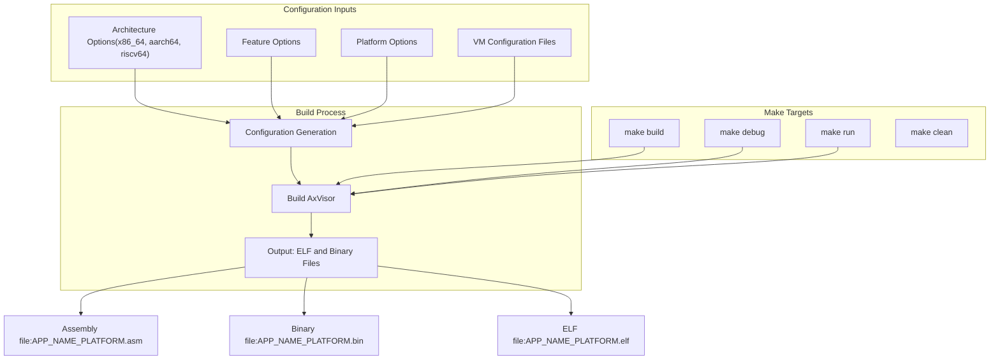
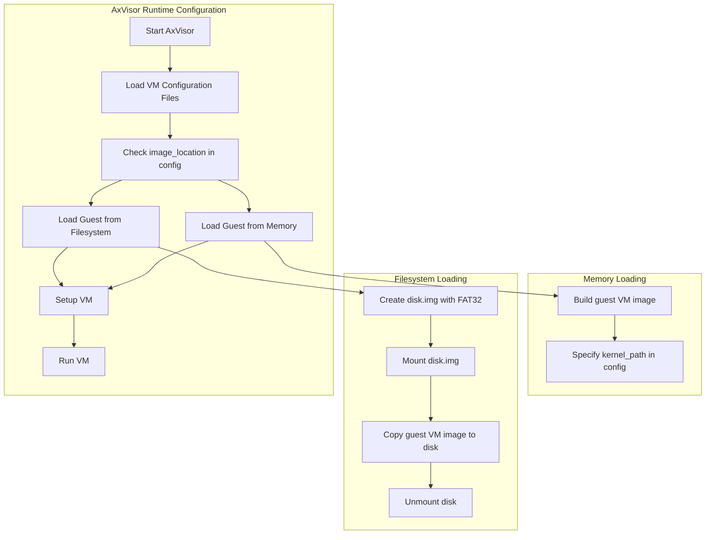

# Building and Running

> **Relevant source files**
> * [.github/workflows/REMOTE-CI.md](https://github.com/arceos-hypervisor/axvisor/blob/0c9b89a5/.github/workflows/REMOTE-CI.md)
> * [.github/workflows/actions/setup-qemu/action.yml](https://github.com/arceos-hypervisor/axvisor/blob/0c9b89a5/.github/workflows/actions/setup-qemu/action.yml)
> * [.gitignore](https://github.com/arceos-hypervisor/axvisor/blob/0c9b89a5/.gitignore)
> * [Makefile](https://github.com/arceos-hypervisor/axvisor/blob/0c9b89a5/Makefile)
> * [README.md](https://github.com/arceos-hypervisor/axvisor/blob/0c9b89a5/README.md)
> * [doc/GuestVMs.md](https://github.com/arceos-hypervisor/axvisor/blob/0c9b89a5/doc/GuestVMs.md)
> * [tool/dev_env.py](https://github.com/arceos-hypervisor/axvisor/blob/0c9b89a5/tool/dev_env.py)

This document provides detailed instructions on how to build AxVisor from source and run it with different guest virtual machines. For information about VM configuration options, see [Configuration](/arceos-hypervisor/axvisor/3-configuration).

## Prerequisites

Before building and running AxVisor, you need to set up your development environment with the following tools:

* Rust development environment
* cargo-binutils
* QEMU (for testing)
* Optional: musl-gcc (for building guest applications)

```
$ cargo install cargo-binutils
```

Sources: [README.md(L64 - L68)&emsp;](https://github.com/arceos-hypervisor/axvisor/blob/0c9b89a5/README.md#L64-L68)

## Setting up the Development Environment

### Automated Setup

AxVisor provides a Python script that automates the process of cloning dependent repositories and configuring the development environment.

```
$ python tool/dev_env.py
```

This script will:

1. Create a `crates` directory
2. Clone all required repositories
3. Patch your Cargo.toml file
4. Set up VSCode settings (if applicable)

You can specify a different repository URL using the `--repo` argument:

```
$ python tool/dev_env.py --repo https://github.com/your-fork/arceos-hypervisor
```

Sources: [tool/dev_env.py(L1 - L106)&emsp;](https://github.com/arceos-hypervisor/axvisor/blob/0c9b89a5/tool/dev_env.py#L1-L106)

## Build System Overview

### Build Process Diagram



Sources: [Makefile(L1 - L151)&emsp;](https://github.com/arceos-hypervisor/axvisor/blob/0c9b89a5/Makefile#L1-L151) [README.md(L57 - L59)&emsp;](https://github.com/arceos-hypervisor/axvisor/blob/0c9b89a5/README.md#L57-L59)

## Building AxVisor

AxVisor uses a Makefile-based build system with numerous configuration options. The basic build command is:

```
$ make ARCH=<architecture> VM_CONFIGS=<config_path> build
```

### Key Build Options

|Option|Description|Example Values|
| --- | --- | --- |
|ARCH|Target architecture|x86_64, aarch64, riscv64|
|PLATFORM|Target platform|aarch64-qemu-virt-hv|
|SMP|Number of CPUs|1, 2, 4, etc.|
|MODE|Build mode|release, debug|
|LOG|Logging level|warn, error, info, debug, trace|
|VM_CONFIGS|Path to VM configuration files|configs/vms/arceos-aarch64.toml|
|FEATURES|Features to enable|fs|
|APP_FEATURES|App-specific features|fs|
|MEM|Memory size|128M, 4G|

Sources: [Makefile(L4 - L32)&emsp;](https://github.com/arceos-hypervisor/axvisor/blob/0c9b89a5/Makefile#L4-L32) [README.md(L57 - L59)&emsp;](https://github.com/arceos-hypervisor/axvisor/blob/0c9b89a5/README.md#L57-L59)

### Example Build Commands

Build for aarch64 architecture with specific VM configurations:

```
$ make ARCH=aarch64 VM_CONFIGS=configs/vms/arceos-aarch64.toml build
```

Build with filesystem support:

```
$ make ARCH=aarch64 VM_CONFIGS=configs/vms/arceos-aarch64.toml APP_FEATURES=fs build
```

Sources: [README.md(L99 - L112)&emsp;](https://github.com/arceos-hypervisor/axvisor/blob/0c9b89a5/README.md#L99-L112)

## Running AxVisor

After building AxVisor, you can run it using QEMU. AxVisor supports two methods for loading guest VM images:

1. Loading from a filesystem
2. Loading from memory (statically compiled)

### Runtime Configuration Diagram



Sources: [README.md(L59 - L112)&emsp;](https://github.com/arceos-hypervisor/axvisor/blob/0c9b89a5/README.md#L59-L112)

### Loading and Running from Filesystem

1. Build a guest VM image for your architecture
2. Create a disk image and place the guest VM image into it:

```markdown
$ make disk_img               # Creates an empty FAT32 disk image
$ mkdir -p tmp
$ sudo mount disk.img tmp
$ sudo cp /PATH/TO/YOUR/GUEST/VM/IMAGE tmp/
$ sudo umount tmp
```

1. Modify the VM configuration file in `configs/vms/<ARCH_CONFIG>.toml`:

* Set `image_location="fs"`
* Set `kernel_path` to the path of the kernel image in the filesystem
* Set `entry_point` to the entry address of the kernel image
* Set `kernel_load_addr` to the loading address of the kernel image
2. Run AxVisor with the configured guest VM:

```
$ make ACCEL=n ARCH=aarch64 LOG=info VM_CONFIGS=configs/vms/arceos-aarch64.toml APP_FEATURES=fs run
```

Sources: [README.md(L76 - L99)&emsp;](https://github.com/arceos-hypervisor/axvisor/blob/0c9b89a5/README.md#L76-L99)

### Loading and Running from Memory

1. Build a guest VM image for your architecture
2. Modify the VM configuration file in `configs/vms/<ARCH_CONFIG>.toml`:

* Set `image_location="memory"`
* Set `kernel_path` to the relative/absolute path of the kernel image in the workspace
* Set `entry_point` to the entry address of the kernel image
* Set `kernel_load_addr` to the loading address of the kernel image
3. Run AxVisor with the configured guest VM:

```
$ make ACCEL=n ARCH=aarch64 LOG=info VM_CONFIGS=configs/vms/arceos-aarch64.toml run
```

Sources: [README.md(L101 - L112)&emsp;](https://github.com/arceos-hypervisor/axvisor/blob/0c9b89a5/README.md#L101-L112)

## Guest VM Support

AxVisor has been verified to work with the following guest operating systems:

|Guest OS|Architecture|Features|Configuration Template|
| --- | --- | --- | --- |
|ArceOS|x86_64, aarch64, riscv64|SMP support|configs/vms/arceos-*.toml|
|Starry-OS|x86_64, aarch64, riscv64|-|-|
|NimbOS|x86_64, aarch64, riscv64|Single-core only|configs/vms/nimbos-*.toml|
|Linux|aarch64|Passthrough device|configs/vms/linux-qemu-aarch64.toml|

Sources: [README.md(L45 - L56)&emsp;](https://github.com/arceos-hypervisor/axvisor/blob/0c9b89a5/README.md#L45-L56) [doc/GuestVMs.md(L1 - L56)&emsp;](https://github.com/arceos-hypervisor/axvisor/blob/0c9b89a5/doc/GuestVMs.md#L1-L56)

## Hardware Platform Support

AxVisor has been verified on the following platforms:

* QEMU ARM64 virt (qemu-max)
* Rockchip RK3568 / RK3588
* 黑芝麻华山 A1000 (Black Sesame A1000)

Sources: [README.md(L37 - L44)&emsp;](https://github.com/arceos-hypervisor/axvisor/blob/0c9b89a5/README.md#L37-L44)

## Debugging

AxVisor provides several targets for debugging:

1. To build and run the system with debugging support:

```
$ make ARCH=<architecture> VM_CONFIGS=<config_path> debug
```

1. To attach GDB to a running instance:

```
$ make gdb
```

This will connect GDB to the running QEMU instance and set a breakpoint at the `rust_entry` function.

Sources: [Makefile(L175 - L182)&emsp;](https://github.com/arceos-hypervisor/axvisor/blob/0c9b89a5/Makefile#L175-L182)

## Troubleshooting and Development

### Common Issues

* Make sure your QEMU version is up-to-date
* For hardware acceleration, ensure KVM is enabled on your system
* VM configuration paths must be correctly specified

### CI/CD Environment

The project uses GitHub Actions for continuous integration and testing. The CI setup includes:

* Testing on multiple architectures (x86_64, aarch64, riscv64)
* Setting up QEMU with necessary configurations
* Remote testing for hardware-specific features

For more information about the remote CI setup, see [.github/workflows/REMOTE-CI.md](https://github.com/arceos-hypervisor/axvisor/blob/0c9b89a5/.github/workflows/REMOTE-CI.md)

Sources: [.github/workflows/actions/setup-qemu/action.yml(L1 - L48)&emsp;](https://github.com/arceos-hypervisor/axvisor/blob/0c9b89a5/.github/workflows/actions/setup-qemu/action.yml#L1-L48) [.github/workflows/REMOTE-CI.md(L1 - L50)&emsp;](https://github.com/arceos-hypervisor/axvisor/blob/0c9b89a5/.github/workflows/REMOTE-CI.md#L1-L50)

## Advanced Configuration

For advanced configuration needs, including detailed VM settings, passthrough devices, and architecture-specific options, refer to [VM Configuration](/arceos-hypervisor/axvisor/3.1-vm-configuration) and [Platform-Specific Configuration](/arceos-hypervisor/axvisor/3.2-platform-specific-configuration).