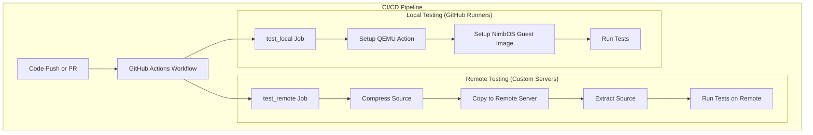
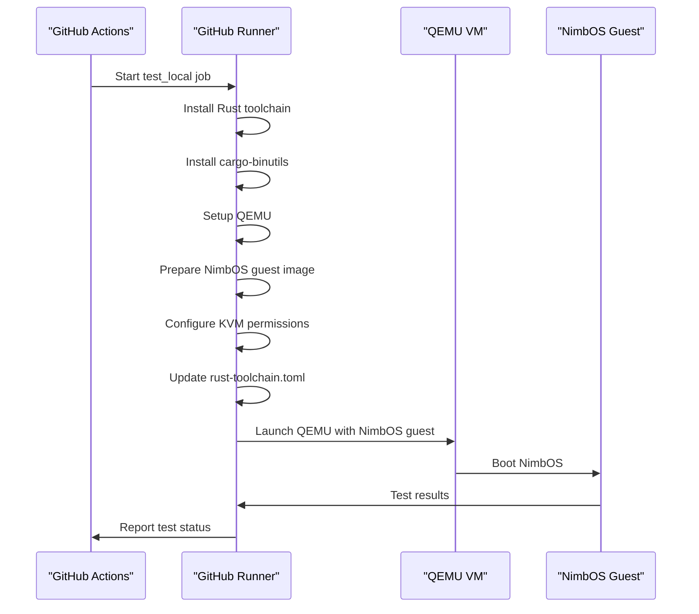
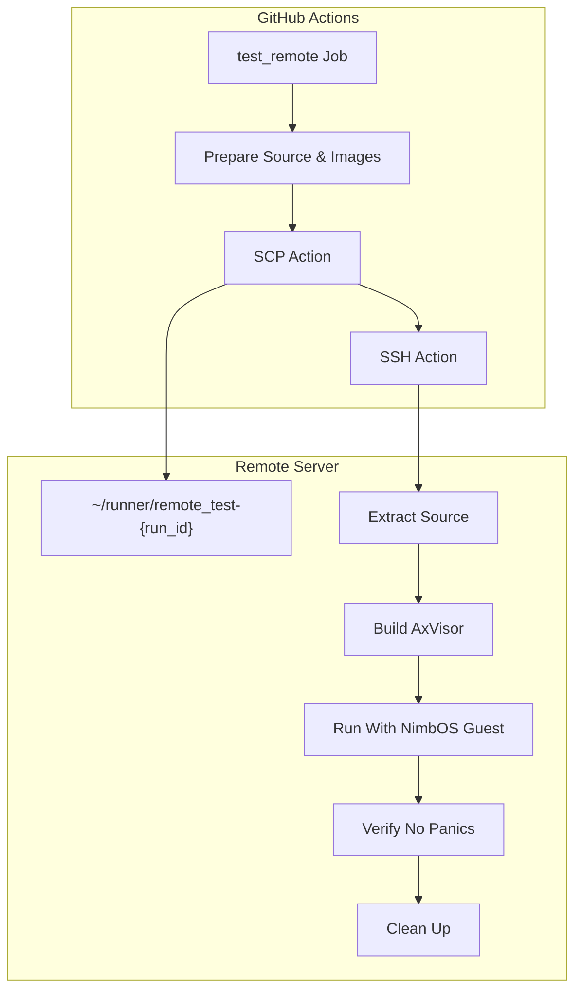
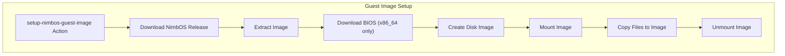
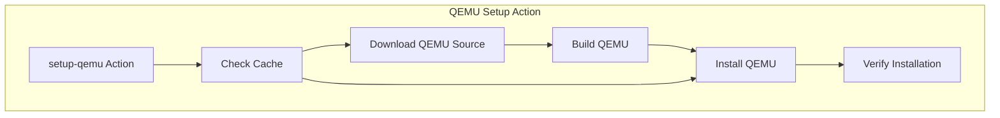
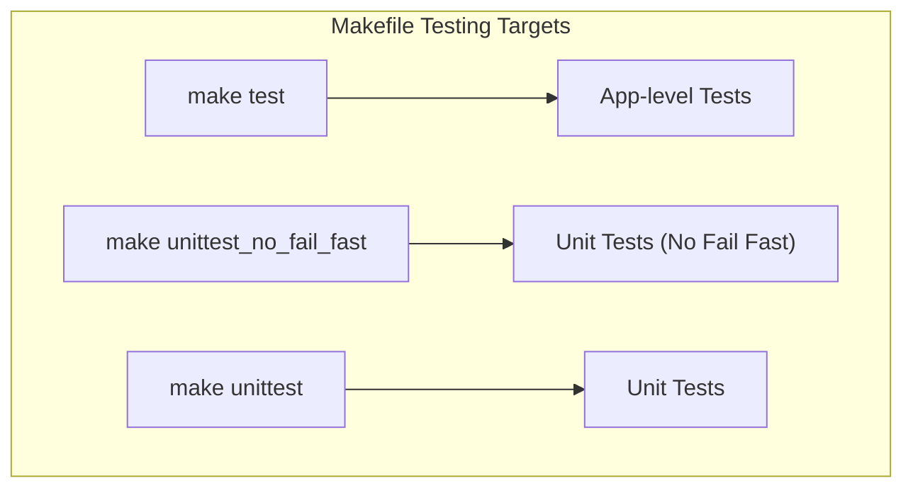
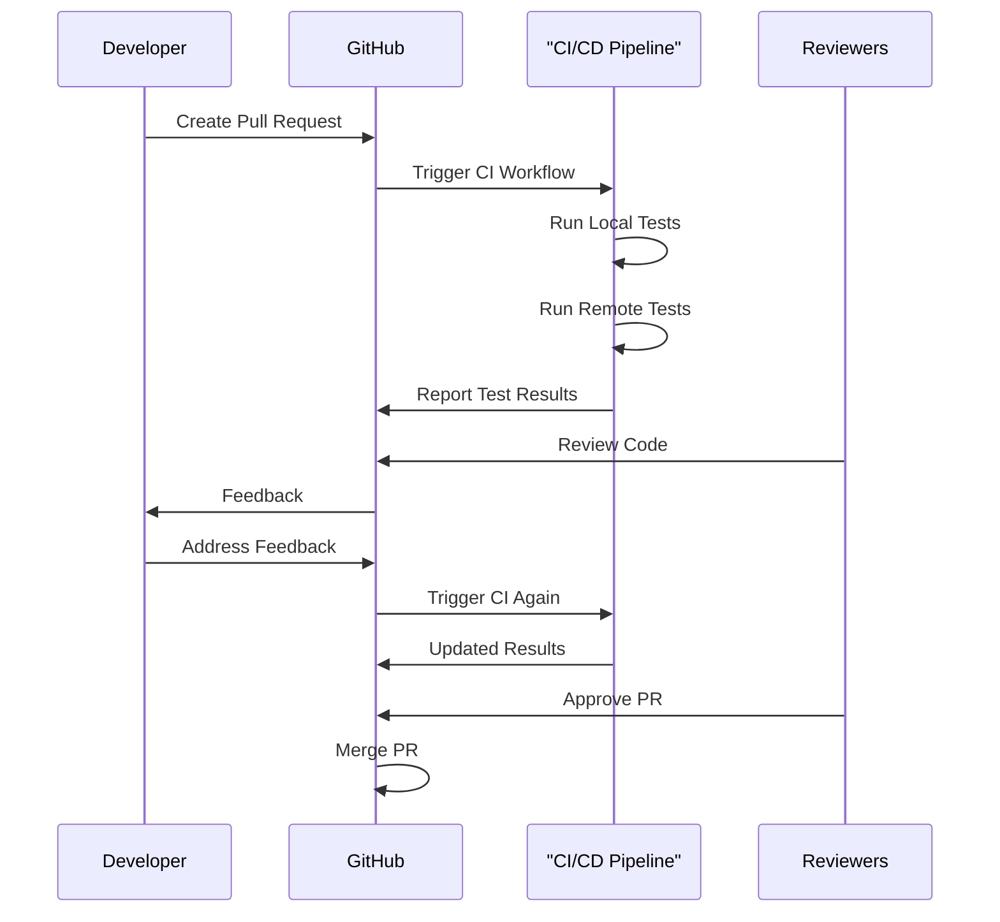

# CI/CD Pipeline

> **Relevant source files**
> * [.github/workflows/REMOTE-CI.md](https://github.com/arceos-hypervisor/axvisor/blob/0c9b89a5/.github/workflows/REMOTE-CI.md)
> * [.github/workflows/actions/setup-nimbos-guest-image/action.yml](https://github.com/arceos-hypervisor/axvisor/blob/0c9b89a5/.github/workflows/actions/setup-nimbos-guest-image/action.yml)
> * [.github/workflows/actions/setup-qemu/action.yml](https://github.com/arceos-hypervisor/axvisor/blob/0c9b89a5/.github/workflows/actions/setup-qemu/action.yml)
> * [.github/workflows/test.yml](https://github.com/arceos-hypervisor/axvisor/blob/0c9b89a5/.github/workflows/test.yml)
> * [Makefile](https://github.com/arceos-hypervisor/axvisor/blob/0c9b89a5/Makefile)

This page documents the Continuous Integration and Continuous Deployment (CI/CD) pipeline used by the AxVisor hypervisor project. The pipeline handles automated building, testing, and verification across multiple architectures (x86_64, aarch64, riscv64) and environments to ensure the hypervisor operates correctly on various platforms.

For information about the testing infrastructure and methodology, see [Testing Infrastructure](/arceos-hypervisor/axvisor/6.1-testing-infrastructure).

## Overview of the CI/CD Pipeline

The AxVisor CI/CD pipeline is implemented using GitHub Actions and consists of two main testing strategies:

1. **Local Testing**: Tests run directly on GitHub-hosted runners
2. **Remote Testing**: Tests run on remote machines for hardware-specific testing (particularly for Intel VT-x)

The pipeline automatically triggers on both push events and pull requests, ensuring all code changes are verified before merging.



Sources: [.github/workflows/test.yml(L1 - L150)&emsp;](https://github.com/arceos-hypervisor/axvisor/blob/0c9b89a5/.github/workflows/test.yml#L1-L150)

## Local Testing Process

Local testing runs on GitHub-hosted runners with multiple architecture and Rust toolchain configurations. This testing strategy covers non-hardware-specific features and ensures compatibility across architectures.

### Configuration Matrix

The local testing strategy uses a configuration matrix to test multiple combinations:

|Architecture|Rust Toolchain|
| --- | --- |
|riscv64|nightly-2024-12-25|
|riscv64|nightly|
|aarch64|nightly-2024-12-25|
|aarch64|nightly|

### Local Testing Workflow



Sources: [.github/workflows/test.yml(L10 - L50)&emsp;](https://github.com/arceos-hypervisor/axvisor/blob/0c9b89a5/.github/workflows/test.yml#L10-L50) [.github/workflows/actions/setup-qemu/action.yml(L1 - L48)&emsp;](https://github.com/arceos-hypervisor/axvisor/blob/0c9b89a5/.github/workflows/actions/setup-qemu/action.yml#L1-L48) [.github/workflows/actions/setup-nimbos-guest-image/action.yml(L1 - L71)&emsp;](https://github.com/arceos-hypervisor/axvisor/blob/0c9b89a5/.github/workflows/actions/setup-nimbos-guest-image/action.yml#L1-L71)

## Remote Testing Process

Remote testing is used specifically for hardware-dependent features (such as Intel VT-x virtualization) that cannot be properly tested on GitHub's AMD-based runners. This is essential for AxVisor as a hypervisor project that requires specific CPU virtualization features.

### Remote Testing Architecture



Sources: [.github/workflows/test.yml(L52 - L150)&emsp;](https://github.com/arceos-hypervisor/axvisor/blob/0c9b89a5/.github/workflows/test.yml#L52-L150) [.github/workflows/REMOTE-CI.md(L1 - L50)&emsp;](https://github.com/arceos-hypervisor/axvisor/blob/0c9b89a5/.github/workflows/REMOTE-CI.md#L1-L50)

### Remote Server Configuration

Remote testing currently uses two server configurations:

|Server ID|Purpose|
| --- | --- |
|remote_aarkegz|Intel CPU for VT-x testing|
|remote_x10dri|Additional Intel platform|

Credentials and connection details for these servers are stored as GitHub secrets and accessed securely during the workflow execution.

Sources: [.github/workflows/test.yml(L59 - L70)&emsp;](https://github.com/arceos-hypervisor/axvisor/blob/0c9b89a5/.github/workflows/test.yml#L59-L70)

## Guest VM Testing System

AxVisor is tested with real guest VMs to verify its functionality as a hypervisor. The primary guest OS used for testing is NimbOS, which is lightweight and designed specifically for testing purposes.

### Guest Image Preparation Process



Sources: [.github/workflows/actions/setup-nimbos-guest-image/action.yml(L1 - L71)&emsp;](https://github.com/arceos-hypervisor/axvisor/blob/0c9b89a5/.github/workflows/actions/setup-nimbos-guest-image/action.yml#L1-L71)

### Guest Testing Configuration

The testing configuration for guest VMs includes:

* **Disk Image**: A FAT32 filesystem image containing the guest OS
* **Virtual Hardware**: Configured through QEMU with appropriate architecture-specific settings
* **VM Configuration**: Loaded from `configs/vms/nimbos-{arch}.toml` files

Sources: [.github/workflows/test.yml(L47 - L50)&emsp;](https://github.com/arceos-hypervisor/axvisor/blob/0c9b89a5/.github/workflows/test.yml#L47-L50) [.github/workflows/test.yml(L134)&emsp;](https://github.com/arceos-hypervisor/axvisor/blob/0c9b89a5/.github/workflows/test.yml#L134-L134)

## QEMU Setup and Integration

QEMU is the virtualization platform used for testing AxVisor. A custom GitHub Action is used to set up QEMU with the required configurations.

### QEMU Installation Process



Sources: [.github/workflows/actions/setup-qemu/action.yml(L1 - L48)&emsp;](https://github.com/arceos-hypervisor/axvisor/blob/0c9b89a5/.github/workflows/actions/setup-qemu/action.yml#L1-L48)

### QEMU Configuration

The QEMU setup configures several architecture-specific system emulators:

* `qemu-system-x86_64` for x86_64 architecture
* `qemu-system-aarch64` for ARM/aarch64 architecture
* `qemu-system-riscv64` for RISC-V architecture

Each emulator is built with slirp networking support and appropriate target configurations.

Sources: [.github/workflows/actions/setup-qemu/action.yml(L28 - L31)&emsp;](https://github.com/arceos-hypervisor/axvisor/blob/0c9b89a5/.github/workflows/actions/setup-qemu/action.yml#L28-L31) [.github/workflows/actions/setup-qemu/action.yml(L42 - L47)&emsp;](https://github.com/arceos-hypervisor/axvisor/blob/0c9b89a5/.github/workflows/actions/setup-qemu/action.yml#L42-L47)

## Integration with Makefile Test Targets

The CI/CD pipeline integrates with the project's Makefile test targets to execute tests within both local and remote environments.

### Makefile Testing Commands



Sources: [Makefile(L203 - L210)&emsp;](https://github.com/arceos-hypervisor/axvisor/blob/0c9b89a5/Makefile#L203-L210)

### CI Testing Execution

In the CI/CD pipeline, tests are executed using a specific command that includes several parameters:

```
make ARCH={arch} DISK_IMG={disk_img} LOG=info BLK=y ACCEL={accel} VM_CONFIGS={vm_configs} APP_FEATURES=fs run
```

This command configures:

* The target architecture
* The disk image path
* Logging level
* Block device support
* Hardware acceleration (KVM on x86_64)
* VM configuration files
* Additional features

Sources: [.github/workflows/test.yml(L49 - L50)&emsp;](https://github.com/arceos-hypervisor/axvisor/blob/0c9b89a5/.github/workflows/test.yml#L49-L50) [.github/workflows/test.yml(L134)&emsp;](https://github.com/arceos-hypervisor/axvisor/blob/0c9b89a5/.github/workflows/test.yml#L134-L134)

## Development Workflow Integration

The CI/CD pipeline is integrated into the development workflow to provide automated testing and verification for all code changes.

### Pull Request Workflow



## Multi-Architecture Support

The CI/CD pipeline is designed to test AxVisor across multiple CPU architectures to ensure broad compatibility.

### Architecture Matrix

The pipeline supports testing on three key architectures:

|Architecture|Local Testing|Remote Testing|Virtualization Technology|
| --- | --- | --- | --- |
|x86_64|No|Yes|Intel VT-x|
|aarch64|Yes|No|ARM Virtualization Extensions|
|riscv64|Yes|No|RISC-V H-Extension|

Sources: [.github/workflows/test.yml(L16)&emsp;](https://github.com/arceos-hypervisor/axvisor/blob/0c9b89a5/.github/workflows/test.yml#L16-L16) [.github/workflows/test.yml(L57)&emsp;](https://github.com/arceos-hypervisor/axvisor/blob/0c9b89a5/.github/workflows/test.yml#L57-L57)

## Future Improvements

Based on the documentation, several potential improvements to the CI/CD pipeline are planned:

1. **Better Tool Integration**: Using the `act` tool to run CI tests more consistently
2. **Improved SSH Tooling**: Finding better alternatives to the current SSH action tools
3. **Enhanced Caching**: Implementing more efficient caching strategies for QEMU and other environments
4. **Automated Environment Setup**: Creating automated setup for remote testing environments
5. **Additional Hardware Resources**: Acquiring more stable and powerful servers for remote testing

Sources: [.github/workflows/REMOTE-CI.md(L40 - L49)&emsp;](https://github.com/arceos-hypervisor/axvisor/blob/0c9b89a5/.github/workflows/REMOTE-CI.md#L40-L49)