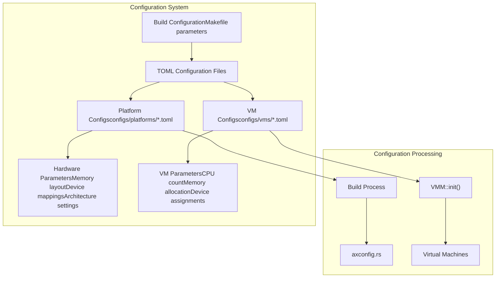
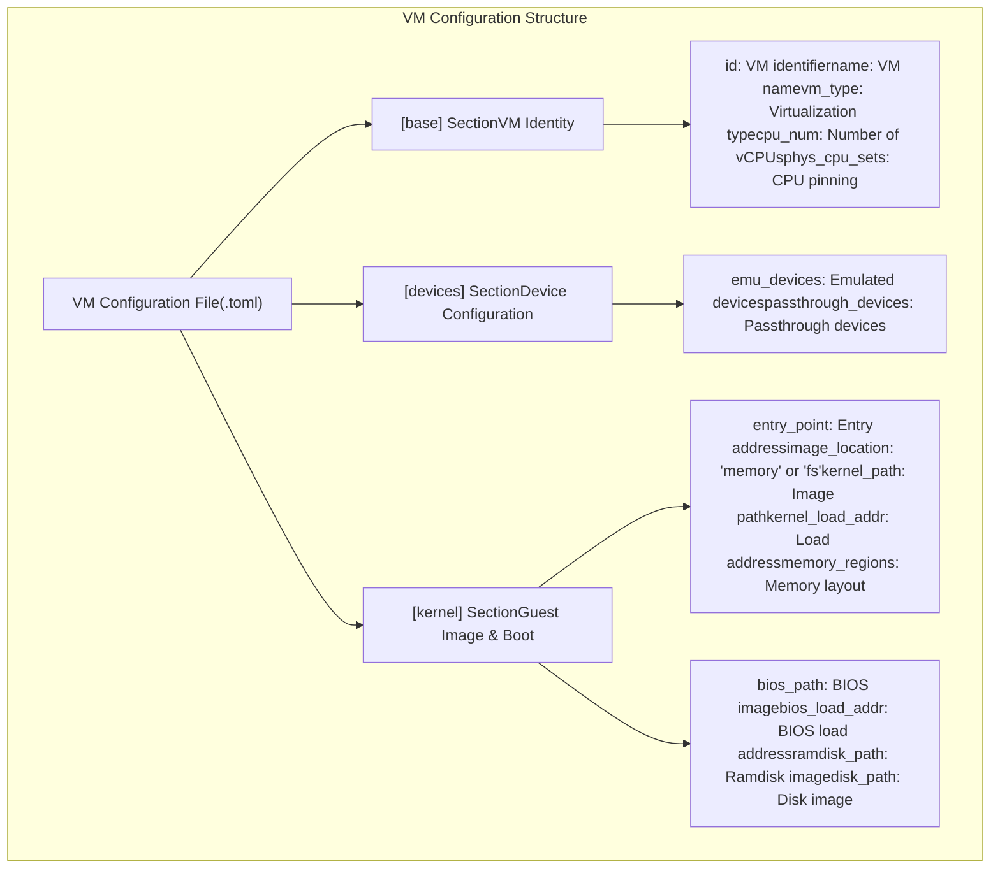
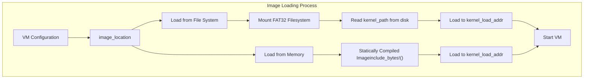

# Configuration

> **Relevant source files**
> * [Cargo.toml](https://github.com/arceos-hypervisor/axvisor/blob/0c9b89a5/Cargo.toml)
> * [README.md](https://github.com/arceos-hypervisor/axvisor/blob/0c9b89a5/README.md)
> * [configs/platforms/x86_64-qemu-q35.toml](https://github.com/arceos-hypervisor/axvisor/blob/0c9b89a5/configs/platforms/x86_64-qemu-q35.toml)
> * [configs/vms/arceos-x86_64.toml](https://github.com/arceos-hypervisor/axvisor/blob/0c9b89a5/configs/vms/arceos-x86_64.toml)
> * [configs/vms/nimbos-x86_64.toml](https://github.com/arceos-hypervisor/axvisor/blob/0c9b89a5/configs/vms/nimbos-x86_64.toml)
> * [scripts/lds/linker.lds.S](https://github.com/arceos-hypervisor/axvisor/blob/0c9b89a5/scripts/lds/linker.lds.S)
> * [src/vmm/timer.rs](https://github.com/arceos-hypervisor/axvisor/blob/0c9b89a5/src/vmm/timer.rs)

This document describes the configuration system used by AxVisor. Configuration files define essential parameters for both the hypervisor and the virtual machines it manages. This page covers the structure and format of configuration files, how they are processed, and the available configuration options. For specific VM configuration details, see [VM Configuration](/arceos-hypervisor/axvisor/3.1-vm-configuration).

## Overview of Configuration System

AxVisor uses TOML files for configuration, which provide a clear and human-readable format for defining hypervisor and virtual machine parameters. Two primary types of configuration files exist:

1. **Platform Configurations** - Define hardware-specific settings for the target platform
2. **VM Configurations** - Define settings for individual virtual machines

These configuration files are processed during the build process and at runtime to initialize the hypervisor and its virtual machines.



Sources: [README.md(L71 - L74)&emsp;](https://github.com/arceos-hypervisor/axvisor/blob/0c9b89a5/README.md#L71-L74) [README.md(L77 - L79)&emsp;](https://github.com/arceos-hypervisor/axvisor/blob/0c9b89a5/README.md#L77-L79)

## Configuration File Structure

### Platform Configuration Files

Platform configuration files define the hardware-specific settings for the target platform. These files are located in the `configs/platforms/` directory with filenames that correspond to the platform, such as `x86_64-qemu-q35.toml`.

A platform configuration file has the following main sections:

|Section|Purpose|
| --- | --- |
|Top-level|Architecture and platform identifiers|
|[plat]|Memory layout, address spaces, and offsets|
|[devices]|Device mappings, MMIO regions, and hardware configuration|

Example platform configuration excerpt:

```markdown
# Architecture identifier
arch = "x86_64"
# Platform identifier
platform = "x86_64-qemu-q35"

[plat]
# Base virtual address of the kernel image
kernel-base-vaddr = "0xffff_8000_0020_0000"
# Linear mapping offset
phys-virt-offset = "0xffff_8000_0000_0000"

[devices]
# MMIO regions with format (`base_paddr`, `size`)
mmio-regions = [
    [0xfec0_0000, 0x1000],      # IO APIC
    [0xfed0_0000, 0x1000],      # HPET
    [0xfee0_0000, 0x1000],      # Local APIC
]
```

Sources: [configs/platforms/x86_64-qemu-q35.toml(L1 - L54)&emsp;](https://github.com/arceos-hypervisor/axvisor/blob/0c9b89a5/configs/platforms/x86_64-qemu-q35.toml#L1-L54)

### VM Configuration Files

VM configuration files define the properties of individual virtual machines that will be managed by AxVisor. These files are located in the `configs/vms/` directory with names like `arceos-x86_64.toml`.

A VM configuration file contains these main sections:

|Section|Purpose|
| --- | --- |
|[base]|Basic VM information (ID, name, type, CPU count)|
|[kernel]|Kernel image details and loading parameters|
|[devices]|Device specifications (emulated and passthrough devices)|

Example VM configuration excerpt:

```markdown
[base]
# Guest VM ID
id = 1
# Guest VM name
name = "arceos"
# Virtualization type
vm_type = 1
# The number of virtual CPUs
cpu_num = 1

[kernel]
# The entry point of the kernel image
entry_point = 0x8000
# The location of image: "memory" | "fs"
image_location = "fs"
# The file path of the kernel image
kernel_path = "arceos-x86_64.bin"
# The load address of the kernel image
kernel_load_addr = 0x20_0000
```

Sources: [configs/vms/arceos-x86_64.toml(L1 - L37)&emsp;](https://github.com/arceos-hypervisor/axvisor/blob/0c9b89a5/configs/vms/arceos-x86_64.toml#L1-L37) [configs/vms/nimbos-x86_64.toml(L1 - L39)&emsp;](https://github.com/arceos-hypervisor/axvisor/blob/0c9b89a5/configs/vms/nimbos-x86_64.toml#L1-L39)

## VM Configuration Options

The VM configuration file contains multiple sections that control various aspects of the virtual machine. Here's a detailed breakdown of the available options:



Sources: [configs/vms/arceos-x86_64.toml(L1 - L78)&emsp;](https://github.com/arceos-hypervisor/axvisor/blob/0c9b89a5/configs/vms/arceos-x86_64.toml#L1-L78) [configs/vms/nimbos-x86_64.toml(L1 - L78)&emsp;](https://github.com/arceos-hypervisor/axvisor/blob/0c9b89a5/configs/vms/nimbos-x86_64.toml#L1-L78)

### Base Section

The `[base]` section defines the core identity and properties of the VM:

|Option|Description|Example|
| --- | --- | --- |
|id|Unique identifier for the VM|id = 1|
|name|Human-readable name for the VM|name = "arceos"|
|vm_type|Type of virtualization|vm_type = 1|
|cpu_num|Number of virtual CPUs|cpu_num = 1|
|phys_cpu_sets|Physical CPU pinning|phys_cpu_sets = [1]|

### Kernel Section

The `[kernel]` section defines how the guest kernel is loaded and executed:

|Option|Description|Example|
| --- | --- | --- |
|entry_point|Entry point address of the kernel|entry_point = 0x8000|
|image_location|Source location for guest image ("memory" or "fs")|image_location = "fs"|
|kernel_path|Path to the kernel image file|kernel_path = "arceos-x86_64.bin"|
|kernel_load_addr|Physical address to load the kernel|kernel_load_addr = 0x20_0000|
|bios_path|Path to the BIOS image file (optional)|bios_path = "axvm-bios.bin"|
|bios_load_addr|Address to load the BIOS (optional)|bios_load_addr = 0x8000|
|ramdisk_path|Path to the ramdisk image (optional)|ramdisk_path = "ramdisk.img"|
|ramdisk_load_addr|Address to load the ramdisk (optional)|ramdisk_load_addr = 0x1000_0000|
|disk_path|Path to the disk image (optional)|disk_path = "disk.img"|
|memory_regions|Memory regions with format (base_paddr,size,flags,map_type)|memory_regions = [[0x0, 0x100_0000, 0x7, 0]]|

### Devices Section

The `[devices]` section defines the virtual and passthrough devices for the VM:

|Option|Description|Format|
| --- | --- | --- |
|emu_devices|Emulated devices|[Name, Base-Ipa, Ipa_len, Alloc-Irq, Emu-Type, EmuConfig]|
|passthrough_devices|Passthrough devices|[Name, Base-Ipa, Base-Pa, Length, Alloc-Irq]|

Example passthrough device entry:

```
passthrough_devices = [
    [
        "IO APIC",
        0xfec0_0000,
        0xfec0_0000,
        0x1000,
        0x1,
    ]
]
```

Sources: [configs/vms/arceos-x86_64.toml(L50 - L78)&emsp;](https://github.com/arceos-hypervisor/axvisor/blob/0c9b89a5/configs/vms/arceos-x86_64.toml#L50-L78) [configs/vms/nimbos-x86_64.toml(L50 - L78)&emsp;](https://github.com/arceos-hypervisor/axvisor/blob/0c9b89a5/configs/vms/nimbos-x86_64.toml#L50-L78)

## Image Loading Methods

AxVisor supports two methods for loading guest VM images:

1. **File System Loading (`image_location = "fs"`)**:

* Loads the guest image from a FAT32 file system
* Requires setting up a disk image file with the guest image(s)
* Used when the guest images need to be changed without rebuilding the hypervisor
2. **Memory Loading (`image_location = "memory"`)**:

* Loads the guest image from memory, bound to the hypervisor through static compilation
* Uses `include_bytes!` to include the image in the hypervisor binary
* Useful for embedded scenarios or when the guest image is fixed



Sources: [README.md(L78 - L112)&emsp;](https://github.com/arceos-hypervisor/axvisor/blob/0c9b89a5/README.md#L78-L112)

## Build Configuration

The build configuration controls how AxVisor is compiled and which features are enabled. The primary method for configuring the build is through the `make` command and its parameters.

Key build parameters include:

|Parameter|Description|Example|
| --- | --- | --- |
|ARCH|Target architecture|ARCH=aarch64|
|LOG|Log level|LOG=info|
|VM_CONFIGS|Path to VM configuration file(s)|VM_CONFIGS=configs/vms/arceos-aarch64.toml|
|ACCEL|Enable hardware acceleration|ACCEL=n|
|APP_FEATURES|Additional features|APP_FEATURES=fs|

Example build command:

```
make ACCEL=n ARCH=aarch64 LOG=info VM_CONFIGS=configs/vms/arceos-aarch64.toml APP_FEATURES=fs run
```

Additionally, build-time dependencies are declared in `Cargo.toml`, including the TOML parser and configuration tools:

```css
[build-dependencies]
toml = { git = "https://github.com/arceos-hypervisor/toml.git", branch = "no_std" }
axconfig = { git = "https://github.com/arceos-hypervisor/arceos.git", branch = "vmm" }
```

Sources: [Cargo.toml(L47 - L52)&emsp;](https://github.com/arceos-hypervisor/axvisor/blob/0c9b89a5/Cargo.toml#L47-L52) [README.md(L112 - L113)&emsp;](https://github.com/arceos-hypervisor/axvisor/blob/0c9b89a5/README.md#L112-L113)

## Configuration Processing

Configuration files are processed both at build time and at runtime:

1. **Build-time Processing**:

* Platform configurations are processed during the build
* Generate architecture-specific code based on the platform configuration
* Set up memory layouts and device mappings
2. **Runtime Processing**:

* VM configurations are processed when AxVisor starts
* The VMM (Virtual Machine Manager) reads and applies VM configurations
* Creates VM instances according to the configuration

The configuration files are parsed using a TOML parser adapted for use in a no_std environment. The parsed configuration is then used to initialize various components of the hypervisor.

For example, timer configuration parameters are used to set up the timer subsystem:

```javascript
// Timer interrupt frequency is configured in the platform configuration
const PERIODIC_INTERVAL_NANOS: u64 = axhal::time::NANOS_PER_SEC / axconfig::TICKS_PER_SEC as u64;
```

Sources: [src/vmm/timer.rs(L12 - L13)&emsp;](https://github.com/arceos-hypervisor/axvisor/blob/0c9b89a5/src/vmm/timer.rs#L12-L13)

## Configuration Tools

AxVisor provides additional tools to help with configuration:

1. **axvmconfig**: A tool for generating VM configuration files

* Simplifies the process of creating complex VM configurations
* Provides validation of configuration parameters
2. **dev_env.py**: A script for setting up the development environment

* Helps localize relevant crates for development and debugging
* Makes it easier to work with the modular components of AxVisor

Sources: [README.md(L77 - L79)&emsp;](https://github.com/arceos-hypervisor/axvisor/blob/0c9b89a5/README.md#L77-L79) [README.md(L210 - L214)&emsp;](https://github.com/arceos-hypervisor/axvisor/blob/0c9b89a5/README.md#L210-L214)

## Conclusion

AxVisor's configuration system provides a flexible and powerful way to define both the hypervisor platform and the virtual machines it manages. By using TOML files, the configuration is human-readable and easy to modify. The separation between platform and VM configurations allows for a modular approach, where the same hypervisor build can host different VMs without requiring recompilation.

Understanding the configuration options is essential for successfully deploying AxVisor and managing virtual machines with different requirements and characteristics.