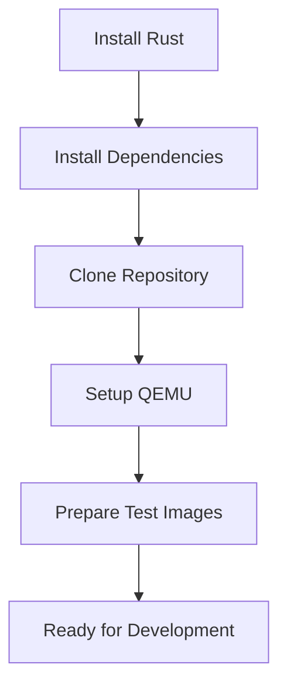
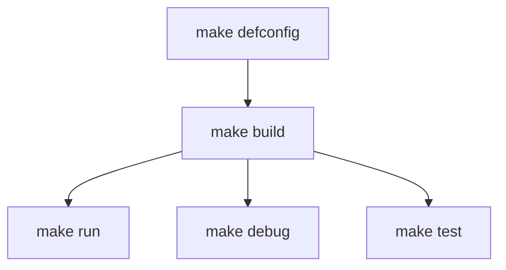
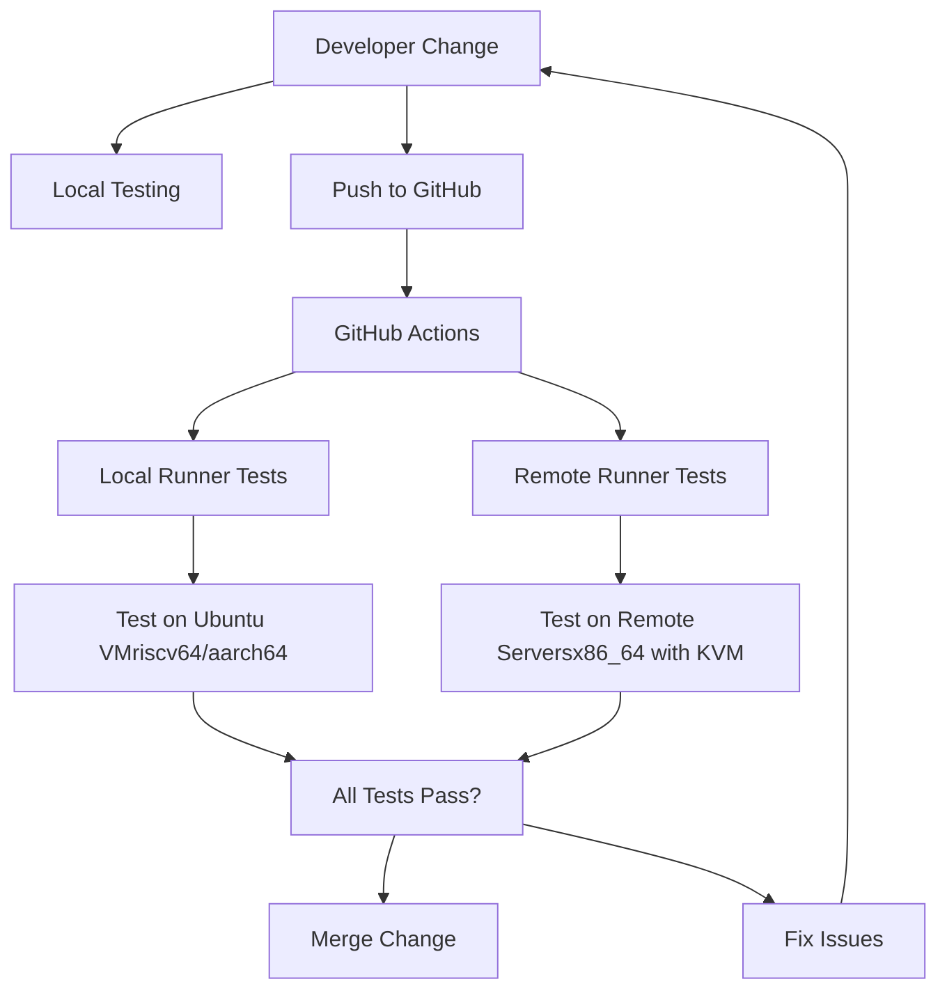
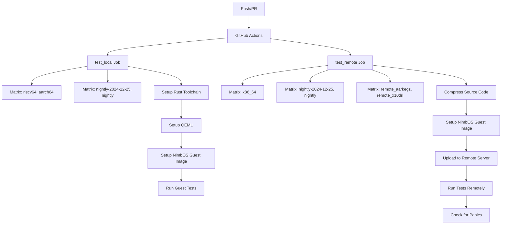
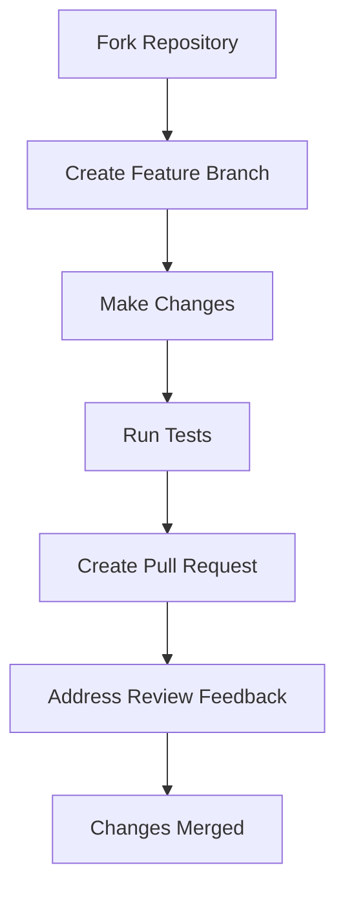
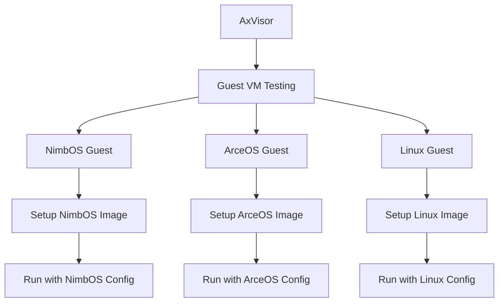

# Contributing

> **Relevant source files**
> * [.github/workflows/REMOTE-CI.md](https://github.com/arceos-hypervisor/axvisor/blob/0c9b89a5/.github/workflows/REMOTE-CI.md)
> * [.github/workflows/actions/setup-nimbos-guest-image/action.yml](https://github.com/arceos-hypervisor/axvisor/blob/0c9b89a5/.github/workflows/actions/setup-nimbos-guest-image/action.yml)
> * [.github/workflows/actions/setup-qemu/action.yml](https://github.com/arceos-hypervisor/axvisor/blob/0c9b89a5/.github/workflows/actions/setup-qemu/action.yml)
> * [.github/workflows/test.yml](https://github.com/arceos-hypervisor/axvisor/blob/0c9b89a5/.github/workflows/test.yml)
> * [Makefile](https://github.com/arceos-hypervisor/axvisor/blob/0c9b89a5/Makefile)

This document provides information and guidelines for contributing to the AxVisor project. It covers setting up a development environment, building and testing your changes, and understanding the CI/CD pipeline. For information about specific technical implementations, please refer to the [Technical Reference](/arceos-hypervisor/axvisor/5-technical-reference) section.

## Development Environment Setup

To begin contributing to AxVisor, you'll need to set up a proper development environment with the necessary tools and dependencies.

### Prerequisites

* Rust toolchain (nightly version, specified in `rust-toolchain.toml`)
* QEMU (version 8.2.0 or later recommended)
* Required system packages (for Linux-based systems)
* Git

### Setting Up Your Environment



1. **Install Rust**:

```
curl --proto '=https' --tlsv1.2 -sSf https://sh.rustup.rs | sh
```
2. **Install Dependencies**:

```sql
sudo apt-get update && sudo apt-get install -y ninja-build libslirp-dev glib-2.0
```
3. **Clone Repository**:

```
git clone https://github.com/arceos-hypervisor/axvisor.git
cd axvisor
```
4. **Setup QEMU** (if not using the system version):

```markdown
# Download and build QEMU
wget https://download.qemu.org/qemu-8.2.0.tar.xz
tar -xJf qemu-8.2.0.tar.xz
cd qemu-8.2.0
./configure --target-list=x86_64-softmmu,riscv64-softmmu,aarch64-softmmu --enable-slirp
make -j
make install
```
5. **Prepare Test Images**:

```sql
# Create disk image for testing
make DISK_IMG=disk.img disk_img
```

Sources: [Makefile(L14 - L34)&emsp;](https://github.com/arceos-hypervisor/axvisor/blob/0c9b89a5/Makefile#L14-L34) [.github/workflows/actions/setup-qemu/action.yml(L1 - L48)&emsp;](https://github.com/arceos-hypervisor/axvisor/blob/0c9b89a5/.github/workflows/actions/setup-qemu/action.yml#L1-L48)

## Building and Running

AxVisor uses a Makefile system adapted from ArceOS to manage the build process, with a variety of options for different architectures and configurations.

### Build Options

Here are the key parameters you can configure when building AxVisor:

|Parameter|Description|Possible Values|
| --- | --- | --- |
|ARCH|Target architecture|x86_64,riscv64,aarch64|
|SMP|Number of CPUs|Any integer (default: 1)|
|MODE|Build mode|release,debug|
|LOG|Logging level|warn,error,info,debug,trace|
|FEATURES|Features to enable|Space-separated list of features|
|APP_FEATURES|App-specific features|Space-separated list of features|
|BLK|Enable storage devices|y,n|
|NET|Enable network devices|y,n|
|ACCEL|Enable hardware acceleration|y,n|

### Basic Build Commands



1. **Generate default configuration**:

```
make ARCH=x86_64 defconfig
```
2. **Build the project**:

```
make ARCH=x86_64 build
```
3. **Run in QEMU**:

```
make ARCH=x86_64 DISK_IMG=disk.img BLK=y ACCEL=y run
```
4. **Debug with GDB**:

```markdown
make ARCH=x86_64 debug
# In another terminal
make gdb
```

Sources: [Makefile(L34 - L117)&emsp;](https://github.com/arceos-hypervisor/axvisor/blob/0c9b89a5/Makefile#L34-L117) [Makefile(L164 - L183)&emsp;](https://github.com/arceos-hypervisor/axvisor/blob/0c9b89a5/Makefile#L164-L183)

## Testing Your Changes

AxVisor has a comprehensive testing infrastructure to verify that your changes work correctly across different architectures and configurations.

### Local Testing

Local testing can be performed on your development machine using the following commands:

1. **Run unit tests**:

```
make unittest
```
2. **Run with a guest VM**:

```sql
# Create disk image if not created yet
make DISK_IMG=disk.img disk_img

# Run with NimbOS as guest
make ARCH=x86_64 DISK_IMG=disk.img LOG=info BLK=y ACCEL=y \
  VM_CONFIGS=configs/vms/nimbos-x86_64.toml APP_FEATURES=fs run
```

### Testing Infrastructure

The testing infrastructure in AxVisor supports multiple architectures (x86_64, riscv64, aarch64) and can run both locally and remotely.



Sources: [.github/workflows/test.yml(L1 - L146)&emsp;](https://github.com/arceos-hypervisor/axvisor/blob/0c9b89a5/.github/workflows/test.yml#L1-L146) [Makefile(L203 - L210)&emsp;](https://github.com/arceos-hypervisor/axvisor/blob/0c9b89a5/Makefile#L203-L210)

## CI/CD Pipeline

AxVisor employs a comprehensive CI/CD pipeline implemented with GitHub Actions to ensure code quality and compatibility across different architectures.



### Local Runner Tests

The CI pipeline runs tests on GitHub-hosted runners for riscv64 and aarch64 architectures. These tests verify that AxVisor compiles and runs correctly on these architectures.

### Remote Runner Tests

For x86_64 architecture, which requires specific hardware features (Intel VT-x), the CI pipeline uses remote runners. These are custom servers with the necessary hardware that allows running AxVisor with hardware acceleration.

Sources: [.github/workflows/test.yml(L9 - L146)&emsp;](https://github.com/arceos-hypervisor/axvisor/blob/0c9b89a5/.github/workflows/test.yml#L9-L146) [.github/workflows/REMOTE-CI.md(L1 - L50)&emsp;](https://github.com/arceos-hypervisor/axvisor/blob/0c9b89a5/.github/workflows/REMOTE-CI.md#L1-L50)

## Contribution Guidelines

When contributing to AxVisor, please follow these guidelines to ensure your changes can be smoothly integrated.

### Code Style and Formatting

1. **Rust Code Formatting**:

```
cargo fmt --all
```
2. **Linting**:

```
make clippy
```
3. **Documentation**:

```
make doc
```

### Git Workflow



1. **Fork the Repository**: Create your own fork of the repository.
2. **Create a Feature Branch**: Create a branch for your feature or bugfix.
3. **Make Changes**: Implement your feature or fix.
4. **Run Tests**: Ensure all tests pass locally.
5. **Create a Pull Request**: Submit your changes for review.
6. **Address Review Feedback**: Make any requested changes.
7. **Changes Merged**: Once approved, your changes will be merged.

Sources: [Makefile(L184 - L202)&emsp;](https://github.com/arceos-hypervisor/axvisor/blob/0c9b89a5/Makefile#L184-L202)

## Testing Different Guest Operating Systems

AxVisor supports multiple guest operating systems, including NimbOS, ArceOS, Linux, and others. When testing your changes, it's important to verify that they work with the relevant guest OS.



### Setting Up Guest Images

1. **NimbOS Guest**:

```python
# The CI/CD pipeline uses this action to set up NimbOS
# You can download releases from the NimbOS repository
```
2. **Ubuntu Guest** (for Linux testing):

```
make DISK_IMG=ubuntu.img ubuntu_img
```

Sources: [.github/workflows/actions/setup-nimbos-guest-image/action.yml(L1 - L71)&emsp;](https://github.com/arceos-hypervisor/axvisor/blob/0c9b89a5/.github/workflows/actions/setup-nimbos-guest-image/action.yml#L1-L71) [Makefile(L219 - L224)&emsp;](https://github.com/arceos-hypervisor/axvisor/blob/0c9b89a5/Makefile#L219-L224)

## Remote Testing Infrastructure

If you need to test changes that require specific hardware features (like Intel VT-x for x86_64), you can use the remote testing infrastructure. This is particularly important for hypervisor development where architectural differences can impact functionality.

### Why Remote Testing is Needed

Remote testing allows testing on specific hardware configurations that may not be available in GitHub's runners. In particular:

* Testing Intel VT-x features
* Testing with high-end hardware
* Testing with specific hardware configurations

Sources: [.github/workflows/REMOTE-CI.md(L1 - L50)&emsp;](https://github.com/arceos-hypervisor/axvisor/blob/0c9b89a5/.github/workflows/REMOTE-CI.md#L1-L50)

This document provides an overview of how to contribute to AxVisor. For more specific information about components, please refer to other sections of the wiki.