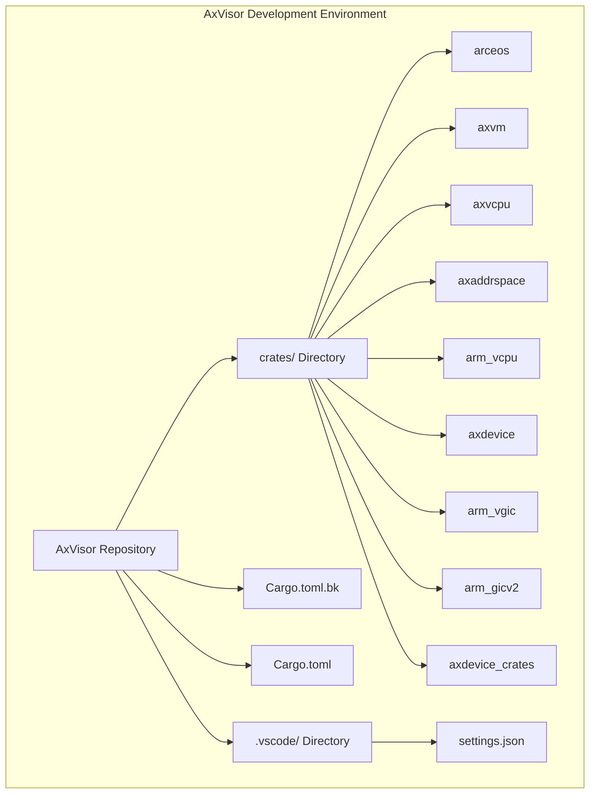
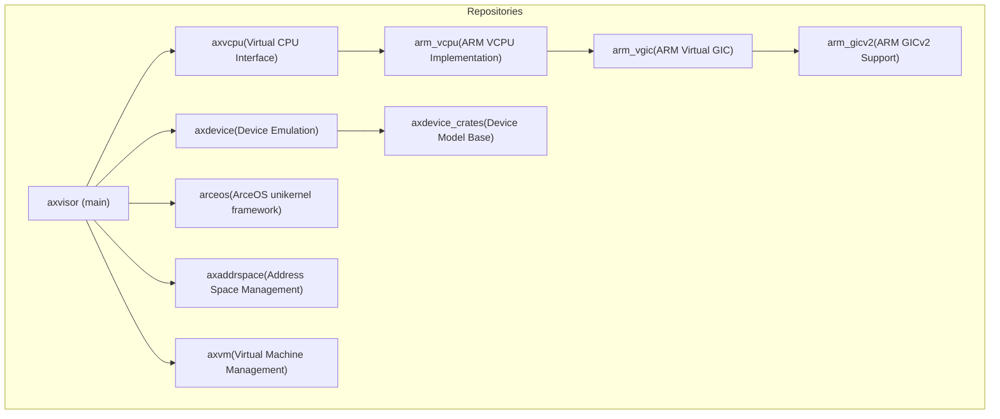
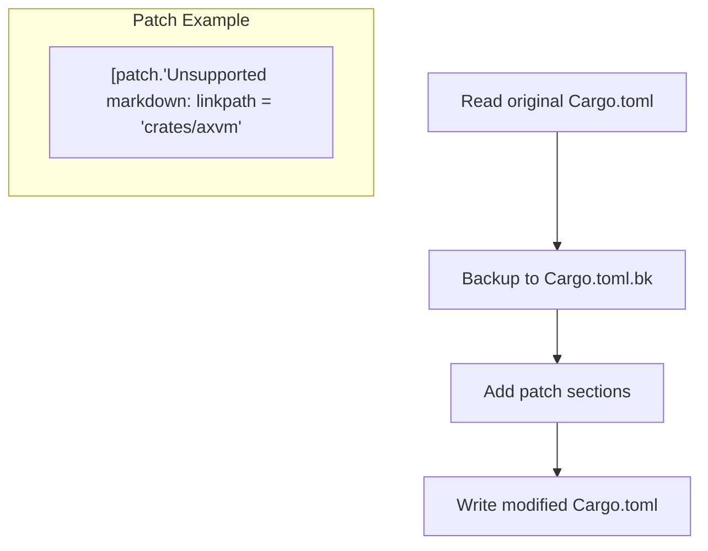
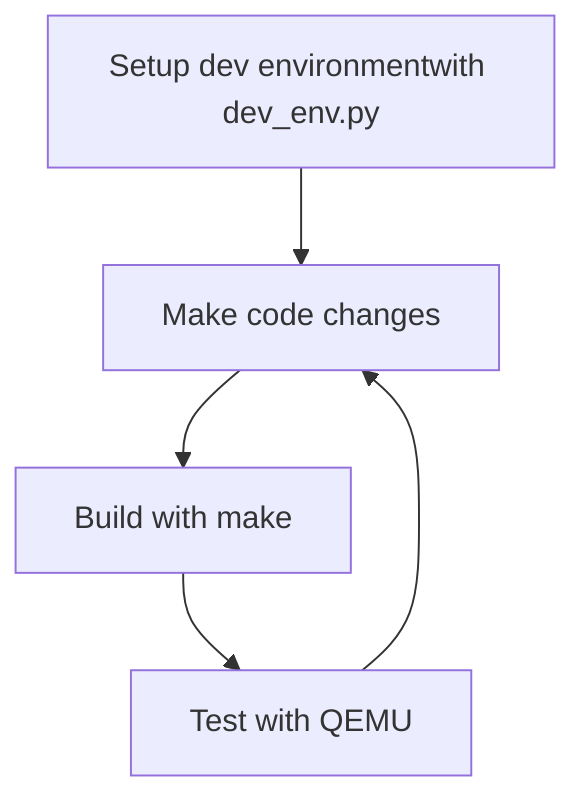

# Development Environment

> **Relevant source files**
> * [.gitignore](https://github.com/arceos-hypervisor/axvisor/blob/0c9b89a5/.gitignore)
> * [README.md](https://github.com/arceos-hypervisor/axvisor/blob/0c9b89a5/README.md)
> * [doc/GuestVMs.md](https://github.com/arceos-hypervisor/axvisor/blob/0c9b89a5/doc/GuestVMs.md)
> * [tool/dev_env.py](https://github.com/arceos-hypervisor/axvisor/blob/0c9b89a5/tool/dev_env.py)

This document outlines how to set up a development environment for AxVisor, a unified modular hypervisor based on ArceOS. It covers the necessary tools, dependencies, repository setup, and IDE configuration to effectively contribute to the project. For information about building and running AxVisor with guest VMs, see [Building and Running](/arceos-hypervisor/axvisor/4-building-and-running).

## Prerequisites

Before setting up the development environment for AxVisor, you need to install the following dependencies:

* **Rust Programming Language**: The core language used to develop AxVisor
* **cargo-binutils**: Required for tools like `rust-objcopy` and `rust-objdump`
* **musl-gcc** (Optional): Needed when building certain guest applications

### Installing Prerequisites

```python
# Install Rust (if not already installed)
curl --proto '=https' --tlsv1.2 -sSf https://sh.rustup.rs | sh

# Install cargo-binutils
cargo install cargo-binutils

# Install musl-gcc (optional)
# Download from http://musl.cc/x86_64-linux-musl-cross.tgz if needed
```

Sources: [README.md(L63 - L68)&emsp;](https://github.com/arceos-hypervisor/axvisor/blob/0c9b89a5/README.md#L63-L68)

## Development Environment Setup Script

AxVisor provides a Python script (`tool/dev_env.py`) to simplify the development environment setup. This script:

1. Clones required repositories
2. Patches Cargo.toml to use local dependencies
3. Creates IDE configuration for VS Code

### Development Environment Structure

The diagram below illustrates the structure created by the development environment setup:



Sources: [tool/dev_env.py(L1 - L106)&emsp;](https://github.com/arceos-hypervisor/axvisor/blob/0c9b89a5/tool/dev_env.py#L1-L106) [.gitignore(L20 - L21)&emsp;](https://github.com/arceos-hypervisor/axvisor/blob/0c9b89a5/.gitignore#L20-L21)

### Running the Setup Script

To set up the development environment, run:

```
python3 tool/dev_env.py
```

By default, the script clones repositories from `git@github.com:arceos-hypervisor`. You can specify a different repository base using the `--repo` parameter:

```
python3 tool/dev_env.py --repo https://github.com/arceos-hypervisor
```

Sources: [tool/dev_env.py(L7 - L25)&emsp;](https://github.com/arceos-hypervisor/axvisor/blob/0c9b89a5/tool/dev_env.py#L7-L25)

## Dependencies and Repository Structure

The following diagram shows the core dependencies that are cloned during the setup process and how they relate to the main AxVisor repository:



Sources: [tool/dev_env.py(L30 - L48)&emsp;](https://github.com/arceos-hypervisor/axvisor/blob/0c9b89a5/tool/dev_env.py#L30-L48)

## Cargo.toml Patching Process

The development environment script modifies the Cargo.toml file to use local paths for dependencies instead of fetching them from GitHub. This allows you to make changes to these dependencies locally and test them immediately.

The patching process works as follows:



The script adds patch sections for all dependencies, redirecting them to local paths in the `crates/` directory.

Sources: [tool/dev_env.py(L52 - L84)&emsp;](https://github.com/arceos-hypervisor/axvisor/blob/0c9b89a5/tool/dev_env.py#L52-L84)

## VS Code Configuration

The development environment script creates a `.vscode/settings.json` file with configuration for Rust Analyzer:

```css
{
    "rust-analyzer.cargo.target": "aarch64-unknown-none-softfloat",
    "rust-analyzer.check.allTargets": false,
    "rust-analyzer.cargo.features": ["fs"],
    "rust-analyzer.cargo.extraEnv": {
        "AX_CONFIG_PATH": "${workspaceFolder}/.axconfig.toml"
    }
}
```

This configuration:

* Sets the target architecture to `aarch64-unknown-none-softfloat`
* Enables the `fs` feature for Cargo
* Sets the `AX_CONFIG_PATH` environment variable for configuration

Sources: [tool/dev_env.py(L86 - L100)&emsp;](https://github.com/arceos-hypervisor/axvisor/blob/0c9b89a5/tool/dev_env.py#L86-L100)

## Development Workflow

Once your development environment is set up, you can start working on AxVisor:

1. Make changes to the code in the main repository or any of the dependencies in the `crates/` directory
2. Build and test using the Makefile commands as described in [Building and Running](/arceos-hypervisor/axvisor/4-building-and-running)
3. Use guest VM configurations from the `configs/vms/` directory for testing

### Typical Development Cycle



## Editing Dependency Code

With the development environment set up, you can edit code in any of the cloned repositories. Changes to dependencies will be immediately reflected when you build the main project, without needing to publish new versions of those dependencies.

Key directories to work with:

* `crates/arceos/`: The ArceOS unikernel framework
* `crates/axvm/`: Virtual machine management
* `crates/axvcpu/`: Virtual CPU interface
* `crates/axaddrspace/`: Address space management
* `crates/arm_vcpu/`: ARM VCPU implementation (when working on ARM support)

## Troubleshooting

### Common Issues

1. **Git clone failures**: Ensure you have proper SSH keys set up if using SSH URLs, or use HTTPS URLs with the `--repo` option.
2. **Rust compiler errors**: Ensure you have the correct Rust toolchain installed. You may need to run:

```
rustup target add aarch64-unknown-none-softfloat
```
3. **Build errors after pulling updates**: If updates to dependencies cause build errors, try running the setup script again to ensure all dependencies are in sync.

### Cleaning the Environment

If you need to reset your development environment:

1. Remove the `crates/` directory:

```
rm -rf crates/
```
2. Restore the original Cargo.toml:

```
mv Cargo.toml.bk Cargo.toml
```
3. Run the setup script again:

```
python3 tool/dev_env.py
```

Sources: [.gitignore(L20 - L21)&emsp;](https://github.com/arceos-hypervisor/axvisor/blob/0c9b89a5/.gitignore#L20-L21)

## Next Steps

After setting up your development environment, you can proceed to:

* Learn more about the [AxVisor Architecture](/arceos-hypervisor/axvisor/2-architecture)
* Configure [Guest VMs](/arceos-hypervisor/axvisor/4.1-guest-vms)
* Contribute to the project by following the [Contributing](/arceos-hypervisor/axvisor/6-contributing) guidelines