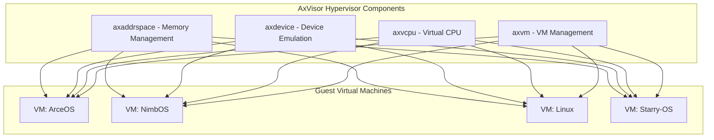
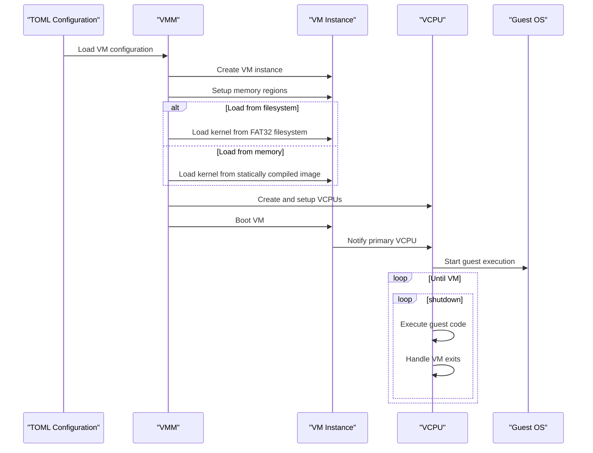
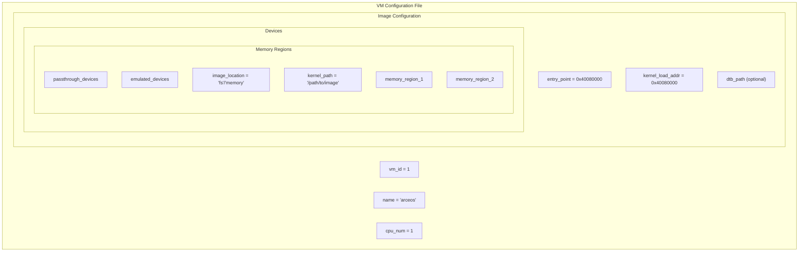

# Guest VMs

> **Relevant source files**
> * [.gitignore](https://github.com/arceos-hypervisor/axvisor/blob/0c9b89a5/.gitignore)
> * [README.md](https://github.com/arceos-hypervisor/axvisor/blob/0c9b89a5/README.md)
> * [doc/GuestVMs.md](https://github.com/arceos-hypervisor/axvisor/blob/0c9b89a5/doc/GuestVMs.md)
> * [tool/dev_env.py](https://github.com/arceos-hypervisor/axvisor/blob/0c9b89a5/tool/dev_env.py)

This page documents the guest operating systems supported by AxVisor, how to configure them, and methods for loading and running guest VM images. For information about setting up the development environment for AxVisor itself, see [Development Environment](/arceos-hypervisor/axvisor/4.2-development-environment).

## Overview of Supported Guest VMs

AxVisor currently supports running the following operating systems as guest VMs:

|Guest OS|Architecture Support|Features|Use Case|
| --- | --- | --- | --- |
|ArceOS|x86_64, aarch64, riscv64|SMP, Hypercalls|SMP testing, General purpose|
|NimbOS|x86_64, aarch64, riscv64|Simple RTOS|Single-core testing|
|Starry-OS|x86_64, aarch64|Educational OS|Educational purposes|
|Linux|aarch64|Passthrough devices|Production workloads|

Sources: [README.md(L46 - L55)&emsp;](https://github.com/arceos-hypervisor/axvisor/blob/0c9b89a5/README.md#L46-L55) [doc/GuestVMs.md(L1 - L13)&emsp;](https://github.com/arceos-hypervisor/axvisor/blob/0c9b89a5/doc/GuestVMs.md#L1-L13)

## Guest VM Architecture

### Relationship Between AxVisor and Guest VMs



Sources: [README.md(L30 - L36)&emsp;](https://github.com/arceos-hypervisor/axvisor/blob/0c9b89a5/README.md#L30-L36)

### Guest VM Boot Process



Sources: [README.md(L58 - L112)&emsp;](https://github.com/arceos-hypervisor/axvisor/blob/0c9b89a5/README.md#L58-L112)

## Guest Operating Systems in Detail

### ArceOS

ArceOS is a modular, arch-agnostic operating system focused on embedded systems, and it's also the foundation of AxVisor itself. As a guest VM, it's primarily used for SMP (Symmetric Multi-Processing) testing.

Key features when running as a guest:

* Supports x86_64, aarch64, and riscv64 architectures
* SMP support for testing multi-core scenarios
* Hypercall support for communication with the hypervisor

Configuration templates are available at:

* `configs/vms/arceos-aarch64.toml`
* `configs/vms/arceos-x86_64.toml`
* `configs/vms/arceos-riscv64.toml`

#### ArceOS Testcases

* **Hypercall Testing**: A HelloWorld application is available that tests hypercall functionality.
* **Virtio-PCI Device Testing**: The PCI branch can be used for testing virtio-pci devices through port I/O.

Sources: [doc/GuestVMs.md(L10 - L23)&emsp;](https://github.com/arceos-hypervisor/axvisor/blob/0c9b89a5/doc/GuestVMs.md#L10-L23)

### NimbOS

NimbOS is a simple real-time operating system designed primarily for single-core testing scenarios. Its simplicity makes it ideal for testing basic hypervisor functionality.

Key features:

* Single-core operation
* Support for x86_64, aarch64, and riscv64 architectures
* Simple design makes it suitable for basic functionality testing

Configuration templates are available at:

* `configs/vms/nimbos-aarch64.toml`
* `configs/vms/nimbos-x86_64.toml`
* `configs/vms/nimbos-riscv64.toml`

Pre-built kernel binary images are available from the [NimbOS releases page](https://github.com/arceos-hypervisor/axvisor/blob/0c9b89a5/NimbOS releases page)

Sources: [doc/GuestVMs.md(L3 - L8)&emsp;](https://github.com/arceos-hypervisor/axvisor/blob/0c9b89a5/doc/GuestVMs.md#L3-L8)

### Starry-OS

Starry-OS is an educational operating system that can be run as a guest VM on AxVisor. While less information is provided about its specific use cases compared to other guest OSes, it's included as a supported guest system.

Sources: [README.md(L50)&emsp;](https://github.com/arceos-hypervisor/axvisor/blob/0c9b89a5/README.md#L50-L50)

### Linux

Linux is supported as a guest OS, primarily on the aarch64 architecture with passthrough devices. This allows for running production workloads in a virtualized environment.

Currently, Linux with passthrough devices on aarch64 has been tested in:

* Single-core configuration: Configuration available at `configs/vms/linux-qemu-aarch64.toml` with device tree at `configs/vms/linux-qemu.dts`
* SMP configuration: Configuration available at `configs/vms/linux-qemu-aarch64-smp2.toml` with device tree at `configs/vms/linux-qemu-smp2.dts`

Special instructions for running Linux on RK3588 boards are also available.

Sources: [README.md(L52 - L55)&emsp;](https://github.com/arceos-hypervisor/axvisor/blob/0c9b89a5/README.md#L52-L55) [doc/GuestVMs.md(L30 - L44)&emsp;](https://github.com/arceos-hypervisor/axvisor/blob/0c9b89a5/doc/GuestVMs.md#L30-L44)

### axvm-bios (Bootloader)

For x86_64 guests, a simple BIOS called axvm-bios is available. This extremely simple BIOS acts as a bootloader for NimbOS and ArceOS on x86_64 platforms.

Pre-built binary is available from the [axvm-bios releases page](https://github.com/arceos-hypervisor/axvisor/blob/0c9b89a5/axvm-bios releases page)

Sources: [doc/GuestVMs.md(L24 - L28)&emsp;](https://github.com/arceos-hypervisor/axvisor/blob/0c9b89a5/doc/GuestVMs.md#L24-L28)

## Guest VM Configuration

### Configuration File Structure

VM configurations in AxVisor are managed through TOML files, which specify parameters such as:

* VM ID and name
* Number of virtual CPUs
* Memory regions
* Virtual devices
* Passthrough devices
* Guest image location and loading information



Example configuration templates can be found in the `configs/vms/` directory, with specific templates for each supported guest OS and architecture combination.

Sources: [README.md(L70 - L74)&emsp;](https://github.com/arceos-hypervisor/axvisor/blob/0c9b89a5/README.md#L70-L74)

## Loading and Running Guest VMs

AxVisor supports two primary methods for loading guest VM images:

### Loading from a Filesystem

This method involves loading the guest image from a FAT32 filesystem:

1. Build a client image file for your target architecture
2. Create a disk image file and place the guest machine image into it:
* Generate an empty FAT32 disk image using `make disk_img`
* Mount the disk image and copy the guest image into it
3. Configure the VM in the TOML file:
* Set `image_location = "fs"` to indicate loading from the filesystem
* Set `kernel_path` to the path of the kernel image in the filesystem
* Configure `entry_point` and `kernel_load_addr` appropriately
4. Build and run AxVisor with the appropriate configuration

```
make ACCEL=n ARCH=aarch64 LOG=info VM_CONFIGS=configs/vms/arceos-aarch64.toml APP_FEATURES=fs run
```

Sources: [README.md(L76 - L99)&emsp;](https://github.com/arceos-hypervisor/axvisor/blob/0c9b89a5/README.md#L76-L99)

### Loading from Memory

This method involves statically compiling the guest image into the hypervisor:

1. Build a client image file for your target architecture
2. Configure the VM in the TOML file:
* Set `image_location = "memory"` to indicate loading from memory
* Set `kernel_path` to the path of the kernel image in your workspace
* Configure `entry_point` and `kernel_load_addr` appropriately
3. Build and run AxVisor with the appropriate configuration

```
make ACCEL=n ARCH=aarch64 LOG=info VM_CONFIGS=configs/vms/arceos-aarch64.toml run
```

Sources: [README.md(L101 - L112)&emsp;](https://github.com/arceos-hypervisor/axvisor/blob/0c9b89a5/README.md#L101-L112)

## Platform-Specific Guest Support

### RK3588 Board Support

AxVisor has been verified on the Rockchip RK3588 platform for running Linux guests. The process involves:

1. Preparing the kernel file (`linux-rk3588-aarch64.bin`) and DTB file (`rk3588.dtb`)
2. Configuring the paths in `configs/vms/linux-rk3588-aarch64.toml`
3. Building the kernel image with `make A=(pwd) ARCH=aarch64 VM_CONFIGS=configs/vms/linux-rk3588-aarch64.toml kernel`
4. Using RKDevTool to flash the image to the RK3588 board

Sources: [doc/GuestVMs.md(L30 - L44)&emsp;](https://github.com/arceos-hypervisor/axvisor/blob/0c9b89a5/doc/GuestVMs.md#L30-L44) [README.md(L37 - L44)&emsp;](https://github.com/arceos-hypervisor/axvisor/blob/0c9b89a5/README.md#L37-L44)

## Guest VM Testing

For effective testing of guest VMs, several specific test configurations are available:

1. **Hypercall Tests**: Using ArceOS HelloWorld application to test hypercall functionality
2. **PCI Device Tests**: Using specific branches of ArceOS to test virtio-pci devices
3. **Single-core Tests**: Using NimbOS for basic single-core functionality testing
4. **SMP Tests**: Using ArceOS for multi-core functionality testing

Sources: [doc/GuestVMs.md(L16 - L23)&emsp;](https://github.com/arceos-hypervisor/axvisor/blob/0c9b89a5/doc/GuestVMs.md#L16-L23)