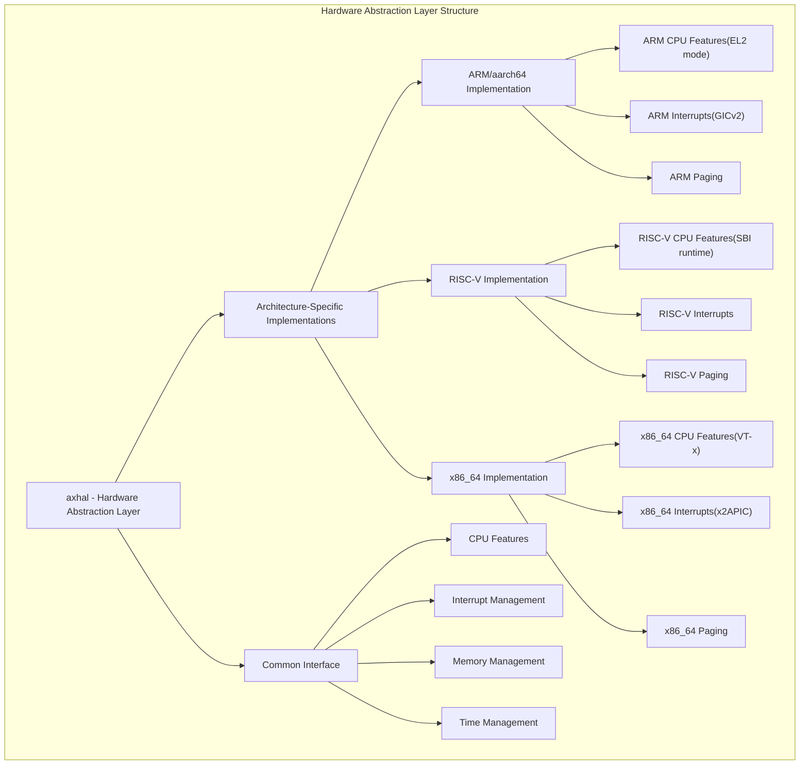
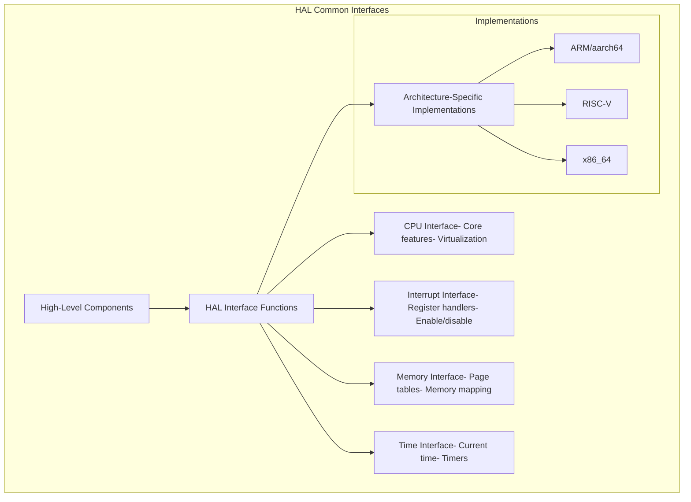
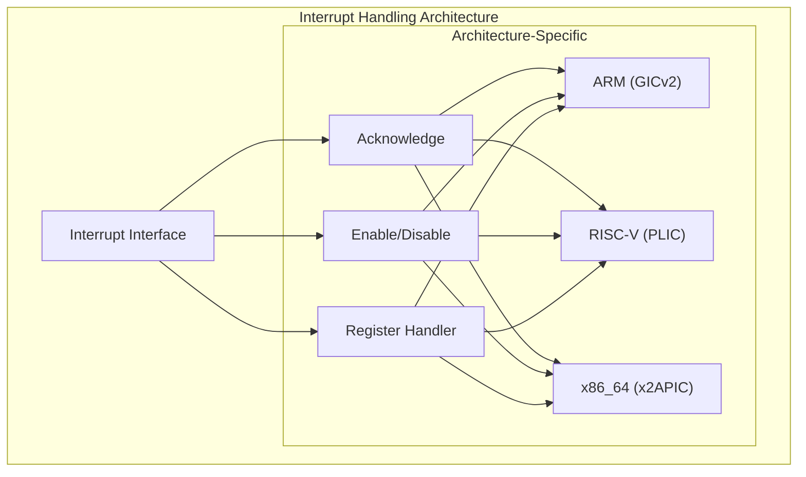
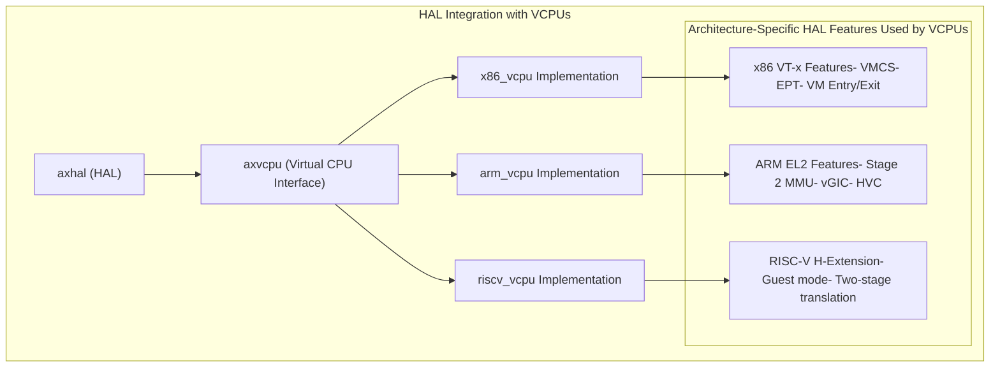

# Hardware Abstraction Layer

> **Relevant source files**
> * [Cargo.lock](https://github.com/arceos-hypervisor/axvisor/blob/0c9b89a5/Cargo.lock)
> * [Cargo.toml](https://github.com/arceos-hypervisor/axvisor/blob/0c9b89a5/Cargo.toml)

The Hardware Abstraction Layer (HAL) in AxVisor provides a uniform interface to access hardware features across multiple architectures. This component enables architecture-independent code to interact with hardware resources without needing to handle architecture-specific details directly. The HAL is a critical foundation that allows AxVisor to support x86_64, ARM/aarch64, and RISC-V architectures from a single codebase.

For detailed information about memory virtualization specifically, see [Memory Management](/arceos-hypervisor/axvisor/2.4-memory-management).

## HAL Architecture Overview

AxVisor's HAL is implemented in the `axhal` crate, which provides platform-agnostic interfaces that delegate to architecture-specific implementations. This design enables higher-level components of AxVisor to operate independently of the underlying hardware.

Sources:

* Cargo.lock
* Cargo.toml

## HAL Core Components

The HAL provides several key functionality areas that are essential for hypervisor operation:

### 1. Architecture-Independent Interfaces

The HAL defines common interfaces for hardware operations that higher-level components can use regardless of architecture:

Sources:

* Cargo.lock (lines 391-427)

### 2. Memory Management

The HAL provides memory management facilities including page table manipulation, address space management, and physical memory allocation:

|Component|Function|Architecture-Specific Aspects|
| --- | --- | --- |
|Page Tables|Virtual-to-physical translation|x86_64: 4-level pagingARM: Stage 2 translationRISC-V: Sv39/Sv48 paging|
|Memory Mapping|Map/unmap regions of memory|Hardware-specific protection bits|
|Physical Memory|Allocate and track physical memory|Platform-specific memory layouts|
|Memory Barriers|Enforce memory access ordering|Different barrier instructions per architecture|

Sources:

* Cargo.lock (lines 1019-1032) - memory_addr and memory_set packages
* Cargo.lock (lines 1062-1084) - page_table_entry and page_table_multiarch packages

### 3. Interrupt Handling

The HAL manages hardware interrupts through an architecture-independent interface:

Sources:

* Cargo.lock (lines 137-142) - arm_gicv2 package
* Cargo.lock (lines 1673-1683) - x2apic package

### 4. Timer and Time Management

The HAL provides interfaces for accessing system timers and managing time-related events:

|Time Feature|Function|Architecture Implementation|
| --- | --- | --- |
|System Timer|Provides current system time|x86_64: TSC or HPETARM: Generic TimerRISC-V: TIME CSR|
|Timer Events|Schedule timer interrupts|Platform-specific timer devices|
|Time Synchronization|Sync time between host and guests|Architecture-specific counters|

Sources:

* Cargo.lock (lines 1460-1463) - timer_list package

## Architecture-Specific Implementations

The HAL implements architecture-specific features for the supported platforms:

### x86_64 Implementation

The x86_64 implementation provides:

* Memory management through 4-level paging
* Interrupt handling using x2APIC
* CPU virtualization using VT-x technology
* I/O ports and MMIO access
* MSR (Model Specific Registers) access

Sources:

* Cargo.lock (lines 1686-1694) - x86 package
* Cargo.lock (lines 1709-1718) - x86_64 package

### ARM/aarch64 Implementation

The ARM implementation offers:

* Memory management through stage 2 translation tables
* Interrupt handling using GICv2
* CPU virtualization using EL2 execution level
* System register access
* Virtualization extensions for memory and interrupts

Sources:

* Cargo.lock (lines 6-12) - aarch64-cpu package
* Cargo.lock (lines 137-142) - arm_gicv2 package
* Cargo.lock (lines 145-151) - arm_pl011 package (UART)

### RISC-V Implementation

The RISC-V implementation provides:

* Memory management through Sv39/Sv48 paging
* Interrupt handling using platform-specific interrupt controllers
* SBI (Supervisor Binary Interface) runtime for hypervisor services
* H-extension support for virtualization (where available)

Sources:

* Cargo.lock (lines 1203-1213) - riscv package
* Cargo.lock (lines 1320-1333) - sbi-rt and sbi-spec packages

## Integration with Virtual CPUs

The HAL provides the foundation for virtual CPU (VCPU) implementations by exposing hardware virtualization features through a common interface:

Sources:

* Cargo.lock (lines 538-544) - axvcpu package
* Cargo.lock (lines 154-168) - arm_vcpu package
* Cargo.lock (lines 1248-1269) - riscv_vcpu package
* Cargo.lock (lines 1721-1739) - x86_vcpu package

## Hardware Resource Management

### Memory Allocation

The HAL works with the memory allocator (`axalloc`) to provide physical memory management:

|Feature|Description|
| --- | --- |
|Physical Memory Allocation|Allocates physical memory pages for guest VMs|
|Memory Region Management|Manages contiguous regions of physical memory|
|Device Memory Mapping|Maps device MMIO regions into address spaces|
|DMA Operations|Manages DMA-accessible memory regions|

Sources:

* Cargo.lock (lines 196-205) - axalloc package

### Device Access

The HAL provides access to physical devices and exposes platform-specific devices:

|Device Type|Function|Implementation|
| --- | --- | --- |
|UART|Serial communication|x86_64: 8250/16550 UARTARM: PL011 UARTRISC-V: SBI console|
|Interrupt Controller|Interrupt management|x86_64: APIC/x2APICARM: GICv2RISC-V: PLIC|
|Timer|Time-keeping|Platform-specific timer devices|
|Platform-specific|Board-specific functionality|Custom device drivers|

Sources:

* Cargo.lock (lines 145-151) - arm_pl011 package
* Cargo.lock (lines 1035-1038) - ns16550a package
* Cargo.lock (lines 137-142) - arm_gicv2 package

## HAL Initialization

During system boot, the HAL is initialized with architecture-specific procedures:

1. Early platform detection and initialization
2. Memory map discovery and setup
3. Architecture-specific hardware initialization
4. Interrupt controller setup
5. Timer initialization
6. Per-CPU state initialization

This initialization sequence ensures that the hardware is properly configured before higher-level hypervisor components begin execution.

Sources:

* Cargo.lock (lines 391-427) - axhal package

## Summary

The Hardware Abstraction Layer in AxVisor provides a unified interface to access hardware features across multiple architectures. It implements architecture-specific features while presenting a common API to higher-level components. This design enables AxVisor to support multiple guest architectures (x86_64, ARM/aarch64, and RISC-V) from a single codebase, allowing for efficient hypervisor operation across diverse hardware platforms.

The HAL is tightly integrated with other components of AxVisor, particularly with memory management, virtual CPU implementations, and device emulation, forming the foundation upon which the entire hypervisor is built.