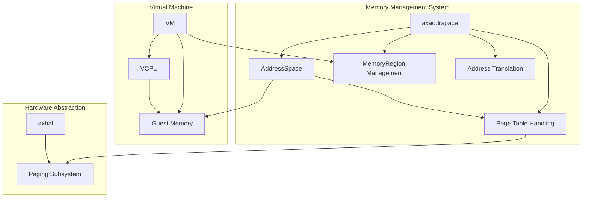
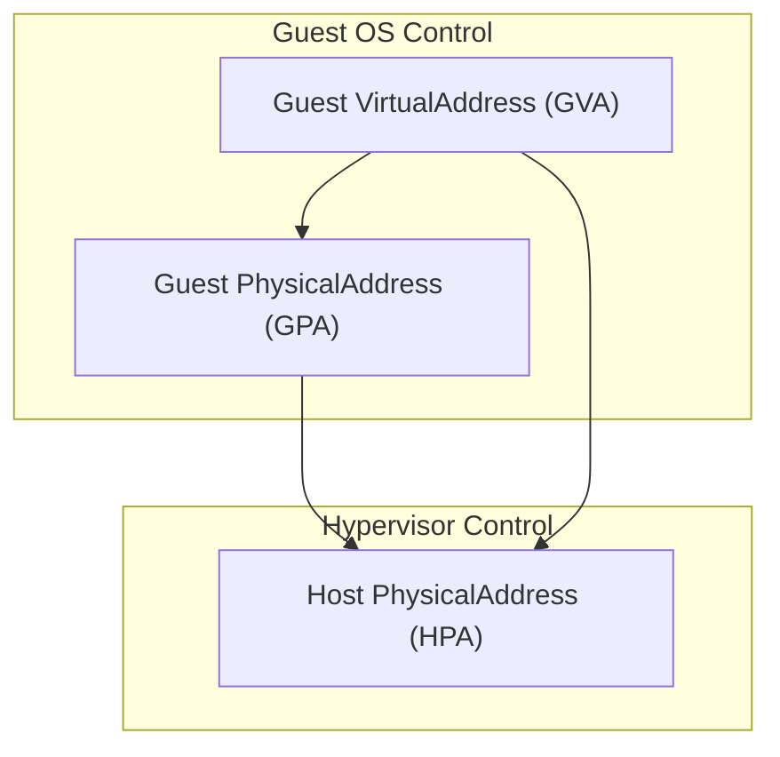
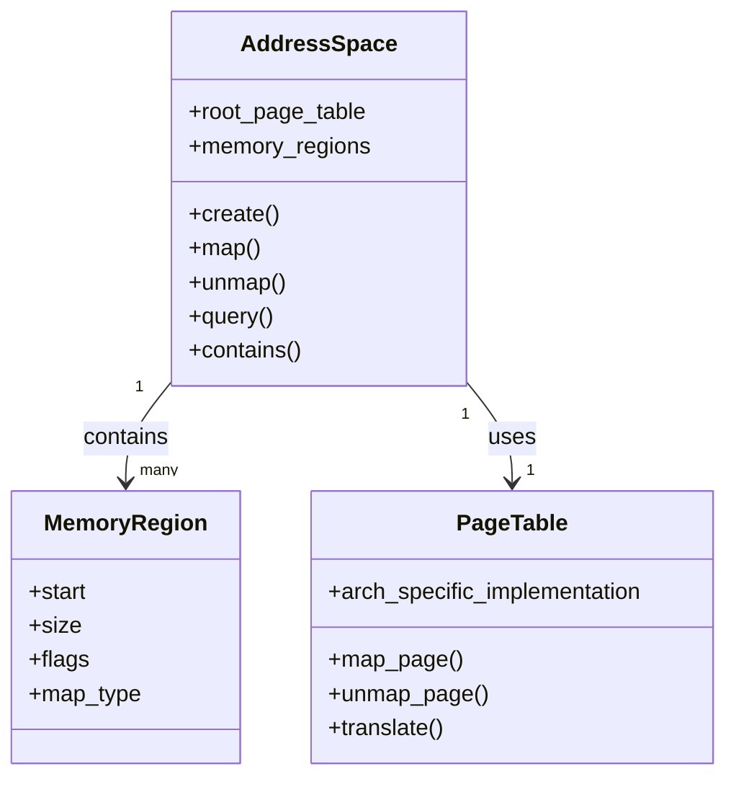
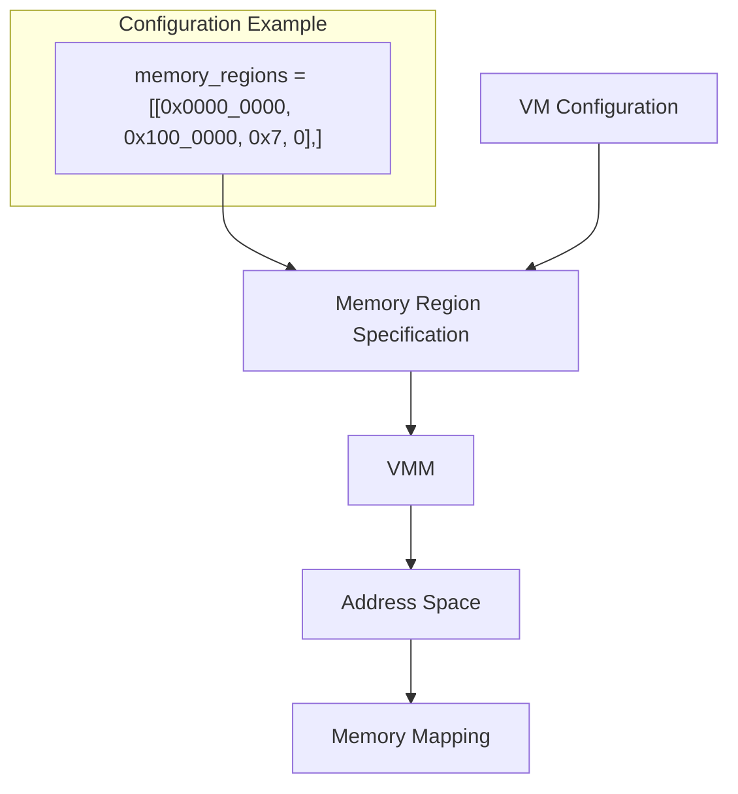
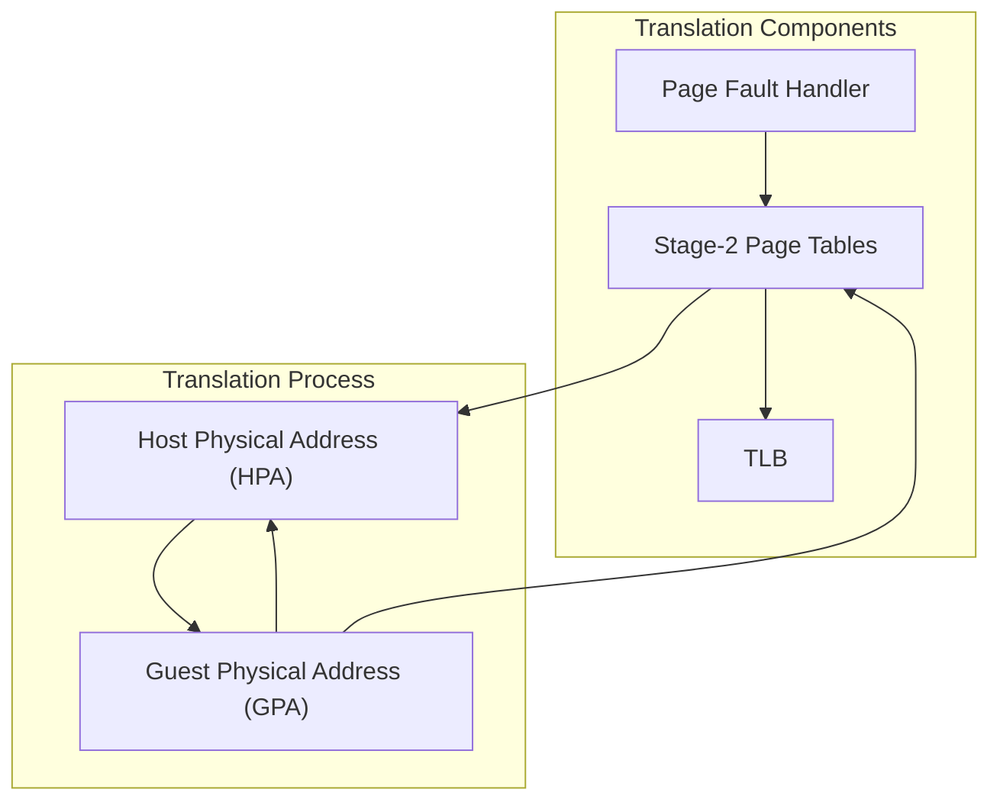
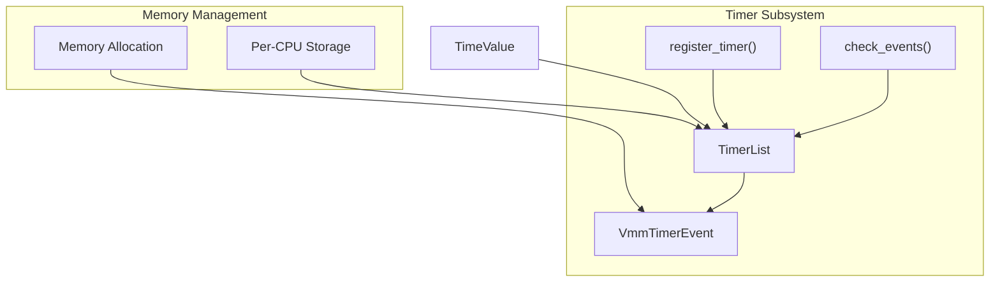

# Memory Management

> **Relevant source files**
> * [Cargo.lock](https://github.com/arceos-hypervisor/axvisor/blob/0c9b89a5/Cargo.lock)
> * [Cargo.toml](https://github.com/arceos-hypervisor/axvisor/blob/0c9b89a5/Cargo.toml)
> * [configs/platforms/x86_64-qemu-q35.toml](https://github.com/arceos-hypervisor/axvisor/blob/0c9b89a5/configs/platforms/x86_64-qemu-q35.toml)
> * [configs/vms/arceos-x86_64.toml](https://github.com/arceos-hypervisor/axvisor/blob/0c9b89a5/configs/vms/arceos-x86_64.toml)
> * [configs/vms/nimbos-x86_64.toml](https://github.com/arceos-hypervisor/axvisor/blob/0c9b89a5/configs/vms/nimbos-x86_64.toml)
> * [scripts/lds/linker.lds.S](https://github.com/arceos-hypervisor/axvisor/blob/0c9b89a5/scripts/lds/linker.lds.S)
> * [src/vmm/timer.rs](https://github.com/arceos-hypervisor/axvisor/blob/0c9b89a5/src/vmm/timer.rs)

This page documents the memory management subsystem in AxVisor, focusing on how memory virtualization and address space management are implemented in the hypervisor. For information about the hardware abstraction layer, see [Hardware Abstraction Layer](/arceos-hypervisor/axvisor/2.3-hardware-abstraction-layer).

## Overview

AxVisor's memory management system is responsible for:

* Virtualizing physical memory for guest VMs
* Managing address spaces for both hypervisor and VMs
* Handling stage-2 page tables for memory virtualization
* Performing address translations between different memory spaces
* Allocating and mapping memory regions for guest VMs

The system utilizes the `axaddrspace` crate to provide architecture-independent abstractions for memory management while supporting x86_64, ARM/aarch64, and RISC-V architectures.



Sources: [Cargo.toml(L35 - L37)&emsp;](https://github.com/arceos-hypervisor/axvisor/blob/0c9b89a5/Cargo.toml#L35-L37)

## Address Spaces and Memory Virtualization

In AxVisor, memory virtualization involves three distinct address spaces:

1. **Guest Virtual Address (GVA)** - Virtual addresses used by the guest OS
2. **Guest Physical Address (GPA)** - Physical addresses from the guest OS perspective
3. **Host Physical Address (HPA)** - Actual physical addresses in the host system

Memory virtualization is achieved through two levels of translation:

* First-stage translation (managed by the guest): GVA → GPA
* Second-stage translation (managed by the hypervisor): GPA → HPA



Sources: [configs/platforms/x86_64-qemu-q35.toml(L15 - L30)&emsp;](https://github.com/arceos-hypervisor/axvisor/blob/0c9b89a5/configs/platforms/x86_64-qemu-q35.toml#L15-L30)

## Address Space Management

The `axaddrspace` crate provides a unified interface for managing address spaces across different architectures. It handles the creation, manipulation, and destruction of second-stage page tables used for GPA to HPA translations.

Key components include:

* `AddressSpace`: Represents a virtual address space for a guest VM
* `MemoryRegion`: Defines a contiguous region of memory with specific permissions
* `PageTable`: Manages the page tables for address translation



Sources: [Cargo.toml(L37)&emsp;](https://github.com/arceos-hypervisor/axvisor/blob/0c9b89a5/Cargo.toml#L37-L37)

## Memory Region Types

AxVisor supports different types of memory regions that can be mapped into a guest VM's address space:

|Region Type|Description|Use Case|
| --- | --- | --- |
|MAP_ALLOC|Memory allocated from hypervisor and mapped to guest|Regular guest memory|
|MAP_IDENTICAL|Identity-mapped memory from host to guest|Device pass-through, shared memory|
|MMIO|Memory-mapped I/O regions|Device access|
|ROM|Read-only memory|BIOS, firmware|

Memory regions are configured with specific access permissions (read, write, execute) and mapping types.

Sources: [configs/vms/arceos-x86_64.toml(L40 - L44)&emsp;](https://github.com/arceos-hypervisor/axvisor/blob/0c9b89a5/configs/vms/arceos-x86_64.toml#L40-L44) [configs/platforms/x86_64-qemu-q35.toml(L37 - L45)&emsp;](https://github.com/arceos-hypervisor/axvisor/blob/0c9b89a5/configs/platforms/x86_64-qemu-q35.toml#L37-L45)

## VM Memory Configuration

Virtual machines in AxVisor are configured with memory regions specified in their configuration files. Here's how memory regions are defined:

```
memory_regions = [
    [base_paddr, size, flags, map_type],
]
```

Where:

* `base_paddr`: Base guest physical address
* `size`: Size of the memory region in bytes
* `flags`: Access permissions (bit 0: read, bit 1: write, bit 2: execute)
* `map_type`: 0 for MAP_ALLOC, 1 for MAP_IDENTICAL

The hypervisor creates and manages these memory regions when a VM is initialized.



Sources: [configs/vms/arceos-x86_64.toml(L40 - L44)&emsp;](https://github.com/arceos-hypervisor/axvisor/blob/0c9b89a5/configs/vms/arceos-x86_64.toml#L40-L44) [configs/vms/nimbos-x86_64.toml(L40 - L44)&emsp;](https://github.com/arceos-hypervisor/axvisor/blob/0c9b89a5/configs/vms/nimbos-x86_64.toml#L40-L44)

## Page Table Management

AxVisor uses the `page_table_multiarch` and `page_table_entry` crates to provide architecture-independent page table management. These crates abstract the architecture-specific details of page tables for x86_64, ARM/aarch64, and RISC-V.

Key functionalities include:

* Creating and managing page tables
* Mapping guest physical addresses to host physical addresses
* Handling page faults and TLB operations
* Supporting different page sizes for efficient memory mapping

The page tables implement the second-stage translation (GPA → HPA) required for memory virtualization.

Sources: [Cargo.toml(L44 - L45)&emsp;](https://github.com/arceos-hypervisor/axvisor/blob/0c9b89a5/Cargo.toml#L44-L45)

## Address Translation

Address translation in AxVisor involves converting between different address spaces:

1. **GPA to HPA Translation**: Used when a guest VM accesses physical memory
2. **HPA to GPA Translation**: Used for handling page faults and device emulation
3. **Linear Address Translation**: Used for quick conversions between host virtual and physical addresses

The physical-virtual offset defined in the platform configuration allows for efficient linear mapping between host virtual and physical addresses.



Sources: [configs/platforms/x86_64-qemu-q35.toml(L22 - L26)&emsp;](https://github.com/arceos-hypervisor/axvisor/blob/0c9b89a5/configs/platforms/x86_64-qemu-q35.toml#L22-L26)

## Memory Isolation and Protection

AxVisor ensures memory isolation between guest VMs and between guests and the hypervisor through several mechanisms:

1. **Separate Address Spaces**: Each VM has its own address space with second-stage page tables
2. **Permission Enforcement**: Memory regions have specific access permissions enforced by hardware
3. **MMIO Protection**: Special handling for memory-mapped I/O regions
4. **EPT/NPT/Stage-2 MMU**: Hardware virtualization extensions enforce memory isolation

This ensures that one VM cannot access the memory of another VM or the hypervisor, providing strong security isolation.

Sources: [Cargo.toml(L37)&emsp;](https://github.com/arceos-hypervisor/axvisor/blob/0c9b89a5/Cargo.toml#L37-L37)

## Kernel Memory Layout

The hypervisor kernel itself has a specific memory layout defined by the linker script. This layout organizes different sections of the kernel in memory:

|Section|Description|
| --- | --- |
|.text|Executable code|
|.rodata|Read-only data|
|.data|Initialized data|
|.tdata/.tbss|Thread-local storage|
|.percpu|Per-CPU data|
|.bss|Uninitialized data|

The layout ensures proper memory alignment and access protection for each section.

Sources: [scripts/lds/linker.lds.S(L11 - L76)&emsp;](https://github.com/arceos-hypervisor/axvisor/blob/0c9b89a5/scripts/lds/linker.lds.S#L11-L76)

## Timer Subsystem and Memory

The VMM timer subsystem interacts with memory management through the allocation and management of timer events. Each timer event is stored in memory and scheduled based on its deadline.



Sources: [src/vmm/timer.rs(L18 - L23)&emsp;](https://github.com/arceos-hypervisor/axvisor/blob/0c9b89a5/src/vmm/timer.rs#L18-L23) [src/vmm/timer.rs(L44)&emsp;](https://github.com/arceos-hypervisor/axvisor/blob/0c9b89a5/src/vmm/timer.rs#L44-L44)

## Architecture-Specific Considerations

While AxVisor provides architecture-independent abstractions for memory management, there are important architecture-specific considerations:

### x86_64

* Uses Extended Page Tables (EPT) for second-stage translation
* Supports large pages (2MB, 1GB) for efficient mapping
* Handles specific x86 memory types and caching attributes

### ARM/aarch64

* Uses Stage-2 translation tables
* Supports different EL2 translation regimes
* Handles ARM-specific memory attributes

### RISC-V

* Uses Sv39/Sv48 page tables with appropriate extensions
* Implements RISC-V specific memory permission bits
* Handles RISC-V address translation modes

Each architecture implementation conforms to the common interfaces provided by `axaddrspace`, `page_table_entry`, and `page_table_multiarch`.

Sources: [Cargo.toml(L44 - L45)&emsp;](https://github.com/arceos-hypervisor/axvisor/blob/0c9b89a5/Cargo.toml#L44-L45)

## Conclusion

AxVisor's memory management system provides a robust, architecture-independent framework for virtualizing memory across different processor architectures. By abstracting the details of address space management and page table handling, it enables efficient memory virtualization while ensuring strong isolation between guest VMs.

The system leverages hardware virtualization features to minimize overhead while providing the flexibility needed to support diverse guest operating systems and configurations.