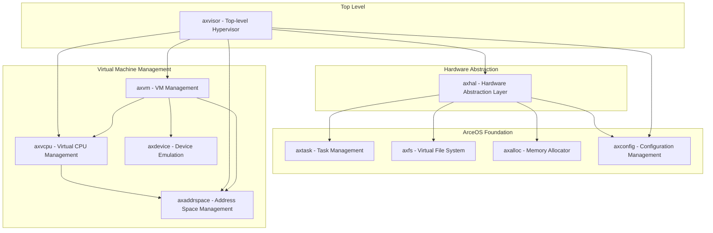
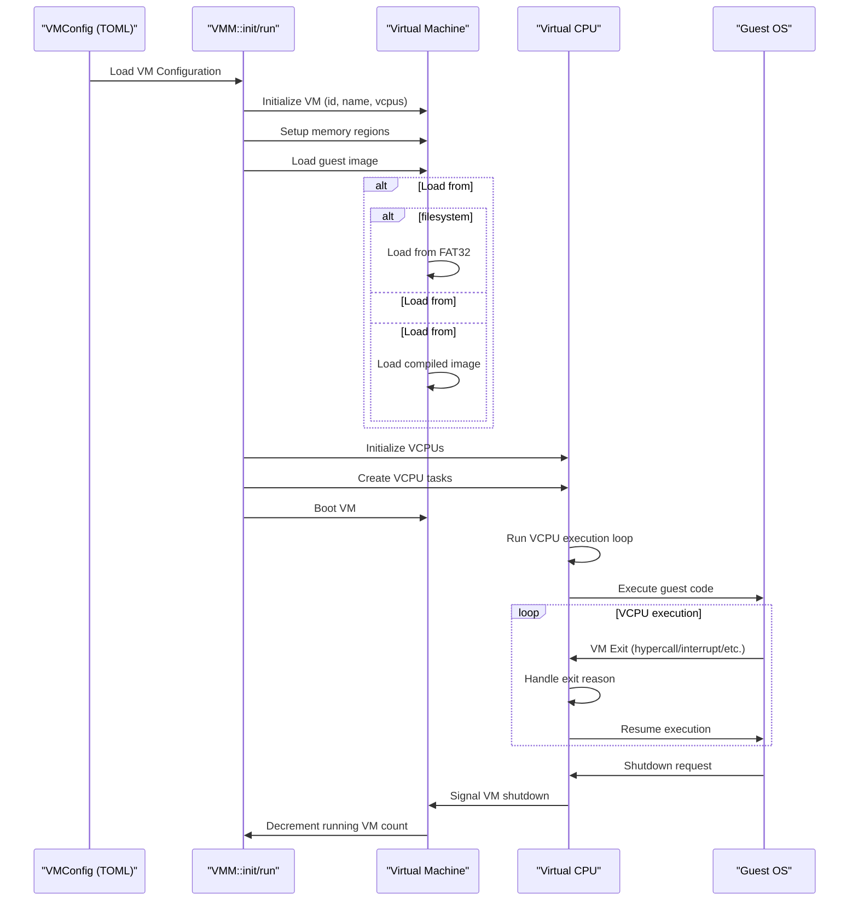
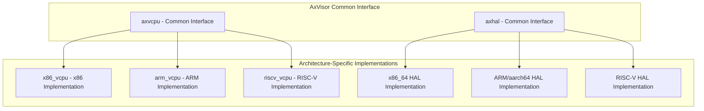
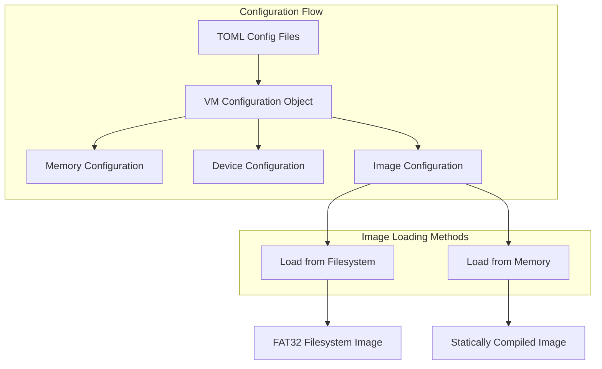

# Overview

> **Relevant source files**
> * [Cargo.lock](https://github.com/arceos-hypervisor/axvisor/blob/0c9b89a5/Cargo.lock)
> * [LICENSE.Apache2](https://github.com/arceos-hypervisor/axvisor/blob/0c9b89a5/LICENSE.Apache2)
> * [LICENSE.GPLv3](https://github.com/arceos-hypervisor/axvisor/blob/0c9b89a5/LICENSE.GPLv3)
> * [LICENSE.MulanPSL2](https://github.com/arceos-hypervisor/axvisor/blob/0c9b89a5/LICENSE.MulanPSL2)
> * [LICENSE.MulanPubL2](https://github.com/arceos-hypervisor/axvisor/blob/0c9b89a5/LICENSE.MulanPubL2)
> * [README.md](https://github.com/arceos-hypervisor/axvisor/blob/0c9b89a5/README.md)
> * [README_CN.md](https://github.com/arceos-hypervisor/axvisor/blob/0c9b89a5/README_CN.md)

This document provides a comprehensive introduction to AxVisor, a unified modular hypervisor built on the ArceOS unikernel framework. It covers the core concepts, architecture, and key components of AxVisor. For more detailed information about specific subsystems, refer to the respective wiki pages linked throughout this document.

## What is AxVisor?

AxVisor is a hypervisor implemented based on the ArceOS unikernel framework. Its goal is to leverage the foundational operating system features provided by ArceOS to implement a unified modular hypervisor that supports multiple hardware architectures with a single codebase.

Key attributes that define AxVisor:

* **Unified**: AxVisor uses the same codebase to simultaneously support x86_64, ARM (aarch64), and RISC-V architectures. This maximizes the reuse of architecture-independent code and simplifies development and maintenance.
* **Modular**: The hypervisor's functionality is decomposed into multiple modules, each implementing a specific function. These modules communicate with each other through standard interfaces to achieve decoupling and reuse of functionality.

Sources: [README.md(L21 - L28)&emsp;](https://github.com/arceos-hypervisor/axvisor/blob/0c9b89a5/README.md#L21-L28)

## Architecture Overview

AxVisor follows a layered architecture approach with clearly defined components that have specific responsibilities:

Sources: [README.md(L29 - L35)&emsp;](https://github.com/arceos-hypervisor/axvisor/blob/0c9b89a5/README.md#L29-L35)

### Key Components

1. **axvisor**: The top-level hypervisor component that coordinates all subsystems.
2. **axvm**: Manages virtual machines, their lifecycle, and interactions with the host system.
3. **axvcpu**: Handles virtual CPU operations, including context switching, instruction emulation, and exit handling.
4. **axaddrspace**: Manages guest memory address spaces, including page tables and memory region mapping.
5. **axhal**: Hardware Abstraction Layer that provides unified interfaces to hardware across different architectures.
6. **axdevice**: Emulates hardware devices for guests or manages device passthrough.
7. **axconfig**: Handles configuration parsing and management for the hypervisor and virtual machines.

Sources: [README.md(L29 - L35)&emsp;](https://github.com/arceos-hypervisor/axvisor/blob/0c9b89a5/README.md#L29-L35)

## Virtual Machine Execution Flow

The following diagram illustrates the typical flow of VM initialization, boot, and execution in AxVisor:

Sources: [README.md(L57 - L59)&emsp;](https://github.com/arceos-hypervisor/axvisor/blob/0c9b89a5/README.md#L57-L59) [README.md(L116 - L202)&emsp;](https://github.com/arceos-hypervisor/axvisor/blob/0c9b89a5/README.md#L116-L202)

## Cross-Platform Support

AxVisor achieves its cross-platform capability through architecture-specific implementations behind common interfaces:

Sources: [README.md(L38 - L47)&emsp;](https://github.com/arceos-hypervisor/axvisor/blob/0c9b89a5/README.md#L38-L47)

## Configuration System

AxVisor uses TOML configuration files to manage virtual machine settings. The configuration system handles:

* VM identification (ID, name)
* Hardware allocation (CPU cores, memory size)
* Guest image loading method and parameters
* Virtual and passthrough devices
* Architecture-specific settings

### Configuration and Image Loading

Sources: [README.md(L61 - L75)&emsp;](https://github.com/arceos-hypervisor/axvisor/blob/0c9b89a5/README.md#L61-L75) [README.md(L76 - L113)&emsp;](https://github.com/arceos-hypervisor/axvisor/blob/0c9b89a5/README.md#L76-L113)

## Supported Guest Operating Systems

AxVisor supports multiple guest operating systems:

|Guest OS|Description|Status|
| --- | --- | --- |
|ArceOS|The foundational unikernel framework|Supported|
|NimbOS|A simple operating system|Supported|
|Linux|Full-featured OS|Supported (mainly on aarch64)|
|Starry-OS|Educational OS|Supported|

Sources: [README.md(L46 - L56)&emsp;](https://github.com/arceos-hypervisor/axvisor/blob/0c9b89a5/README.md#L46-L56)

## Hardware Platform Support

AxVisor has been verified on the following platforms:

|Platform|Architecture|Status|
| --- | --- | --- |
|QEMU ARM64 virt|aarch64|Verified|
|Rockchip RK3568/RK3588|aarch64|Verified|
|黑芝麻华山 A1000|aarch64|Verified|
|QEMU x86_64|x86_64|Supported|
|QEMU RISC-V|riscv64|Supported|

Sources: [README.md(L38 - L43)&emsp;](https://github.com/arceos-hypervisor/axvisor/blob/0c9b89a5/README.md#L38-L43)

## Code Organization

AxVisor's codebase is organized around a modular architecture with the following key crates:

* **axvisor**: Top-level hypervisor implementation
* **axvm**: Virtual machine management
* **axvcpu**: Common virtual CPU interface
* **arm_vcpu/x86_vcpu/riscv_vcpu**: Architecture-specific VCPU implementations
* **axaddrspace**: Address space and memory virtualization
* **axdevice**: Device virtualization and management
* **axvmconfig**: Configuration management

For more detailed information about the system components, refer to [System Components](/arceos-hypervisor/axvisor/2.1-system-components).

For information about VM management, see [VM Management](/arceos-hypervisor/axvisor/2.2-vm-management).

Sources: [Cargo.lock(L118 - L121)&emsp;](https://github.com/arceos-hypervisor/axvisor/blob/0c9b89a5/Cargo.lock#L118-L121) [Cargo.lock(L574 - L593)&emsp;](https://github.com/arceos-hypervisor/axvisor/blob/0c9b89a5/Cargo.lock#L574-L593) [Cargo.lock(L536 - L545)&emsp;](https://github.com/arceos-hypervisor/axvisor/blob/0c9b89a5/Cargo.lock#L536-L545) [Cargo.lock(L154 - L168)&emsp;](https://github.com/arceos-hypervisor/axvisor/blob/0c9b89a5/Cargo.lock#L154-L168) [Cargo.lock(L1248 - L1269)&emsp;](https://github.com/arceos-hypervisor/axvisor/blob/0c9b89a5/Cargo.lock#L1248-L1269) [Cargo.lock(L177 - L192)&emsp;](https://github.com/arceos-hypervisor/axvisor/blob/0c9b89a5/Cargo.lock#L177-L192) [Cargo.lock(L239 - L261)&emsp;](https://github.com/arceos-hypervisor/axvisor/blob/0c9b89a5/Cargo.lock#L239-L261) [Cargo.lock(L596 - L605)&emsp;](https://github.com/arceos-hypervisor/axvisor/blob/0c9b89a5/Cargo.lock#L596-L605)

## Development Environment

AxVisor provides tools to simplify the development environment setup:

* **dev_env.py**: Script to localize relevant crates for easier development and debugging
* **Makefile**: Handles build configurations and targets

For more information on setting up a development environment, see [Development Environment](/arceos-hypervisor/axvisor/4.2-development-environment).

Sources: [README.md(L210 - L212)&emsp;](https://github.com/arceos-hypervisor/axvisor/blob/0c9b89a5/README.md#L210-L212)

## License

AxVisor is open-source software and uses the following licenses:

* Apache-2.0
* MulanPubL-2.0
* MulanPSL-2.0
* GPL-3.0-or-later

Sources: [README.md(L222 - L229)&emsp;](https://github.com/arceos-hypervisor/axvisor/blob/0c9b89a5/README.md#L222-L229) [LICENSE.Apache2](https://github.com/arceos-hypervisor/axvisor/blob/0c9b89a5/LICENSE.Apache2) [LICENSE.MulanPSL2](https://github.com/arceos-hypervisor/axvisor/blob/0c9b89a5/LICENSE.MulanPSL2) [LICENSE.MulanPubL2](https://github.com/arceos-hypervisor/axvisor/blob/0c9b89a5/LICENSE.MulanPubL2) [LICENSE.GPLv3](https://github.com/arceos-hypervisor/axvisor/blob/0c9b89a5/LICENSE.GPLv3)