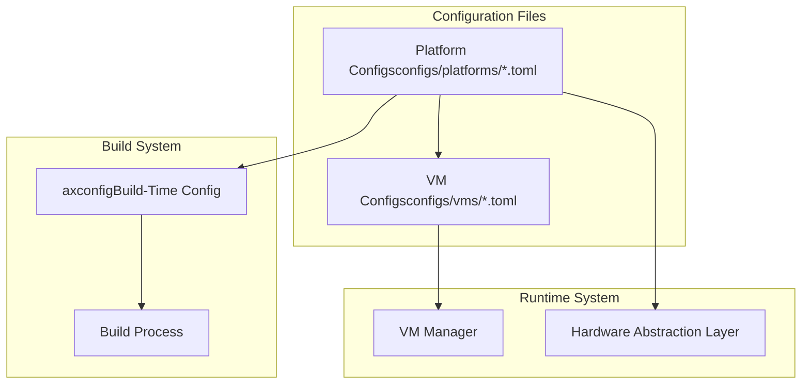
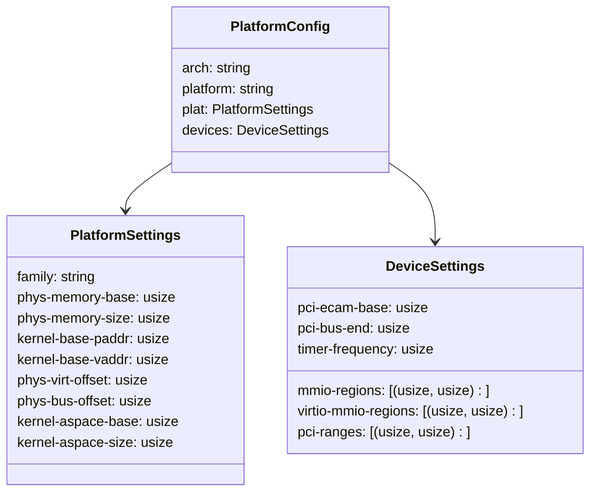
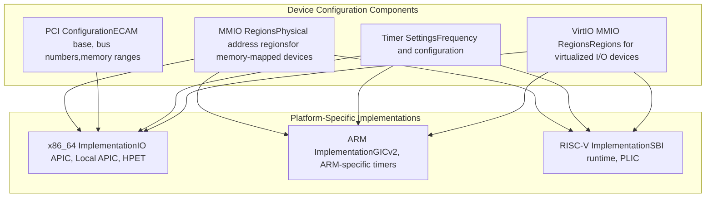
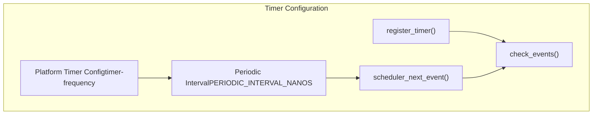
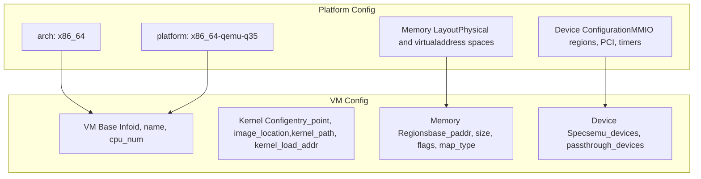
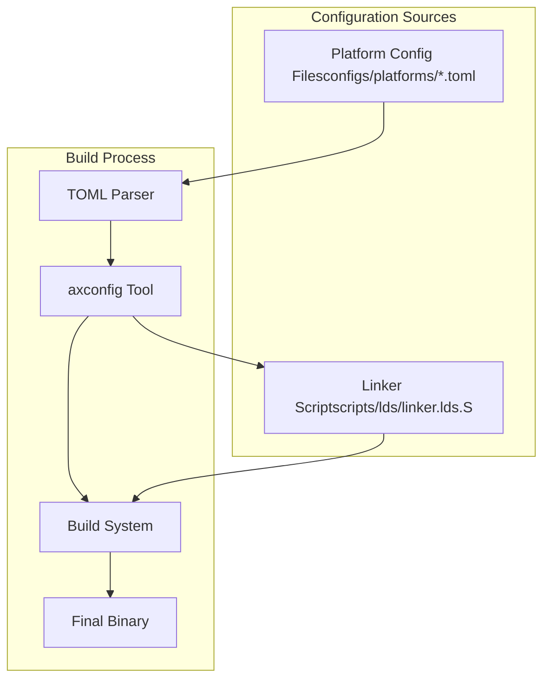

# Platform-Specific Configuration

> **Relevant source files**
> * [Cargo.toml](https://github.com/arceos-hypervisor/axvisor/blob/0c9b89a5/Cargo.toml)
> * [configs/platforms/x86_64-qemu-q35.toml](https://github.com/arceos-hypervisor/axvisor/blob/0c9b89a5/configs/platforms/x86_64-qemu-q35.toml)
> * [configs/vms/arceos-x86_64.toml](https://github.com/arceos-hypervisor/axvisor/blob/0c9b89a5/configs/vms/arceos-x86_64.toml)
> * [configs/vms/nimbos-x86_64.toml](https://github.com/arceos-hypervisor/axvisor/blob/0c9b89a5/configs/vms/nimbos-x86_64.toml)
> * [scripts/lds/linker.lds.S](https://github.com/arceos-hypervisor/axvisor/blob/0c9b89a5/scripts/lds/linker.lds.S)
> * [src/vmm/timer.rs](https://github.com/arceos-hypervisor/axvisor/blob/0c9b89a5/src/vmm/timer.rs)

This document describes the architecture-specific configuration options in AxVisor. It covers the configuration files and settings required for each supported hardware platform (x86_64, ARM/aarch64, and RISC-V). For information about virtual machine configuration, see [VM Configuration](/arceos-hypervisor/axvisor/3.1-vm-configuration).

## Configuration System Overview

AxVisor uses TOML configuration files to define platform-specific settings, which are located in the `configs/platforms/` directory. These files contain architecture-dependent parameters such as memory layout, device specifications, and timer frequencies.



Sources: [configs/platforms/x86_64-qemu-q35.toml(L1 - L58)&emsp;](https://github.com/arceos-hypervisor/axvisor/blob/0c9b89a5/configs/platforms/x86_64-qemu-q35.toml#L1-L58) [Cargo.toml(L47 - L52)&emsp;](https://github.com/arceos-hypervisor/axvisor/blob/0c9b89a5/Cargo.toml#L47-L52)

## Platform Configuration File Structure

Each platform configuration file follows a standardized format, with sections for platform identification, memory layout, and device specifications.

### Example Configuration (x86_64-qemu-q35)



Sources: [configs/platforms/x86_64-qemu-q35.toml(L1 - L58)&emsp;](https://github.com/arceos-hypervisor/axvisor/blob/0c9b89a5/configs/platforms/x86_64-qemu-q35.toml#L1-L58)

## Memory Layout Configuration

The memory layout configuration is one of the most critical aspects of platform-specific settings. It defines the physical and virtual memory address spaces, kernel loading addresses, and memory mapping offsets.

### Memory Layout Parameters

|Parameter|Description|Example (x86_64)|
| --- | --- | --- |
|phys-memory-base|Base address of physical memory|0x0|
|phys-memory-size|Size of physical memory|0x8000000 (128MB)|
|kernel-base-paddr|Physical address where kernel is loaded|0x200000|
|kernel-base-vaddr|Virtual address of the kernel image|0xffff800000200000|
|phys-virt-offset|Offset for physical-to-virtual address translation|0xffff800000000000|
|kernel-aspace-base|Base of kernel address space|0xffff800000000000|
|kernel-aspace-size|Size of kernel address space|0x7fffffffff000|

Sources: [configs/platforms/x86_64-qemu-q35.toml(L13 - L30)&emsp;](https://github.com/arceos-hypervisor/axvisor/blob/0c9b89a5/configs/platforms/x86_64-qemu-q35.toml#L13-L30) [scripts/lds/linker.lds.S(L1 - L94)&emsp;](https://github.com/arceos-hypervisor/axvisor/blob/0c9b89a5/scripts/lds/linker.lds.S#L1-L94)

## Device Configuration

Device configuration defines the memory-mapped I/O (MMIO) regions, PCI configuration, and other hardware-specific settings for each platform.



Sources: [configs/platforms/x86_64-qemu-q35.toml(L34 - L58)&emsp;](https://github.com/arceos-hypervisor/axvisor/blob/0c9b89a5/configs/platforms/x86_64-qemu-q35.toml#L34-L58) [configs/vms/arceos-x86_64.toml(L40 - L77)&emsp;](https://github.com/arceos-hypervisor/axvisor/blob/0c9b89a5/configs/vms/arceos-x86_64.toml#L40-L77) [configs/vms/nimbos-x86_64.toml(L40 - L77)&emsp;](https://github.com/arceos-hypervisor/axvisor/blob/0c9b89a5/configs/vms/nimbos-x86_64.toml#L40-L77)

### MMIO Regions

The `mmio-regions` parameter defines the memory ranges reserved for memory-mapped devices. For x86_64-qemu-q35, these include:

* PCI config space: 0xb0000000 - 0xc0000000
* PCI devices: 0xfe000000 - 0xfec00000
* IO APIC: 0xfec00000 - 0xfec01000
* HPET: 0xfed00000 - 0xfed01000
* Local APIC: 0xfee00000 - 0xfee01000

Sources: [configs/platforms/x86_64-qemu-q35.toml(L36 - L45)&emsp;](https://github.com/arceos-hypervisor/axvisor/blob/0c9b89a5/configs/platforms/x86_64-qemu-q35.toml#L36-L45)

### PCI Configuration

PCI configuration varies by platform. For x86_64-qemu-q35, it includes:

* PCI ECAM base: 0xb0000000
* PCI bus end: 0xff

Sources: [configs/platforms/x86_64-qemu-q35.toml(L49 - L54)&emsp;](https://github.com/arceos-hypervisor/axvisor/blob/0c9b89a5/configs/platforms/x86_64-qemu-q35.toml#L49-L54)

## Timer Configuration

Platform-specific timer configuration is essential for proper scheduling and timing in the hypervisor. The configuration specifies the timer frequency and related parameters.



Sources: [configs/platforms/x86_64-qemu-q35.toml(L57)&emsp;](https://github.com/arceos-hypervisor/axvisor/blob/0c9b89a5/configs/platforms/x86_64-qemu-q35.toml#L57-L57) [src/vmm/timer.rs(L1 - L105)&emsp;](https://github.com/arceos-hypervisor/axvisor/blob/0c9b89a5/src/vmm/timer.rs#L1-L105)

### Timer Implementation

The timer subsystem is implemented in [src/vmm/timer.rs](https://github.com/arceos-hypervisor/axvisor/blob/0c9b89a5/src/vmm/timer.rs) and uses platform-specific timers through the Hardware Abstraction Layer (HAL). For x86_64-qemu-q35, the timer frequency is set at 4 GHz.

The timer system uses the following key parameters:

* `timer-frequency`: Base frequency of the platform timer (e.g., 4 GHz for x86_64-qemu-q35)
* `PERIODIC_INTERVAL_NANOS`: Derived from `axconfig::TICKS_PER_SEC` and `axhal::time::NANOS_PER_SEC`

Sources: [src/vmm/timer.rs(L12)&emsp;](https://github.com/arceos-hypervisor/axvisor/blob/0c9b89a5/src/vmm/timer.rs#L12-L12) [configs/platforms/x86_64-qemu-q35.toml(L57)&emsp;](https://github.com/arceos-hypervisor/axvisor/blob/0c9b89a5/configs/platforms/x86_64-qemu-q35.toml#L57-L57)

## Relationship with VM Configuration

Platform-specific configurations form the foundation for VM configurations. VM configurations reference platform settings and may override or extend them for specific virtual machines.



Sources: [configs/vms/arceos-x86_64.toml(L1 - L78)&emsp;](https://github.com/arceos-hypervisor/axvisor/blob/0c9b89a5/configs/vms/arceos-x86_64.toml#L1-L78) [configs/vms/nimbos-x86_64.toml(L1 - L78)&emsp;](https://github.com/arceos-hypervisor/axvisor/blob/0c9b89a5/configs/vms/nimbos-x86_64.toml#L1-L78) [configs/platforms/x86_64-qemu-q35.toml(L1 - L58)&emsp;](https://github.com/arceos-hypervisor/axvisor/blob/0c9b89a5/configs/platforms/x86_64-qemu-q35.toml#L1-L58)

### Memory Region Configuration in VMs

VM configurations specify memory regions that must be compatible with the platform's memory layout. For example, a VM configuration might include:

```markdown
memory_regions = [
    [0x0000_0000, 0x100_0000, 0x7, 0], # Low RAM 16M 0b111 R|W|EXECUTE
]
```

This defines a 16MB region starting at physical address 0, with read, write, and execute permissions (flags 0x7), using allocation mapping (map_type 0).

Sources: [configs/vms/arceos-x86_64.toml(L42 - L44)&emsp;](https://github.com/arceos-hypervisor/axvisor/blob/0c9b89a5/configs/vms/arceos-x86_64.toml#L42-L44) [configs/vms/nimbos-x86_64.toml(L42 - L44)&emsp;](https://github.com/arceos-hypervisor/axvisor/blob/0c9b89a5/configs/vms/nimbos-x86_64.toml#L42-L44)

### Device Passthrough in VMs

Platform-specific device configurations determine which devices can be passed through to VMs. The VM configuration specifies which devices to pass through and how to map them:

```
passthrough_devices = [
    ["IO APIC", 0xfec0_0000, 0xfec0_0000, 0x1000, 0x1],
    ["Local APIC", 0xfee0_0000, 0xfee0_0000, 0x1000, 0x1],
    ["HPET", 0xfed0_0000, 0xfed0_0000, 0x1000, 0x1],
]
```

Each entry specifies:

1. Device name
2. Base IPA (Intermediate Physical Address) in guest
3. Base physical address in host
4. Length of memory region
5. Interrupt allocation flag

Sources: [configs/vms/arceos-x86_64.toml(L55 - L77)&emsp;](https://github.com/arceos-hypervisor/axvisor/blob/0c9b89a5/configs/vms/arceos-x86_64.toml#L55-L77) [configs/vms/nimbos-x86_64.toml(L55 - L77)&emsp;](https://github.com/arceos-hypervisor/axvisor/blob/0c9b89a5/configs/vms/nimbos-x86_64.toml#L55-L77)

## Architecture-Specific Considerations

Each supported architecture has specific configuration requirements and capabilities.

### x86_64 Architecture

For x86_64 platforms, important considerations include:

* APIC configuration (IO APIC and Local APIC)
* HPET timer configuration
* PCI configuration space mapping
* Boot page table setup

Sources: [configs/platforms/x86_64-qemu-q35.toml(L1 - L58)&emsp;](https://github.com/arceos-hypervisor/axvisor/blob/0c9b89a5/configs/platforms/x86_64-qemu-q35.toml#L1-L58) [configs/vms/arceos-x86_64.toml(L55 - L77)&emsp;](https://github.com/arceos-hypervisor/axvisor/blob/0c9b89a5/configs/vms/arceos-x86_64.toml#L55-L77) [configs/vms/nimbos-x86_64.toml(L55 - L77)&emsp;](https://github.com/arceos-hypervisor/axvisor/blob/0c9b89a5/configs/vms/nimbos-x86_64.toml#L55-L77)

### ARM/aarch64 Architecture

While not explicitly shown in the provided files, support for ARM architecture is indicated in the Cargo.toml file with features like "arm-el2". ARM platforms would have specific considerations for:

* GIC (Generic Interrupt Controller) configuration
* ARM-specific timer devices
* EL2 (Hypervisor) mode configuration

Sources: [Cargo.toml(L43 - L45)&emsp;](https://github.com/arceos-hypervisor/axvisor/blob/0c9b89a5/Cargo.toml#L43-L45)

### RISC-V Architecture

RISC-V support is mentioned in the system overview diagrams. RISC-V platforms would have specific considerations for:

* SBI (Supervisor Binary Interface) runtime configuration
* PLIC (Platform-Level Interrupt Controller) setup
* RISC-V privilege modes

## Build Integration

The platform-specific configuration is integrated into the build process through the `axconfig` build dependency, which processes the configuration files at build time.



Sources: [Cargo.toml(L47 - L52)&emsp;](https://github.com/arceos-hypervisor/axvisor/blob/0c9b89a5/Cargo.toml#L47-L52) [scripts/lds/linker.lds.S(L1 - L94)&emsp;](https://github.com/arceos-hypervisor/axvisor/blob/0c9b89a5/scripts/lds/linker.lds.S#L1-L94)