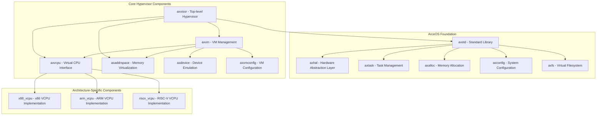
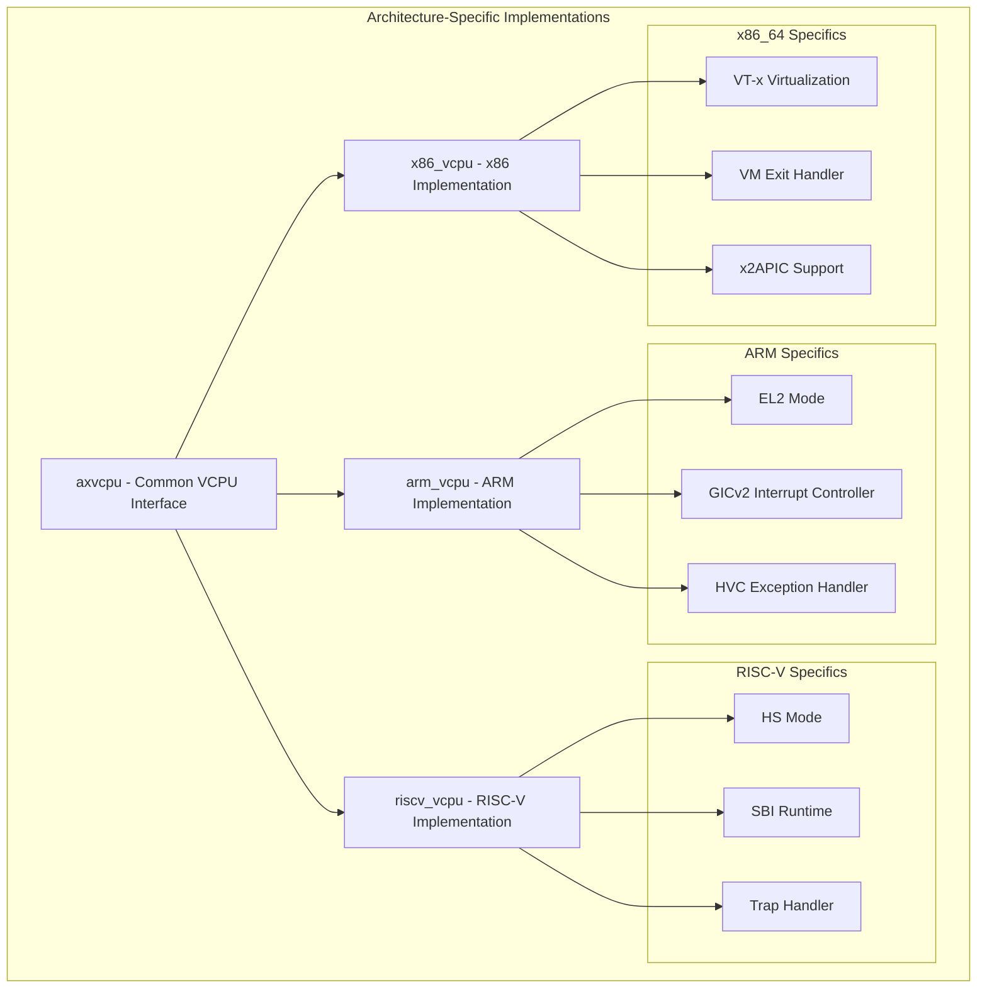
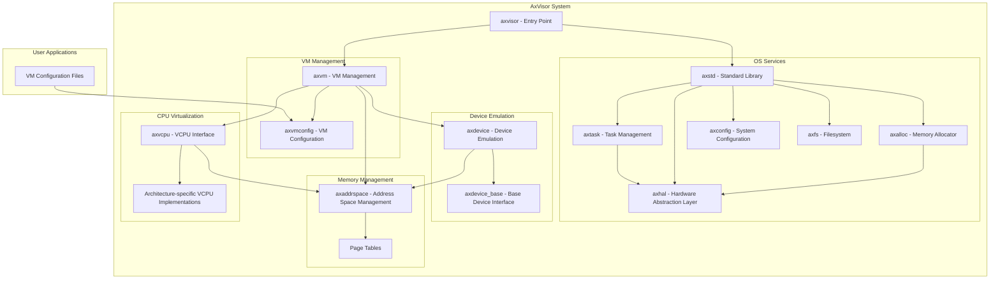
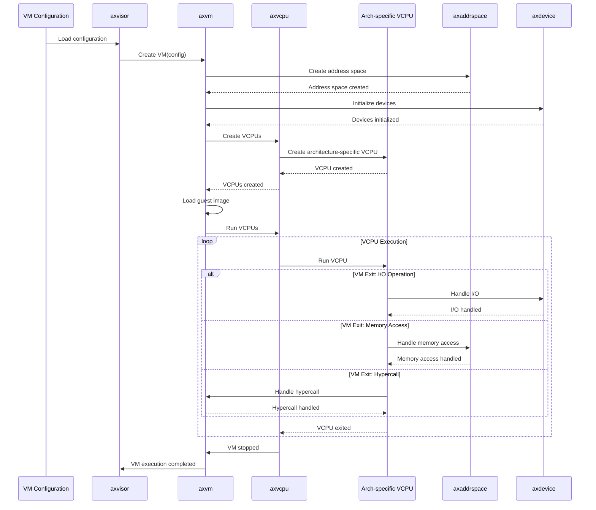

# System Components

> **Relevant source files**
> * [Cargo.lock](https://github.com/arceos-hypervisor/axvisor/blob/0c9b89a5/Cargo.lock)
> * [Cargo.toml](https://github.com/arceos-hypervisor/axvisor/blob/0c9b89a5/Cargo.toml)

This document details the main crates and their relationships within the AxVisor hypervisor system. It provides an overview of the modular architecture of AxVisor, explaining how various components interact to create a unified hypervisor framework that supports multiple architectures. For information about VM configuration, see [VM Configuration](/arceos-hypervisor/axvisor/3.1-vm-configuration). For implementation details of the VMM (Virtual Machine Manager), see [VMM Implementation](/arceos-hypervisor/axvisor/5.1-vmm-implementation).

## Component Architecture Overview

AxVisor follows a modular design approach with clearly defined components that have specific responsibilities. This architecture enables:

1. Cross-architecture support (x86_64, ARM/aarch64, RISC-V)
2. Clear separation of concerns
3. Hardware abstraction
4. Simplified development and testing

The system is organized into several categories of components that work together to provide hypervisor functionality.

Sources: [Cargo.toml(L14 - L45)&emsp;](https://github.com/arceos-hypervisor/axvisor/blob/0c9b89a5/Cargo.toml#L14-L45)

## Core Hypervisor Components

The main components of AxVisor can be categorized into core hypervisor functionality crates that are independent of the underlying architecture.

### axvisor

The top-level hypervisor crate that ties all components together and provides the main entry point for the hypervisor. It coordinates the virtual machine lifecycle and manages the hypervisor state.

### axvm

The Virtual Machine Manager responsible for creating, running, and managing virtual machines. It handles VM lifecycle operations such as creation, initialization, execution, and shutdown.

Key responsibilities:

* VM resource allocation and management
* Guest image loading
* Coordinating interactions between VCPUs, memory, and devices
* VM state management

### axvcpu

Defines the common Virtual CPU interface used across all architectures. It provides an abstraction layer for architecture-specific VCPU implementations.

Key responsibilities:

* Common VCPU interface definition
* VCPU state management
* Architecture-agnostic VCPU operations

### axaddrspace

Handles memory virtualization and address space management for virtual machines.

Key responsibilities:

* Memory region allocation and management
* Second-stage page table management
* Memory protection mechanisms
* Address translation services

### axdevice

Provides device emulation capabilities for virtual machines, allowing guest operating systems to interact with virtualized hardware.

Key responsibilities:

* Device model implementation
* I/O handling
* Device state management

### axvmconfig

Manages VM configurations through TOML-based configuration files, defining VM properties such as memory size, CPU count, and device settings.

Sources: [Cargo.toml(L34 - L37)&emsp;](https://github.com/arceos-hypervisor/axvisor/blob/0c9b89a5/Cargo.toml#L34-L37)

## Architecture-Specific Components

AxVisor supports multiple architectures through specialized implementation crates that implement the common interfaces defined by the core components.

Sources: [Cargo.lock(L138 - L148)&emsp;](https://github.com/arceos-hypervisor/axvisor/blob/0c9b89a5/Cargo.lock#L138-L148) [Cargo.lock(L154 - L168)&emsp;](https://github.com/arceos-hypervisor/axvisor/blob/0c9b89a5/Cargo.lock#L154-L168) [Cargo.lock(L1247 - L1269)&emsp;](https://github.com/arceos-hypervisor/axvisor/blob/0c9b89a5/Cargo.lock#L1247-L1269) [Cargo.lock(L1721 - L1739)&emsp;](https://github.com/arceos-hypervisor/axvisor/blob/0c9b89a5/Cargo.lock#L1721-L1739)

### x86_vcpu

Implements the VCPU interface for x86_64 architecture using Intel VT-x or AMD SVM technologies.

Key features:

* VM entry/exit handling
* Extended Page Tables (EPT) support
* Interrupt virtualization
* MSR virtualization

### arm_vcpu

Implements the VCPU interface for ARM/aarch64 architecture using ARM Virtualization Extensions.

Key features:

* EL2 (Hypervisor mode) operations
* Stage-2 translation
* GICv2 interrupt controller virtualization
* Hypervisor calls (HVC) handling

### riscv_vcpu

Implements the VCPU interface for RISC-V architecture using the RISC-V Hypervisor Extension.

Key features:

* Hypervisor-Supervisor (HS) mode operations
* Guest-page-table handling
* SBI services virtualization
* Trap handling

Sources: [Cargo.lock(L1721 - L1739)&emsp;](https://github.com/arceos-hypervisor/axvisor/blob/0c9b89a5/Cargo.lock#L1721-L1739) [Cargo.lock(L154 - L168)&emsp;](https://github.com/arceos-hypervisor/axvisor/blob/0c9b89a5/Cargo.lock#L154-L168) [Cargo.lock(L1247 - L1269)&emsp;](https://github.com/arceos-hypervisor/axvisor/blob/0c9b89a5/Cargo.lock#L1247-L1269)

## ArceOS Foundation

AxVisor is built on top of the ArceOS (Architecture-centric OS) unikernel framework, which provides essential OS services and hardware abstractions.

### axstd

A minimal standard library for ArceOS that provides common functionality and interfaces to the underlying OS services.

### axhal

The Hardware Abstraction Layer that provides a uniform interface to hardware across different architectures.

Key responsibilities:

* CPU and interrupt management
* Timer services
* Memory management primitives
* Platform-specific initialization

### axtask

Task management services including task creation, scheduling, and synchronization.

Key responsibilities:

* Task creation and lifecycle management
* Scheduling
* Inter-task synchronization

### axalloc

Memory allocation services and memory management.

Key responsibilities:

* Physical memory allocation
* Heap management
* Memory pools

### axconfig

System configuration management.

Key responsibilities:

* System parameters
* Feature flags
* Runtime configuration

### axfs

Virtual filesystem support.

Key responsibilities:

* File operations
* Filesystem implementations (FAT32, etc.)
* Device filesystem

Sources: [Cargo.toml(L24 - L32)&emsp;](https://github.com/arceos-hypervisor/axvisor/blob/0c9b89a5/Cargo.toml#L24-L32) [Cargo.lock(L118 - L134)&emsp;](https://github.com/arceos-hypervisor/axvisor/blob/0c9b89a5/Cargo.lock#L118-L134)

## Component Relationships and Dependencies

The components in AxVisor have well-defined relationships and dependencies that enable the modular architecture to function as a cohesive system.

Sources: [Cargo.toml(L24 - L45)&emsp;](https://github.com/arceos-hypervisor/axvisor/blob/0c9b89a5/Cargo.toml#L24-L45)

## Component Interaction Flow

The following diagram illustrates how the components interact during VM creation and execution:

Sources: [Cargo.lock(L549 - L571)&emsp;](https://github.com/arceos-hypervisor/axvisor/blob/0c9b89a5/Cargo.lock#L549-L571) [Cargo.lock(L576 - L593)&emsp;](https://github.com/arceos-hypervisor/axvisor/blob/0c9b89a5/Cargo.lock#L576-L593) [Cargo.lock(L536 - L545)&emsp;](https://github.com/arceos-hypervisor/axvisor/blob/0c9b89a5/Cargo.lock#L536-L545) [Cargo.lock(L177 - L191)&emsp;](https://github.com/arceos-hypervisor/axvisor/blob/0c9b89a5/Cargo.lock#L177-L191)

## Component Key Features and Capabilities

Below is a table summarizing the key features and capabilities of the main components:

|Component|Primary Role|Key Features|Architecture Support|
| --- | --- | --- | --- |
|axvisor|Entry point and coordinator|VM lifecycle management, System initialization|All|
|axvm|VM management|VM creation, resource management, guest image loading|All|
|axvcpu|VCPU interface|Common VCPU operations, architecture-agnostic interface|All|
|x86_vcpu|x86 VCPU implementation|VT-x/SVM, EPT, VMCS management|x86_64|
|arm_vcpu|ARM VCPU implementation|EL2 mode, GICv2, Stage-2 translation|ARM/aarch64|
|riscv_vcpu|RISC-V VCPU implementation|HS mode, SBI services virtualization|RISC-V|
|axaddrspace|Memory virtualization|Memory regions, second-stage page tables, address translation|All|
|axdevice|Device emulation|Device models, I/O handling|All|
|axvmconfig|VM configuration|TOML-based VM configuration|All|
|axhal|Hardware abstraction|Platform initialization, interrupts, timers|All (platform-specific)|
|axtask|Task management|Scheduling, synchronization|All|
|axalloc|Memory allocation|Physical memory, heap management|All|

Sources: [Cargo.toml(L14 - L45)&emsp;](https://github.com/arceos-hypervisor/axvisor/blob/0c9b89a5/Cargo.toml#L14-L45) [Cargo.lock(L549 - L571)&emsp;](https://github.com/arceos-hypervisor/axvisor/blob/0c9b89a5/Cargo.lock#L549-L571)

## Crate Dependency Tree

The core hypervisor crates have specific dependencies that demonstrate their relationships:

1. **axvisor** depends on:

* axvm - For VM management
* axvcpu - For VCPU operations
* axaddrspace - For memory management
* axstd - For OS services
* Various utility crates (log, bitflags, spin, etc.)
2. **axvm** depends on:

* axvcpu - For VCPU operations
* axaddrspace - For memory management
* axdevice - For device emulation
* axvmconfig - For configuration management
3. **axvcpu** provides common interfaces implemented by:

* x86_vcpu - For x86_64
* arm_vcpu - For ARM/aarch64
* riscv_vcpu - For RISC-V

This modular structure allows AxVisor to maintain a single codebase while supporting multiple architectures through well-defined interfaces and architecture-specific implementations.

Sources: [Cargo.toml(L34 - L45)&emsp;](https://github.com/arceos-hypervisor/axvisor/blob/0c9b89a5/Cargo.toml#L34-L45) [Cargo.lock(L549 - L571)&emsp;](https://github.com/arceos-hypervisor/axvisor/blob/0c9b89a5/Cargo.lock#L549-L571) [Cargo.lock(L576 - L593)&emsp;](https://github.com/arceos-hypervisor/axvisor/blob/0c9b89a5/Cargo.lock#L576-L593)