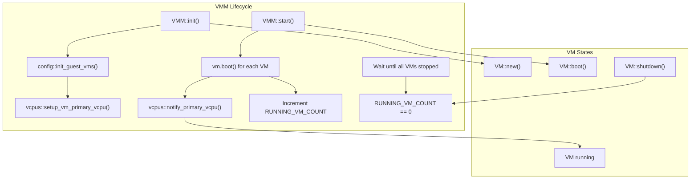
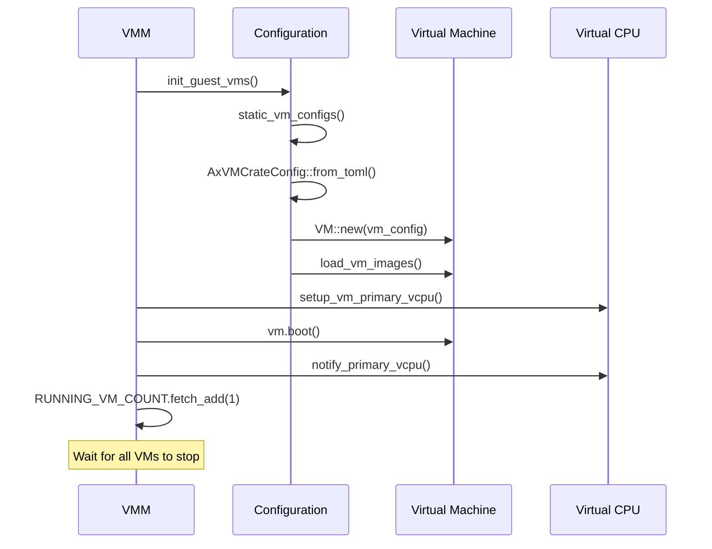
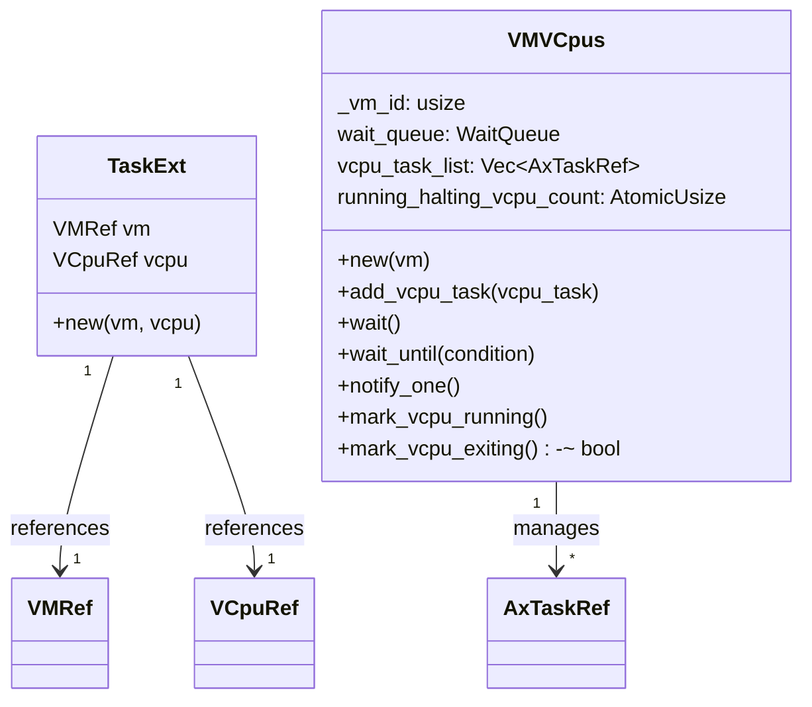
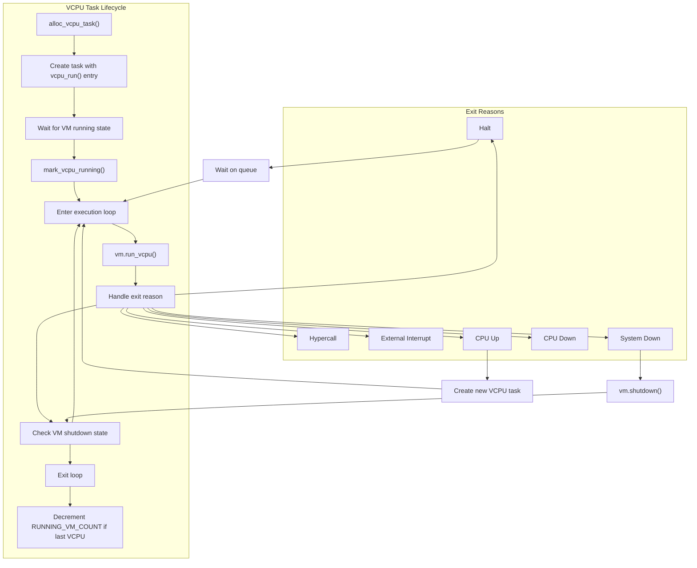
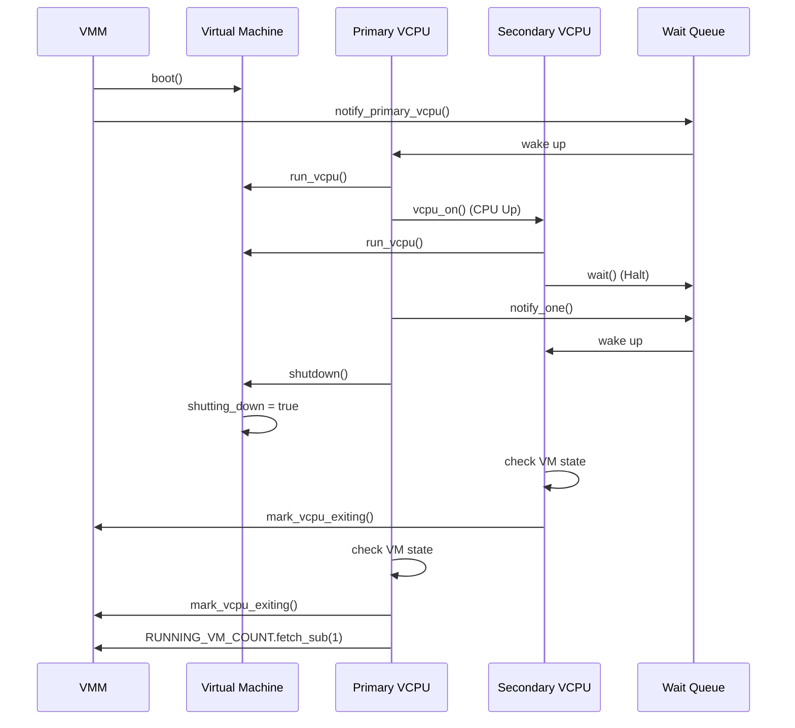
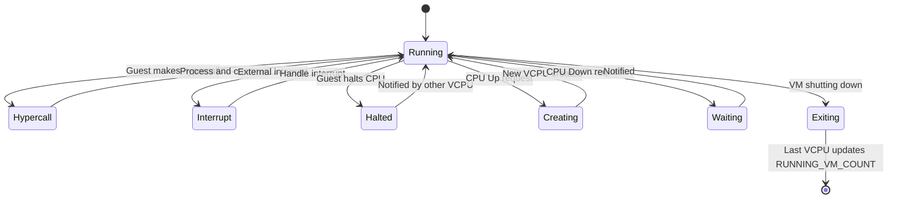
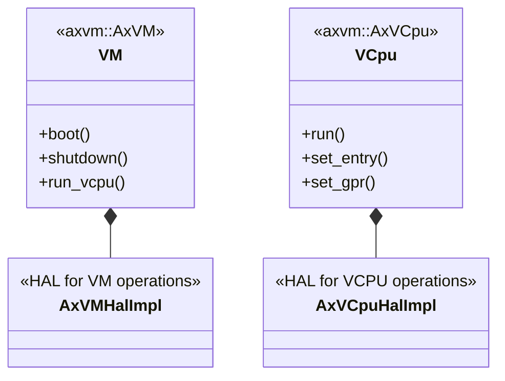

# Technical Reference

> **Relevant source files**
> * [Cargo.lock](https://github.com/arceos-hypervisor/axvisor/blob/0c9b89a5/Cargo.lock)
> * [src/task.rs](https://github.com/arceos-hypervisor/axvisor/blob/0c9b89a5/src/task.rs)
> * [src/vmm/config.rs](https://github.com/arceos-hypervisor/axvisor/blob/0c9b89a5/src/vmm/config.rs)
> * [src/vmm/mod.rs](https://github.com/arceos-hypervisor/axvisor/blob/0c9b89a5/src/vmm/mod.rs)
> * [src/vmm/vcpus.rs](https://github.com/arceos-hypervisor/axvisor/blob/0c9b89a5/src/vmm/vcpus.rs)

This document provides detailed technical information about the internal implementation of AxVisor, the ArceOS hypervisor. It covers core components, execution models, and internal data structures used by the hypervisor. For information about building and running AxVisor, see [Building and Running](/arceos-hypervisor/axvisor/4-building-and-running), and for configuration details, see [Configuration](/arceos-hypervisor/axvisor/3-configuration).

## 1. VMM Implementation

The Virtual Machine Manager (VMM) is the core component of AxVisor responsible for managing virtual machines throughout their lifecycle. It handles VM initialization, booting, execution, and shutdown.



Sources: [src/vmm/mod.rs(L28 - L65)&emsp;](https://github.com/arceos-hypervisor/axvisor/blob/0c9b89a5/src/vmm/mod.rs#L28-L65)

### 1.1 VM Initialization Process

The VMM initializes VMs through the following steps:

1. Loads VM configuration from TOML files via `config::init_guest_vms()`
2. Creates VM instances using `VM::new()`
3. Loads VM images according to configuration
4. Sets up the primary VCPU for each VM using `vcpus::setup_vm_primary_vcpu()`

The `RUNNING_VM_COUNT` atomic counter tracks active VMs, allowing the VMM to determine when all VMs have stopped.



Sources: [src/vmm/mod.rs(L28 - L65)&emsp;](https://github.com/arceos-hypervisor/axvisor/blob/0c9b89a5/src/vmm/mod.rs#L28-L65) [src/vmm/config.rs(L25 - L43)&emsp;](https://github.com/arceos-hypervisor/axvisor/blob/0c9b89a5/src/vmm/config.rs#L25-L43)

## 2. VCPU Management System

The VCPU management system handles the creation, execution, and synchronization of virtual CPUs. Each VCPU runs as a separate task in the ArceOS task scheduler.

### 2.1 VCPU Task Structure

Each VCPU is associated with a task that contains:

* Reference to the parent VM
* Reference to the VCPU itself
* Stack space for execution (256 KiB)
* Processor affinity settings (if configured)



Sources: [src/task.rs(L1 - L19)&emsp;](https://github.com/arceos-hypervisor/axvisor/blob/0c9b89a5/src/task.rs#L1-L19) [src/vmm/vcpus.rs(L27 - L107)&emsp;](https://github.com/arceos-hypervisor/axvisor/blob/0c9b89a5/src/vmm/vcpus.rs#L27-L107)

### 2.2 VCPU Execution Flow

The VCPU execution flow follows these steps:

1. Task is created for the VCPU with `alloc_vcpu_task()`
2. VCPU task waits until the VM is in running state
3. VCPU enters the execution loop via `vcpu_run()`
4. VM executes guest code with `vm.run_vcpu(vcpu_id)`
5. VCPU handles various exit reasons (hypercalls, interrupts, etc.)
6. If the VM is shutting down, VCPU exits the loop



Sources: [src/vmm/vcpus.rs(L169 - L367)&emsp;](https://github.com/arceos-hypervisor/axvisor/blob/0c9b89a5/src/vmm/vcpus.rs#L169-L367)

### 2.3 Synchronization Mechanism

VCPUs are synchronized using a wait queue system:

* Each VM has a `VMVCpus` structure containing a wait queue
* VCPUs can wait on the queue using `wait()` or `wait_until()`
* Other VCPUs can wake waiting VCPUs using `notify_one()`
* The primary VCPU is notified when the VM boots

The system also tracks running VCPUs with an atomic counter to determine when all VCPUs in a VM have exited.



Sources: [src/vmm/vcpus.rs(L110 - L167)&emsp;](https://github.com/arceos-hypervisor/axvisor/blob/0c9b89a5/src/vmm/vcpus.rs#L110-L167) [src/vmm/mod.rs(L22 - L65)&emsp;](https://github.com/arceos-hypervisor/axvisor/blob/0c9b89a5/src/vmm/mod.rs#L22-L65)

## 3. Internal Data Structures

The hypervisor uses several key data structures to manage VMs and VCPUs.

### 3.1 VM and VCPU Types

```
VM = axvm::AxVM<AxVMHalImpl, AxVCpuHalImpl>
VMRef = axvm::AxVMRef<AxVMHalImpl, AxVCpuHalImpl>
VCpuRef = axvm::AxVCpuRef<AxVCpuHalImpl>
```

These types abstract the architecture-specific implementations behind common interfaces.

Sources: [src/vmm/mod.rs(L16 - L20)&emsp;](https://github.com/arceos-hypervisor/axvisor/blob/0c9b89a5/src/vmm/mod.rs#L16-L20)

### 3.2 Global State Management

|Structure|Purpose|Implementation|
| --- | --- | --- |
|RUNNING_VM_COUNT|Tracks number of running VMs|static AtomicUsize|
|VMM|Wait queue for VMM synchronization|static AxWaitQueueHandle|
|VM_VCPU_TASK_WAIT_QUEUE|Maps VM IDs to their VCPU wait queues|static mut BTreeMap<usize, VMVCpus>|

Sources: [src/vmm/mod.rs(L22 - L25)&emsp;](https://github.com/arceos-hypervisor/axvisor/blob/0c9b89a5/src/vmm/mod.rs#L22-L25) [src/vmm/vcpus.rs(L23)&emsp;](https://github.com/arceos-hypervisor/axvisor/blob/0c9b89a5/src/vmm/vcpus.rs#L23-L23)

### 3.3 Task Extension

The `TaskExt` structure associates an ArceOS task with VM and VCPU references:

```css
pub struct TaskExt {
    pub vm: VMRef,
    pub vcpu: VCpuRef,
}
```

This allows the task scheduler to properly manage VCPU execution.

Sources: [src/task.rs(L6 - L11)&emsp;](https://github.com/arceos-hypervisor/axvisor/blob/0c9b89a5/src/task.rs#L6-L11)

## 4. VM Exit Handling

VM exits occur when the guest execution needs to be intercepted by the hypervisor. The hypervisor handles various exit reasons through the VCPU execution loop.

### 4.1 Exit Reason Processing

The following table shows the main exit reasons and their handling:

|Exit Reason|Description|Handling|
| --- | --- | --- |
|Hypercall|Guest executed a hypercall|Log hypercall details and arguments|
|ExternalInterrupt|Interrupt received|Handle interrupt and continue execution|
|Halt|Guest halted CPU|VCPU waits on wait queue|
|CpuUp|Guest wants to start another CPU|Create new VCPU task for target CPU|
|CpuDown|Guest wants to stop a CPU|VCPU waits on wait queue|
|SystemDown|Guest wants to shutdown|Shutdown VM and exit VCPU task|
|FailEntry|Failed to enter VM|Log error and continue|



Sources: [src/vmm/vcpus.rs(L290 - L363)&emsp;](https://github.com/arceos-hypervisor/axvisor/blob/0c9b89a5/src/vmm/vcpus.rs#L290-L363)

### 4.2 VCPU State Transitions

VCPUs transition through the following states during their lifecycle:

1. **Free**: Initial state when VCPU is created
2. **Running**: VCPU is executing guest code
3. **Halted**: VCPU is waiting on a wait queue
4. **Exiting**: VCPU is exiting due to VM shutdown

The `mark_vcpu_running()` and `mark_vcpu_exiting()` functions track these transitions.

Sources: [src/vmm/vcpus.rs(L92 - L107)&emsp;](https://github.com/arceos-hypervisor/axvisor/blob/0c9b89a5/src/vmm/vcpus.rs#L92-L107) [src/vmm/vcpus.rs(L155 - L167)&emsp;](https://github.com/arceos-hypervisor/axvisor/blob/0c9b89a5/src/vmm/vcpus.rs#L155-L167)

## 5. Architecture-Specific Components

AxVisor supports multiple CPU architectures through hardware abstraction layers.

### 5.1 HAL Implementation

The hypervisor uses architecture-specific implementations behind common interfaces:



The actual implementations vary by architecture (x86_64, ARM/aarch64, RISC-V) but present a unified interface.

Sources: [src/vmm/mod.rs(L12 - L20)&emsp;](https://github.com/arceos-hypervisor/axvisor/blob/0c9b89a5/src/vmm/mod.rs#L12-L20)

### 5.2 Architecture-Specific Behaviors

Some behaviors vary by architecture:

```css
#[cfg(target_arch = "riscv64")]
{
    debug!(
        "vcpu_on: vcpu[{}] entry={:x} opaque={:x}",
        vcpu_id, entry_point, arg
    );
    vcpu.set_gpr(0, vcpu_id);
    vcpu.set_gpr(1, arg);
}
```

This example shows RISC-V specific register setup for secondary VCPUs.

Sources: [src/vmm/vcpus.rs(L193 - L201)&emsp;](https://github.com/arceos-hypervisor/axvisor/blob/0c9b89a5/src/vmm/vcpus.rs#L193-L201)

## 6. System Configuration

VM configurations are loaded from TOML files and used to initialize VMs.

### 6.1 Configuration Loading

Static VM configurations are included at compile time and parsed during VM initialization:

```javascript
pub fn init_guest_vms() {
    let gvm_raw_configs = config::static_vm_configs();

    for raw_cfg_str in gvm_raw_configs {
        let vm_create_config =
            AxVMCrateConfig::from_toml(raw_cfg_str).expect("Failed to resolve VM config");
        let vm_config = AxVMConfig::from(vm_create_config.clone());
        
        // Create VM and load images
        // ...
    }
}
```

Architecture-specific configurations are selected based on the target architecture.

Sources: [src/vmm/config.rs(L10 - L22)&emsp;](https://github.com/arceos-hypervisor/axvisor/blob/0c9b89a5/src/vmm/config.rs#L10-L22) [src/vmm/config.rs(L25 - L43)&emsp;](https://github.com/arceos-hypervisor/axvisor/blob/0c9b89a5/src/vmm/config.rs#L25-L43)

### 6.2 Configuration Structure

VM configurations include:

* Basic properties (ID, name, CPU count)
* Memory regions
* Image location and loading parameters
* Device configurations

For more detailed information on configuration options, see [VM Configuration](/arceos-hypervisor/axvisor/3.1-vm-configuration).