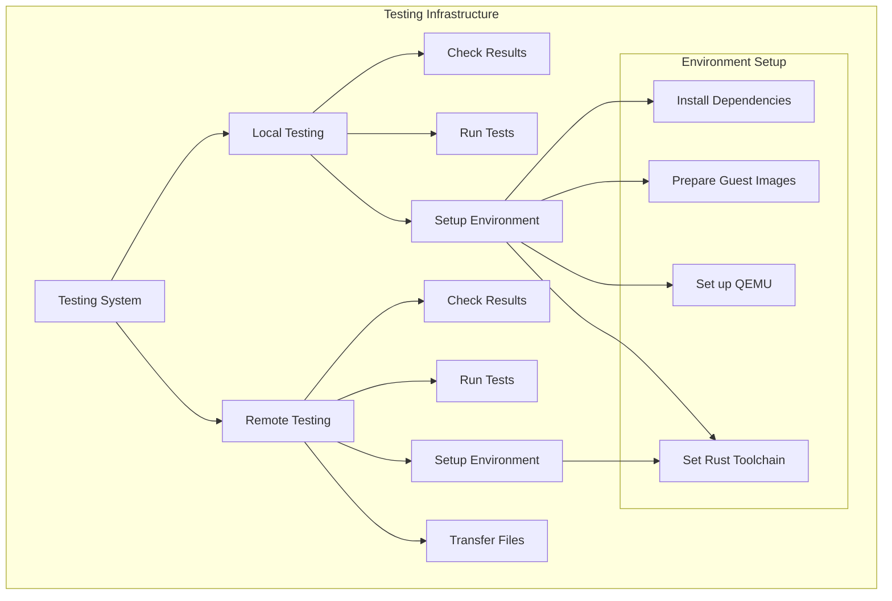
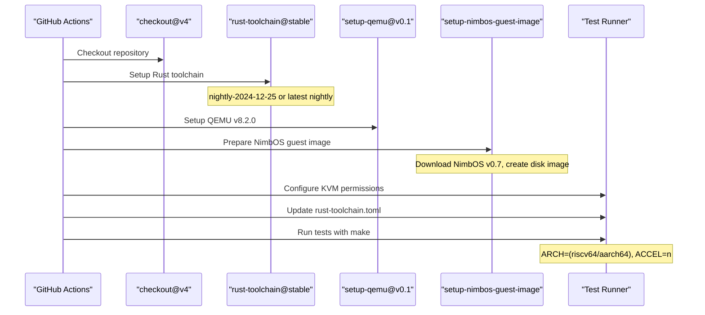
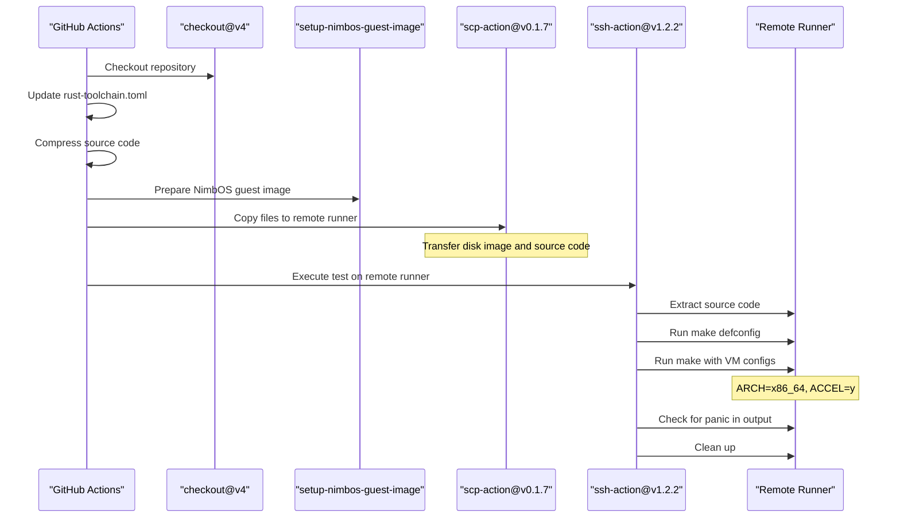

# Testing Infrastructure

> **Relevant source files**
> * [.github/workflows/actions/setup-nimbos-guest-image/action.yml](https://github.com/arceos-hypervisor/axvisor/blob/0c9b89a5/.github/workflows/actions/setup-nimbos-guest-image/action.yml)
> * [.github/workflows/test.yml](https://github.com/arceos-hypervisor/axvisor/blob/0c9b89a5/.github/workflows/test.yml)

This page documents the testing infrastructure for AxVisor, explaining how testing is automated, configured, and executed. It covers both local and remote testing setups, guest image preparation, and how to run and interpret tests. For CI/CD pipeline details beyond testing, see [CI/CD Pipeline](/arceos-hypervisor/axvisor/6.2-cicd-pipeline).

## Overview

AxVisor employs a comprehensive testing infrastructure to ensure that changes don't break functionality across supported architectures (x86_64, aarch64, and riscv64). The testing system runs virtual machines with guest operating systems to verify that virtualization works correctly.



Sources: [.github/workflows/test.yml(L1 - L150)&emsp;](https://github.com/arceos-hypervisor/axvisor/blob/0c9b89a5/.github/workflows/test.yml#L1-L150)

## Testing Strategy

The AxVisor testing infrastructure is built around running actual guest virtual machines to validate functionality. Tests are executed both in local GitHub Actions runners and on specialized remote hardware for architecture-specific testing.

### Test Matrix

Tests are conducted across a matrix of configurations:

|Test Type|Architectures|Rust Toolchains|Hardware Acceleration|
| --- | --- | --- | --- |
|Local|riscv64, aarch64|nightly-2024-12-25, nightly|No (QEMU)|
|Remote|x86_64|nightly-2024-12-25, nightly|Yes (KVM)|

Sources: [.github/workflows/test.yml(L10 - L59)&emsp;](https://github.com/arceos-hypervisor/axvisor/blob/0c9b89a5/.github/workflows/test.yml#L10-L59)

## Local Testing Workflow

Local testing runs on GitHub Actions runners and focuses on riscv64 and aarch64 architectures using QEMU emulation.



Sources: [.github/workflows/test.yml(L10 - L50)&emsp;](https://github.com/arceos-hypervisor/axvisor/blob/0c9b89a5/.github/workflows/test.yml#L10-L50) [.github/workflows/actions/setup-nimbos-guest-image/action.yml(L1 - L70)&emsp;](https://github.com/arceos-hypervisor/axvisor/blob/0c9b89a5/.github/workflows/actions/setup-nimbos-guest-image/action.yml#L1-L70)

### Local Test Execution Steps

1. Check out the repository
2. Set up the specified Rust toolchain with rust-src component
3. Install cargo-binutils
4. Set up QEMU for the target architecture
5. Download and prepare NimbOS guest image
6. Configure KVM permissions
7. Update rust-toolchain.toml with the specified toolchain
8. Run the test using make with:
* Target architecture
* Disk image path
* Verbose logging
* Block device enabled
* Hardware acceleration disabled
* VM configuration file path
* Filesystem support

Sources: [.github/workflows/test.yml(L19 - L50)&emsp;](https://github.com/arceos-hypervisor/axvisor/blob/0c9b89a5/.github/workflows/test.yml#L19-L50)

## Remote Testing Workflow

Remote testing targets x86_64 architecture on specialized hardware with KVM acceleration enabled.



Sources: [.github/workflows/test.yml(L52 - L149)&emsp;](https://github.com/arceos-hypervisor/axvisor/blob/0c9b89a5/.github/workflows/test.yml#L52-L149)

### Remote Test Execution Steps

1. Check out the repository
2. Update rust-toolchain.toml with the specified toolchain
3. Compress the source code
4. Prepare NimbOS guest image locally
5. Transfer files to the remote runner:
* Compressed source code
* Disk image
6. On the remote runner:
* Extract the source code
* Run `make defconfig` for x86_64
* Execute test with hardware acceleration enabled
* Check output for panic messages
* Clean up temporary files

Sources: [.github/workflows/test.yml(L72 - L149)&emsp;](https://github.com/arceos-hypervisor/axvisor/blob/0c9b89a5/.github/workflows/test.yml#L72-L149)

## Guest VM Image Preparation

The testing infrastructure uses a custom action to prepare guest VM images (specifically NimbOS) for testing.

```mermaid
flowchart TD
subgraph subGraph0["setup-nimbos-guest-image Action"]
    setupStart["Start Setup"]
    downloadNimbOS["Download NimbOS Release"]
    unzipNimbOS["Unzip NimbOS Image"]
    renameNimbOS["Rename to nimbos-{arch}.bin"]
    isX86["Is x86_64?"]
    downloadBIOS["Download AXVM BIOS"]
    createDiskImage["Create Disk Image"]
    mountDisk["Mount Disk Image"]
    copyFiles["Copy Files to Disk"]
    unmountDisk["Unmount Disk"]
    cleanup["Cleanup Temporary Files"]
end

copyFiles --> unmountDisk
createDiskImage --> mountDisk
downloadBIOS --> createDiskImage
downloadNimbOS --> unzipNimbOS
isX86 --> createDiskImage
isX86 --> downloadBIOS
mountDisk --> copyFiles
renameNimbOS --> isX86
setupStart --> downloadNimbOS
unmountDisk --> cleanup
unzipNimbOS --> renameNimbOS
```



Sources: [.github/workflows/actions/setup-nimbos-guest-image/action.yml(L1 - L70)&emsp;](https://github.com/arceos-hypervisor/axvisor/blob/0c9b89a5/.github/workflows/actions/setup-nimbos-guest-image/action.yml#L1-L70)

### Guest Image Setup Process

The setup process:

1. Creates a temporary directory
2. Downloads the appropriate NimbOS release for the target architecture
3. Unzips and renames the NimbOS binary
4. For x86_64, also downloads the AXVM BIOS
5. Creates a disk image using the makefile
6. Mounts the disk image
7. Copies the NimbOS binary and BIOS (if applicable) to the disk image
8. Unmounts the disk image and cleans up temporary files

Sources: [.github/workflows/actions/setup-nimbos-guest-image/action.yml(L32 - L70)&emsp;](https://github.com/arceos-hypervisor/axvisor/blob/0c9b89a5/.github/workflows/actions/setup-nimbos-guest-image/action.yml#L32-L70)

## Running Tests Manually

To run tests manually in a local development environment, follow these steps:

1. Set up a disk image with a guest OS (like NimbOS)
2. Configure the test environment:

```markdown
# For local testing (without hardware acceleration)
make ARCH=<arch> defconfig
make ARCH=<arch> DISK_IMG=<path_to_disk_img> LOG=info BLK=y ACCEL=n VM_CONFIGS=<path_to_vm_config> APP_FEATURES=fs run

# For testing with hardware acceleration (KVM)
make ARCH=<arch> defconfig
make ARCH=<arch> DISK_IMG=<path_to_disk_img> LOG=info BLK=y ACCEL=y VM_CONFIGS=<path_to_vm_config> APP_FEATURES=fs run
```

Replace `<arch>` with the target architecture (x86_64, aarch64, or riscv64), `<path_to_disk_img>` with the path to your guest disk image, and `<path_to_vm_config>` with the path to your VM configuration file.

Sources: [.github/workflows/test.yml(L45 - L50)&emsp;](https://github.com/arceos-hypervisor/axvisor/blob/0c9b89a5/.github/workflows/test.yml#L45-L50) [.github/workflows/test.yml(L133 - L134)&emsp;](https://github.com/arceos-hypervisor/axvisor/blob/0c9b89a5/.github/workflows/test.yml#L133-L134)

## Interpreting Test Results

Tests are considered successful if they complete without generating "panic" messages in the output. The CI system checks for these messages automatically:

```markdown
if grep -q "panic" make_output.log; then
  # Test failed
  exit 1
else
  # Test passed
fi
```

For debugging failed tests, examine the log output for:

* Panic messages
* Errors during VM boot
* Issues with guest OS execution
* Problems with virtual device emulation

Sources: [.github/workflows/test.yml(L139 - L146)&emsp;](https://github.com/arceos-hypervisor/axvisor/blob/0c9b89a5/.github/workflows/test.yml#L139-L146)

## Architecture-Specific Considerations

Each supported architecture has specific testing requirements:

### x86_64

* Tested on remote runners with KVM acceleration
* Requires AXVM BIOS for guest OS boot
* Uses hardware virtualization extensions (VT-x)

### aarch64

* Tested on local GitHub Actions runners
* Uses QEMU for emulation
* Leverages virtualization extensions (EL2 mode)

### riscv64

* Tested on local GitHub Actions runners
* Uses QEMU for emulation
* Relies on SBI runtime for hypervisor operations

Sources: [.github/workflows/test.yml(L16)&emsp;](https://github.com/arceos-hypervisor/axvisor/blob/0c9b89a5/.github/workflows/test.yml#L16-L16) [.github/workflows/test.yml(L57)&emsp;](https://github.com/arceos-hypervisor/axvisor/blob/0c9b89a5/.github/workflows/test.yml#L57-L57) [.github/workflows/actions/setup-nimbos-guest-image/action.yml(L52 - L58)&emsp;](https://github.com/arceos-hypervisor/axvisor/blob/0c9b89a5/.github/workflows/actions/setup-nimbos-guest-image/action.yml#L52-L58)