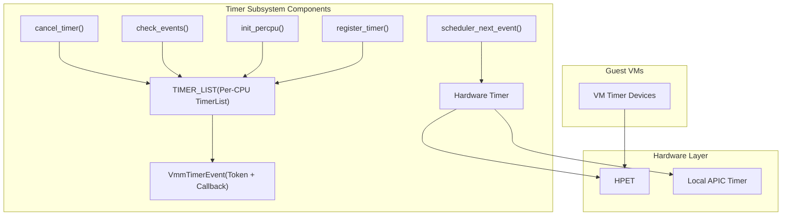
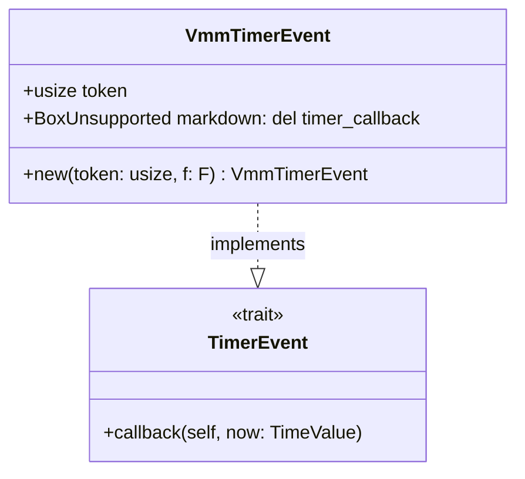
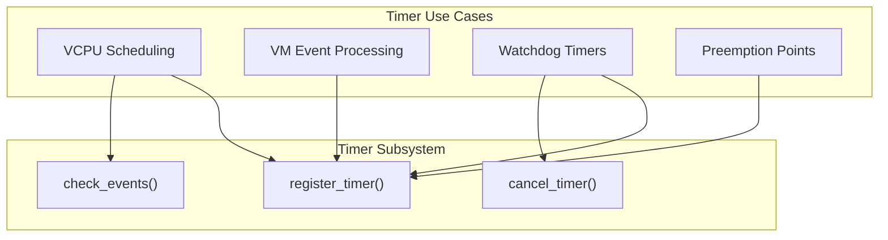

# Timer Subsystem

> **Relevant source files**
> * [Cargo.lock](https://github.com/arceos-hypervisor/axvisor/blob/0c9b89a5/Cargo.lock)
> * [configs/platforms/x86_64-qemu-q35.toml](https://github.com/arceos-hypervisor/axvisor/blob/0c9b89a5/configs/platforms/x86_64-qemu-q35.toml)
> * [configs/vms/arceos-x86_64.toml](https://github.com/arceos-hypervisor/axvisor/blob/0c9b89a5/configs/vms/arceos-x86_64.toml)
> * [configs/vms/nimbos-x86_64.toml](https://github.com/arceos-hypervisor/axvisor/blob/0c9b89a5/configs/vms/nimbos-x86_64.toml)
> * [scripts/lds/linker.lds.S](https://github.com/arceos-hypervisor/axvisor/blob/0c9b89a5/scripts/lds/linker.lds.S)
> * [src/vmm/timer.rs](https://github.com/arceos-hypervisor/axvisor/blob/0c9b89a5/src/vmm/timer.rs)

The Timer Subsystem in AxVisor provides time-based event scheduling and management for the hypervisor environment. This document describes the internal design and implementation of the timer framework that enables scheduling and execution of time-bound operations across the hypervisor.

For information about VCPU Management and how it interacts with timers, see [VCPU Management](/arceos-hypervisor/axvisor/5.2-vcpu-management).

## Overview

The Timer Subsystem enables the hypervisor to schedule operations to be executed at specific times or after specific intervals. It manages a list of pending timer events per virtual CPU and provides an interface for registering, canceling, and processing timer events.



Sources: [src/vmm/timer.rs(L1 - L105)&emsp;](https://github.com/arceos-hypervisor/axvisor/blob/0c9b89a5/src/vmm/timer.rs#L1-L105) [configs/vms/arceos-x86_64.toml(L57 - L77)&emsp;](https://github.com/arceos-hypervisor/axvisor/blob/0c9b89a5/configs/vms/arceos-x86_64.toml#L57-L77) [configs/platforms/x86_64-qemu-q35.toml(L56 - L57)&emsp;](https://github.com/arceos-hypervisor/axvisor/blob/0c9b89a5/configs/platforms/x86_64-qemu-q35.toml#L56-L57)

## Core Components

### VmmTimerEvent Structure

The Timer Subsystem is built around the `VmmTimerEvent` struct, which encapsulates a timer event with:

1. A unique token identifier
2. A callback function to be executed when the timer expires



Sources: [src/vmm/timer.rs(L15 - L41)&emsp;](https://github.com/arceos-hypervisor/axvisor/blob/0c9b89a5/src/vmm/timer.rs#L15-L41)

The `VmmTimerEvent` implements the `TimerEvent` trait, which defines a `callback` method that will be invoked when the timer expires. Each timer event is uniquely identified by a token, which allows for cancellation or modification of pending timers.

### Per-CPU Timer Lists

The Timer Subsystem maintains a separate timer list for each virtual CPU using the `percpu` crate. This approach:

1. Avoids contention between CPUs for timer management
2. Allows each CPU to handle its local timer events efficiently
3. Ensures scalability as the number of CPUs increases

```
#[percpu::def_percpu]
static TIMER_LIST: LazyInit<SpinNoIrq<TimerList<VmmTimerEvent>>> = LazyInit::new();
```

Sources: [src/vmm/timer.rs(L43 - L44)&emsp;](https://github.com/arceos-hypervisor/axvisor/blob/0c9b89a5/src/vmm/timer.rs#L43-L44)

The `TIMER_LIST` is protected by a spinlock (`SpinNoIrq`) to prevent concurrent modifications from different contexts on the same CPU. The `LazyInit` wrapper ensures the timer list is initialized only when first accessed.

## Timer Operations

### Timer Registration

Timers are registered using the `register_timer` function, which:

1. Accepts a deadline timestamp in nanoseconds
2. Takes a callback function to execute when the deadline is reached
3. Returns a unique token that can be used to cancel the timer

```rust
pub fn register_timer<F>(deadline: u64, handler: F) -> usize
where
    F: FnOnce(TimeValue) + Send + 'static
```

Sources: [src/vmm/timer.rs(L54 - L64)&emsp;](https://github.com/arceos-hypervisor/axvisor/blob/0c9b89a5/src/vmm/timer.rs#L54-L64)

### Timer Cancellation

A previously registered timer can be canceled before its expiration using the `cancel_timer` function:

```rust
pub fn cancel_timer(token: usize)
```

The function removes the timer with the matching token from the timer list.

Sources: [src/vmm/timer.rs(L70 - L74)&emsp;](https://github.com/arceos-hypervisor/axvisor/blob/0c9b89a5/src/vmm/timer.rs#L70-L74)

### Event Processing

The Timer Subsystem periodically checks for expired timers using the `check_events` function. This function:

1. Obtains the current time
2. Retrieves and executes all expired timer events
3. Continues until no more expired events remain

Timer event processing happens in the context of the caller, which means callback functions are executed synchronously.

Sources: [src/vmm/timer.rs(L77 - L89)&emsp;](https://github.com/arceos-hypervisor/axvisor/blob/0c9b89a5/src/vmm/timer.rs#L77-L89)

### Scheduling the Next Timer

The `scheduler_next_event` function sets up the next hardware timer interrupt based on a periodic interval:

```javascript
pub fn scheduler_next_event() {
    let now_ns = axhal::time::monotonic_time_nanos();
    let deadline = now_ns + PERIODIC_INTERVAL_NANOS;
    axhal::time::set_oneshot_timer(deadline);
}
```

The interval is calculated from the system configuration (`axconfig::TICKS_PER_SEC`).

Sources: [src/vmm/timer.rs(L92 - L97)&emsp;](https://github.com/arceos-hypervisor/axvisor/blob/0c9b89a5/src/vmm/timer.rs#L92-L97) [src/vmm/timer.rs(L12)&emsp;](https://github.com/arceos-hypervisor/axvisor/blob/0c9b89a5/src/vmm/timer.rs#L12-L12)

## Hardware Integration

The Timer Subsystem abstracts the underlying hardware timer mechanisms through the ArceOS hardware abstraction layer (`axhal`).

### Timer Hardware

AxVisor supports several hardware timer mechanisms:

|Timer Type|Description|Usage|
| --- | --- | --- |
|HPET|High Precision Event Timer|Passed through to guest VMs for high-precision timing|
|Local APIC Timer|Per-CPU timer in the Advanced Programmable Interrupt Controller|Used for scheduling timer events on individual CPUs|

Sources: [configs/vms/arceos-x86_64.toml(L72 - L77)&emsp;](https://github.com/arceos-hypervisor/axvisor/blob/0c9b89a5/configs/vms/arceos-x86_64.toml#L72-L77) [configs/vms/nimbos-x86_64.toml(L72 - L77)&emsp;](https://github.com/arceos-hypervisor/axvisor/blob/0c9b89a5/configs/vms/nimbos-x86_64.toml#L72-L77)

### Timer Frequency Configuration

The platform configuration specifies the timer frequency, which affects the precision and granularity of timer events:

```markdown
# Timer interrupt frequency in Hz. (4.0GHz)
timer-frequency = 4_000_000_000     # uint
```

This high frequency enables precise timing for hypervisor operations.

Sources: [configs/platforms/x86_64-qemu-q35.toml(L56 - L57)&emsp;](https://github.com/arceos-hypervisor/axvisor/blob/0c9b89a5/configs/platforms/x86_64-qemu-q35.toml#L56-L57)

## Initialization and Setup

The Timer Subsystem requires initialization on each CPU using the `init_percpu` function:

```javascript
pub fn init_percpu() {
    info!("Initing HV Timer...");
    let timer_list = unsafe { TIMER_LIST.current_ref_mut_raw() };
    timer_list.init_once(SpinNoIrq::new(TimerList::new()));
}
```

This function initializes the per-CPU timer list and prepares it for use.

Sources: [src/vmm/timer.rs(L99 - L104)&emsp;](https://github.com/arceos-hypervisor/axvisor/blob/0c9b89a5/src/vmm/timer.rs#L99-L104)

## Usage in AxVisor

The Timer Subsystem is used throughout AxVisor for various purposes:



Sources: [src/vmm/timer.rs(L1 - L105)&emsp;](https://github.com/arceos-hypervisor/axvisor/blob/0c9b89a5/src/vmm/timer.rs#L1-L105)

## Examples

Below is a simplified example of how a timer might be used in the hypervisor:

1. Register a timer to check VM progress after 100ms:

```javascript
let deadline = current_time_ns() + 100_000_000; // 100ms in the future
let token = register_timer(deadline, |_| {
    // Check VM progress and take action if needed
    check_vm_progress();
});
```
2. Cancel the timer if the VM makes progress before the deadline:

```
if vm_made_progress {
    cancel_timer(token);
}
```
3. Process any expired timers:

```python
// Called periodically from the hypervisor main loop
check_events();
```

## Summary

The Timer Subsystem provides a fundamental service for the AxVisor hypervisor, enabling time-based operations and scheduling. Its per-CPU design ensures scalability, while the simple API makes it easy to use throughout the hypervisor codebase.

The timer framework successfully abstracts the underlying hardware timer mechanisms, allowing AxVisor to provide consistent timing services across different hardware platforms and architectures.