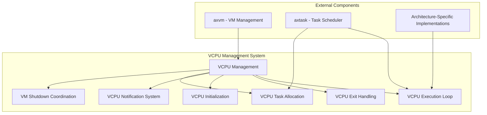
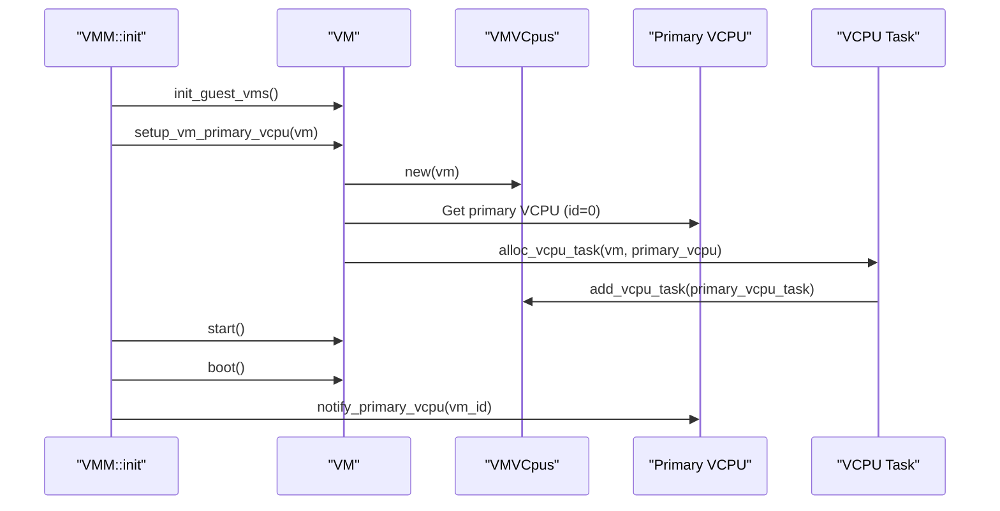
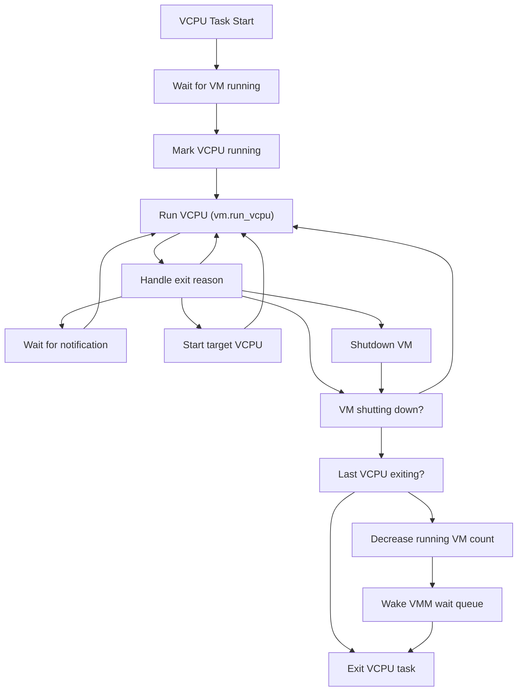
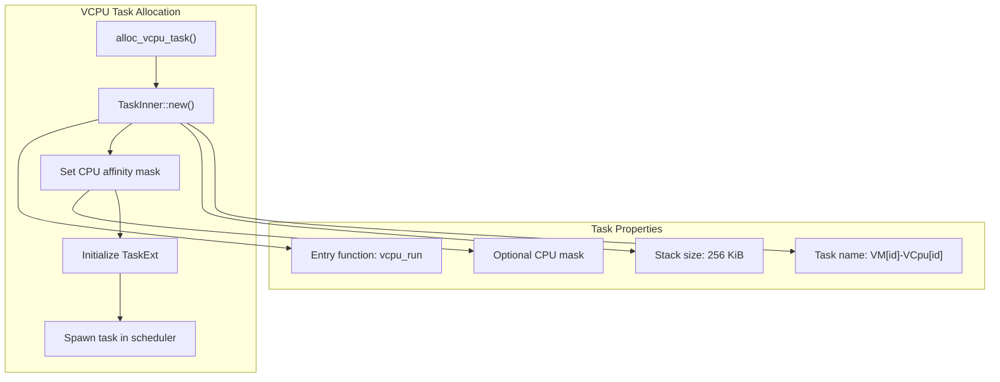
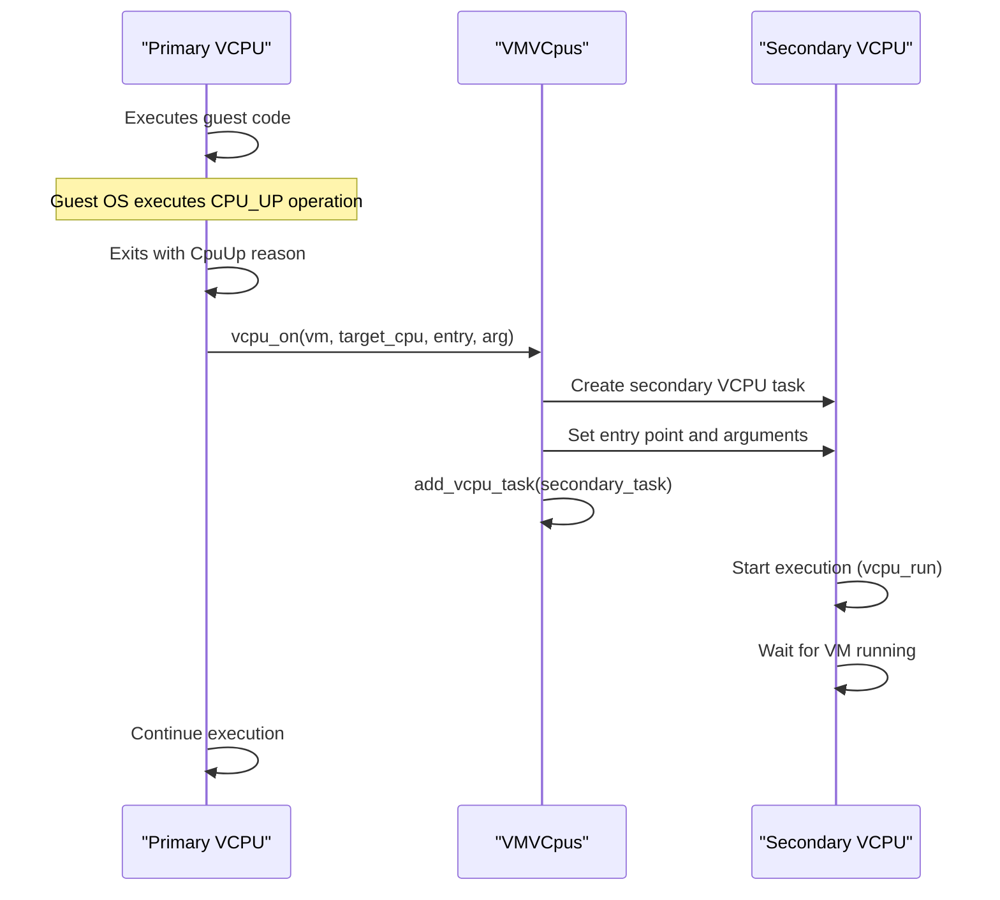
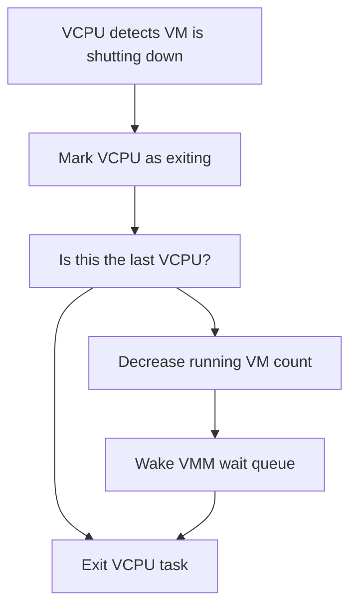

# VCPU Management

> **Relevant source files**
> * [Cargo.lock](https://github.com/arceos-hypervisor/axvisor/blob/0c9b89a5/Cargo.lock)
> * [src/task.rs](https://github.com/arceos-hypervisor/axvisor/blob/0c9b89a5/src/task.rs)
> * [src/vmm/config.rs](https://github.com/arceos-hypervisor/axvisor/blob/0c9b89a5/src/vmm/config.rs)
> * [src/vmm/mod.rs](https://github.com/arceos-hypervisor/axvisor/blob/0c9b89a5/src/vmm/mod.rs)
> * [src/vmm/vcpus.rs](https://github.com/arceos-hypervisor/axvisor/blob/0c9b89a5/src/vmm/vcpus.rs)

This page documents the VCPU (Virtual CPU) management system in AxVisor, focusing on how virtual CPUs are implemented, initialized, scheduled, and monitored throughout their lifecycle. For information about the overall VM management, see [VM Management](/arceos-hypervisor/axvisor/2.2-vm-management). For timer-related aspects of VCPUs, see [Timer Subsystem](/arceos-hypervisor/axvisor/5.3-timer-subsystem).

## Overview

AxVisor implements a task-based VCPU execution model, where each VCPU runs as a separate task in the ArceOS task scheduler. This design allows multiple VCPUs to be efficiently managed across physical CPUs, with mechanisms for coordination, notification, and state tracking.



Sources: [src/vmm/vcpus.rs(L1 - L368)&emsp;](https://github.com/arceos-hypervisor/axvisor/blob/0c9b89a5/src/vmm/vcpus.rs#L1-L368) [src/vmm/mod.rs(L1 - L66)&emsp;](https://github.com/arceos-hypervisor/axvisor/blob/0c9b89a5/src/vmm/mod.rs#L1-L66) [src/task.rs(L1 - L19)&emsp;](https://github.com/arceos-hypervisor/axvisor/blob/0c9b89a5/src/task.rs#L1-L19)

## VCPU Architecture and Implementation

AxVisor's VCPU management is based on a cross-architecture design that abstracts hardware-specific details. The system includes platform-specific VCPU implementations for x86_64, ARM, and RISC-V architectures, all conforming to a common interface defined by `axvcpu`.

### VCPU Type Hierarchy

```

```

Sources: [src/vmm/mod.rs(L15 - L20)&emsp;](https://github.com/arceos-hypervisor/axvisor/blob/0c9b89a5/src/vmm/mod.rs#L15-L20) [src/vmm/vcpus.rs(L175 - L201)&emsp;](https://github.com/arceos-hypervisor/axvisor/blob/0c9b89a5/src/vmm/vcpus.rs#L175-L201)

### VCPU and Task Relationship

Each VCPU in AxVisor is associated with an ArceOS task, which is scheduled by the underlying task scheduler. This relationship is established through the `TaskExt` structure that extends ArceOS tasks with VCPU-specific information.

|Component|Purpose|
| --- | --- |
|TaskExt|Extension to ArceOS tasks that holds references to VM and VCPU|
|VCpuRef|Reference to a VCPU instance, architecture-specific implementation|
|VMRef|Reference to the VM that owns the VCPU|

Source: [src/task.rs(L1 - L19)&emsp;](https://github.com/arceos-hypervisor/axvisor/blob/0c9b89a5/src/task.rs#L1-L19)

## VCPU Lifecycle

### VCPU Initialization

VCPUs are initialized during the VMM startup process. The primary VCPU (VCPU 0) for each VM is set up first, while secondary VCPUs can be started on demand.



Sources: [src/vmm/mod.rs(L27 - L39)&emsp;](https://github.com/arceos-hypervisor/axvisor/blob/0c9b89a5/src/vmm/mod.rs#L27-L39) [src/vmm/vcpus.rs(L211 - L231)&emsp;](https://github.com/arceos-hypervisor/axvisor/blob/0c9b89a5/src/vmm/vcpus.rs#L211-L231)

### VCPU Execution Loop

The main VCPU execution loop is implemented in the `vcpu_run` function, which is the entry point for all VCPU tasks. The VCPU waits for the VM to be in a running state, then enters a loop where it runs the VCPU and handles various exit reasons.



Sources: [src/vmm/vcpus.rs(L270 - L367)&emsp;](https://github.com/arceos-hypervisor/axvisor/blob/0c9b89a5/src/vmm/vcpus.rs#L270-L367)

## VCPU Task Management

### Task Allocation

Each VCPU runs as a separate ArceOS task, allocated with a dedicated kernel stack. The `alloc_vcpu_task` function creates a task for a VCPU, initializes it with VCPU-specific information, and configures its CPU affinity if specified.



Sources: [src/vmm/vcpus.rs(L232 - L268)&emsp;](https://github.com/arceos-hypervisor/axvisor/blob/0c9b89a5/src/vmm/vcpus.rs#L232-L268)

### Task Structure: VMVCpus

The `VMVCpus` structure maintains the state of all VCPUs for a specific VM, including:

|Field|Purpose|
| --- | --- |
|_vm_id|ID of the VM to which these VCPUs belong|
|wait_queue|Wait queue for VCPU task scheduling|
|vcpu_task_list|List of tasks associated with the VCPUs|
|running_halting_vcpu_count|Counter for running/halting VCPUs to track VM shutdown|

Sources: [src/vmm/vcpus.rs(L25 - L40)&emsp;](https://github.com/arceos-hypervisor/axvisor/blob/0c9b89a5/src/vmm/vcpus.rs#L25-L40)

## VCPU Exit Handling

When a VCPU exits from guest mode, the exit reason is handled in the `vcpu_run` function. The system supports various exit reasons, including:

|Exit Reason|Description|Handling Behavior|
| --- | --- | --- |
|Hypercall|Guest OS making a call to the hypervisor|Process hypercall and continue|
|ExternalInterrupt|Hardware interrupt delivered to host|Handle interrupt and continue|
|Halt|VCPU in halted state|Wait for notification to continue|
|CpuUp|Request to start another VCPU|Boot target VCPU and continue|
|CpuDown|VCPU being stopped|Wait for notification to continue|
|SystemDown|Guest OS shutting down|Shut down the VM|
|FailEntry|Failed to enter guest mode|Report error and continue|

Sources: [src/vmm/vcpus.rs(L290 - L343)&emsp;](https://github.com/arceos-hypervisor/axvisor/blob/0c9b89a5/src/vmm/vcpus.rs#L290-L343)

## Multi-VCPU Coordination

### Primary and Secondary VCPUs

AxVisor distinguishes between the primary VCPU (typically VCPU 0) and secondary VCPUs. The primary VCPU is initialized during VM setup, while secondary VCPUs can be started on demand through the `CpuUp` exit reason.



Sources: [src/vmm/vcpus.rs(L179 - L208)&emsp;](https://github.com/arceos-hypervisor/axvisor/blob/0c9b89a5/src/vmm/vcpus.rs#L179-L208) [src/vmm/vcpus.rs(L319 - L330)&emsp;](https://github.com/arceos-hypervisor/axvisor/blob/0c9b89a5/src/vmm/vcpus.rs#L319-L330)

### VM Shutdown Coordination

When a VM is shutting down, all VCPUs must exit properly. The last VCPU to exit is responsible for notifying the VMM that the VM has fully shut down.



Sources: [src/vmm/vcpus.rs(L345 - L366)&emsp;](https://github.com/arceos-hypervisor/axvisor/blob/0c9b89a5/src/vmm/vcpus.rs#L345-L366) [src/vmm/mod.rs(L55 - L64)&emsp;](https://github.com/arceos-hypervisor/axvisor/blob/0c9b89a5/src/vmm/mod.rs#L55-L64)

## Wait Queue System

AxVisor uses a wait queue system to coordinate VCPU execution. The `WaitQueue` in VMVCpus allows VCPUs to block when they are halted and to be woken up when needed.

|Wait Queue Operation|Purpose|
| --- | --- |
|wait()|Block the current VCPU task unconditionally|
|wait_until(condition)|Block until a condition is met|
|notify_one()|Wake up one waiting VCPU task|

Sources: [src/vmm/vcpus.rs(L72 - L89)&emsp;](https://github.com/arceos-hypervisor/axvisor/blob/0c9b89a5/src/vmm/vcpus.rs#L72-L89) [src/vmm/vcpus.rs(L117 - L138)&emsp;](https://github.com/arceos-hypervisor/axvisor/blob/0c9b89a5/src/vmm/vcpus.rs#L117-L138)

## Cross-Architecture VCPU Implementation

AxVisor supports multiple architectures through architecture-specific VCPU implementations. Each platform has its own VCPU implementation that conforms to the `axvcpu` interface.

|Architecture|Implementation|Special Considerations|
| --- | --- | --- |
|ARM/aarch64|arm_vcpu|Uses ARM-specific registers and virtualization extensions|
|x86_64|x86_vcpu|Leverages VT-x/VMX for virtualization|
|RISC-V|riscv_vcpu|Uses RISC-V virtualization extensions and SBI|

Sources: [src/vmm/mod.rs(L15 - L20)&emsp;](https://github.com/arceos-hypervisor/axvisor/blob/0c9b89a5/src/vmm/mod.rs#L15-L20) [src/vmm/vcpus.rs(L193 - L201)&emsp;](https://github.com/arceos-hypervisor/axvisor/blob/0c9b89a5/src/vmm/vcpus.rs#L193-L201)