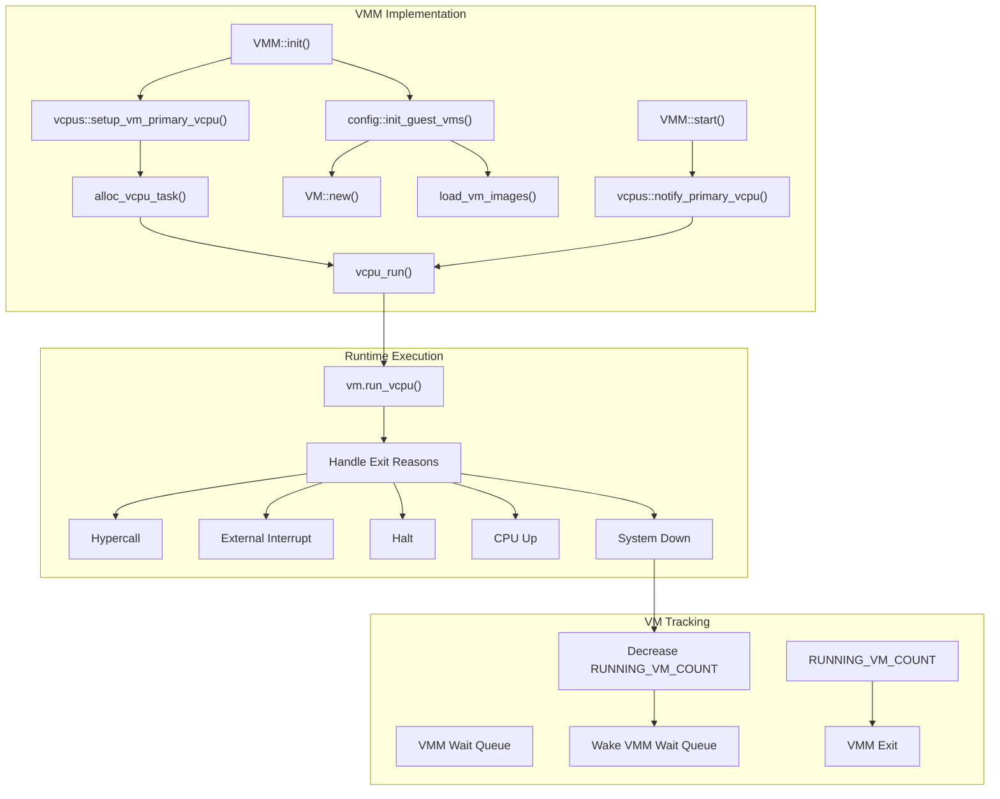
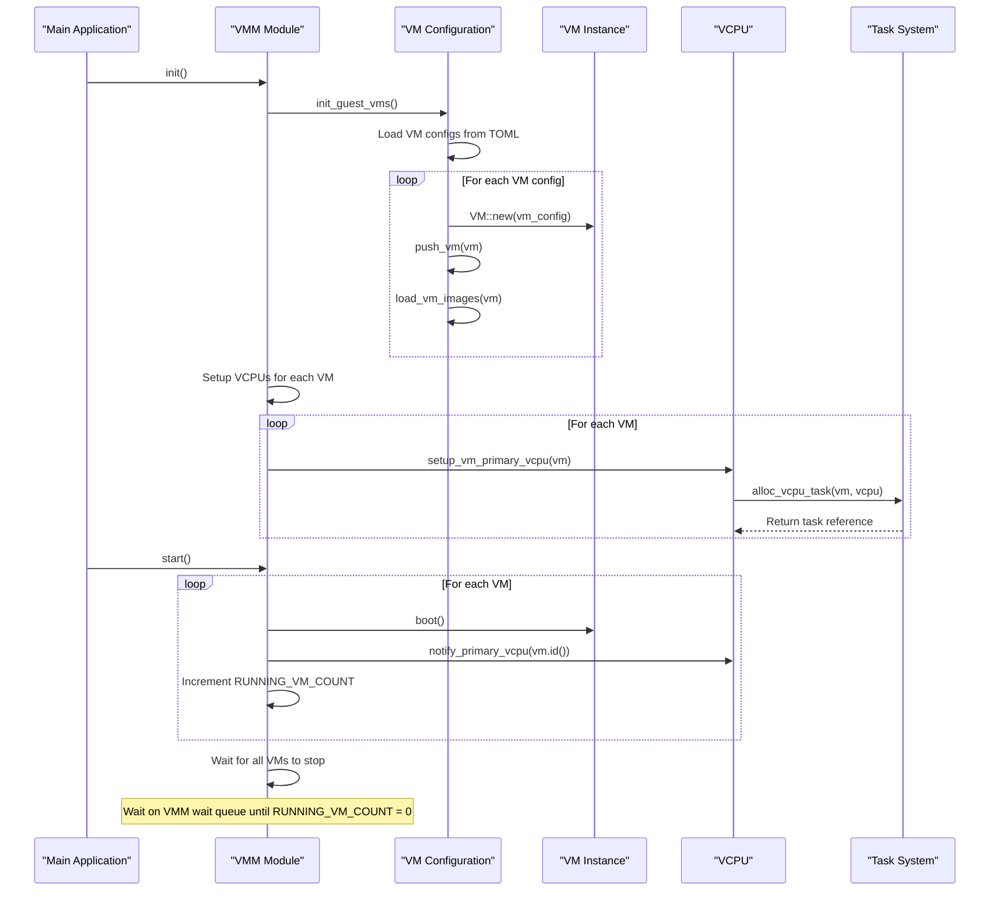
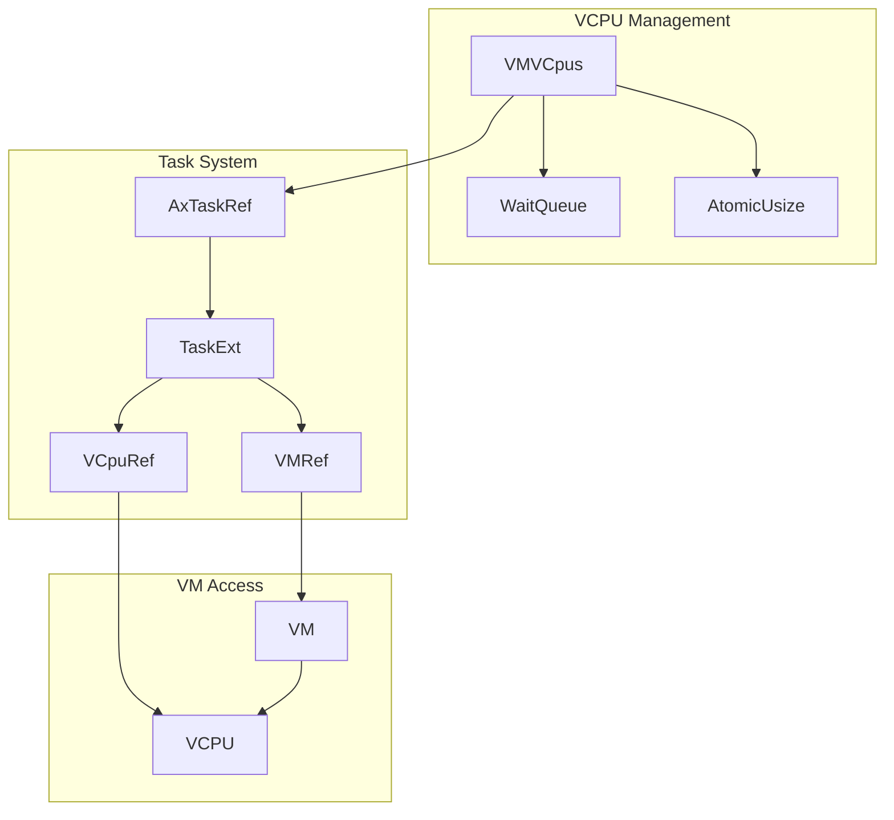
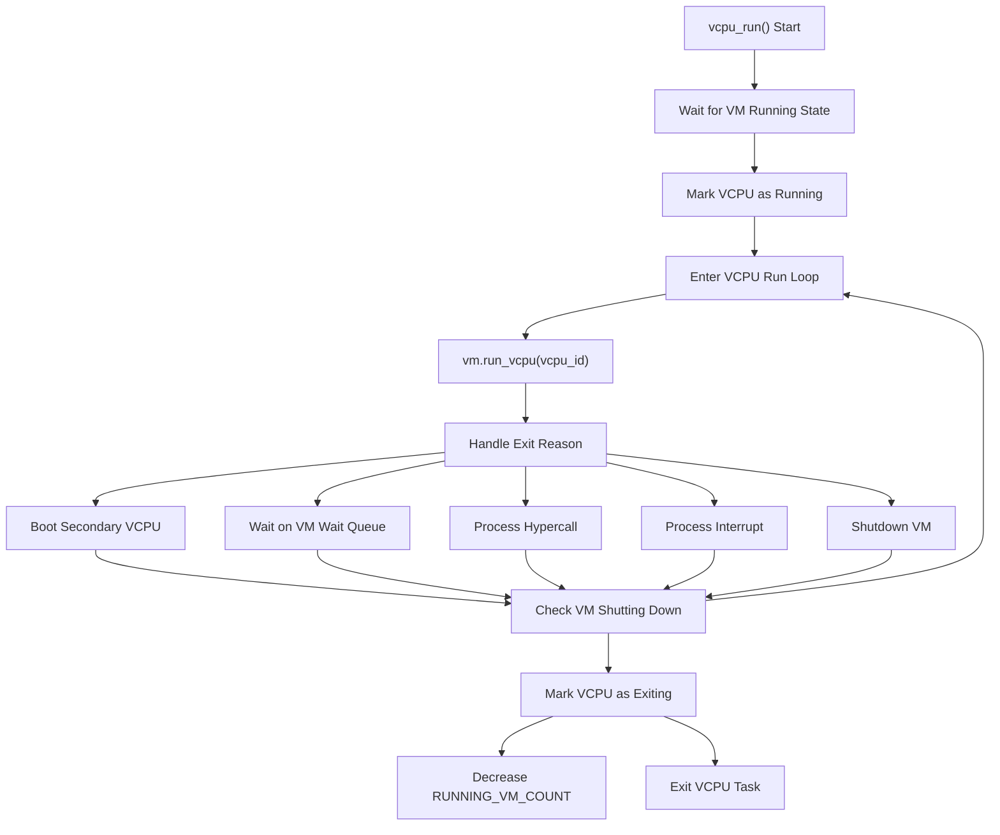
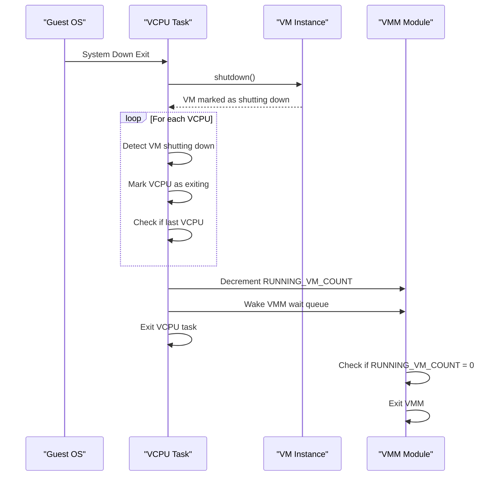

# VMM Implementation

> **Relevant source files**
> * [Cargo.lock](https://github.com/arceos-hypervisor/axvisor/blob/0c9b89a5/Cargo.lock)
> * [src/task.rs](https://github.com/arceos-hypervisor/axvisor/blob/0c9b89a5/src/task.rs)
> * [src/vmm/config.rs](https://github.com/arceos-hypervisor/axvisor/blob/0c9b89a5/src/vmm/config.rs)
> * [src/vmm/mod.rs](https://github.com/arceos-hypervisor/axvisor/blob/0c9b89a5/src/vmm/mod.rs)
> * [src/vmm/vcpus.rs](https://github.com/arceos-hypervisor/axvisor/blob/0c9b89a5/src/vmm/vcpus.rs)

This document details the implementation of the Virtual Machine Manager (VMM) in AxVisor. The VMM is the core component responsible for creating, managing, and supervising virtual machines in the hypervisor. For information about specific VCPU management, see [VCPU Management](/arceos-hypervisor/axvisor/5.2-vcpu-management).

## Overview

The VMM in AxVisor orchestrates the complete lifecycle of virtual machines, from initialization and booting to handling runtime events and shutdown. It provides a unified framework for managing VMs across multiple architectures (x86_64, aarch64, and RISC-V) while abstracting hardware-specific details.



Sources: [src/vmm/mod.rs(L28 - L65)&emsp;](https://github.com/arceos-hypervisor/axvisor/blob/0c9b89a5/src/vmm/mod.rs#L28-L65) [src/vmm/vcpus.rs(L268 - L367)&emsp;](https://github.com/arceos-hypervisor/axvisor/blob/0c9b89a5/src/vmm/vcpus.rs#L268-L367)

## Key Components

The VMM implementation consists of several interconnected components that work together to manage virtual machines:

|Component|Description|Key Files|
| --- | --- | --- |
|VMM Core|Initializes the VMM and starts VMs|src/vmm/mod.rs|
|VM Configuration|Loads and processes VM configurations|src/vmm/config.rs|
|VCPU Management|Manages VCPU tasks and execution|src/vmm/vcpus.rs|
|Task Extensions|Extends tasks to support VM and VCPU references|src/task.rs|
|VM List|Maintains a list of all VMs|src/vmm/vm_list.rs|
|Image Loading|Handles loading guest VM images|src/vmm/images.rs|

Sources: [src/vmm/mod.rs(L1 - L7)&emsp;](https://github.com/arceos-hypervisor/axvisor/blob/0c9b89a5/src/vmm/mod.rs#L1-L7) [src/task.rs(L1 - L19)&emsp;](https://github.com/arceos-hypervisor/axvisor/blob/0c9b89a5/src/task.rs#L1-L19)

## Initialization and Startup Flow

The VMM initialization and startup process follows a specific sequence to properly set up and boot virtual machines.



Sources: [src/vmm/mod.rs(L28 - L65)&emsp;](https://github.com/arceos-hypervisor/axvisor/blob/0c9b89a5/src/vmm/mod.rs#L28-L65) [src/vmm/config.rs(L25 - L43)&emsp;](https://github.com/arceos-hypervisor/axvisor/blob/0c9b89a5/src/vmm/config.rs#L25-L43)

### VMM Initialization

The VMM initialization process begins with the `init()` function, which performs two main tasks:

1. **VM Configuration Loading**: The system loads VM configurations from TOML files and creates VM instances for each configuration.
2. **VCPU Setup**: For each VM, the primary VCPU is set up, and a task is created to run it.

```rust
pub fn init() {
    // Initialize guest VM according to config file.
    config::init_guest_vms();

    // Setup vcpus, spawn axtask for primary VCpu.
    info!("Setting up vcpus...");
    for vm in vm_list::get_vm_list() {
        vcpus::setup_vm_primary_vcpu(vm);
    }
}
```

Sources: [src/vmm/mod.rs(L28 - L39)&emsp;](https://github.com/arceos-hypervisor/axvisor/blob/0c9b89a5/src/vmm/mod.rs#L28-L39)

### VMM Startup

After initialization, the `start()` function boots all VMs and waits for them to complete:

1. **VM Boot**: Each VM is booted, and its primary VCPU is notified to start execution.
2. **VM Tracking**: The system tracks the number of running VMs using the `RUNNING_VM_COUNT` atomic counter.
3. **Wait for Completion**: The VMM waits on a wait queue until all VMs have stopped (`RUNNING_VM_COUNT` reaches 0).

```javascript
pub fn start() {
    info!("VMM starting, booting VMs...");
    for vm in vm_list::get_vm_list() {
        match vm.boot() {
            Ok(_) => {
                vcpus::notify_primary_vcpu(vm.id());
                RUNNING_VM_COUNT.fetch_add(1, Ordering::Release);
                info!("VM[{}] boot success", vm.id())
            }
            Err(err) => warn!("VM[{}] boot failed, error {:?}", vm.id(), err),
        }
    }

    // Do not exit until all VMs are stopped.
    task::ax_wait_queue_wait_until(
        &VMM,
        || {
            let vm_count = RUNNING_VM_COUNT.load(Ordering::Acquire);
            info!("a VM exited, current running VM count: {}", vm_count);
            vm_count == 0
        },
        None,
    );
}
```

Sources: [src/vmm/mod.rs(L42 - L65)&emsp;](https://github.com/arceos-hypervisor/axvisor/blob/0c9b89a5/src/vmm/mod.rs#L42-L65)

## VCPU Task Management

The VCPU management system is a critical component of the VMM, responsible for setting up, scheduling, and managing VCPU tasks.

### VCPU Task Structure

Each VCPU runs in its own task, managed by the task system. The task extensions (`TaskExt`) store references to both the VM and VCPU, allowing easy access to these components from within the task context.



Sources: [src/task.rs(L1 - L19)&emsp;](https://github.com/arceos-hypervisor/axvisor/blob/0c9b89a5/src/task.rs#L1-L19) [src/vmm/vcpus.rs(L27 - L40)&emsp;](https://github.com/arceos-hypervisor/axvisor/blob/0c9b89a5/src/vmm/vcpus.rs#L27-L40)

### VCPU Task Creation

The `alloc_vcpu_task` function creates a new task for a VCPU and initializes it with the appropriate VM and VCPU references:

1. Create a new task with the `vcpu_run` function as its entry point
2. Set the CPU mask if the VCPU has a dedicated physical CPU
3. Initialize the task extension with VM and VCPU references
4. Spawn the task on the scheduler

```javascript
fn alloc_vcpu_task(vm: VMRef, vcpu: VCpuRef) -> AxTaskRef {
    let mut vcpu_task = TaskInner::new(
        vcpu_run,
        format!("VM[{}]-VCpu[{}]", vm.id(), vcpu.id()),
        KERNEL_STACK_SIZE,
    );

    if let Some(phys_cpu_set) = vcpu.phys_cpu_set() {
        vcpu_task.set_cpumask(AxCpuMask::from_raw_bits(phys_cpu_set));
    }
    vcpu_task.init_task_ext(TaskExt::new(vm, vcpu));

    axtask::spawn_task(vcpu_task)
}
```

Sources: [src/vmm/vcpus.rs(L249 - L268)&emsp;](https://github.com/arceos-hypervisor/axvisor/blob/0c9b89a5/src/vmm/vcpus.rs#L249-L268)

## VCPU Execution Flow

The execution of a VCPU is managed by the `vcpu_run` function, which runs in the context of the VCPU task.



Sources: [src/vmm/vcpus.rs(L275 - L367)&emsp;](https://github.com/arceos-hypervisor/axvisor/blob/0c9b89a5/src/vmm/vcpus.rs#L275-L367)

### VCPU Execution Loop

The VCPU execution loop performs the following steps:

1. Wait for the VM to be in a running state
2. Mark the VCPU as running
3. Enter the main execution loop:
* Run the VCPU
* Handle various exit reasons
* Check if the VM is shutting down
4. If the VM is shutting down:
* Mark the VCPU as exiting
* If this is the last VCPU to exit, decrement the running VM count
* Exit the VCPU task

```javascript
fn vcpu_run() {
    let curr = axtask::current();
    let vm = curr.task_ext().vm.clone();
    let vcpu = curr.task_ext().vcpu.clone();
    // ... [Initialization code]
    
    // Wait for VM to be in running state
    wait_for(vm_id, || vm.running());
    
    // Mark VCPU as running
    mark_vcpu_running(vm_id);
    
    // Main execution loop
    loop {
        match vm.run_vcpu(vcpu_id) {
            Ok(exit_reason) => match exit_reason {
                // ... [Handle various exit reasons]
            },
            Err(err) => {
                // ... [Handle error]
            }
        }
        
        // Check if VM is shutting down
        if vm.shutting_down() {
            // ... [Handle shutdown]
            if mark_vcpu_exiting(vm_id) {
                // Last VCPU exiting
                super::RUNNING_VM_COUNT.fetch_sub(1, Ordering::Release);
                ax_wait_queue_wake(&super::VMM, 1);
            }
            break;
        }
    }
}
```

Sources: [src/vmm/vcpus.rs(L275 - L367)&emsp;](https://github.com/arceos-hypervisor/axvisor/blob/0c9b89a5/src/vmm/vcpus.rs#L275-L367)

## VM and VCPU State Management

The VMM maintains the state of VMs and VCPUs through a combination of atomic counters and wait queues.

### VM State Tracking

The VMM tracks running VMs using the `RUNNING_VM_COUNT` atomic counter. When all VMs have stopped (`RUNNING_VM_COUNT` reaches 0), the VMM is signaled to exit.

```
static RUNNING_VM_COUNT: AtomicUsize = AtomicUsize::new(0);
static VMM: AxWaitQueueHandle = AxWaitQueueHandle::new();
```

Sources: [src/vmm/mod.rs(L22 - L25)&emsp;](https://github.com/arceos-hypervisor/axvisor/blob/0c9b89a5/src/vmm/mod.rs#L22-L25)

### VCPU State Management

The VCPU state management involves:

1. **Wait Queues**: Each VM has a wait queue to manage its VCPUs
2. **VCPU Task List**: Each VM maintains a list of VCPU tasks
3. **Running/Halting Count**: The system tracks the number of running or halting VCPUs for each VM

```css
pub struct VMVCpus {
    _vm_id: usize,
    wait_queue: WaitQueue,
    vcpu_task_list: Vec<AxTaskRef>,
    running_halting_vcpu_count: AtomicUsize,
}
```

Sources: [src/vmm/vcpus.rs(L27 - L40)&emsp;](https://github.com/arceos-hypervisor/axvisor/blob/0c9b89a5/src/vmm/vcpus.rs#L27-L40)

## Secondary VCPU Management

While primary VCPUs are set up during VMM initialization, secondary VCPUs can be dynamically started by the guest OS through the `CPU Up` exit reason.

When a running VCPU requests to start a secondary VCPU, the system:

1. Sets up the entry point and arguments for the new VCPU
2. Creates a new VCPU task
3. Adds the task to the VM's VCPU task list

```javascript
fn vcpu_on(vm: VMRef, vcpu_id: usize, entry_point: GuestPhysAddr, arg: usize) {
    let vcpu = vm.vcpu_list()[vcpu_id].clone();
    
    // Setup VCPU entry point and arguments
    vcpu.set_entry(entry_point).expect("vcpu_on: set_entry failed");
    vcpu.set_gpr(0, arg);
    
    // Create and add VCPU task
    let vcpu_task = alloc_vcpu_task(vm.clone(), vcpu);
    unsafe { VM_VCPU_TASK_WAIT_QUEUE.get_mut(&vm.id()) }
        .unwrap()
        .add_vcpu_task(vcpu_task);
}
```

Sources: [src/vmm/vcpus.rs(L179 - L208)&emsp;](https://github.com/arceos-hypervisor/axvisor/blob/0c9b89a5/src/vmm/vcpus.rs#L179-L208)

## VM Shutdown Process

When a VM shuts down, the following steps occur:

1. The VM is marked as shutting down
2. Each VCPU detects the shutdown state in its execution loop
3. The last VCPU to exit decrements the `RUNNING_VM_COUNT`
4. When `RUNNING_VM_COUNT` reaches 0, the VMM wait queue is signaled
5. The VMM exits its wait loop and the hypervisor can terminate

This coordinated shutdown ensures proper cleanup of resources and allows the hypervisor to exit cleanly.



Sources: [src/vmm/vcpus.rs(L345 - L363)&emsp;](https://github.com/arceos-hypervisor/axvisor/blob/0c9b89a5/src/vmm/vcpus.rs#L345-L363) [src/vmm/mod.rs(L55 - L64)&emsp;](https://github.com/arceos-hypervisor/axvisor/blob/0c9b89a5/src/vmm/mod.rs#L55-L64)

## Summary

The VMM implementation in AxVisor provides a robust foundation for managing virtual machines across multiple architectures. Key aspects of this implementation include:

1. **Centralized VM Management**: The VMM initializes, boots, and tracks all VMs in the system.
2. **VCPU Task System**: Each VCPU runs in its own task, managed by the task scheduler.
3. **Coordinated Shutdown**: The system ensures proper cleanup and coordination during VM shutdown.
4. **State Tracking**: The VMM maintains clear state tracking for VMs and VCPUs.
5. **Secondary VCPU Support**: The system supports dynamically starting secondary VCPUs.

This implementation enables AxVisor to efficiently manage multiple guest VMs while providing a clean architecture for future extensions.