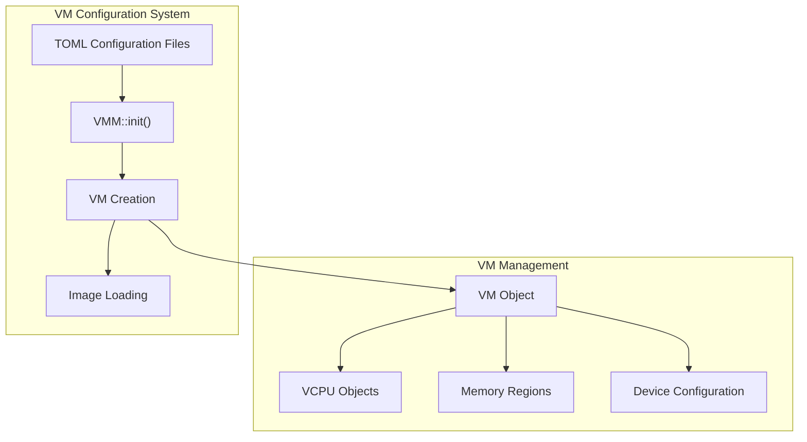
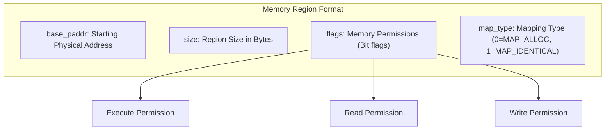
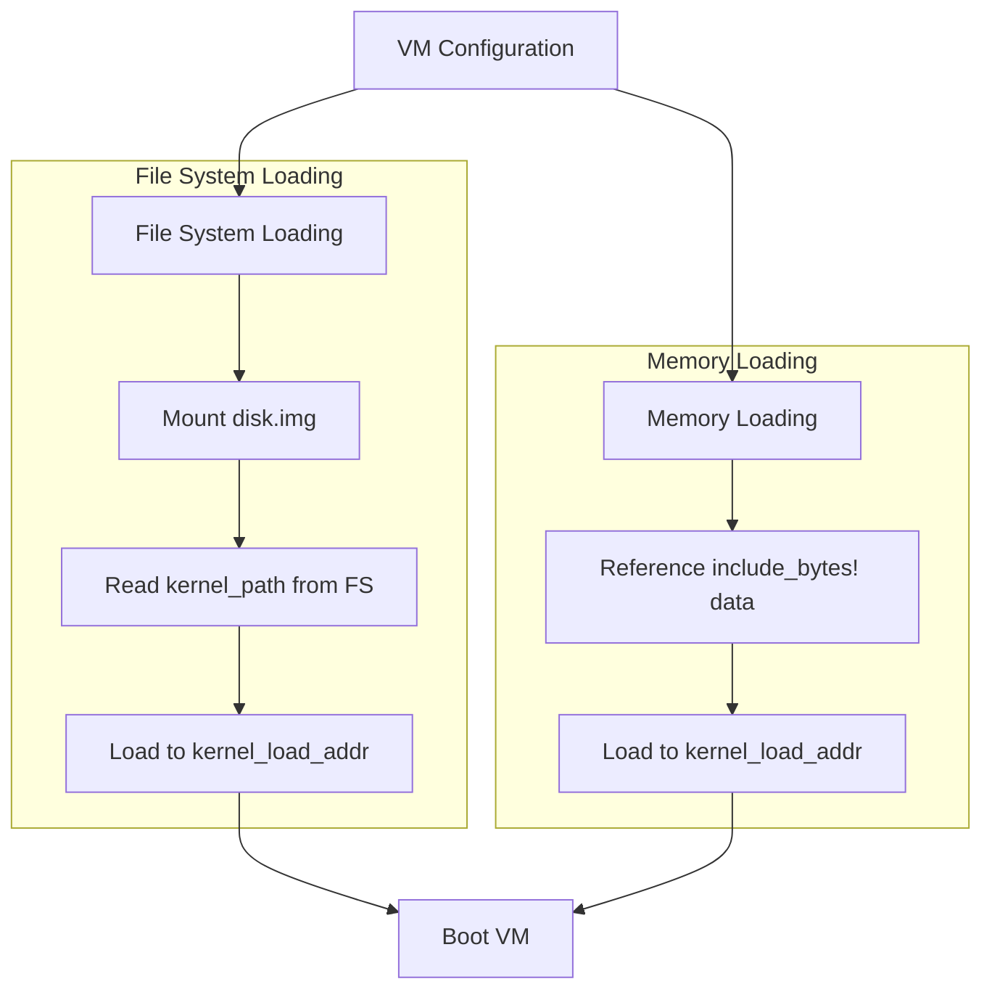
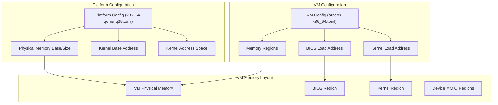
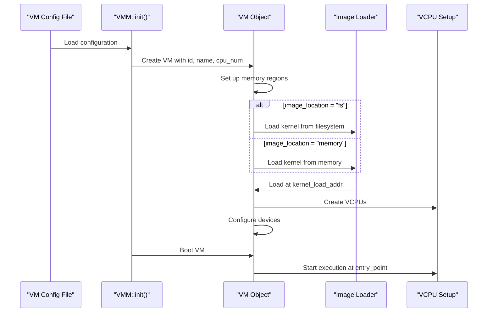
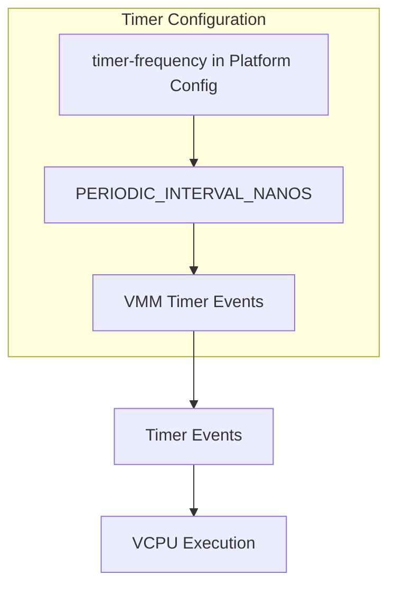

# VM Configuration

> **Relevant source files**
> * [README.md](https://github.com/arceos-hypervisor/axvisor/blob/0c9b89a5/README.md)
> * [configs/platforms/x86_64-qemu-q35.toml](https://github.com/arceos-hypervisor/axvisor/blob/0c9b89a5/configs/platforms/x86_64-qemu-q35.toml)
> * [configs/vms/arceos-x86_64.toml](https://github.com/arceos-hypervisor/axvisor/blob/0c9b89a5/configs/vms/arceos-x86_64.toml)
> * [configs/vms/nimbos-x86_64.toml](https://github.com/arceos-hypervisor/axvisor/blob/0c9b89a5/configs/vms/nimbos-x86_64.toml)
> * [scripts/lds/linker.lds.S](https://github.com/arceos-hypervisor/axvisor/blob/0c9b89a5/scripts/lds/linker.lds.S)
> * [src/vmm/timer.rs](https://github.com/arceos-hypervisor/axvisor/blob/0c9b89a5/src/vmm/timer.rs)

This page describes how to configure virtual machines (VMs) in AxVisor. The configuration system uses TOML files to define VM properties, including basic VM information, kernel image details, memory layout, and device specifications. For information about platform-specific configuration options, see [Platform-Specific Configuration](/arceos-hypervisor/axvisor/3.2-platform-specific-configuration).

## Configuration Overview

AxVisor uses a structured configuration approach that allows users to declaratively define VM properties using TOML files. These configuration files are processed during VM initialization and determine how VMs are created, what resources they receive, and how they interact with the host system.



Sources: [README.md(L69 - L78)&emsp;](https://github.com/arceos-hypervisor/axvisor/blob/0c9b89a5/README.md#L69-L78) [configs/vms/arceos-x86_64.toml(L1 - L78)&emsp;](https://github.com/arceos-hypervisor/axvisor/blob/0c9b89a5/configs/vms/arceos-x86_64.toml#L1-L78)

## Configuration File Structure

The VM configuration file is divided into three main sections: `[base]`, `[kernel]`, and `[devices]`.

### Base Configuration

The `[base]` section defines fundamental VM properties:

```markdown
[base]
# Guest vm id.
id = 1
# Guest vm name.
name = "arceos"
# Virtualization type.
vm_type = 1
# The number of virtual CPUs.
cpu_num = 1
# Guest vm physical cpu sets.
phys_cpu_sets = [1]
```

|Parameter|Description|Example|
| --- | --- | --- |
|id|Unique identifier for the VM|1|
|name|Descriptive name for the VM|"arceos"|
|vm_type|Type of virtualization (1 = full virtualization)|1|
|cpu_num|Number of virtual CPUs allocated to the VM|1|
|phys_cpu_sets|Physical CPU cores assigned to the VM|[1]|

Sources: [configs/vms/arceos-x86_64.toml(L1 - L13)&emsp;](https://github.com/arceos-hypervisor/axvisor/blob/0c9b89a5/configs/vms/arceos-x86_64.toml#L1-L13) [configs/vms/nimbos-x86_64.toml(L1 - L13)&emsp;](https://github.com/arceos-hypervisor/axvisor/blob/0c9b89a5/configs/vms/nimbos-x86_64.toml#L1-L13)

### Kernel Configuration

The `[kernel]` section specifies how the guest kernel image should be loaded and executed:

```markdown
[kernel]
# The entry point of the kernel image.
entry_point = 0x8000
# The location of image: "memory" | "fs".
image_location = "fs"
# The file path of the BIOS image.
bios_path = "axvm-bios.bin"
# The load address of the BIOS image.
bios_load_addr = 0x8000
# The file path of the kernel image.
kernel_path = "arceos-x86_64.bin"
# The load address of the kernel image.
kernel_load_addr = 0x20_0000

# Memory regions with format (`base_paddr`, `size`, `flags`, `map_type`).
# For `map_type`, 0 means `MAP_ALLOC`, 1 means `MAP_IDENTICAL`.
memory_regions = [
    [0x0000_0000, 0x100_0000, 0x7, 0], # Low RAM 16M 0b111
]
```

|Parameter|Description|Example|
| --- | --- | --- |
|entry_point|Starting execution address for the guest|0x8000|
|image_location|Source of the guest image ("memory" or "fs")|"fs"|
|bios_path|Path to BIOS image (for x86)|"axvm-bios.bin"|
|bios_load_addr|Memory address where BIOS should be loaded|0x8000|
|kernel_path|Path to kernel image|"arceos-x86_64.bin"|
|kernel_load_addr|Memory address where kernel should be loaded|0x20_0000|
|memory_regions|Memory regions allocated to the VM|[[0x0, 0x100_0000, 0x7, 0]]|

Sources: [configs/vms/arceos-x86_64.toml(L14 - L44)&emsp;](https://github.com/arceos-hypervisor/axvisor/blob/0c9b89a5/configs/vms/arceos-x86_64.toml#L14-L44) [configs/vms/nimbos-x86_64.toml(L14 - L44)&emsp;](https://github.com/arceos-hypervisor/axvisor/blob/0c9b89a5/configs/vms/nimbos-x86_64.toml#L14-L44)

### Device Configuration

The `[devices]` section defines both emulated and passthrough devices:

```markdown
[devices]
# Emu_devices.
# Name Base-Ipa Ipa_len Alloc-Irq Emu-Type EmuConfig.
emu_devices = []

# Pass-through devices.
# Name Base-Ipa Base-Pa Length Alloc-Irq.
passthrough_devices = [
    [
        "IO APIC",
        0xfec0_0000,
        0xfec0_0000,
        0x1000,
        0x1,
    ],
    [
        "Local APIC",
        0xfee0_0000,
        0xfee0_0000,
        0x1000,
        0x1,
    ],
]
```

|Parameter|Description|Format|
| --- | --- | --- |
|emu_devices|List of emulated devices|[Name, Base-Ipa, Ipa_len, Alloc-Irq, Emu-Type, EmuConfig]|
|passthrough_devices|List of passthrough devices|[Name, Base-Ipa, Base-Pa, Length, Alloc-Irq]|

Sources: [configs/vms/arceos-x86_64.toml(L46 - L78)&emsp;](https://github.com/arceos-hypervisor/axvisor/blob/0c9b89a5/configs/vms/arceos-x86_64.toml#L46-L78) [configs/vms/nimbos-x86_64.toml(L46 - L78)&emsp;](https://github.com/arceos-hypervisor/axvisor/blob/0c9b89a5/configs/vms/nimbos-x86_64.toml#L46-L78)

## Memory Region Configuration

Memory regions in the `memory_regions` parameter use a structured format:



### Memory Flags

The `flags` field defines memory permissions as bit flags:

* Bit 0 (0x1): Read permission
* Bit 1 (0x2): Write permission
* Bit 2 (0x4): Execute permission

Common combinations:

* `0x7` (0b111): Read + Write + Execute
* `0x3` (0b011): Read + Write
* `0x1` (0b001): Read-only

### Mapping Types

The `map_type` field defines how memory is mapped:

* `0` (`MAP_ALLOC`): Allocate new memory for the VM
* `1` (`MAP_IDENTICAL`): Identity map to physical memory (for passthrough)

Sources: [configs/vms/arceos-x86_64.toml(L40 - L44)&emsp;](https://github.com/arceos-hypervisor/axvisor/blob/0c9b89a5/configs/vms/arceos-x86_64.toml#L40-L44) [configs/vms/nimbos-x86_64.toml(L40 - L44)&emsp;](https://github.com/arceos-hypervisor/axvisor/blob/0c9b89a5/configs/vms/nimbos-x86_64.toml#L40-L44)

## Image Loading Methods

AxVisor supports two methods for loading guest images:



### File System Loading

When `image_location="fs"` is specified:

1. AxVisor mounts a FAT32 disk image file (typically `disk.img`)
2. Reads the kernel image from the specified `kernel_path`
3. Loads it into memory at `kernel_load_addr`

Required configuration:

* `image_location = "fs"`
* `kernel_path` (path within filesystem)
* `kernel_load_addr` (memory address for loading)
* Optionally, `bios_path` and `bios_load_addr` for x86

### Memory Loading

When `image_location="memory"` is specified:

1. The guest kernel image is statically compiled into the AxVisor binary
2. The image is loaded from memory at runtime

Required configuration:

* `image_location = "memory"`
* `kernel_path` (must point to a file in the workspace)
* `kernel_load_addr` (memory address for loading)
* Optionally, `bios_path` and `bios_load_addr` for x86

Sources: [README.md(L79 - L112)&emsp;](https://github.com/arceos-hypervisor/axvisor/blob/0c9b89a5/README.md#L79-L112)

## Configuration and Memory Layout Relationships

Each VM's memory layout is determined by both VM-specific configuration and platform-specific memory layouts:



Sources: [configs/vms/arceos-x86_64.toml(L40 - L44)&emsp;](https://github.com/arceos-hypervisor/axvisor/blob/0c9b89a5/configs/vms/arceos-x86_64.toml#L40-L44) [configs/platforms/x86_64-qemu-q35.toml(L13 - L28)&emsp;](https://github.com/arceos-hypervisor/axvisor/blob/0c9b89a5/configs/platforms/x86_64-qemu-q35.toml#L13-L28)

## Using the axvmconfig Tool

For complex VM configurations, AxVisor provides the `axvmconfig` tool that can generate custom configuration files. To use this tool:

1. Install the tool: `cargo install axvmconfig`
2. Define your VM configuration using the tool's syntax
3. Generate a TOML configuration file

See the [axvmconfig documentation](https://arceos-hypervisor.github.io/axvmconfig/axvmconfig/index.html) for detailed usage.

Sources: [README.md(L72 - L74)&emsp;](https://github.com/arceos-hypervisor/axvisor/blob/0c9b89a5/README.md#L72-L74)

## Example Configuration: ArceOS on x86_64

Here's an example of configuring an ArceOS guest on x86_64:

```markdown
# Vm base info configs
[base]
id = 1
name = "arceos"
vm_type = 1
cpu_num = 1
phys_cpu_sets = [1]

# Vm kernel configs
[kernel]
entry_point = 0x8000
image_location = "fs"
bios_path = "axvm-bios.bin"
bios_load_addr = 0x8000
kernel_path = "arceos-x86_64.bin"
kernel_load_addr = 0x20_0000

memory_regions = [
    [0x0000_0000, 0x100_0000, 0x7, 0], # Low RAM 16M with RWX permissions
]

# Device specifications
[devices]
emu_devices = []
passthrough_devices = [
    ["IO APIC", 0xfec0_0000, 0xfec0_0000, 0x1000, 0x1],
    ["Local APIC", 0xfee0_0000, 0xfee0_0000, 0x1000, 0x1],
    ["HPET", 0xfed0_0000, 0xfed0_0000, 0x1000, 0x1],
]
```

Sources: [configs/vms/arceos-x86_64.toml(L1 - L78)&emsp;](https://github.com/arceos-hypervisor/axvisor/blob/0c9b89a5/configs/vms/arceos-x86_64.toml#L1-L78)

## Boot Process with VM Configuration

During the boot process, AxVisor uses the VM configuration to set up and start the VM:



Sources: [README.md(L57 - L112)&emsp;](https://github.com/arceos-hypervisor/axvisor/blob/0c9b89a5/README.md#L57-L112) [src/vmm/timer.rs(L98 - L104)&emsp;](https://github.com/arceos-hypervisor/axvisor/blob/0c9b89a5/src/vmm/timer.rs#L98-L104)

## Timer Configuration

The VM timer subsystem is also affected by configuration settings:



Sources: [src/vmm/timer.rs(L1 - L104)&emsp;](https://github.com/arceos-hypervisor/axvisor/blob/0c9b89a5/src/vmm/timer.rs#L1-L104) [configs/platforms/x86_64-qemu-q35.toml(L56 - L57)&emsp;](https://github.com/arceos-hypervisor/axvisor/blob/0c9b89a5/configs/platforms/x86_64-qemu-q35.toml#L56-L57)

## Conclusion

AxVisor's VM configuration system provides a flexible and declarative way to define virtual machine properties. By using TOML configuration files, users can easily customize VM attributes without modifying code. The configuration system supports different image loading methods, memory configurations, and device setups, enabling a wide range of virtualization scenarios.

For platform-specific configuration options that complement VM configurations, see [Platform-Specific Configuration](/arceos-hypervisor/axvisor/3.2-platform-specific-configuration).