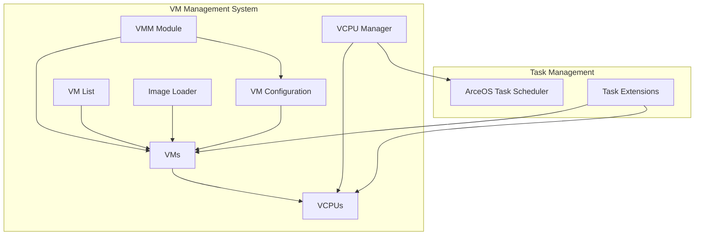
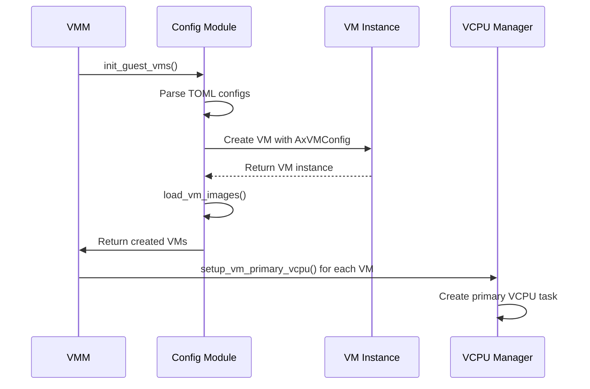
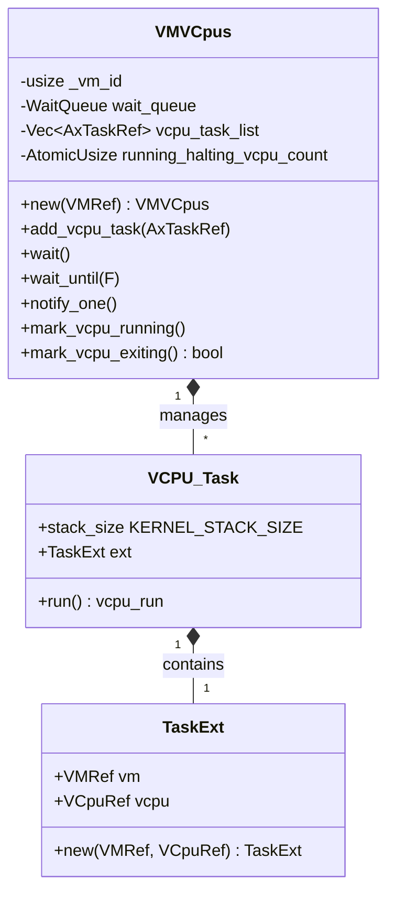

# VM Management

> **Relevant source files**
> * [Cargo.lock](https://github.com/arceos-hypervisor/axvisor/blob/0c9b89a5/Cargo.lock)
> * [src/task.rs](https://github.com/arceos-hypervisor/axvisor/blob/0c9b89a5/src/task.rs)
> * [src/vmm/config.rs](https://github.com/arceos-hypervisor/axvisor/blob/0c9b89a5/src/vmm/config.rs)
> * [src/vmm/mod.rs](https://github.com/arceos-hypervisor/axvisor/blob/0c9b89a5/src/vmm/mod.rs)
> * [src/vmm/vcpus.rs](https://github.com/arceos-hypervisor/axvisor/blob/0c9b89a5/src/vmm/vcpus.rs)

This document describes how virtual machines (VMs) are created, configured, and managed within the AxVisor hypervisor system. It explains the VM lifecycle from initialization through execution to shutdown, as well as the management of virtual CPUs (VCPUs) within each VM. For information about the underlying hardware abstraction layer, see [Hardware Abstraction Layer](/arceos-hypervisor/axvisor/2.3-hardware-abstraction-layer).

## VM Architecture Overview

AxVisor implements a modular VM management system that separates VM configuration, execution, and resource management concerns. The core components work together to create, execute, and monitor virtual machines.



Sources: [src/vmm/mod.rs](https://github.com/arceos-hypervisor/axvisor/blob/0c9b89a5/src/vmm/mod.rs) [src/task.rs](https://github.com/arceos-hypervisor/axvisor/blob/0c9b89a5/src/task.rs)

## VM Types and References

The VM management system uses specific types to represent VMs and VCPUs:

|Type|Description|Source|
| --- | --- | --- |
|VM|Instantiated VM type usingaxvm::AxVM<AxVMHalImpl, AxVCpuHalImpl>|src/vmm/mod.rs16|
|VMRef|VM reference type (shared viaArc)|src/vmm/mod.rs18|
|VCpuRef|VCPU reference type (shared viaArc)|src/vmm/mod.rs20|

These types provide the foundation for VM management operations, with reference types allowing shared access to VM and VCPU resources across different components and tasks.

Sources: [src/vmm/mod.rs(L16 - L20)&emsp;](https://github.com/arceos-hypervisor/axvisor/blob/0c9b89a5/src/vmm/mod.rs#L16-L20)

## VM Lifecycle

The VM lifecycle in AxVisor follows a defined sequence of operations, from initialization through execution to shutdown.

```

```

Sources: [src/vmm/mod.rs(L28 - L65)&emsp;](https://github.com/arceos-hypervisor/axvisor/blob/0c9b89a5/src/vmm/mod.rs#L28-L65) [src/vmm/vcpus.rs(L275 - L367)&emsp;](https://github.com/arceos-hypervisor/axvisor/blob/0c9b89a5/src/vmm/vcpus.rs#L275-L367)

### VM Initialization

The VMM initializes VMs through the following process:

1. Call `VMM::init()` to initialize guest VMs and set up primary VCPUs
2. Load VM configurations from TOML files
3. Create VM instances using `VM::new()`
4. Load VM images based on configuration
5. Set up primary VCPUs for each VM



Sources: [src/vmm/mod.rs(L28 - L39)&emsp;](https://github.com/arceos-hypervisor/axvisor/blob/0c9b89a5/src/vmm/mod.rs#L28-L39) [src/vmm/config.rs(L25 - L43)&emsp;](https://github.com/arceos-hypervisor/axvisor/blob/0c9b89a5/src/vmm/config.rs#L25-L43)

### VM Execution

The VMM starts VM execution:

1. Call `VMM::start()` to boot all VMs
2. For each VM, call `vm.boot()` to start execution
3. Notify the primary VCPU to begin execution
4. Increment `RUNNING_VM_COUNT` for each successfully started VM
5. Wait until all VMs are stopped (when `RUNNING_VM_COUNT` reaches 0)

VCPUs execute in their own tasks, handling various exit reasons such as hypercalls, interrupts, halts, and system shutdown events.

Sources: [src/vmm/mod.rs(L42 - L65)&emsp;](https://github.com/arceos-hypervisor/axvisor/blob/0c9b89a5/src/vmm/mod.rs#L42-L65) [src/vmm/vcpus.rs(L275 - L367)&emsp;](https://github.com/arceos-hypervisor/axvisor/blob/0c9b89a5/src/vmm/vcpus.rs#L275-L367)

## VM Configuration

AxVisor uses TOML-based configuration files to define VM properties:

1. Configuration files are stored in `configs/vms/` directory
2. Default configurations are provided for different architectures (x86_64, aarch64, riscv64)
3. Configurations define VM properties like ID, name, CPU count, memory regions, etc.
4. Configuration processing involves:
* Parsing TOML into `AxVMCrateConfig`
* Converting to `AxVMConfig` for VM creation
* Using configuration to load appropriate VM images

Sources: [src/vmm/config.rs(L1 - L43)&emsp;](https://github.com/arceos-hypervisor/axvisor/blob/0c9b89a5/src/vmm/config.rs#L1-L43)

## VCPU Management

VCPUs are managed for each VM, with special handling for the primary VCPU:



Sources: [src/vmm/vcpus.rs(L27 - L40)&emsp;](https://github.com/arceos-hypervisor/axvisor/blob/0c9b89a5/src/vmm/vcpus.rs#L27-L40) [src/task.rs(L6 - L11)&emsp;](https://github.com/arceos-hypervisor/axvisor/blob/0c9b89a5/src/task.rs#L6-L11)

### VCPU Initialization

For each VM, VCPUs are initialized:

1. `setup_vm_primary_vcpu()` is called for each VM
2. A `VMVCpus` structure is created to manage VCPUs for the VM
3. The primary VCPU (ID 0) is set up first
4. A task is created for the primary VCPU with the `vcpu_run` entry point
5. The VCPU task is added to the VM's VCPU task list
6. The VM's VCPU structure is stored in a global mapping

Sources: [src/vmm/vcpus.rs(L218 - L231)&emsp;](https://github.com/arceos-hypervisor/axvisor/blob/0c9b89a5/src/vmm/vcpus.rs#L218-L231)

### VCPU Task Creation

Each VCPU runs in its own ArceOS task:

1. `alloc_vcpu_task()` creates a task for a VCPU
2. Tasks are created with a 256 KiB kernel stack
3. The task's entry point is set to `vcpu_run()`
4. If configured, the VCPU is assigned to specific physical CPUs
5. The task is initialized with `TaskExt` containing references to the VM and VCPU
6. The task is spawned using `axtask::spawn_task()`

Sources: [src/vmm/vcpus.rs(L249 - L268)&emsp;](https://github.com/arceos-hypervisor/axvisor/blob/0c9b89a5/src/vmm/vcpus.rs#L249-L268) [src/task.rs(L1 - L19)&emsp;](https://github.com/arceos-hypervisor/axvisor/blob/0c9b89a5/src/task.rs#L1-L19)

### VCPU Execution Loop

The main VCPU execution flow is:

1. Wait for the VM to be in running state
2. Mark the VCPU as running, incrementing the running count
3. Enter execution loop:
* Run the VCPU using `vm.run_vcpu(vcpu_id)`
* Handle various exit reasons (hypercalls, interrupts, halts, etc.)
* Check if the VM is shutting down
4. When the VM is shutting down:
* Mark the VCPU as exiting
* If this was the last VCPU, decrement `RUNNING_VM_COUNT`
* Wake the VMM wait queue if necessary
* Exit the execution loop

Sources: [src/vmm/vcpus.rs(L275 - L367)&emsp;](https://github.com/arceos-hypervisor/axvisor/blob/0c9b89a5/src/vmm/vcpus.rs#L275-L367)

## Secondary VCPU Management

AxVisor supports dynamic secondary VCPU initialization:

1. When a primary VCPU requests to start a secondary VCPU (via `CpuUp` exit):
* `vcpu_on()` is called with the target VCPU ID, entry point, and argument
* The target VCPU's entry point and registers are set
* A new task is created for the secondary VCPU
* The task is added to the VM's VCPU task list
2. Secondary VCPUs follow the same execution loop as the primary VCPU

Sources: [src/vmm/vcpus.rs(L179 - L208)&emsp;](https://github.com/arceos-hypervisor/axvisor/blob/0c9b89a5/src/vmm/vcpus.rs#L179-L208) [src/vmm/vcpus.rs(L319 - L330)&emsp;](https://github.com/arceos-hypervisor/axvisor/blob/0c9b89a5/src/vmm/vcpus.rs#L319-L330)

## VM Coordination and Shutdown

VMs and VCPUs coordinate through wait queues:

1. `VMVCpus` maintains a wait queue for each VM
2. VCPUs can wait on the queue (e.g., when halted)
3. Other VCPUs can notify waiting VCPUs (e.g., for interrupt handling)
4. When a VM is shutting down, all VCPUs detect this condition
5. Each VCPU marks itself as exiting
6. The last exiting VCPU decrements `RUNNING_VM_COUNT`
7. When `RUNNING_VM_COUNT` reaches 0, the VMM itself is notified to exit

This coordination ensures proper cleanup when VMs are shut down.

Sources: [src/vmm/vcpus.rs(L42 - L108)&emsp;](https://github.com/arceos-hypervisor/axvisor/blob/0c9b89a5/src/vmm/vcpus.rs#L42-L108) [src/vmm/mod.rs(L55 - L65)&emsp;](https://github.com/arceos-hypervisor/axvisor/blob/0c9b89a5/src/vmm/mod.rs#L55-L65)

## VM Image Loading

VM images are loaded according to configuration:

1. Images can be loaded from a FAT32 filesystem or from memory
2. Configuration specifies the kernel path, entry point, and load address
3. The image loading process occurs after VM creation but before VCPU setup

This completes the VM preparation before execution begins.

Sources: [src/vmm/config.rs(L39 - L41)&emsp;](https://github.com/arceos-hypervisor/axvisor/blob/0c9b89a5/src/vmm/config.rs#L39-L41)