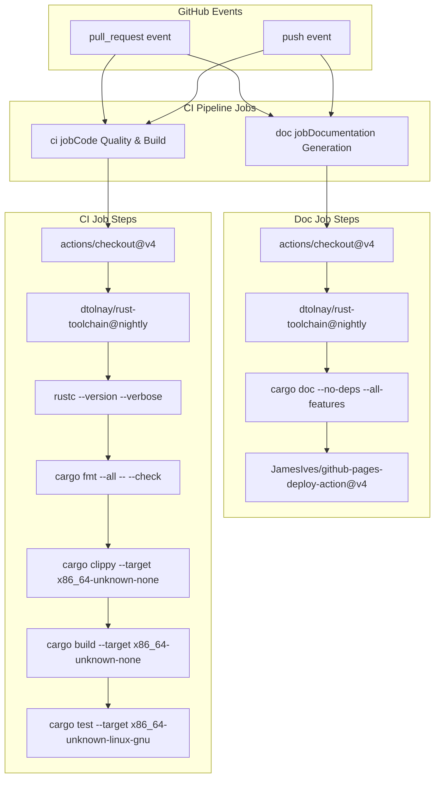
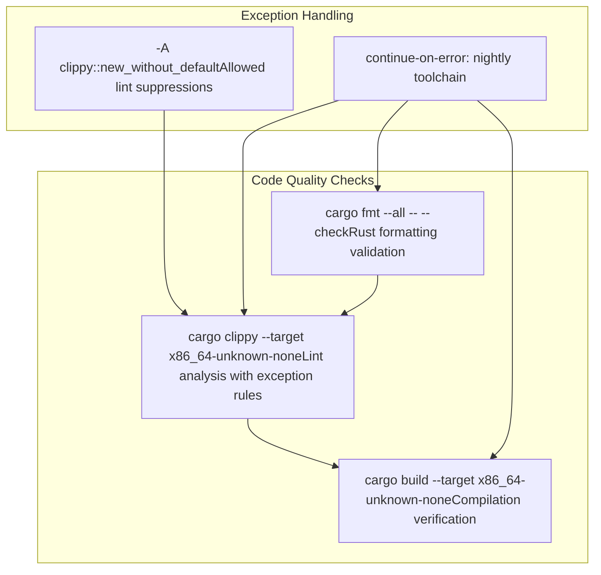
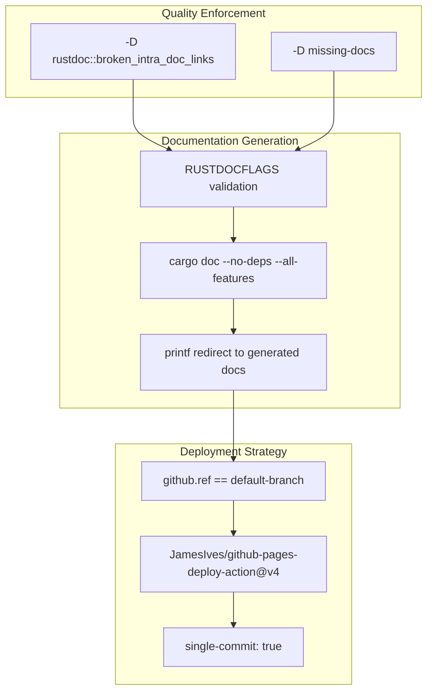

# Build System and CI

> **Relevant source files**
> * [.github/workflows/ci.yml](https://github.com/arceos-hypervisor/x86_vcpu/blob/2cc42349/.github/workflows/ci.yml)
> * [.gitignore](https://github.com/arceos-hypervisor/x86_vcpu/blob/2cc42349/.gitignore)

This document covers the continuous integration pipeline, build matrix configuration, code quality enforcement, and documentation deployment for the x86_vcpu hypervisor library. The build system is designed to ensure code quality across multiple Rust toolchain versions while providing automated documentation deployment.

For information about project dependencies and feature configuration, see [Project Configuration](/arceos-hypervisor/x86_vcpu/5.1-project-configuration).

## CI Pipeline Overview

The x86_vcpu project uses GitHub Actions for continuous integration with a dual-job pipeline that handles both code validation and documentation deployment. The pipeline is triggered on `push` and `pull_request` events to ensure all changes are properly validated.

### CI Workflow Structure

**Sources:** [.github/workflows/ci.yml(L1 - L62)&emsp;](https://github.com/arceos-hypervisor/x86_vcpu/blob/2cc42349/.github/workflows/ci.yml#L1-L62)

## Build Matrix Strategy

The CI pipeline employs a matrix strategy to test against multiple Rust toolchain versions, ensuring compatibility across both stable nightly builds and the latest nightly releases.

### Toolchain Matrix Configuration

|Matrix Dimension|Values|
| --- | --- |
|rust-toolchain|nightly-2024-12-25,nightly|
|targets|x86_64-unknown-none|
|Runner|ubuntu-latest|

The matrix configuration uses `fail-fast: false` to ensure all combinations are tested even if one fails. The `nightly` toolchain uses `continue-on-error: true` for all steps, allowing bleeding-edge compatibility testing without blocking releases.

### Target Architecture Rationale

The primary build target `x86_64-unknown-none` is specifically chosen for bare-metal hypervisor deployment:

* **No standard library**: Suitable for kernel-level virtualization code
* **x86_64 architecture**: Aligns with Intel VMX requirements
* **Bare-metal execution**: Matches hypervisor runtime environment

**Sources:** [.github/workflows/ci.yml(L8 - L19)&emsp;](https://github.com/arceos-hypervisor/x86_vcpu/blob/2cc42349/.github/workflows/ci.yml#L8-L19)

## Code Quality Enforcement

The CI pipeline implements comprehensive code quality checks through automated tools and formatting validation.

### Quality Check Pipeline

### Quality Check Configuration

The clippy configuration includes specific lint suppressions appropriate for hypervisor code:

* **`clippy::new_without_default`**: Suppressed due to specialized constructor requirements in VMX structures
* **All features enabled**: Ensures comprehensive linting across feature gates
* **Target-specific linting**: Validates against bare-metal target constraints

**Sources:** [.github/workflows/ci.yml(L22 - L30)&emsp;](https://github.com/arceos-hypervisor/x86_vcpu/blob/2cc42349/.github/workflows/ci.yml#L22-L30)

## Testing Strategy

The testing strategy accommodates the bare-metal nature of the hypervisor library while providing comprehensive validation where possible.

### Test Execution Matrix

|Test Type|Target|Condition|Purpose|
| --- | --- | --- | --- |
|Unit Tests|x86_64-unknown-linux-gnu|Linux-compatible targets only|Validate core logic|
|Build Tests|x86_64-unknown-none|All targets|Ensure bare-metal compilation|
|Integration Tests|Not applicable|N/A|Hardware-dependent functionality|

The unit tests are conditionally executed only for Linux-compatible targets since the primary `x86_64-unknown-none` target cannot execute tests in the CI environment.

**Sources:** [.github/workflows/ci.yml(L31 - L34)&emsp;](https://github.com/arceos-hypervisor/x86_vcpu/blob/2cc42349/.github/workflows/ci.yml#L31-L34)

## Documentation Generation and Deployment

The documentation system provides automated API documentation generation and GitHub Pages deployment with strict documentation quality enforcement.

### Documentation Build Pipeline

### Documentation Quality Standards

The documentation build enforces strict quality standards through `RUSTDOCFLAGS`:

* **Broken intra-doc links**: Treated as build failures to ensure documentation integrity
* **Missing documentation**: All public APIs must be documented
* **All features enabled**: Comprehensive documentation across all feature gates

### Deployment Configuration

Documentation deployment uses the following strategy:

* **Branch restriction**: Only deploys from the default branch
* **Single commit mode**: Maintains clean documentation history
* **Target folder**: `target/doc` with generated index redirect

**Sources:** [.github/workflows/ci.yml(L36 - L61)&emsp;](https://github.com/arceos-hypervisor/x86_vcpu/blob/2cc42349/.github/workflows/ci.yml#L36-L61)

## Build Artifact Management

The build system excludes specific artifacts and temporary files to maintain a clean repository while supporting the ArceOS hypervisor development workflow.

### Excluded Artifacts

|Category|Patterns|Purpose|
| --- | --- | --- |
|Build Output|/target,*.asm,*.img,*.bin,*.elf|Standard Rust and ArceOS build artifacts|
|Runtime Files|actual.out,qemu.log|Hypervisor testing and emulation logs|
|Development Tools|/.vscode,.DS_Store,rusty-tags.vi|Editor and system-specific files|
|Dependency Lock|Cargo.lock|Library projects exclude lock files|

The exclusion of `Cargo.lock` follows Rust library best practices, allowing downstream consumers to resolve their own dependency versions while maintaining compatibility constraints defined in `Cargo.toml`.

**Sources:** [.gitignore(L1 - L19)&emsp;](https://github.com/arceos-hypervisor/x86_vcpu/blob/2cc42349/.gitignore#L1-L19)