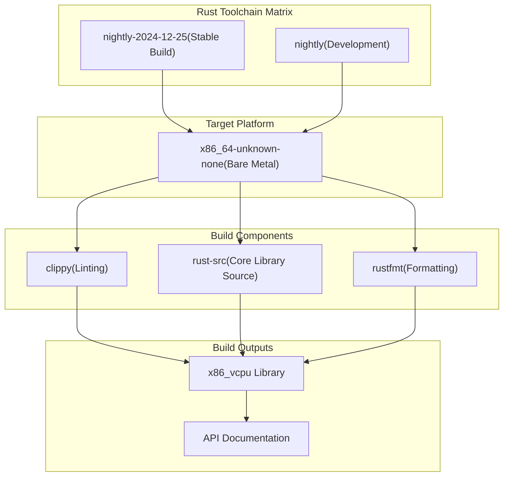
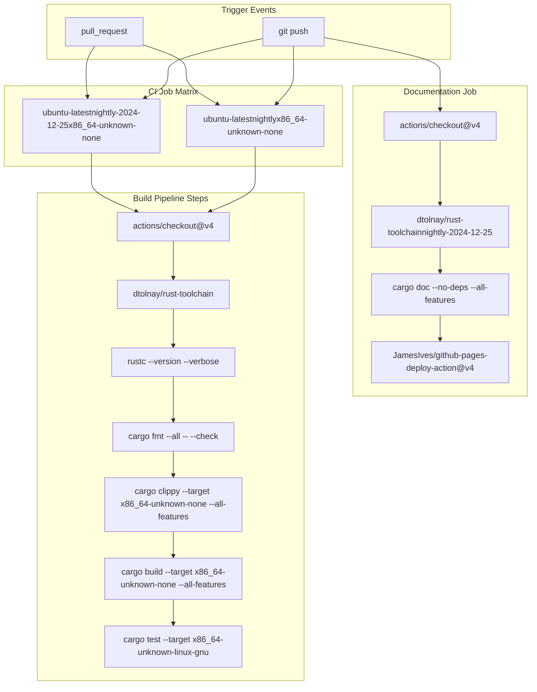

# Development and Configuration

> **Relevant source files**
> * [.github/workflows/ci.yml](https://github.com/arceos-hypervisor/x86_vcpu/blob/2cc42349/.github/workflows/ci.yml)
> * [.gitignore](https://github.com/arceos-hypervisor/x86_vcpu/blob/2cc42349/.gitignore)
> * [Cargo.toml](https://github.com/arceos-hypervisor/x86_vcpu/blob/2cc42349/Cargo.toml)

This document covers the development environment setup, build configuration, and continuous integration pipeline for the x86_vcpu hypervisor library. It provides guidance on project dependencies, feature flags, build toolchain requirements, and the automated testing and documentation deployment processes.

For information about the VMX-specific code organization and module structure, see [VMX Virtualization Engine](/arceos-hypervisor/x86_vcpu/2-vmx-virtualization-engine). For details about the physical frame allocation interface that integrates with external systems, see [Physical Frame Management](/arceos-hypervisor/x86_vcpu/3.1-physical-frame-management).

## Project Structure and Dependencies

The x86_vcpu library is configured as a Rust 2024 edition crate with carefully selected dependencies that support bare-metal x86_64 virtualization. The project uses a modular architecture with optional feature flags to support different virtualization technologies.

### Dependency Architecture

```mermaid
flowchart TD
subgraph subGraph5["Interface System"]
    CrateInterface["crate_interface (0.1)"]
end
subgraph subGraph4["ArceOS Ecosystem"]
    AxErrno["axerrno (0.1.0)"]
    AxAddrspace["axaddrspace (git)"]
    AxVcpu["axvcpu (git)"]
end
subgraph subGraph3["Memory Management"]
    PageTableEntry["page_table_entry (0.5)"]
    MemoryAddr["memory_addr (0.3.1)"]
end
subgraph subGraph2["Utility Crates"]
    Log["log (0.4.19)"]
    CfgIf["cfg-if (1.0)"]
    Bitflags["bitflags (2.2)"]
    BitField["bit_field (0.10)"]
    NumericEnum["numeric-enum-macro (0.2)"]
end
subgraph subGraph1["Low-Level x86 Support"]
    X86["x86 (0.52)"]
    X86_64["x86_64 (0.15)"]
    RawCpuid["raw-cpuid (11.0)"]
end
subgraph subGraph0["x86_vcpu Core"]
    MainCrate["x86_vcpu(edition 2024)"]
end

MainCrate --> AxAddrspace
MainCrate --> AxErrno
MainCrate --> AxVcpu
MainCrate --> BitField
MainCrate --> Bitflags
MainCrate --> CfgIf
MainCrate --> CrateInterface
MainCrate --> Log
MainCrate --> MemoryAddr
MainCrate --> NumericEnum
MainCrate --> PageTableEntry
MainCrate --> RawCpuid
MainCrate --> X86
MainCrate --> X86_64
```



**Sources:** [Cargo.toml(L6 - L22)&emsp;](https://github.com/arceos-hypervisor/x86_vcpu/blob/2cc42349/Cargo.toml#L6-L22)

### Feature Configuration

The project supports conditional compilation through feature flags defined in the `Cargo.toml` configuration:

|Feature|Purpose|Default|
| --- | --- | --- |
|vmx|Enables Intel VMX (Virtual Machine Extensions) support|✓|
|amd|Enables AMD SVM (Secure Virtual Machine) support|✗|

The default feature set includes only `vmx`, making Intel VMX the primary supported virtualization technology. The `amd` feature can be enabled for AMD SVM support in future implementations.

**Sources:** [Cargo.toml(L24 - L27)&emsp;](https://github.com/arceos-hypervisor/x86_vcpu/blob/2cc42349/Cargo.toml#L24-L27)

## Build System and Toolchain Requirements

The x86_vcpu library requires specific Rust toolchain configurations and targets to support bare-metal x86_64 development. The build process is designed for no-std environments with custom memory management.

### Toolchain Configuration

The project uses Rust nightly toolchains with the following requirements:

* **Primary Toolchain**: `nightly-2024-12-25` (pinned for stability)
* **Development Toolchain**: `nightly` (latest for development)
* **Target Architecture**: `x86_64-unknown-none` (bare-metal)
* **Required Components**: `rust-src`, `clippy`, `rustfmt`

### Build Target Specifications



**Sources:** [.github/workflows/ci.yml(L11 - L19)&emsp;](https://github.com/arceos-hypervisor/x86_vcpu/blob/2cc42349/.github/workflows/ci.yml#L11-L19)

## Continuous Integration Pipeline

The CI/CD system uses GitHub Actions to ensure code quality, build verification, and automatic documentation deployment. The pipeline runs on multiple Rust toolchain versions to ensure compatibility.

### CI Workflow Structure



**Sources:** [.github/workflows/ci.yml(L1 - L62)&emsp;](https://github.com/arceos-hypervisor/x86_vcpu/blob/2cc42349/.github/workflows/ci.yml#L1-L62)

### Quality Assurance Steps

The CI pipeline enforces several quality checks:

1. **Code Formatting**: Uses `cargo fmt` with `--check` flag to ensure consistent code style
2. **Linting**: Runs `cargo clippy` with `--all-features` and custom lint configuration
3. **Build Verification**: Compiles the library for the target architecture
4. **Unit Testing**: Executes tests when applicable target platforms are available

The pipeline includes error tolerance for the latest nightly toolchain to prevent CI failures from bleeding-edge compiler changes.

**Sources:** [.github/workflows/ci.yml(L23 - L34)&emsp;](https://github.com/arceos-hypervisor/x86_vcpu/blob/2cc42349/.github/workflows/ci.yml#L23-L34)

### Documentation Deployment

The documentation system automatically builds and deploys API documentation to GitHub Pages:

* **Documentation Flags**: `-D rustdoc::broken_intra_doc_links -D missing-docs`
* **Build Command**: `cargo doc --no-deps --all-features`
* **Deployment**: Automatic deployment to `gh-pages` branch on main branch updates
* **Index Generation**: Creates redirect index.html pointing to the main crate documentation

**Sources:** [.github/workflows/ci.yml(L36 - L61)&emsp;](https://github.com/arceos-hypervisor/x86_vcpu/blob/2cc42349/.github/workflows/ci.yml#L36-L61)

## Development Workflow

### Local Development Setup

1. **Install Rust Toolchain**:

```
rustup toolchain install nightly-2024-12-25
rustup component add rust-src clippy rustfmt --toolchain nightly-2024-12-25
rustup target add x86_64-unknown-none --toolchain nightly-2024-12-25
```
2. **Build Commands**:

```
cargo +nightly-2024-12-25 build --target x86_64-unknown-none --all-features
cargo +nightly-2024-12-25 clippy --target x86_64-unknown-none --all-features
cargo +nightly-2024-12-25 fmt --all
```
3. **Documentation Generation**:

```
cargo +nightly-2024-12-25 doc --no-deps --all-features --open
```

### Ignored Files and Build Artifacts

The `.gitignore` configuration excludes build outputs and development artifacts:

* **Build Outputs**: `/target`, `*.asm`, `*.img`, `*.bin`, `*.elf`
* **Log Files**: `actual.out`, `qemu.log`
* **IDE Configuration**: `/.vscode`
* **System Files**: `.DS_Store`
* **Dependency Lock**: `Cargo.lock` (ignored because x86_vcpu is a library)

**Sources:** [.gitignore(L1 - L18)&emsp;](https://github.com/arceos-hypervisor/x86_vcpu/blob/2cc42349/.gitignore#L1-L18)