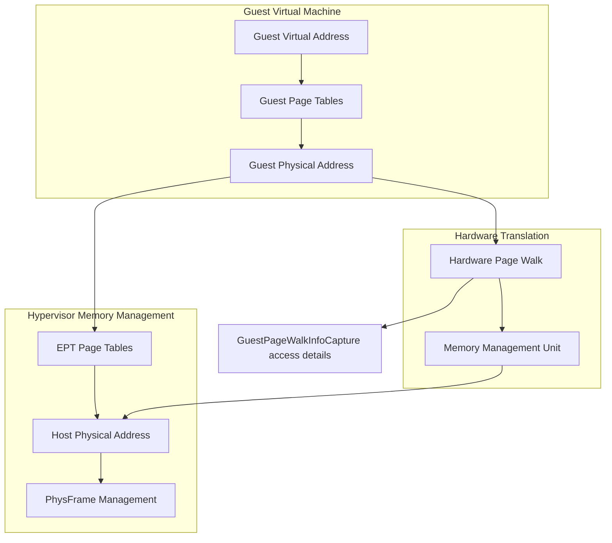
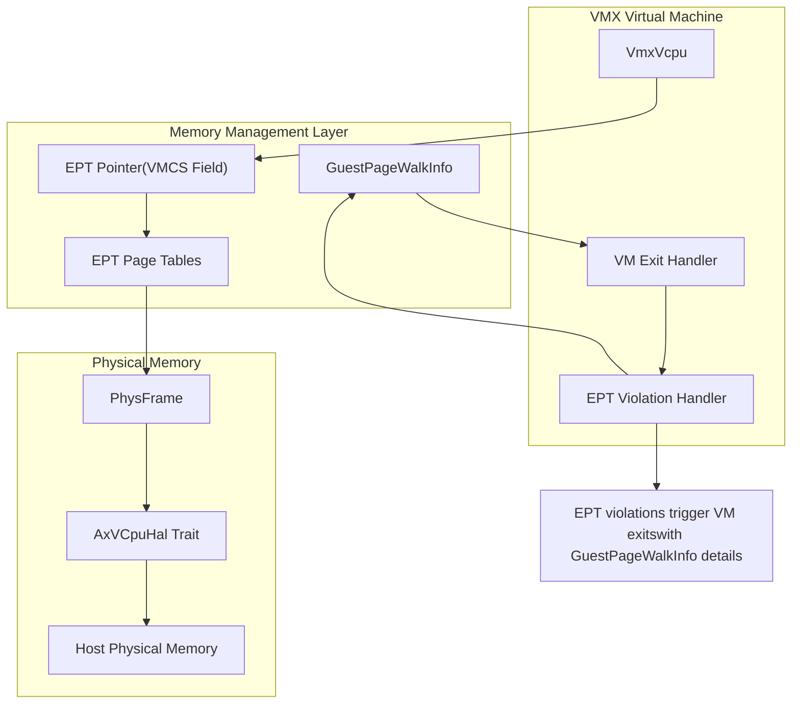

# Extended Page Tables and Guest Memory

> **Relevant source files**
> * [src/ept.rs](https://github.com/arceos-hypervisor/x86_vcpu/blob/2cc42349/src/ept.rs)

## Purpose and Scope

This document covers the Extended Page Tables (EPT) implementation and guest memory virtualization mechanisms in the x86_vcpu hypervisor. EPT provides hardware-assisted second-level address translation, enabling efficient memory virtualization for guest virtual machines. The document focuses on the `GuestPageWalkInfo` structure and how guest memory access information is captured and processed.

For physical memory allocation and the underlying frame management system, see [Physical Frame Management](/arceos-hypervisor/x86_vcpu/3.1-physical-frame-management). For overall VMX virtual machine management that utilizes EPT, see [Virtual CPU Management](/arceos-hypervisor/x86_vcpu/2.1-virtual-cpu-management).

## Extended Page Tables Overview

Extended Page Tables (EPT) is Intel's hardware-assisted memory virtualization technology that provides a second level of address translation. In a virtualized environment, memory accesses undergo a two-stage translation process:

1. **Guest Virtual → Guest Physical**: Performed by the guest OS page tables
2. **Guest Physical → Host Physical**: Performed by EPT page tables managed by the hypervisor

This two-level translation allows guests to manage their own virtual memory while the hypervisor maintains control over physical memory allocation.

## Memory Translation Architecture

**Sources:** [src/ept.rs(L1 - L28)&emsp;](https://github.com/arceos-hypervisor/x86_vcpu/blob/2cc42349/src/ept.rs#L1-L28)

## Guest Page Walk Information

The `GuestPageWalkInfo` structure captures detailed information about guest memory access attempts, particularly during EPT violations (nested page faults). This information is essential for the hypervisor to understand the guest's memory access patterns and handle them appropriately.

### GuestPageWalkInfo Structure

```mermaid
flowchart TD
subgraph subGraph3["GuestPageWalkInfo Fields"]
    TopEntry["top_entry: usizeTop level paging structure entry"]
    Level["level: usizeGuest page table level"]
    Width["width: u32Guest page table width"]
    subgraph subGraph2["Security Features"]
        SMAP["is_smap_on: boolSupervisor Mode Access Prevention"]
        SMEP["is_smep_on: boolSupervisor Mode Execution Prevention"]
    end
    subgraph subGraph1["Control Register State"]
        PSE["pse: boolCR4.PSE for 32bit paging"]
        WP["wp: boolCR0.WP write protection"]
        NXE["nxe: boolMSR_IA32_EFER_NXE_BIT"]
    end
    subgraph subGraph0["Access Type Information"]
        UserMode["is_user_mode_access: boolUser vs kernel access"]
        WriteAccess["is_write_access: boolRead vs write operation"]
        InstFetch["is_inst_fetch: boolInstruction fetch access"]
    end
end
AccessInfo["Memory Access Context"]

InstFetch --> AccessInfo
Level --> AccessInfo
NXE --> AccessInfo
PSE --> AccessInfo
SMAP --> AccessInfo
SMEP --> AccessInfo
TopEntry --> AccessInfo
UserMode --> AccessInfo
WP --> AccessInfo
Width --> AccessInfo
WriteAccess --> AccessInfo
```

**Sources:** [src/ept.rs(L3 - L27)&emsp;](https://github.com/arceos-hypervisor/x86_vcpu/blob/2cc42349/src/ept.rs#L3-L27)

### Key Fields and Their Purpose

|Field|Purpose|Usage Context|
| --- | --- | --- |
|top_entry|Physical address of the top-level page table|Identifies the root of guest page table hierarchy|
|level|Current page table level being accessed|Determines page size and translation depth|
|width|Page table entry width (32/64-bit)|Architecture-specific page table format|
|is_user_mode_access|User vs supervisor mode access|Privilege level validation|
|is_write_access|Read vs write operation|Access permission checking|
|is_inst_fetch|Instruction fetch vs data access|Execution permission validation|
|pse|Page Size Extension enabled|Support for large pages (2MB/4MB)|
|wp|Write Protection enabled|CR0.WP supervisor write protection|
|nxe|No-Execute bit enabled|Execution prevention support|
|is_smap_on|SMAP protection active|Prevents supervisor access to user pages|
|is_smep_on|SMEP protection active|Prevents supervisor execution of user pages|

**Sources:** [src/ept.rs(L4 - L26)&emsp;](https://github.com/arceos-hypervisor/x86_vcpu/blob/2cc42349/src/ept.rs#L4-L26)

## EPT Integration with VMX System

**Sources:** [src/ept.rs(L1 - L28)&emsp;](https://github.com/arceos-hypervisor/x86_vcpu/blob/2cc42349/src/ept.rs#L1-L28)

## Memory Access Handling Flow

The `GuestPageWalkInfo` structure plays a crucial role in handling memory access violations and implementing memory virtualization policies:

### EPT Violation Processing

1. **Guest Memory Access**: Guest attempts to access memory through its virtual address space
2. **Hardware Translation**: MMU performs guest virtual → guest physical translation
3. **EPT Lookup**: Hardware attempts guest physical → host physical translation via EPT
4. **EPT Violation**: If EPT entry is missing or access violates permissions, VM exit occurs
5. **Information Capture**: Hardware populates `GuestPageWalkInfo` with access details
6. **Hypervisor Handling**: VMX exit handler processes the violation using captured information

### Security Feature Integration

The structure captures several x86 security features that affect memory access:

* **SMAP (Supervisor Mode Access Prevention)**: Prevents supervisor code from accessing user-mode pages
* **SMEP (Supervisor Mode Execution Prevention)**: Prevents supervisor code from executing user-mode pages
* **NXE (No-Execute)**: Enables execution prevention for marked pages
* **WP (Write Protection)**: Controls supervisor write access to read-only pages

These features are essential for maintaining security boundaries in virtualized environments.

**Sources:** [src/ept.rs(L19 - L26)&emsp;](https://github.com/arceos-hypervisor/x86_vcpu/blob/2cc42349/src/ept.rs#L19-L26)

## Current Implementation Status

The current EPT implementation in the codebase provides the foundational data structure for capturing guest page walk information. The `GuestPageWalkInfo` struct serves as the interface between the hardware EPT violation mechanism and the hypervisor's memory management logic.

The minimal implementation suggests that:

* EPT page table management may be handled in other components
* The focus is on capturing and processing EPT violation information
* Integration with the broader VMX system occurs through other modules

For the complete memory virtualization picture, this EPT information works in conjunction with the physical frame management system documented in [Physical Frame Management](/arceos-hypervisor/x86_vcpu/3.1-physical-frame-management) and the VMX virtual machine control structures covered in [VMX Data Structures](/arceos-hypervisor/x86_vcpu/2.2-vmx-data-structures).

**Sources:** [src/ept.rs(L1 - L28)&emsp;](https://github.com/arceos-hypervisor/x86_vcpu/blob/2cc42349/src/ept.rs#L1-L28)